<!-- _class: title -->
# **Vibe Coder Bootcamp 第一回**
## オリエンテーションとマインドセット変革

### 〜 非エンジニアによるアウトプット革命の幕開け 〜

**2025年9月版**
**講師：泉水 亮介（TEKION Group CEO）**

---

## 🎯 本日のゴール

### **これから起こる「3つの革命」**

1. **🧠 思考の革命**
   - 「できない」から「まず作ってみる」へ
   - 「リソース不足」から「AI協働で無限の可能性」へ

2. **💡 価値観の革命**
   - 「コストとしてのAI」から「投資としてのAI」へ
   - 「技術の壁」から「ビジネス価値への集中」へ

3. **🚀 行動の革命**
   - 「アイデアの墓場」から「アウトプットの工場」へ
   - 「完璧を求める」から「高速反復で成長」へ

> **"今日から、あなたは新しい人類(Vibe Coder)になる"**

---

## 📋 本日のアジェンダ

### **第一回講義：AI駆動開発への第一歩**

#### **Part 1: オリエンテーションとマインドセット変革**
- なぜ私が、なぜあなたが、なぜ今なのか
- Vibe Coderとアウトプット革命の本質
- 非エンジニアが持つ「隠れた武器」の発見
- AIと共に成長する思考法

#### **Part 2: ビジネス活用事例とLLM基礎**
- 実際のビジネス変革事例
- LLMの仕組みと特性理解
- Text is KING - プロンプトエンジニアリング
- 音声入力による生産性革命

#### **Part 3: ビジネス要件定義の実践**
- アイデアを構造化する思考フレームワーク
- Markdownで書く要件定義
- 「あったらいいな」を形にするワーク
- 組織の課題を言語化する技術

#### **Part 4: ツール紹介と宿題説明**
- 主要AIツール総覧（2025年9月版）
- 投資判断フレームワーク
- 宿題：自分だけのオリジナルSNSを構想する
- 次回までの実践課題

---

<!-- _class: section -->
# 第1章
## 🎭 イントロダクション
### 〜 一人の非エンジニアが起こした革命 〜

---

## 👤 講師紹介：泉水 亮介という「実験」

### **34歳、千葉県在住、元営業マン → Vibe Coder**

### 営業時代（2013-2016）

- **富士ゼロックス株式会社**（新卒入社）
    - 大手企業向けドキュメントコンサルティング営業
    - 複合機・文書管理システムのITソリューション提供
    - ゴリゴリの新規開拓営業を経験

### スタートアップCOO時代（2016-2020）

- **MAMORIO株式会社**（現・NEARIZE）
    - 25歳、アライアンスマネージャーとして入社、3ヶ月でCOOに昇格
    - 取締役COOとして事業開発・広報・製品企画を統括
    - 紛失防止IoTデバイス事業で「落とし物をなくす」ミッションを推進

### 複数企業のCXO時代（2020-現在）

- **TEKION Group設立**（2020年10月）
    - 「Take it 温（おん）」をコンセプトに、テクノロジーを「ちょうどいい」「あったかい」形で提供
    - 当初はハードウェアプロダクト開発、仮想通貨マイニング機器の製造・販売・運用保守も手掛ける
- **兼務**
    - Cybernex株式会社 CSO (Chief Strategy Officer)
    - SUNDRED株式会社 CBDO（Chief Business Development Officer）
    - 株式会社MENUCOMPANY 共同創業者 COO
    - 株式会社Momo CSO（Chief Strategy Officer）

> **重要な事実：** 2022年12月まで、私はコードを1行も書けませんでした。そして、今も書けません。

---

## 🎬 転機：2022年12月、ChatGPTとの出会い

### **最初の開発：問い合わせBot「Ryoko AI」**

**開発環境：** メモ帳
**使用言語：** Google Apps Script（コピペ）
**所要時間：** 3日間の試行錯誤

### **そこで起きた「認識の革命」**

> 「コードが読めなくても、**AIがバグを判断してくれる**」
> 「エラーメッセージをコピペするだけで、**解決策が返ってくる**」
> 「動くものが、**自分の手で作れた**」

**この瞬間、私は確信しました：**
## **「プログラミングの民主化が始まった」**

---

## 📈 驚異的な成長曲線：2年で80本のアプリ開発

### **代表的な開発実績とビジネスインパクト**

| 時期 | プロダクト | ビジネス成果 | 学び |
|------|------------|-------------|------|
| **2024.7** | MENU DB入力システム | エンジニア不在の環境で<br/>基幹システム構築 | AIのみでの開発実践 |
| **2025.2** | Brainwave Analyzer 2 | 月額課金SaaS構築<br/>継続的な収益モデル確立 | SaaS型ビジネスモデル |
| **2025.3** | Oh! My Gear | 初のB2C公開サービス<br/>SNS機能で成長中 | ユーザー体験設計 |
| **2025.7** | MD Now! | Cursor拡張として動作<br/>開発者コミュニティで話題 | エコシステム理解 |

> **注目：** これらすべて、**エンジニア経験ゼロ、AIとの対話だけ**で実現

---

## 🌍 世界で起きているVibe Coder革命

### **18歳が月収1.4億円、3人の10代が2,000億円企業を創業**

| 年齢 | 創業者・企業 | 成果 | ポイント |
|------|-------------|------|--------|
| **18歳** | Zach Yadegari<br/>Cal AI | 月収1.4億円<br/>（約140万ドル/月） | 自宅から開始、5ヶ月で黒字化<br/>ダウンロード500万回超 |
| **17歳** | 匿名の開発者 | 月収1.12億円<br/>（112万ドル/月） | 寝室で開発、完全独学 |
| **10代3人** | Mercor創業者 | 評価額2,000億円<br/>（20億ドル） | Series B 1億ドル調達<br/>Peter Thiel、Jack Dorsey出資 |
| **17歳** | Jacob Klug<br/>Creme Digital | No-codeで起業 | Bubble使用、コード書かずに成功 |

### **重要な事実：**
- **Zach（Cal AI創業者）は15の有名大学に落ちた**（ハーバード、コロンビア含む）
- **Cursor（Anysphere社）は広告費ゼロで年商200億円**（2億ドル ARR）
- **ChatGPTアプリは2024年だけで2,000億円**の消費者支出

> **「大学に行く必要性すら、もはや疑わしい」**

---

## 💡 彼らに共通する「3つの特徴」

### **1️⃣ 完璧を求めない**
- Cal AI：最初のバージョンは精度70%
- 「動くものを早く出す」が最優先

### **2️⃣ AIを「共同創業者」として扱う**
- コードが書けなくても問題なし
- AIに「バグを見つけて」と頼むだけ

### **3️⃣ 解決したい問題が明確**
- Cal AI：「カロリー計算が面倒」
- Mercor：「採用プロセスが非効率」

### **あなたと彼らの違いは、たった1つ**
## **「始めたか、始めていないか」**

---

## 💭 なぜこの話をするのか？

### **3つの重要なメッセージ**

### 1️⃣ **「特別な才能」は不要**
- 私は絵も描けない、デザインセンスもない
- プログラミングの素養もゼロ
- ただ「作りたい」という情熱だけ

### 2️⃣ **「遅すぎる」ことはない**
- つい最近初めてコードに触れた
- 本格的に取り組んで1年で実用的なシステム構築が可能に
- 年齢は言い訳にならない

### 3️⃣ **「あなたにもできる」**
- 必要なのは正しい方法論
- AIとの協働スキル（コンテクストコントロール）
- そして、今日から始める勇気

---

## 🎯 本ブートキャンプのゴール

### **1ヶ月半後、組織が手にする「3つの変革」**

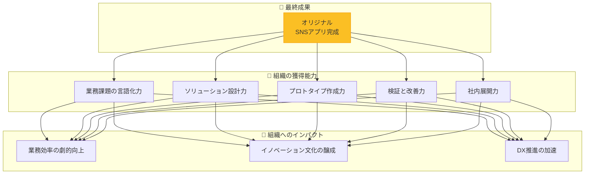

---

## 🏆 最終発表会：第5回講義での成果共有

### **各自が発表するオリジナルSNSアプリ**

- あなただけのアイデアでSNSを作成
- TwitterやInstagramとは違う、独自のコンセプト
- 1ヶ月半で学んだすべての技術を活用
- 創造性と実装力を同時に発揮する機会


**SNSアプリの例（あくまで参考）：**
- 📸 写真専用SNS（特定の趣味に特化）
- 💭 匿名つぶやきSNS（本音を語れる場所）
- 🎯 目標共有SNS（みんなで応援し合う）

---

<!-- _class: section -->
# 第2章
## 🌟 Vibe Coderとは
### 〜 アウトプット革命の主役たち 〜

---

## 📖 Vibe Codingの起源と進化

### **元々の定義（Wikipedia）**
> バイブコーディングはAIに依存したプログラミング手法で、人は解きたい問題を、コーディングに特化した大規模言語モデル（LLM）へのプロンプトとして自然言語で記述。それを元にAIに身を任せてコーディングを行う。

### **本講座での拡張定義**
## **Vibe Coder = AIとの協働により、アイデアを価値あるアウトプットへ高速に変換する、次世代の価値創造者**

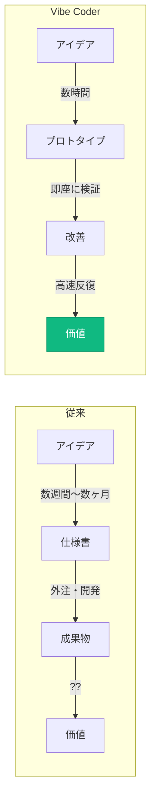

---

## 🔑 最重要概念：「コンテクストコントロール」

### **Vibe Codingの本質は、コードを書くことではない**

## **コンテクストコントロールとは？**

検討過程、思考回路、要件、制約...これらすべてを「コンテクスト」として管理し、AIと協働しながら様々なアウトプットに変換する技術。
それを支える最も重要なツールがIDE(Cursor)と、その上で動作するAIエージェントである。

### **具体例：新規事業企画の構造的生成**

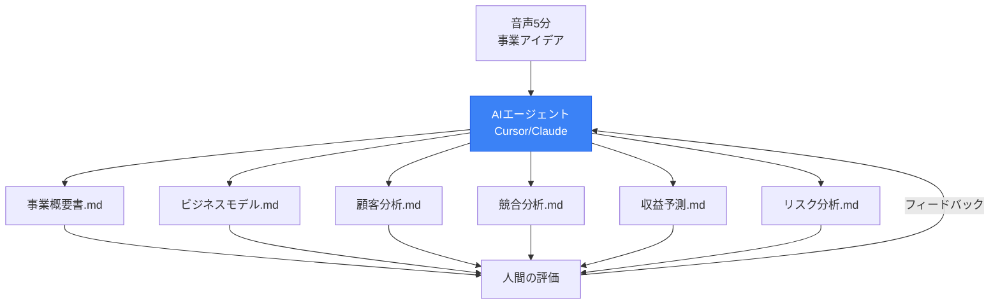

---


## 💥 アイデアの墓場から、アウトプットの工場へ

### **組織で起きている「アイデアの死」**

| 段階 | 現象 | 死因 |
|------|------|------|
| **会議** | 「それいいね！」 | → 議事録の1行で終了 |
| **Slack** | 「こんなのあったら...」 | → いいねスタンプで流れる |
| **企画書** | 「検討します」 | → リソース不足で頓挫 |

### **なぜアイデアの99%は形にならないのか？**

> **「誰が作るの？」**
> **「実装リソースが...」**
> **「ドキュメント化する時間が...」**

## **この「アウトプット化の壁」が、今、完全に崩壊しつつある**

---

## 🏭 1つのアイデアから生まれる多様なアウトプット

### **2時間で作れるもの（実例）**

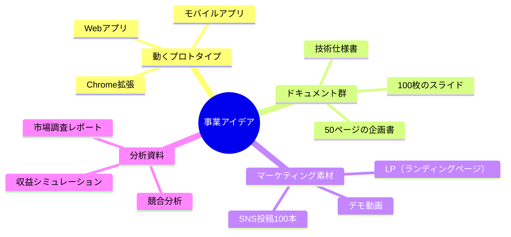

### **重要：これらすべてが同じコンテクストから、整合性を保って生成される**

---

## 🎯 なぜ「非エンジニア」こそが主役なのか

### **革命の本質：0→100の飛躍**

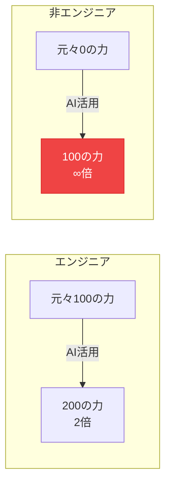

### **非エンジニアが持つ「4つの武器」**

| 武器 | 内容 | Vibe Codingとの相乗効果 |
|------|------|------------------------|
| **顧客理解** | 現場の痛みを知っている | → 本当に必要な機能を作れる |
| **ビジネス感覚** | 何が価値を生むか分かる | → ROIの高いプロダクト |
| **ドメイン知識** | 業界特有の課題を理解 | → 競合にない差別化 |
| **文書作成経験** | 報告書、提案書の「型」を知る | → 構造的なアウトプット |

---

## 📊 実際に起きている革命：数字で見るインパクト

### **ケーススタディ：営業チームの変革**

#### **Before（従来）**
- 商談後の提案書作成：**3日**
- 顧客要望への対応：**「検討します」**
- 月間提案数：**5件**
- 成約率：**20%**

#### **After（Vibe Coder導入後）**
- 商談後の提案書作成：**1時間**
- 顧客要望への対応：**「プロトタイプ作りました」**
- 月間提案数：**20件**
- 成約率：**45%**

### **結果：売上2.25倍、残業時間50%削減**

> 💡 **ポイント：** 動くプロトタイプは、100枚の提案書より説得力がある

---

## 🌐 2025年の今、なぜ緊急に必要なのか

### **AI技術の加速度的進化**

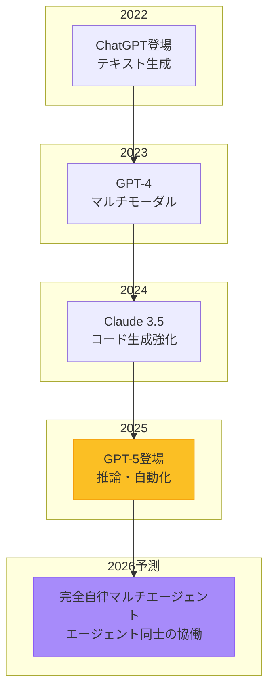

### **警告：この波に乗れる組織と乗れない組織の差は、もう埋められない**

---

<!-- _class: section -->
# 第3章
## 💎 非エンジニアの隠れた優位性
### 〜 あなたが持つ「未開発の金鉱」〜

---

## 🚧 非エンジニアが直面する「3つの壁」

### **従来、これらの壁があなたを止めていた**

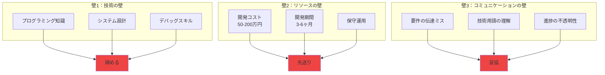

---

## 🎯 Vibe Coderが提供する「3つの解決策」

### **すべての壁を、AIが溶かしていく**

| 従来の壁 | Vibe Coderの解決策 | 具体例 |
|----------|-------------------|---------|
| **技術の壁** | AIが技術を肩代わり | エラーメッセージをコピペ → 解決策を提示 |
| **リソースの壁** | コスト1/100、期間1/10 | 50万円→5千円、3ヶ月→3日 |
| **コミュニケーションの壁** | 自然言語で直接指示 | 「Twitterみたいなの作って」→ 動くプロトタイプ |

### **革命的な事実**
## **もはや「作れない理由」は存在しない**

---V

## 💪 非エンジニアの「4つの強み」を最大化

### **あなたが既に持っている武器を、AIが100倍に増幅する**

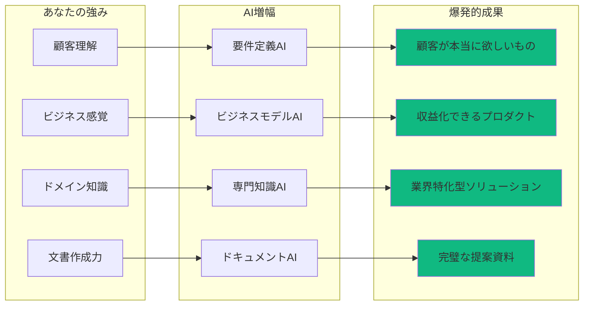

---

### **組織文化への影響（測定困難な価値）**
- 💡 「できない」から「やってみよう」文化へ
- 🚀 部門間連携の活性化
- 🌟 DX推進の実質的な加速
- 💪 課題解決スピードの向上

---

## 🔮 研修後の組織の姿

### **AI駆動型組織への変革**

#### **業務面の変化**
- 定型業務：**自動化率50%以上**
- 意思決定：**データドリブン＋プロトタイプ検証**
- 問題解決：**即日〜数日でソリューション実装**

#### **チーム力の向上**
- 開発した業務ツール：**各部門で5本以上**
- 部門横断プロジェクト：**AI活用が前提**
- ナレッジ共有：**成功パターンの横展開**

#### **組織文化の進化**
- 「AIファースト」の思考が定着
- 失敗を恐れない実験文化
- 継続的な改善サイクル確立

> **重要：これは理想論ではなく、既に多くの企業で起きはじめている変革**

---

<!-- _class: section -->
# 第4章
## 🚀 AIと共に成長する思考法
### 〜 「追いつく」から「乗りこなす」へ 〜

---

## 📊 人間 vs AI：成長曲線の残酷な真実

### **もはや追いつくことは不可能**

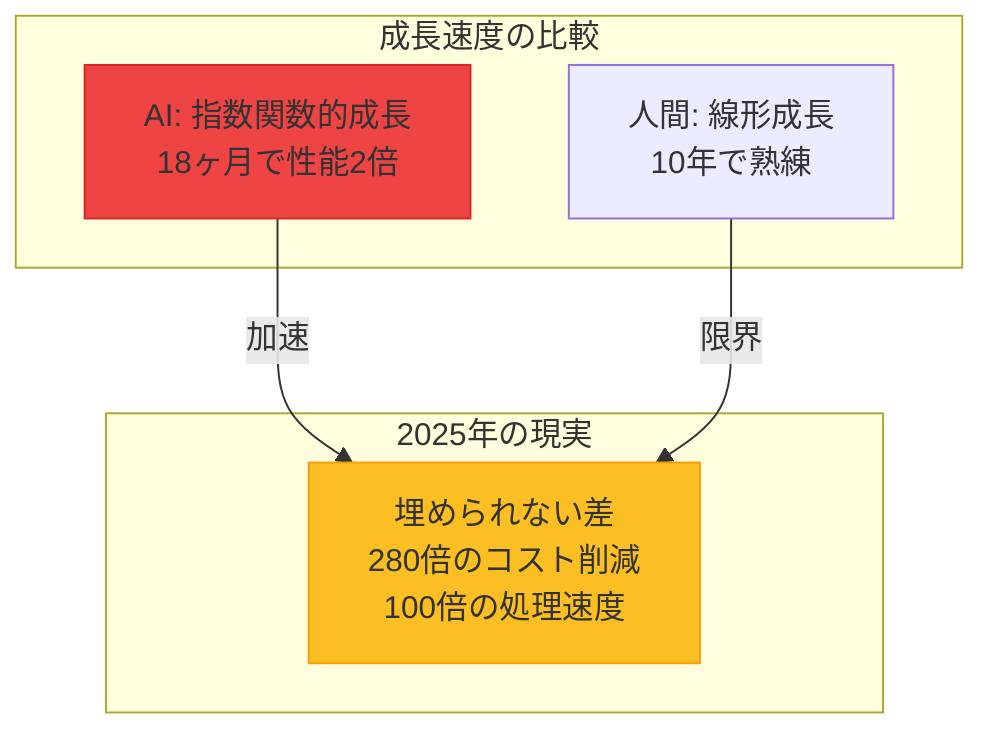

### **だからこそ、発想を転換する**
## **AIの成長を、自分の成長に変換する**

---

## 🌊 AIの進化を「追い風」に変える3つのレンズ

### **1. 編集者のレンズ 👁️**
AIの大量出力から、価値ある20%を抽出し、磨き上げる

**実践例：**
```
AI出力：10個の事業アイデア
↓ 編集者の仕事
選別：市場性のある3つを選択
深掘り：ターゲットを明確化
統合：1つの強力な提案に
```

### **2. ドメイン専門家のレンズ 🎯**
業界知識をAIの「翻訳キー」として活用
より強固なコンテクストを与え、独自の出力を引き出す。

### **3. 実験者のレンズ 🧪**
小さく作り、速く壊し、多く学ぶ

---

## 💡 私自身の体験：絵が描けない私が起こした革命

### **Before（2023年）**
- デザインスキル：**ゼロ**
- キービジュアル作成：デザイナーに依頼
- 費用：1枚5万円
- 納期：2週間
- 修正：追加費用と時間

### **After（2025年）**
- デザインスキル：**変わらずゼロ**
- キービジュアル作成：**AIで自作**
- 費用：月額3,000円で無制限
- 納期：**一晩で20パターン**
- 修正：**即座に100パターン追加**

## **絵を描くスキルは伸びていない。でも成果は100倍に。**
### **これがAIの成長を取り込むということ**

---

## 🔄 日常に落とし込む「4つの習慣」

### **今日から始められる具体的アクション**

```mermaid
graph LR
    subgraph "毎日（30分）"
        D1[何か1つ自動化]
        D2[メール整理]
        D3[日報作成]
    end
    
    subgraph "毎週（1つ）"
        W1[新機能を試す]
        W2[最新モデル]
        W3[新ツール]
    end
    
    subgraph "毎月（1本）"
        M1[公開物を作る]
        M2[ブログ]
        M3[アプリ]
    end
    
    subgraph "四半期（棚卸し）"
        Q1[手動作業リスト]
        Q2[自動化候補]
        Q3[改善計画]
    end
    
    D1 --> W1 --> M1 --> Q1
```

### **重要：小さな習慣の積み重ねが、1年後に巨大な差を生む**

---

## 📈 複利効果：早期学習者が得る圧倒的優位性

### **知識とスキルの複利計算**

| 月 | 学習内容 | 累積価値 | 実践例 |
|----|---------|---------|---------|
| **1ヶ月目** | 基礎（プロンプト） | 1x | 簡単な自動化 |
| **3ヶ月目** | 応用（エージェント） | 3x | 業務ツール開発 |
| **6ヶ月目** | 実践（プロダクト） | 10x | 公開アプリ |
| **12ヶ月目** | 専門（ビジネス展開） | 30x | 収益化成功 |
| **24ヶ月目** | 達人（教育・拡散） | 100x | 講師・コンサル |

### **ポイント：AIが進化するたびに、あなたの過去の学びも価値が上がる**

> **例：** GPT-4で学んだプロンプト技術 → GPT-5でさらに強力に

---

## 🎯 2025年後半〜2026年の技術トレンド

### **最新情報（2025年9月時点）**

| トレンド | 現在 | 2026年予測 | あなたへの影響 |
|---------|------|-----------|--------------|
| **推論AI** | GPT-5登場<br/>思考モード実装 | 完全自律エージェント | プログラミング不要に |
| **コスト** | 280倍削減達成 | 1000倍削減 | 個人で大規模開発可能 |
| **エージェント** | 画面操作可能 | 複雑な業務自動化 | 業務の80%自動化 |
| **ローカルAI** | Gemma 3登場 | スマホで動作 | プライバシー問題解決 |
| **規制** | EU AI Act準備 | 完全施行 | 信頼性向上 |

### **準備すべきこと：**
1. **今すぐ**: 基礎スキルの習得（このブートキャンプ）
2. **3ヶ月後**: エージェント活用の実践
3. **6ヶ月後**: ビジネスモデルの確立

---

<!-- _class: section -->
# 第5章
## 💰 AIツールへの課金について
### 〜 必要経費として考える 〜

---

## 💭 シンプルな事実

### **AIツールは道具。良い道具にはお金をかける**

**営業マンの例：**
- 良い靴：毎日歩き回るなら投資する
- 良い鞄：書類を運ぶなら投資する
- 良いAI：仕事を効率化するなら投資する

**プログラマーの例：**
- 良いPC：開発効率のために投資する
- 良いモニター：作業環境に投資する
- 良いAI：コーディング支援に投資する

### **月3,000円は、缶コーヒー20本分**

---

## 🎯 無料版と有料版の違い

### **実際の制限比較**

| 項目 | 無料版 | 有料版（Claude Pro/ChatGPT Plus） |
|------|--------|----------------------------------|
| **利用回数** | 時間/日数制限あり | 制限大幅緩和または無制限 |
| **待ち時間** | 混雑時は利用不可 | 優先アクセス |
| **最新モデル** | 使えない | 最新・高性能モデル利用可 |
| **ファイル添付** | 制限あり | 大容量ファイル対応 |

### **判断基準はシンプル**
- 仕事で使う → 課金
- 週3回以上使う → 課金
- ストレスを感じる → 課金

---

## ⚠️ よくある勘違い

### **「まず無料版で練習してから...」**

**これが罠**
- 制限があるとストレスで続かない
- 性能が低いと効果を実感できない
- 結果：AIの価値を誤解して諦める

### **正しいアプローチ**
1. 最初の1ヶ月だけ有料版を試す
2. 効果を実感できたら継続
3. 実感できなければ解約（月額なので安心）

### **重要：年額プランは避ける（まずは月額で）**

---

## 🎯 活用を最大化する「5つの鉄則」

### **課金した分、組織全体で活用し尽くす**

### 1️⃣ **毎日10分でも使う**
- 朝一番にAIでタスク整理
- 議事録をAIで要約
- メールの下書きをAI作成

### 2️⃣ **新機能は即座に試す**
- リリースノートを毎週チェック
- 新機能を使った感想をSNSで共有
- 失敗を恐れずに実験

### 3️⃣ **成果を必ず記録する**
- 部門の業務改善効果を数値化
- 作成したツール・成果物を共有
- 四半期ごとにROI報告

### 4️⃣ **組織内で知見を共有**
- 他部門の成功事例を横展開
- 定期的な成果発表会を開催
- 社内AIコミュニティを形成

### 5️⃣ **3ヶ月ごとに見直す**
- 使用頻度と効果を評価
- より良いツールがないか調査
- 投資配分を最適化

---

## ⚠️ よくある失敗パターン

| 失敗パターン | 症状 | 対策 |
|------------|------|------|
| **ツール収集癖** | 10個契約して1個しか使わない | 1つマスターしてから次へ |
| **年契約の後悔** | 使わなくなっても解約できない | 必ず月額契約 |
| **目的の喪失** | AIを使うことが目的化 | 作りたいものを先に決める |

---

<!-- _class: section -->
# 第6章
## 🔮 未来への期待
### 〜 今できないことは、来年の当たり前 〜

---

## 📈 AI進化の驚異的スピード

### **過去3年間で起きた「不可能→当たり前」の変化**

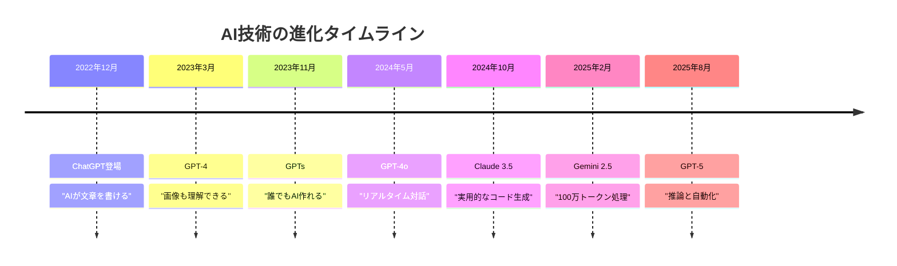

### **重要：どの時点の「限界」も、半年後には大きく改善、解決されている**

---

## 🚀 「不満は伸びしろ」の法則

### **今あなたが感じる不満こそ、最速で改善される領域**

| 現在の不満（2025.9） | 改善の兆し | 2026年の姿 |
|-------------------|-----------|-----------|
| **まだ間違える** | RAG/検索連携強化 | エラー率1%未満 |
| **文脈を忘れる** | 長期記憶実装中 | プロジェクト全体を記憶 |
| **専門性が浅い** | 業界特化モデル | 専門家レベルの知識 |
| **統合が面倒** | エージェント連携 | ワンクリックで全自動 |
| **コストが高い** | 最適化進行中 | 現在の1/10のコスト |

### **実例：私が2023年に感じた不満**
- 「コードのエラーが多い」→ 簡単なものであれば2024年には作れるように。
- 「日本語が不自然」→ 2025年にはネイティブレベル
- 「画像生成が下手」→ 現在はプロ級のクオリティ（nano-banana凄い！）

---

## 🎯 2026年に実現する「5つの革命」

### **これらは夢物語ではなく、既に開発中の技術**

### 1️⃣ **完全自律エージェント**
- 複雑なタスクを丸投げ可能
- 「売上を20%上げて」→ 施策立案から実行まで

### 2️⃣ **ノーコードが完全主流**
- プログラミング知識が完全に不要
- アイデアを話すだけでアプリ完成

### 3️⃣ **リアルタイム協働**
- AIと人間が同じ画面で共同作業
- Google Docsのように同時編集

### 4️⃣ **個人AI秘書**
- あなたの好み、スタイル、目標を完全理解
- 24時間365日、成長し続けるパートナー

### 5️⃣ **コスト革命**
- 現在の1/100のコストでAI利用
- 個人で大企業規模のシステム運用可能

---

## 💡 期待を現実に変える「準備リスト」

### **2026年の勝者になるために、今すべきこと**

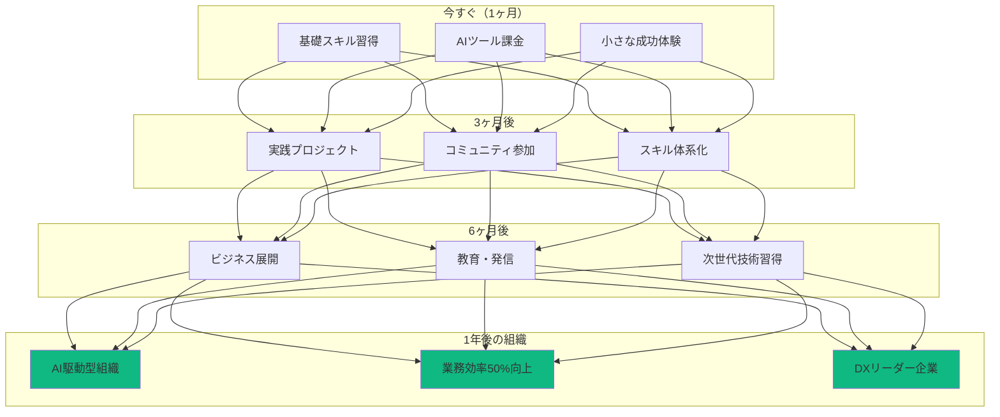

---

## 🌟 早期参入者の特権

### **今始める組織だけが得られる「5つの優位性」**

### 1️⃣ **先行者利益**
- 競合他社より先に業務効率化を実現
- 業界内でのAI活用リーダーポジション確立

### 2️⃣ **組織的学習の複利効果**
- チーム全体のスキルが相乗的に向上
- 新技術への適応力が組織文化として定着

### 3️⃣ **社内イノベーターネットワーク**
- 部門横断的な改善活動の活性化
- ナレッジ共有による組織全体の底上げ

### 4️⃣ **実験的アプローチの文化醸成**
- 低コストでの試行錯誤が可能
- 失敗から学ぶ文化の構築

### 5️⃣ **組織の競争優位**
- AI活用で他社に先行
- デジタル変革のリーダー企業へ

---

<!-- _class: section -->
# まとめ
## 🎯 今日から始まる、あなたの革命

---

## 📝 本日の学び：7つの革命的気づき

### **組織の中で、既に革命は始まっている**

### 1️⃣ **Vibe Coderは新しい人類**
- プログラマーではなく、価値創造者

### 2️⃣ **アウトプット革命の本質**
- アイデアの墓場から、アウトプットの工場へ

### 3️⃣ **非エンジニアこそ主役**
- 0→100の飛躍が最大のインパクト

### 4️⃣ **AIと共に成長する**
- 追いつくのではなく、乗りこなす

### 5️⃣ **投資思考の重要性**
- 月3,000円が月30万円の価値を生む

### 6️⃣ **不満は伸びしろ**
- 今の限界は、明日のスタートライン

### 7️⃣ **今が最高のタイミング**
- 競合他社より先に始めることが競争優位の源泉

---

## 🚀 この後の内容

### **本日の講義はまだ続きます！**

### **Part 2: ビジネス活用事例とLLM基礎**
- 実際のビジネス変革事例を詳しく解説
- LLMの仕組みと特性を理解
- プロンプトエンジニアリングの実践

### **Part 3: ビジネス要件定義の実践**
- アイデアを構造化する技術
- Markdownでの要件定義書作成

### **Part 4: ツール紹介と宿題説明**
- 最新AIツールの詳細解説
- 宿題の具体的な進め方

**ここで5分間の休憩を取りましょう**

---

## 💬 Q&Aタイム

### **よくある質問と回答**

**Q: プログラミング経験ゼロでも本当に大丈夫？**
A: 私自身がゼロから始めて2年で60本開発。大丈夫です。

**Q: どのAIツールから始めるべき？**
A: Claude ProかChatGPT Plus。両方でも月6,000円。

**Q: 仕事が忙しくて時間が取れない**
A: 1日30分から。通勤時間でも学習可能。

**Q: ベテラン社員でも習得可能？**
A: 業務知識がある分、むしろAI活用の効果は大きい。

**Q: 失敗が怖い**
A: AIなら失敗のコストは限りなく小さい。失敗は学び。

---

## 🎊 最後のメッセージ

### **今日この瞬間から、組織が変わる**

## **3つの約束**

### 1️⃣ **すべての業務に改善の可能性がある**
「これは仕方ない」という壁は、もう存在しない

### 2️⃣ **チーム全体で成長する**
個人ではなく、組織として変革を起こす

### 3️⃣ **1ヶ月半後、業務が変わっている**
必ず、実務で使えるツールを作り、展開する

---

## 🔥 行動への招待

### **今すぐやるべき3つのアクション**

## **1. 今日中に**
AIツール（Claude/ChatGPT）に登録して、最初の会話をする

## **2. 今週中に**
自部門の「面倒な作業」を1つ、AIで自動化してみる

## **3. 次回講義まで**
「こんなSNSがあったら面白い」というアイデアを10個書き出す

### **重要：知識ではなく、行動が組織を変える**

> **「The best time to plant a tree was 20 years ago.**
> **The second best time is now.」**
> 
> 木を植える最良の時期は20年前だった。
> 次に良い時期は、今だ。

---

<!-- _class: ending -->
# **Welcome to the Revolution**

## **組織のVibe Coder変革が、今始まる**

### **続いて Part 2: ビジネス活用事例とLLM基礎へ**

**Contact:**
- 講師：泉水 亮介
- TEKION Group
- Twitter: @vibe_coder
- メール：support@tekion.jp

**Remember:**
# **You are the Revolution.**

---