<!-- _class: title -->
# **Vibe Coder Bootcamp 第一回**
## オリエンテーションとマインドセット変革

### 〜 非エンジニアによるアウトプット革命の幕開け 〜

**2025年9月版**
**講師：泉水 亮介（TEKION Group CEO）**

---

## 🚀 衝撃の事実：AI時代の新しい成功法則

### **「午前の会議のアイデアが、午後にはプロトタイプに」**

これは夢物語ではありません。**今、この瞬間に起きている現実**です。

### **受講満足度100%（2025年10月現在）**
### **非エンジニアが、1.5ヶ月でフルスタックWeb開発を習得**

---

## 💥 世界で起きている革命

### **18歳が月収1.4億円、3人の10代が評価額2,000億円企業を創業**

| 年齢 | 創業者・企業 | 成果 | 秘密は？ |
|------|-------------|------|---------|
| **18歳** | Zach Yadegari<br/>Cal AI | 月収1.4億円<br/>（約140万ドル/月） | AI + アイデア |
| **10代3人** | Mercor創業者 | 評価額2,000億円<br/>（20億ドル） | コードを書かない開発 |

### **彼らに共通する3つの特徴**
1. ✅ プログラミング経験ゼロからスタート
2. ✅ AIを「共同創業者」として活用
3. ✅ **「始めた」という、ただそれだけ**

---

## 🎯 本日のゴール：あなたも「新しい人類」になる

### **これから起こる「3つの革命」**

1. **🧠 思考の革命**
   - 「できない」から「まず作ってみる」へ
   - 「リソース不足」から「AI協働で無限の可能性」へ

2. **💡 価値観の革命**
   - 「コストとしてのAI」から「投資としてのAI」へ
   - 「技術の壁」から「ビジネス価値への集中」へ

3. **🚀 行動の革命**
   - 「アイデアの墓場」から「アウトプットの工場」へ
   - 「完璧を求める」から「高速反復で成長」へ

> **"今日から、あなたは新しい人類(Vibe Coder)になる"**

---

## 🏆 このプログラムの実績

### **Vibe Coder Bootcampが選ばれる理由**

- ✅ **受講満足度100%**（2025年10月現在）
- ✅ **1.5ヶ月でフルスタックWeb開発を習得**
- ✅ **企画から開発、デプロイまで一貫して完結**
- ✅ **非エンジニアが主役のプログラム設計**

### **習得できる技術範囲**
- DB設計、認証、API連携
- フロントエンド・バックエンド開発
- デプロイとインターネット公開
- **そして最も重要な「コンテクストコントロール」技術**

---

## 📋 本日のアジェンダ

### **第一回講義：AI駆動開発への第一歩**

#### **Part 1: オリエンテーションとマインドセット変革**
- **衝撃の事実**：世界で起きている革命
- **第1章**：イントロダクション（なぜ私が、なぜあなたが、なぜ今なのか）
- **第2章**：Vibe Coderとコンテクストコントロールの本質
- **第2.5章**：革命の本質 - なぜIDEを学ぶべきなのか（重要★）
- **第3章**：3つの活用領域（Coding/Writing/Making）
- **第4章**：非エンジニアの隠れた武器
- **第5章**：AIと共に成長する思考法
- **第6章**：投資思考
- **第7章**：未来への期待

#### **Part 2: ビジネス活用事例とLLM基礎**
- 実際のビジネス変革事例
- LLMの仕組みと特性理解
- Text is KING - プロンプトエンジニアリング
- 音声入力による生産性革命

#### **Part 3: ビジネス要件定義の実践**
- アイデアを構造化する思考フレームワーク
- Markdownで書く要件定義
- 「あったらいいな」を形にするワーク
- 組織の課題を言語化する技術

#### **Part 4: ツール紹介と宿題説明**
- 主要AIツール総覧（2025年9月版）
- 投資判断フレームワーク
- 宿題：自分だけのオリジナルSNSを構想する
- 次回までの実践課題

---

<!-- _class: section -->
# 第1章
## 🎭 イントロダクション
### 〜 一人の非エンジニアが起こした革命 〜

---

## 👤 講師紹介

### **泉水 亮介（Ryosuke Sensui）**

**現職**
- TEKION Group CEO
- 武蔵野大学アントレプレナーシップ学部 Vibe Coding講師

---

### **経歴**

| 期間 | 役職・組織 |
|------|-----------|
| **2013-2016** | 富士ゼロックス株式会社<br/>大手企業向けドキュメントコンサルティング営業 |
| **2016-2020** | MAMORIO株式会社（現・NEARIZE）取締役COO<br/>紛失防止IoTデバイス事業の事業開発・広報・製品企画を統括 |
| **2020-現在** | TEKION Group CEO<br/>複数企業のCXOを兼務 |

**兼務役職**
- SUNDRED株式会社 Chief Business Development Officer
- 株式会社Momo Chief Strategy Officer
- 株式会社MENUCOMPANY 共同創業者 COO
- Cybernex株式会社 CSO

---

### **Vibe Coder としての実績**

**開発実績**
- 2022年12月〜2025年9月：**80本のアプリ・機能を開発**
- コーディング経験：**ゼロ**（現在もコードは書けません）

**教育実績**
- 受講生満足度：**100%**（2025年10月現在）
- 上場企業代表を含む経営者の育成実績
- 複数企業でVibe Coder育成と組織変革を実現

---

### **講師としての強み**

非エンジニア出身だからこそ、**非エンジニアの躓きポイントを熟知**しています。
そのため、挫折させないプログラム設計が可能です。

> **「2022年12月まで、コードを1行も書けませんでした。そして、今も書けません。」**

---

## 🎬 転機：2022年12月、ChatGPTとの出会い

### **最初の開発：問い合わせBot「Ryoko AI」**

**開発環境：** メモ帳
**使用言語：** Google Apps Script（コピペ）
**所要時間：** 3日間の試行錯誤

### **そこで起きた「認識の革命」**

> 「コードが読めなくても、**AIがバグを判断してくれる**」
> 「エラーメッセージをコピペするだけで、**解決策が返ってくる**」
> 「動くものが、**自分の手で作れた**」

**この瞬間、私は確信しました：**
## **「プログラミングの民主化が始まった」**

---

## 📈 驚異的な成長曲線：2年で80本のアプリ開発

### **代表的な開発実績とビジネスインパクト**

| 時期 | プロダクト | ビジネス成果 | 学び |
|------|------------|-------------|------|
| **2024.7** | MENU DB入力システム | エンジニア不在の環境で<br/>基幹システム構築 | AIのみでの開発実践 |
| **2025.2** | Brainwave Analyzer 2 | 月額課金SaaS構築<br/>継続的な収益モデル確立 | SaaS型ビジネスモデル |
| **2025.3** | Oh! My Gear | 初のB2C公開サービス<br/>SNS機能で成長中 | ユーザー体験設計 |
| **2025.7** | MD Now! | Cursor拡張として動作<br/>開発者コミュニティで話題 | エコシステム理解 |

> **注目：** これらすべて、**エンジニア経験ゼロ、AIとの対話だけ**で実現

---

## 💭 なぜこの話をするのか？

### **3つの重要なメッセージ**

### 1️⃣ **「特別な才能」は不要**
- 私は絵も描けない、デザインセンスもない
- プログラミングの素養もゼロ
- ただ「作りたい」という情熱だけ

### 2️⃣ **「遅すぎる」ことはない**
- つい最近初めてコードに触れた
- 本格的に取り組んで1年で実用的なシステム構築が可能に
- 年齢は言い訳にならない

### 3️⃣ **「あなたにもできる」**
- 必要なのは正しい方法論
- AIとの協働スキル（コンテクストコントロール）
- そして、今日から始める勇気

---

<!-- _class: section -->
# 第2章
## 🌟 Vibe Coderとは
### 〜 アウトプット革命の主役たち 〜

---

## 🌟 Vibe Coderの定義：3つの視点で理解する

### **シンプルな定義**

# **Vibe Coder = コードで制御される世界を、AIを通じて自在に操る人**

現代社会のあらゆるシステム（Web、アプリ、業務ツール）はコードで動いています。
Vibe Coderは、プログラミングスキルがなくても、AIという強力なパートナーを通じて、
これらのシステムを自在に作り、操ることができる人材です。

---

## 📖 Vibe Codingの起源：AIとの「ノリ」の良い開発

### **「Vibe Coding」という言葉の背景**

「Vibe Coding」という言葉は、元々「プログラマーがAIに対し、作りたいものの全体的な雰囲気（Vibe）を伝えることで、効率的に開発を進める手法」として提唱されました。

細かい技術仕様を記述するのではなく、**アイデアの核となるフィーリングや目的をAIと共有し、共創するスタイル**を指します。

### **元々の定義（Wikipedia）**
> Vibe CodingはAIに依存したプログラミング手法で、人は解きたい問題を、コーディングに特化した大規模言語モデル（LLM）へのプロンプトとして自然言語で記述する。
> プログラマの役割は手作業によるコーディングから、AIがソースコードを生成する際のガイドと生成したコードのテスト・改良へと変化してきている。

---

## 🌟 本研修が定義するVibe Coder

### **ビジネスにおける「アウトプット革命」の主役**

この研修では、Vibe Codingの概念を**エンジニアの領域からビジネス全体へと拡張**します。

## **Vibe Coder = AIとの協働により、アイデアを価値あるアウトプットへ高速に変換する、次世代の価値創造者**

これは単なる「AIが使える人」ではありません。

営業、マーケティング、企画、人事など、あらゆる職種のビジネスパーソンが、AIをパートナーとして**アイデアを即座に価値（プロトタイプ、企画書、業務改善ツールなど）へと変換する**ための新しい働き方であり、その実践者を指します。

### **重要な転換点**

コードを書くことが目的ではなく、**「コンテクストコントロール」**という新たなスキルを駆使して、ビジネスにおけるアウトプットの質と量を劇的に向上させる**「アウトプット革命」**の中心となる存在です。

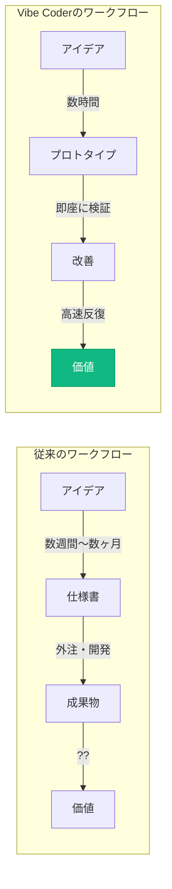

---

## 🔄 従来のプログラマーとVibe Coderの違い

### **パラダイムシフトを可視化する**

| 項目 | **従来のプログラマー** | **Vibe Coder** |
|------|---------------------|---------------|
| **主な作業** | 一からコードを手書きで作成 | AIとの対話を通じて開発 |
| **必要な知識** | 言語仕様やフレームワークの深い知識 | 自然言語でのコミュニケーション能力 |
| **時間の使い方** | デバッグやエラー解決に多くの時間 | アイデアの具現化に集中 |
| **重視する点** | 技術的な専門性 | ビジネス価値の創出 |
| **学習曲線** | 数年かけて習得 | 数週間〜数ヶ月で実用レベル |
| **参入障壁** | 高い（専門教育が必要） | 低い（AIがサポート） |
| **開発速度** | 慎重に積み上げる | 高速プロトタイピング |
| **失敗のコスト** | 高い（時間とリソース） | 低い（即座に修正可能） |

### **重要な気づき**

## **技術的な深さではなく、アイデアの価値と実装速度が勝負になる**

---

## 🔑 最重要概念：「コンテクストが全て」

### **このプログラムの本質は、プログラミングではありません**

## **「コンテクストコントロール」技術の習得です**

### **コンテクストコントロールとは？**

検討過程、思考回路、要件、制約条件、背景情報...
これらすべてを「コンテクスト」として構造化して管理し、
AIエージェントと協働しながら様々なアウトプットに変換する技術。

### **AIの出力品質 = 入力（コンテクスト）品質**

適切な背景情報を構造化して提供する能力こそが、Vibe Coderの真の力です。

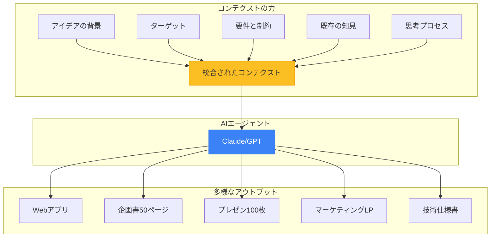

### **重要：すべてが整合性を保って生成される**

同じコンテクストから生成されるため、企画書とアプリとプレゼンの内容が完全に一致。
これまでのように「資料ごとに内容が矛盾する」問題が消滅します。

---


## 💥 アイデアの墓場から、アウトプットの工場へ

### **組織で起きている「アイデアの死」**

私たちの多くは、素晴らしいアイデアが形になる前に消えていく「アイデアの墓場」を経験してきました。

| 段階 | 現象 | 死因 |
|------|------|------|
| **会議** | 「それいいね！」 | → 議事録の1行で終了 |
| **Slack** | 「こんなのあったら...」 | → いいねスタンプで流れる |
| **企画書** | 「検討します」 | → リソース不足で頓挫 |

### **なぜアイデアの99%は形にならないのか？**

> **「誰が作るの？」**
> **「実装リソースが...」**
> **「ドキュメント化する時間が...」**

---

## 🔄 従来との決定的な違い

### **VibeCoderは、この状況を根本から変える新しいアプローチです**

| 項目 | **従来のアウトプット手法** | **VibeCoderのアプローチ** |
|------|------------------------|----------------------|
| **文化** | アイデアの揮発<br/>（「それいいね」で終わる） | 即時アウトプット文化<br/>（「まず作ってみよう」） |
| **障壁** | リソースの壁<br/>（「作る人がいない」） | AIによる価値の多角化<br/>（1アイデア→多成果物） |
| **プロセス** | 専門家への依存<br/>（担当者待ち） | 自律的な高速仮説検証<br/>（自分で即座に実装） |
| **焦点** | 時間とコスト | **ビジネス価値の最大化** |

## **この「アウトプット化の壁」が、今、完全に崩壊しつつある**

---

## 🏭 1つのアイデアから生まれる多様なアウトプット

### **2時間で作れるもの（実例）**

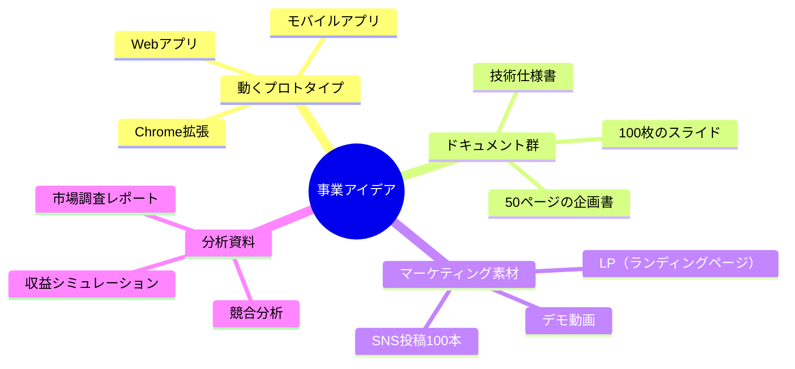

### **重要：これらすべてが同じコンテクストから、整合性を保って生成される**

---

<!-- _class: section -->
# 第2.5章
## 🎮 革命の本質：なぜIDEを学ぶべきなのか
### 〜 チャット型AIとIDE型AIの決定的な違い 〜

---

## 💬 多くの人が「AIを使っている」と言うが...

### **それは氷山の一角に過ぎない**

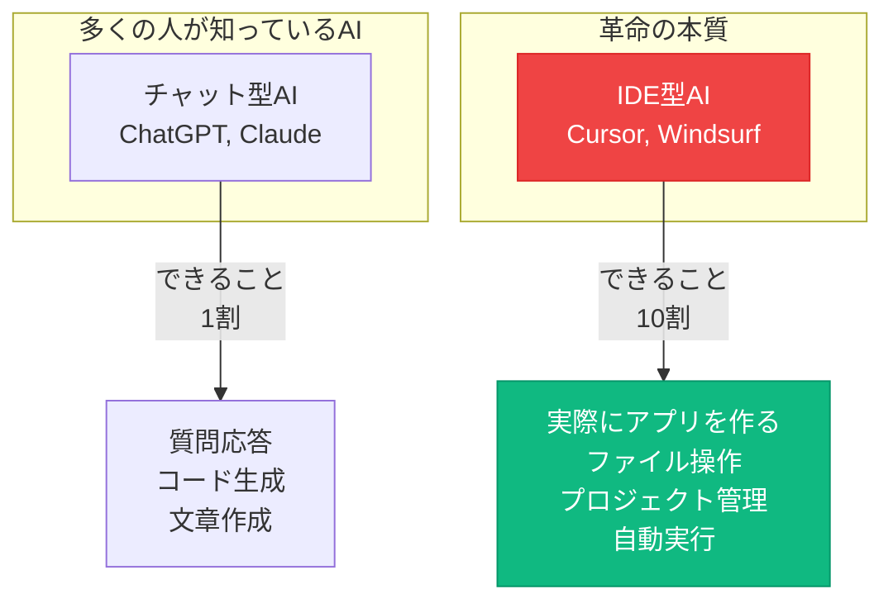

### **ChatGPTを使っているだけでは、本当の革命は起きない**

---

## 🔍 チャット型AIとIDE型AIの決定的な違い

### **比較表：何が違うのか？**

| 項目 | チャット型AI<br/>（ChatGPT, Claude） | IDE型AI<br/>（Cursor, Windsurf） |
|------|----------------------------------|--------------------------------|
| **できること** | 質問応答、コード生成 | **実際にファイルを作成・編集** |
| **作業範囲** | 1つの質問、1つのタスク | **プロジェクト全体を理解** |
| **自動化** | コピペが必要 | **AIがターミナル操作を代行** |
| **コンテクスト** | 会話履歴のみ | **全ファイルを常時参照** |
| **成果物** | テキスト | **動くアプリケーション** |
| **学習曲線** | すぐ使える | 少し学習が必要 |

### **重要な事実**
## **ChatGPT：30分で企画書**
## **Cursor：2時間で動くアプリ**

---

## 🚀 IDEが革命的な3つの理由

### **1️⃣ AIエージェントが代わりに作業する**

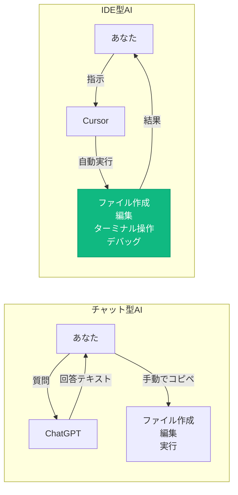

**あなたは指示するだけ。AIエージェントがファイル作成、編集、実行をすべて自動で行う。**

---

## 🧠 2️⃣ プロジェクト全体を理解している

### **チャット型AIの限界**

```
あなた：「この関数を修正して」
ChatGPT：「どの関数ですか？コードを貼り付けてください」
あなた：（コピペ）「これです」
ChatGPT：「修正しました」（修正コードを返す）
あなた：（また手動でコピペ...）
```

### **IDE型AIの革命**

```
あなた：「この関数を修正して」
Cursor：（全ファイルを既に理解している）
         「utils.ts の fetchData 関数ですね。
          他の3箇所でも使われているので、
          影響を考慮して修正します」
         （自動で修正完了）
```

### **プロジェクト全体を「コンテクスト」として理解**
- すべてのファイルを常時参照
- 関数の依存関係を把握
- 整合性のあるコード生成

---

## ⚡ 3️⃣ 「午前の会議→午後にプロトタイプ」が現実に

### **実際の開発フロー比較**

#### **チャット型AIの場合（3日間）**

| 時間 | 作業 | 問題 |
|------|------|------|
| **Day 1** | ChatGPTに相談 | コードをコピペ地獄 |
| **Day 2** | エラーが出る | 何が間違っているか不明 |
| **Day 3** | 修正を繰り返す | 結局動かない... |

#### **IDE型AIの場合（2時間）**

| 時間 | 作業 | 結果 |
|------|------|------|
| **10:00** | 「SNSアプリ作って」 | ✅ プロジェクト作成 |
| **10:30** | 「認証機能追加」 | ✅ 自動実装 |
| **11:00** | 「デザイン修正」 | ✅ 即座に反映 |
| **12:00** | **プロトタイプ完成** | 🎉 **デモ準備完了** |

---

## 🎯 IDEを習得すべき決定的な理由

### **AIツールの進化マップ**

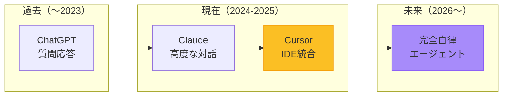

### **重要な事実**

## **IDEを使えるようになることは、未来の完全自律エージェントを使いこなす準備**

---

## 💡 実例：私自身の体験

### **2023年（チャットAIのみ使用）**
- 開発したアプリ数：**10本**
- 1アプリの開発期間：**2週間**
- エラー対応：**苦痛**
- コピペ回数：**無限**

### **2024年（IDE + AIエージェント）**
- 開発したアプリ数：**60本**
- 1アプリの開発期間：**2日**
- エラー対応：**AIが自動修正**
- コピペ回数：**ほぼゼロ**

## **6倍の生産性向上、7倍の開発速度**

---

## 🎓 本プログラムでの学習内容

### **このブートキャンプで習得するIDE活用スキル**

#### **Week 1-2：IDE基礎**
- Cursorのセットアップ
- AIエージェントとの対話方法
- プロジェクト構造の理解

#### **Week 3-4：実践開発**
- コンテクストを活用した開発
- エラー対応の自動化
- プロトタイプ高速作成

#### **Week 5-6：応用と発表**
- オリジナルSNSアプリ開発
- デプロイとインターネット公開
- 成果発表

### **重要：IDEを学ぶことが、このプログラムの核心**

---

## 🔧 AI協働開発の5ステップワークフロー

### **Vibe Coderの実践的な開発プロセス**

実際にVibe Coderとして開発する際の具体的なワークフローを理解しましょう。

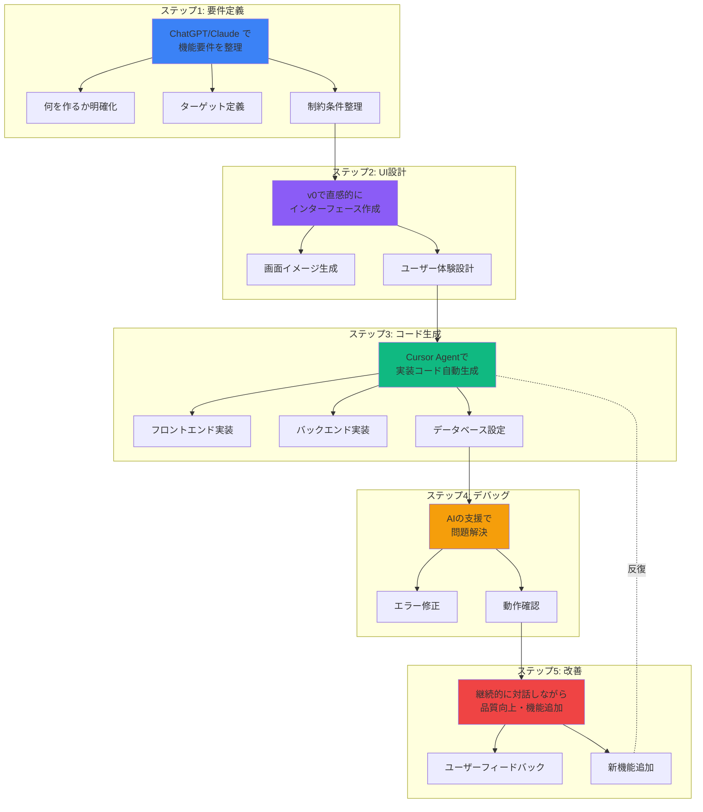

### **各ステップの詳細**

| ステップ | 使用ツール | 所要時間 | 重要なポイント |
|---------|-----------|---------|--------------|
| **1. 要件定義** | ChatGPT/Claude | 30分〜1時間 | コンテクストを明確に |
| **2. UI設計** | v0 | 30分〜1時間 | ユーザー体験を優先 |
| **3. コード生成** | Cursor Agent | 1〜3時間 | AIに任せる勇気 |
| **4. デバッグ** | Cursor/ChatGPT | 1〜2時間 | エラーは学びの機会 |
| **5. 改善** | 全ツール統合 | 継続的 | 小さく速く反復 |

### **重要な心構え**

✅ **完璧を求めない**：まず動くものを作り、改善していく
✅ **AIを信じる**：エラーが出ても、AIが解決策を提示してくれる
✅ **高速反復**：1つの機能に時間をかけすぎず、まず形にする
✅ **コンテクスト重視**：各ステップで「なぜ作るか」を明確に

---

## 🚨 よくある誤解

### **「ChatGPTで十分では？」**

**答え：用途による**

| 用途 | 推奨ツール | 理由 |
|------|-----------|------|
| 質問応答 | ChatGPT | 会話に最適 |
| 文章作成 | Claude | 高度な文章生成 |
| **アプリ開発** | **Cursor** | **実装まで自動化** |
| **業務ツール作成** | **Cursor** | **即座にデプロイ可能** |

### **「学習コストが高そう...」**

**実際：ChatGPTが使えれば、Cursorも使える**
- 基本は同じ「会話」
- ただし、結果が「動くアプリ」になる

---

## 🎬 デモタイム（講義中に実施）

### **実際に見せます：チャット型 vs IDE型**

#### **課題：簡単なToDoアプリを作る**

| 方法 | 所要時間 | 結果 |
|------|---------|------|
| **ChatGPT** | 30分 | コードだけ |
| **Cursor** | 5分 | **動くアプリ** |

### **百聞は一見にしかず**

---

<!-- _class: section -->
# 第3章
## 🌈 3つの活用領域：Vibe Coder の真の力
### 〜 Coding だけじゃない、Writing も Making も 〜

---

## 📚 Vibe Coderが活躍する3つの領域

### **コンテクストコントロール × AIエージェント = 無限の可能性**

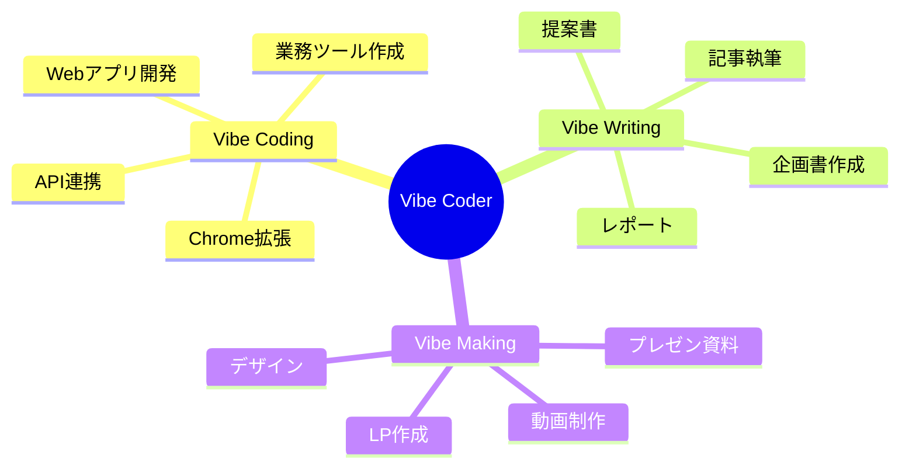

### **重要：すべてが同じスキルセットで実現**

---

## 💻 1️⃣ Vibe Coding：Webアプリ・ツール開発

### **作れるものの多様性**

| カテゴリ | 具体例 |
|---------|--------|
| **業務ツール** | 在庫管理、勤怠システム、顧客管理ツール |
| **Webサイト** | コーポレートサイト、LP、ポートフォリオ |
| **SNSアプリ** | コミュニティプラットフォーム、趣味特化型SNS |
| **シミュレーションツール** | 売上予測、リスク分析、最適化ツール |
| **Chrome拡張** | 業務効率化、自動化ツール |
| **API連携** | Slack Bot、通知システム、データ連携 |

### **プロジェクトによって開発期間は様々**
- シンプルなツール：数時間〜数日
- 複雑なアプリケーション：数週間〜数ヶ月
- 重要なのは「作れる」という選択肢を持つこと

---

## 📝 2️⃣ Vibe Writing：企画書・記事作成

### **できること**

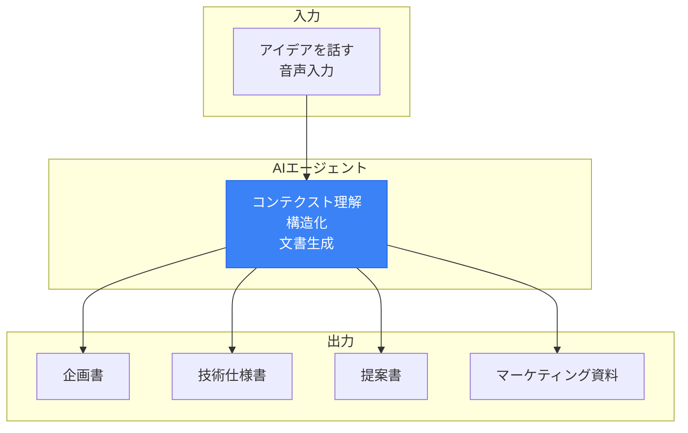

### **従来との違い**

| 項目 | 従来 | Vibe Writing |
|------|------|-------------|
| **作成時間** | 数日かかる | 大幅に短縮 |
| **品質** | 担当者に依存 | 一貫性あり |
| **修正** | 大変 | 即座に反映 |
| **整合性** | 資料ごとにバラバラ | 完全一致 |

---

## 🎨 3️⃣ Vibe Making：プレゼン・動画制作

### **作れるもの**

| 成果物カテゴリ | 具体例 | 活用ツール |
|-------------|--------|-----------|
| **プレゼン資料** | 営業資料、研修資料、提案書 | AI + Canva/Marp |
| **解説動画** | 商品説明、チュートリアル | AI台本 + 編集ツール |
| **Webページ** | LP（ランディングページ）、特設サイト | Cursor/v0 |
| **SNSコンテンツ** | 投稿文、キャプション、画像 | Claude/ChatGPT |

### **実例：この講義資料も**

この講義資料（Marp形式のマークダウン）も、
コンテクストとAIで作成しました。

---

## 🔗 3つの領域の統合活用

### **実例：新規事業立ち上げフロー**

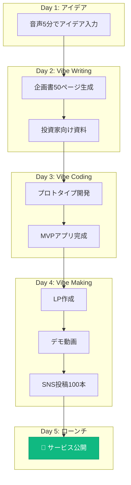

### **たった5日間で、アイデアから公開まで完結**

---

## 💡 組織での活用イメージ

### **各部門での活用例**

| 部門 | Vibe Coding | Vibe Writing | Vibe Making |
|------|------------|-------------|------------|
| **営業** | 顧客管理ツール | 提案書自動生成 | プレゼン資料 |
| **マーケ** | LP作成 | 記事量産 | SNS投稿自動化 |
| **人事** | 勤怠システム | 評価レポート | 研修資料 |
| **経営** | ダッシュボード | 事業計画書 | 株主向け資料 |

---

## 🔗 まとめ：3つの領域を統合する力

### **Vibe Coderの真価は、統合にある**

- ✅ **Coding**: アイデアを動くアプリに
- ✅ **Writing**: 思考を構造化された文書に
- ✅ **Making**: 価値を視覚的に伝える資料に

### **すべてが1つのコンテクストから生まれる**

次の第4章では、これらを活用できる「非エンジニアの隠れた優位性」を解説します。

---

<!-- _class: section -->
# 第4章
## 💎 非エンジニアの隠れた優位性
### 〜 あなたが持つ「未開発の金鉱」〜

---

## 🚧 非エンジニアが直面する「3つの壁」

### **従来、これらの壁があなたを止めていた**

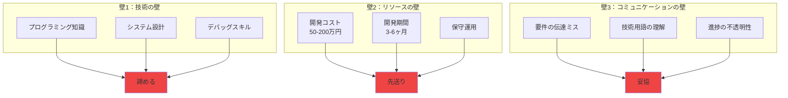

---

## 🎯 Vibe Coderが提供する「4つの解決策」

### **すべての壁を、AIが溶かしていく**

#### **1️⃣ 即座のアイデア実現**

- ✅ 思いついたアイデアをその日のうちに形にできる
- ✅ プロトタイプの作成が数時間で可能
- ✅ 市場の反応を素早く確認できる
- ✅ 失敗しても低コストで次のアイデアに移行

**実践例：**
Vibe Coderの基本は「まずAIに指示文を書き、即実行してみる」ことです。下準備に膨大な時間を取られることなく、数時間で触れる試作品を得られます。試してみてダメならすぐに方向を変える──**失敗コストが小さいからこそ、挑戦の回数を増やせる**わけです。

#### **2️⃣ 技術の壁をAIが肩代わり**

- ✅ 複雑なプログラミング知識が不要
- ✅ AIが技術的な詳細を補完
- ✅ 自然言語でのコミュニケーションが中心
- ✅ 学習コストの大幅な削減

**実践例：**
複雑なフレームワーク設定やライブラリ選定はAIが提案・自動生成します。あなたは「どんな価値を届けたいか」「ユーザーはどう感じるか」など、**本質的な問いに集中**できます。結果として技術的制約に縛られない自由度の高い発想が可能になります。

#### **3️⃣ コミュニケーションロスの大幅削減**

- ✅ 完成イメージを文章でAIに伝え、即座にデモとして確認
- ✅ 要件のズレを早い段階で修正できる
- ✅ AIが生成したコードを見せながらエンジニアと議論
- ✅ 意思疎通が格段にスムーズに

| 従来の壁 | Vibe Coderの解決策 | 具体例 |
|----------|-------------------|---------|
| **技術の壁** | AIが技術を肩代わり | エラーメッセージをコピペ → 解決策を提示 |
| **リソースの壁** | コスト1/100、期間1/10 | 50万円→5千円、3ヶ月→3日 |
| **コミュニケーションの壁** | 自然言語で直接指示 | 「Twitterみたいなの作って」→ 動くプロトタイプ |

#### **4️⃣ 自走できる改善サイクル**

プロトタイプ → ユーザーテスト → 改善 という迭代を、エンジニアの空き待ちなしで自主的に回せます。**改善サイクルが短くなるほど学びも速くなり、製品価値は指数関数的に高まります。**

### **革命的な事実**
## **もはや「作れない理由」は存在しない**

---

## 💪 非エンジニアの「4つの強み」を最大化

### **あなたが既に持っている武器を、AIが100倍に増幅する**

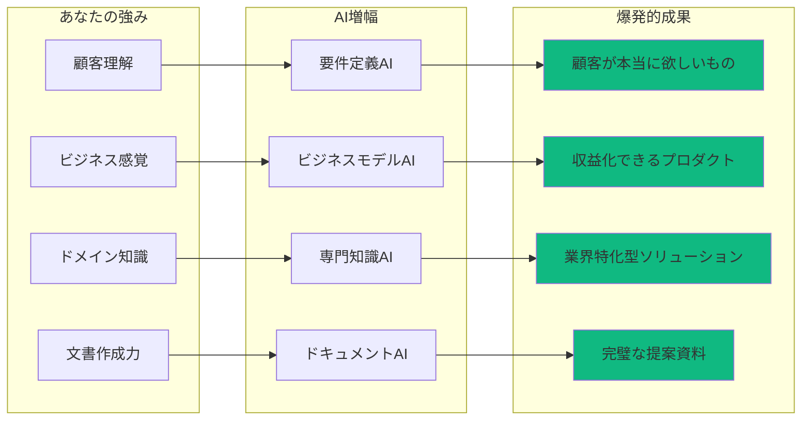

---

## 🎓 Vibe Coderに必要なスキルセット

### **技術的スキルと非技術的スキルのバランス**

Vibe Coderとして成功するために必要なスキルは、従来のプログラマーとは大きく異なります。
**技術的な深さよりも、幅広い能力とAI活用力が重要**です。

### **技術的スキル（AIがサポートしてくれる）**

| スキル | 必要レベル | AI支援度 | 学習時間 |
|-------|----------|---------|---------|
| **基本的なWeb技術理解**<br/>（HTML、CSS、JavaScript） | 概念理解 | ★★★★★ | 数週間 |
| **AIツールの効果的な使い方**<br/>（Cursor、Claude、ChatGPT） | 実践レベル | ★★★★☆ | 数日〜1週間 |
| **プロンプトエンジニアリング**<br/>（AIへの指示の書き方） | 中級 | ★★★☆☆ | 継続的 |
| **バージョン管理（Git）**<br/>の基本操作 | 基礎のみ | ★★★★☆ | 1〜2週間 |

**重要：** これらは「完璧に理解する」必要はありません。**AIがほとんどをサポート**してくれます。

### **非技術的スキル（あなたの本当の強み）**

| スキル | 重要度 | Vibe Coderでの活用 |
|-------|-------|------------------|
| **論理的思考力** | ★★★★★ | 要件を構造化し、AIに明確に伝える |
| **問題解決能力** | ★★★★★ | エラーの本質を理解し、解決策を導く |
| **コミュニケーション能力** | ★★★★☆ | AIとの対話、ステークホルダーへの説明 |
| **継続的学習への意欲** | ★★★★★ | AI技術の進化に合わせて成長 |
| **ビジネス感覚** | ★★★★☆ | 何を作るべきかの判断 |
| **顧客理解** | ★★★★★ | ユーザーが本当に欲しいものを見抜く |

### **非エンジニアが既に持っているスキルの価値**

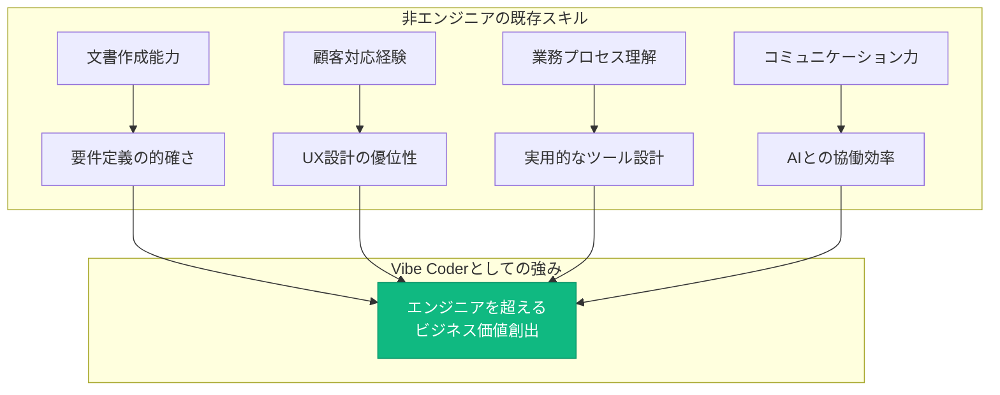

### **心構え：安心してください、AIがサポートします**

**難しそう？ でも安心してください。**

> AIがすべての技術的な詳細をサポートしてくれます。
> だから私たち非エンジニアもVibe Coderになれるんです。

**重要なのは：**
- ✅ 「何を作りたいか」を明確に伝える力
- ✅ 「なぜ作るのか」を理解している
- ✅ 「どう使われるか」をイメージできる
- ✅ 諦めずに試行錯誤する姿勢

---

### **組織文化への影響（測定困難な価値）**
- 💡 「できない」から「やってみよう」文化へ
- 🚀 部門間連携の活性化
- 🌟 DX推進の実質的な加速
- 💪 課題解決スピードの向上

---

## 🔮 研修後の組織の姿

### **AI駆動型組織への変革**

#### **業務面の変化**
- 定型業務：**自動化率50%以上**
- 意思決定：**データドリブン＋プロトタイプ検証**
- 問題解決：**即日〜数日でソリューション実装**

#### **チーム力の向上**
- 開発した業務ツール：**各部門で5本以上**
- 部門横断プロジェクト：**AI活用が前提**
- ナレッジ共有：**成功パターンの横展開**

#### **組織文化の進化**
- 「AIファースト」の思考が定着
- 失敗を恐れない実験文化
- 継続的な改善サイクル確立

> **重要：これは理想論ではなく、既に多くの企業で起きはじめている変革**

---

<!-- _class: section -->
# 第5章
## 🚀 AIと共に成長する思考法
### 〜 「追いつく」から「乗りこなす」へ 〜

---

## 🌊 なぜ「追いつく」ではなく「乗りこなす」なのか

### **世界で起きていること**

> いま世界で起きていることは、「人間の学習曲線」よりもはるかに急峻な「AIの進化曲線」が私たちを追い越し、背中から強烈な追い風を吹かせはじめた、という事実です。
>
> その風を怖がるか、帆に受けて前へ進むか──すべては私たちの"受け止め方"にかかっています。

### **驚異的な進化スピード**

2022年にGPT-3.5が登場し、多くの人が「AIがここまで文章を整えるのか」と驚きました。ところが翌2023年にはGPT-4が、2024年にはGPT-4oが、2025年にはマルチモーダルとリアルタイム推論を標準搭載した**GPT-5系**が当たり前のようにリリースされ、テキスト・画像・音声の壁を溶かしてしまいました。

年単位どころか**四半期単位で「できること」が書き換わる**世界です。

---

## 📊 人間 vs AI：成長曲線の残酷な真実

### **もはや追いつくことは不可能**

人間が同じスピードで知識を暗記し、技能を習得しようとしても到底追いつきません。

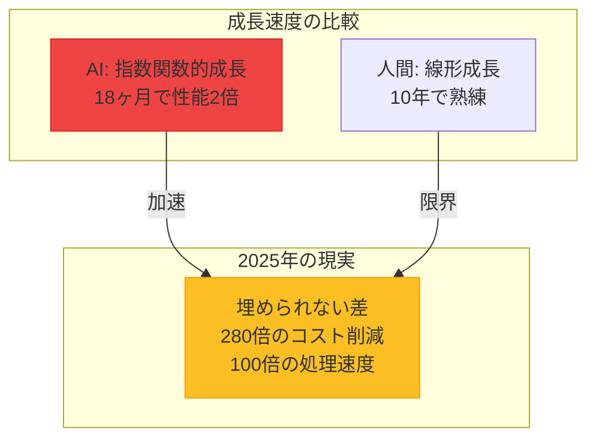

### **だからこそ、発想を転換する**

ならば発想を転換し、**AIが伸びる速度をそのまま自分のアウトプット速度に変換する仕組み**を作った方が合理的です。

## **AIの成長を、自分の成長に変換する**

---

## 🌊 AIの進化を「追い風」に変える3つのレンズ

### **1. 編集者のレンズ 👁️**
AIの大量出力から、価値ある20%を抽出し、磨き上げる

**実践例：**
```
AI出力：10個の事業アイデア
↓ 編集者の仕事
選別：市場性のある3つを選択
深掘り：ターゲットを明確化
統合：1つの強力な提案に
```

### **2. ドメイン専門家のレンズ 🎯**
業界知識をAIの「翻訳キー」として活用
より強固なコンテクストを与え、独自の出力を引き出す。

### **3. 実験者のレンズ 🧪**
小さく作り、速く壊し、多く学ぶ

---

## 💡 私自身の体験：絵が描けない私が起こした革命

### **Before（2023年）**
- デザインスキル：**ゼロ**
- キービジュアル作成：デザイナーに依頼
- 費用：1枚5万円
- 納期：2週間
- 修正：追加費用と時間

### **After（2025年）**
- デザインスキル：**変わらずゼロ**
- キービジュアル作成：**AIで自作**
- 費用：月額3,000円で無制限
- 納期：**一晩で20パターン**
- 修正：**即座に100パターン追加**

## **絵を描くスキルは伸びていない。でも成果は100倍に。**
### **これがAIの成長を取り込むということ**

---

## 🔄 日常に落とし込む「4つの習慣」

### **今日から始められる具体的アクション**

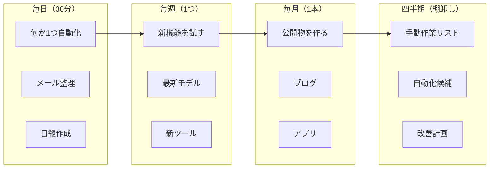

### **重要：小さな習慣の積み重ねが、1年後に巨大な差を生む**

---

## 📈 複利効果：早期学習者が得る圧倒的優位性

### **知識とスキルの複利計算**

| 月 | 学習内容 | 累積価値 | 実践例 |
|----|---------|---------|---------|
| **1ヶ月目** | 基礎（プロンプト） | 1x | 簡単な自動化 |
| **3ヶ月目** | 応用（エージェント） | 3x | 業務ツール開発 |
| **6ヶ月目** | 実践（プロダクト） | 10x | 公開アプリ |
| **12ヶ月目** | 専門（ビジネス展開） | 30x | 収益化成功 |
| **24ヶ月目** | 達人（教育・拡散） | 100x | 講師・コンサル |

### **ポイント：AIが進化するたびに、あなたの過去の学びも価値が上がる**

> **例：** GPT-4で学んだプロンプト技術 → GPT-5でさらに強力に

---

## 🎯 2025年後半〜2026年の技術トレンド

### **最新情報（2025年9月時点）**

| トレンド | 現在 | 2026年予測 | あなたへの影響 |
|---------|------|-----------|--------------|
| **推論AI** | GPT-5登場<br/>思考モード実装 | 完全自律エージェント | プログラミング不要に |
| **コスト** | 280倍削減達成 | 1000倍削減 | 個人で大規模開発可能 |
| **エージェント** | 画面操作可能 | 複雑な業務自動化 | 業務の80%自動化 |
| **ローカルAI** | Gemma 3登場 | スマホで動作 | プライバシー問題解決 |
| **規制** | EU AI Act準備 | 完全施行 | 信頼性向上 |

### **準備すべきこと：**
1. **今すぐ**: 基礎スキルの習得（このブートキャンプ）
2. **3ヶ月後**: エージェント活用の実践
3. **6ヶ月後**: ビジネスモデルの確立

---

<!-- _class: section -->
# 第6章
## 💰 AIツールへの投資思考
### 〜 月3,000円が月30万円の価値を生む 〜

---

## 💭 シンプルな事実

### **AIツールは道具。良い道具にはお金をかける**

**営業マンの例：**
- 良い靴：毎日歩き回るなら投資する
- 良い鞄：書類を運ぶなら投資する
- 良いAI：仕事を効率化するなら投資する

**プログラマーの例：**
- 良いPC：開発効率のために投資する
- 良いモニター：作業環境に投資する
- 良いAI：コーディング支援に投資する

### **月3,000円は、缶コーヒー20本分**

---

## 🎯 無料版と有料版の違い

### **実際の制限比較**

| 項目 | 無料版 | 有料版（Claude Pro/ChatGPT Plus） |
|------|--------|----------------------------------|
| **利用回数** | 時間/日数制限あり | 制限大幅緩和または無制限 |
| **待ち時間** | 混雑時は利用不可 | 優先アクセス |
| **最新モデル** | 使えない | 最新・高性能モデル利用可 |
| **ファイル添付** | 制限あり | 大容量ファイル対応 |

### **判断基準はシンプル**
- 仕事で使う → 課金
- 週3回以上使う → 課金
- ストレスを感じる → 課金

---

## ⚠️ よくある勘違い

### **「まず無料版で練習してから...」**

**これが罠**
- 制限があるとストレスで続かない
- 性能が低いと効果を実感できない
- 結果：AIの価値を誤解して諦める

### **正しいアプローチ**
1. 最初の1ヶ月だけ有料版を試す
2. 効果を実感できたら継続
3. 実感できなければ解約（月額なので安心）

### **重要：年額プランは避ける（まずは月額で）**

---

## 🎯 活用を最大化する「5つの鉄則」

### **課金した分、組織全体で活用し尽くす**

### 1️⃣ **毎日10分でも使う**
- 朝一番にAIでタスク整理
- 議事録をAIで要約
- メールの下書きをAI作成

### 2️⃣ **新機能は即座に試す**
- リリースノートを毎週チェック
- 新機能を使った感想をSNSで共有
- 失敗を恐れずに実験

### 3️⃣ **成果を必ず記録する**
- 部門の業務改善効果を数値化
- 作成したツール・成果物を共有
- 四半期ごとにROI報告

### 4️⃣ **組織内で知見を共有**
- 他部門の成功事例を横展開
- 定期的な成果発表会を開催
- 社内AIコミュニティを形成

### 5️⃣ **3ヶ月ごとに見直す**
- 使用頻度と効果を評価
- より良いツールがないか調査
- 投資配分を最適化

---

## ⚠️ よくある失敗パターン

| 失敗パターン | 症状 | 対策 |
|------------|------|------|
| **ツール収集癖** | 10個契約して1個しか使わない | 1つマスターしてから次へ |
| **年契約の後悔** | 使わなくなっても解約できない | 必ず月額契約 |
| **目的の喪失** | AIを使うことが目的化 | 作りたいものを先に決める |

---

<!-- _class: section -->
# 第7章
## 🔮 未来への期待
### 〜 今できないことは、来年の当たり前 〜

---

## 📈 AI進化の驚異的スピード

### **過去3年間で起きた「不可能→当たり前」の変化**

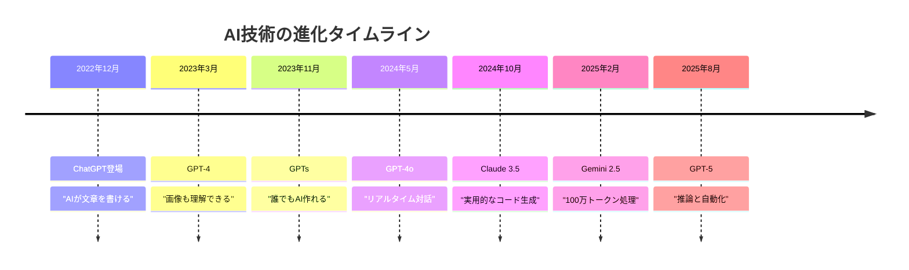

### **重要：どの時点の「限界」も、半年後には大きく改善、解決されている**

---

## 🚀 「不満は伸びしろ」の法則

### **今あなたが感じる不満こそ、最速で改善される領域**

| 現在の不満（2025.9） | 改善の兆し | 2026年の姿 |
|-------------------|-----------|-----------|
| **まだ間違える** | RAG/検索連携強化 | エラー率1%未満 |
| **文脈を忘れる** | 長期記憶実装中 | プロジェクト全体を記憶 |
| **専門性が浅い** | 業界特化モデル | 専門家レベルの知識 |
| **統合が面倒** | エージェント連携 | ワンクリックで全自動 |
| **コストが高い** | 最適化進行中 | 現在の1/10のコスト |

### **実例：私が2023年に感じた不満**
- 「コードのエラーが多い」→ 簡単なものであれば2024年には作れるように。
- 「日本語が不自然」→ 2025年にはネイティブレベル
- 「画像生成が下手」→ 現在はプロ級のクオリティ（nano-banana凄い！）

---

## 🎯 2026年に実現する「5つの革命」

### **これらは夢物語ではなく、既に開発中の技術**

### 1️⃣ **完全自律エージェント**
- 複雑なタスクを丸投げ可能
- 「売上を20%上げて」→ 施策立案から実行まで

### 2️⃣ **ノーコードが完全主流**
- プログラミング知識が完全に不要
- アイデアを話すだけでアプリ完成

### 3️⃣ **リアルタイム協働**
- AIと人間が同じ画面で共同作業
- Google Docsのように同時編集

### 4️⃣ **個人AI秘書**
- あなたの好み、スタイル、目標を完全理解
- 24時間365日、成長し続けるパートナー

### 5️⃣ **コスト革命**
- 現在の1/100のコストでAI利用
- 個人で大企業規模のシステム運用可能

---

## 💡 期待を現実に変える「準備リスト」

### **2026年の勝者になるために、今すべきこと**

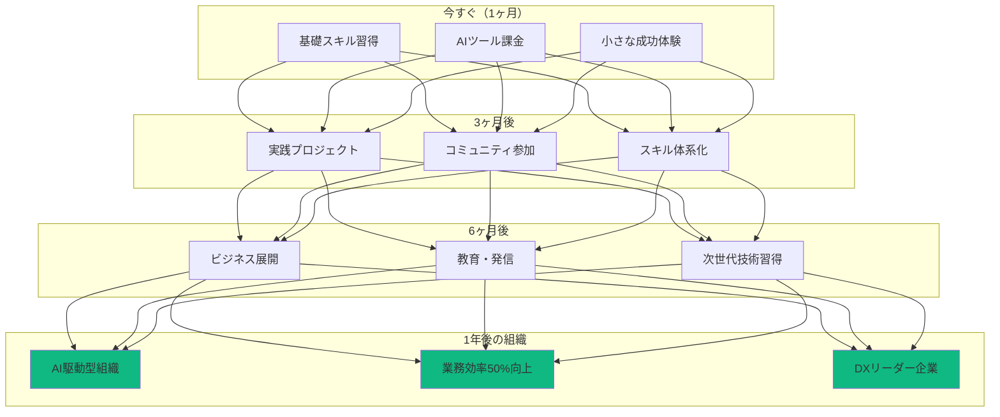

---

## 🌟 早期参入者の特権

### **今始める組織だけが得られる「5つの優位性」**

### 1️⃣ **先行者利益**
- 競合他社より先に業務効率化を実現
- 業界内でのAI活用リーダーポジション確立

### 2️⃣ **組織的学習の複利効果**
- チーム全体のスキルが相乗的に向上
- 新技術への適応力が組織文化として定着

### 3️⃣ **社内イノベーターネットワーク**
- 部門横断的な改善活動の活性化
- ナレッジ共有による組織全体の底上げ

### 4️⃣ **実験的アプローチの文化醸成**
- 低コストでの試行錯誤が可能
- 失敗から学ぶ文化の構築

### 5️⃣ **組織の競争優位**
- AI活用で他社に先行
- デジタル変革のリーダー企業へ

---

<!-- _class: section -->
# まとめ
## 🎯 今日から始まる、あなたの革命

---

## 📝 本日の学び：8つの革命的気づき

### **組織の中で、既に革命は始まっている**

### 1️⃣ **コンテクストが全て**
- Vibe Codingの本質はプログラミングではなく、コンテクストコントロール
- AIの出力品質 = 入力（コンテクスト）品質

### 2️⃣ **IDEこそが革命の本質**
- チャット型AI（ChatGPT）は氷山の一角
- IDE型AI（Cursor）が「午前の会議→午後にプロトタイプ」を実現
- AIエージェントによる自動化が真の革命

### 3️⃣ **3つの活用領域がすべて開放される**
- Vibe Coding：Webアプリ・ツール開発
- Vibe Writing：企画書・記事作成
- Vibe Making：プレゼン・動画制作

### 4️⃣ **アウトプット革命の本質**
- アイデアの墓場から、アウトプットの工場へ

### 5️⃣ **非エンジニアこそ主役**
- 0→100の飛躍が最大のインパクト
- 顧客理解、ビジネス感覚、ドメイン知識が武器に

### 6️⃣ **AIと共に成長する**
- 追いつくのではなく、乗りこなす

### 7️⃣ **投資思考の重要性**
- 月3,000円が月30万円の価値を生む

### 8️⃣ **今が最高のタイミング**
- 早期参入者の特権
- 競合他社より先に始めることが競争優位の源泉

---

## 🚀 この後の内容

### **本日の講義はまだ続きます！**

### **Part 2: ビジネス活用事例とLLM基礎**
- 実際のビジネス変革事例を詳しく解説
- LLMの仕組みと特性を理解
- プロンプトエンジニアリングの実践

### **Part 3: ビジネス要件定義の実践**
- アイデアを構造化する技術
- Markdownでの要件定義書作成

### **Part 4: ツール紹介と宿題説明**
- 最新AIツールの詳細解説
- 宿題の具体的な進め方

**ここで5分間の休憩を取りましょう**

---

## 💬 Q&Aタイム

### **よくある質問と回答**

**Q: プログラミング経験ゼロでも本当に大丈夫？**
A: 私自身がゼロから始めて2年で60本開発。大丈夫です。

**Q: どのAIツールから始めるべき？**
A: Claude ProかChatGPT Plus。両方でも月6,000円。

**Q: 仕事が忙しくて時間が取れない**
A: 1日30分から。通勤時間でも学習可能。

**Q: ベテラン社員でも習得可能？**
A: 業務知識がある分、むしろAI活用の効果は大きい。

**Q: 失敗が怖い**
A: AIなら失敗のコストは限りなく小さい。失敗は学び。

---

## 🎊 最後のメッセージ

### **今日この瞬間から、組織が変わる**

## **3つの約束**

### 1️⃣ **すべての業務に改善の可能性がある**
「これは仕方ない」という壁は、もう存在しない

### 2️⃣ **チーム全体で成長する**
個人ではなく、組織として変革を起こす

### 3️⃣ **1ヶ月半後、業務が変わっている**
必ず、実務で使えるツールを作り、展開する

---

## 🔥 行動への招待

### **今すぐやるべき3つのアクション**

## **1. 今日中に**
AIツール（Claude/ChatGPT）に登録して、最初の会話をする

## **2. 今週中に**
自部門の「面倒な作業」を1つ、AIで自動化してみる

## **3. 次回講義まで**
「こんなSNSがあったら面白い」というアイデアを10個書き出す

### **重要：知識ではなく、行動が組織を変える**

> **「The best time to plant a tree was 20 years ago.**
> **The second best time is now.」**
> 
> 木を植える最良の時期は20年前だった。
> 次に良い時期は、今だ。

---

<!-- _class: ending -->
# **Welcome to the Revolution**

## **組織のVibe Coder変革が、今始まる**

### **続いて Part 2: ビジネス活用事例とLLM基礎へ**

**Contact:**
- 講師：泉水 亮介
- TEKION Group
- Twitter: @rsensui
- メール：rsensui@tekion.jp

**Remember:**
# **You are the Revolution.**

---