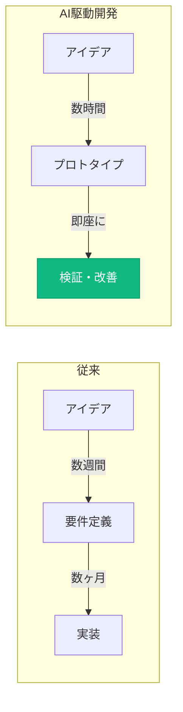
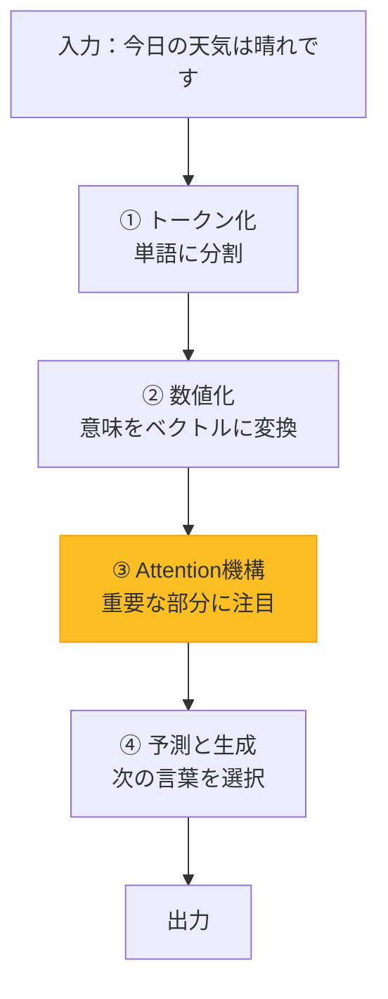
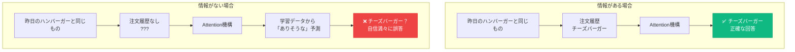
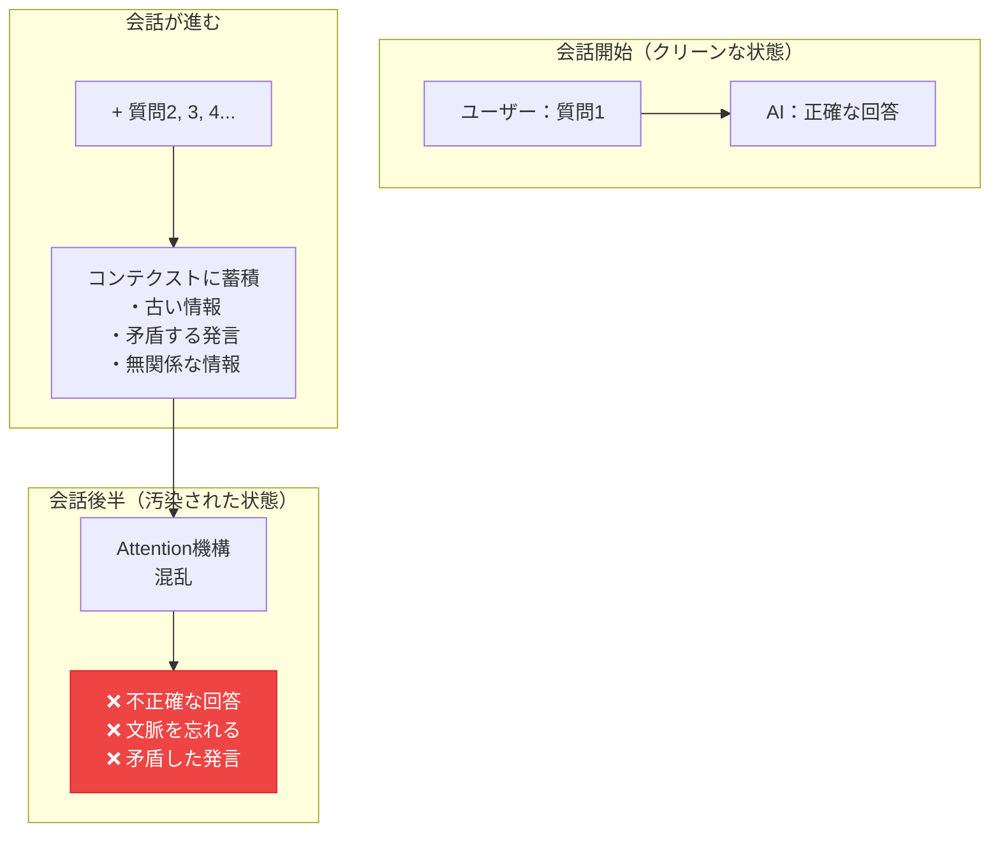
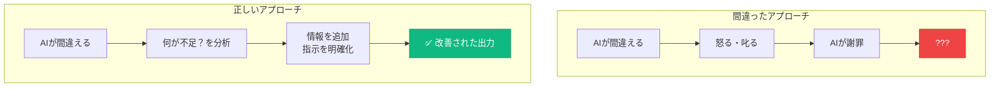
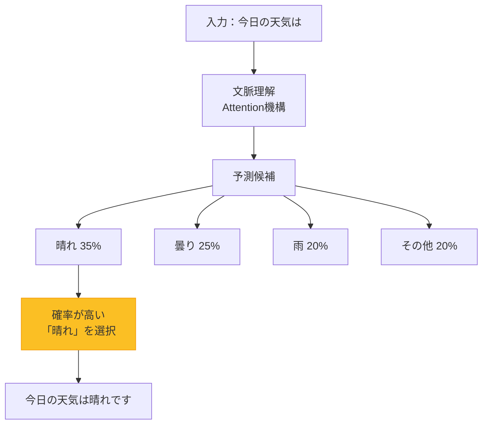
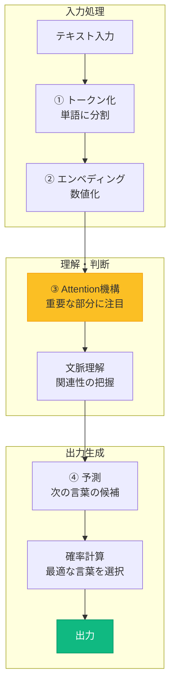
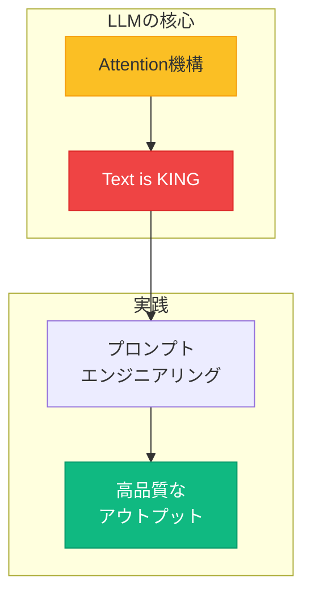

# **第一回**
## ビジネス活用事例とLLM基礎

---

## 本日のアジェンダ

1.  **ビジネス活用事例 (5分)**
    -   AI駆動開発がもたらす変化の本質
2.  **LLM基礎 (30分)**
    -   LLMとは？ - 大規模言語モデルの理解
    -   LLMの「理解」の仕組み
    -   Text is KING - テキストを制する者はLLMを制する
    -   プロンプトエンジニアリング - AIとの効果的な対話術
    -   音声入力の活用 - 思考を瞬時にテキスト化

---

## 1. ビジネス活用事例
### AI駆動開発がもたらす変化の本質

**前回（1-1）で学んだ具体的事例：**
- コミュニケーション円滑化：プロトタイプでの認識共有
- 泉水亮介のプロジェクト：mygear.jp、calendy.biz、mdnow.tokyo

### **これらを可能にした技術が「LLM」**



**重要：この変化の背後にあるのが「LLM」という技術です**

---

## 2. LLM基礎
### LLMとは？ - 大規模言語モデルの理解（5分）

---

### LLMの本質：「予測マシン」

**LLMを一言で表すと：**
> 💡 **「次に来る言葉を予測する超高性能なシステム」**

#### 身近な例で理解する

**スマホの予測変換を思い出してください：**
```
「今日の」と入力すると...
→ 「天気」「予定」「ランチ」などが候補に出る
```

**LLMは、これの超強化版**
- 膨大な読書経験（インターネット上の大量テキスト）から学習
- 文脈を深く理解して予測
- 単語だけでなく、文章・段落・コード全体を生成

---

### LLMの比喩：3つの視点

#### 1️⃣ **図書館の司書さん**
```
📚 膨大な本（知識）を記憶している
👂 あなたの質問を理解して、適切な情報を探す
⚠️  でも、時々記憶違いをする（ハルシネーション）
✅ 質問が具体的であるほど、良い回答をしてくれる
```

#### 2️⃣ **優秀なスーパーインターン**
```
💼 知識は豊富だが、判断は人間が必要
⚡ タイピングの3-4倍の速度で作業
🔄 24時間365日、疲れ知らず
📝 下書きは得意、最終判断は苦手
```

#### 3️⃣ **高度な自動補完システム**
```
⌨️  入力に合わせて次を予測
🧠 文脈を理解して整合性を保つ
🎯 確率的に最適な言葉を選択
```

---

### LLMの特徴：4つのポイント

#### ✅ **大規模なパラメータ数**
- 数十億から数兆のパラメータ（調整可能な設定）
- パラメータが多いほど、複雑なパターンを学習可能

#### ✅ **汎用性**
- 様々なタスクに対応可能
- 文章作成、翻訳、要約、コード生成、分析...

#### ✅ **文脈理解**
- 長い文脈を理解し、一貫した回答を生成
- 前の会話を覚えて、話をつなげる

#### ✅ **創造性**
- 学習したパターンを組み合わせて新しいアイデアを提案
- ただし、本当に「理解」しているわけではない

---

## LLMの「理解」の仕組み（10分）

### AIがテキストを理解するまでの4ステップ



---

### ① テキストの分解（トークン化）

**簡単な例：「今日の天気は晴れです」**

```
入力：「今日の天気は晴れです」
    ↓
トークン化（単語に分割）
    ↓
["今日", "の", "天気", "は", "晴れ", "です"]
```

#### なぜ分割するの？
- コンピュータは文章全体を一度に理解できない
- 単語レベルに分けることで、それぞれの意味を把握
- 「今日」「天気」「晴れ」という重要な単語を特定

#### 実際のトークン化はもっと細かい
```
「理解しました」 → ["理", "解", "し", "ました"]
"understanding" → ["under", "stand", "ing"]
```

---

### ② 意味の数値化（エンベディング）

**単語を数値（ベクトル）に変換**

```
トークン：["今日", "の", "天気", "は", "晴れ", "です"]
    ↓
数値ベクトルに変換（簡略化した例）
    ↓
"今日"   → [0.23, -0.54, 0.87, ...]
"天気"   → [0.45,  0.12, -0.33, ...]
"晴れ"   → [0.78,  0.91,  0.15, ...]
```

#### 身近な例で理解：色の数値表現

```
🎨 色を数値で表現するのと同じ
- 「赤」 → RGB(255, 0, 0)
- 「青」 → RGB(0, 0, 255)
- 「紫」 → RGB(128, 0, 128)

単語も数値で表現することで、
コンピュータが「意味の近さ」を計算できる
```

#### 重要ポイント
- **似た意味の単語は、似た数値になる**
- 「晴れ」と「快晴」の数値は近い
- 「晴れ」と「雨」の数値は遠い

---

### ③ 「注目する力」- Attention機構の本質

---

#### 🍽️ レストランの注文で理解する

**超簡単な例：店員さんが注文を聞くとき**

```
お客さん：「ハンバーガーとコーラをお願いします」

店員の頭の中（Attention機構）：
👀 全部の単語を見る
   ["ハンバーガー", "と", "コーラ", "を", "お願いします"]

🎯 重要度を判定：
   "ハンバーガー" → ⭐⭐⭐ 超重要！（商品名）
   "コーラ"       → ⭐⭐⭐ 超重要！（商品名）
   "と"           → ⭐ 普通（つなぎの言葉）
   "を"           → ⭐ 普通（つなぎの言葉）
   "お願いします" → ⭐⭐ 重要（注文の意図）

💡 関連性を理解：
   「ハンバーガー」と「コーラ」は
   両方とも注文したい商品
   → セットメニューを提案できる
```

---

#### もっと複雑な例：文脈の理解

**良いケース：必要な情報がある**
```
お客さん：「昨日食べた美味しいハンバーガーと同じもの」
店員：「昨日の注文履歴を確認します...チーズバーガーですね！」

Attention機構の働き：
1. "昨日" に注目 → 過去の体験を参照
2. "同じもの" に注目 → 「昨日のハンバーガー」を指していると理解
3. "美味しい" に注目 → ポジティブな評価だったことを記憶

→ 注文履歴という**コンテクスト（文脈情報）**があるので正確に対応
```

**悪いケース：情報が不足している**
```
お客さん：「昨日食べた美味しいハンバーガーと同じもの」
新人店員：「昨日の注文履歴がありません...でも多分チーズバーガーですか？」
        （実際はテリヤキバーガーだった）

→ 情報がないのに「もっともらしい嘘」を自信満々につく
   = これがハルシネーション（幻覚）の典型例
```

---

#### ⚠️ ハルシネーション（幻覚）はなぜ起こるのか

**OpenAI 2025年研究の結論：**
> LLMは「分からない」と言うより、「もっともらしい答え」を予測する方が
> 評価で高得点を取れるように訓練されている。
> だから、情報が不足していても自信満々に間違える。



**ハルシネーションの3大原因（最新研究より）：**

1. **コンテクストの不足**
   - 「今日の天気は」→ 天気情報がないのに「晴れです」と予測
   - 対策：**必要な情報を与えるか、取得手段を提供する**

2. **Attentionの迷子（"Lost in the Middle"）**
   - 長い文章の「真ん中」にある重要情報を見落とす
   - 対策：**重要情報は最初か最後に配置**

3. **「当て推量」が得をする訓練**
   - 「分かりません」より「多分〇〇です」の方が評価が高い
   - 対策：**不確実な時は「分からない」と言わせる設計**

---

#### 💡 実践的な対策：正しい出力を得るために

**天気の例で理解する：**
```
❌ 悪い例：情報を与えない
あなた：「今日の東京の天気は？」
AI：「晴れです」（予測で回答 = ハルシネーションの可能性）

✅ 良い例1：情報を与える
あなた：「今日の東京の天気は曇りで気温は15度です。この情報を基に服装を提案して」
AI：「曇りで15度なら、薄手のジャケットがおすすめです」（正確な回答）

✅ 良い例2：取得手段を提供する
あなた：「天気APIで今日の東京の天気を取得してから、服装を提案して」
AI：（APIで天気取得）→「曇りで15度なので、薄手のジャケットがおすすめです」
```

**重要な原則：**
> 🎯 **「正確な回答が欲しければ、正確な情報を与える」**
> - AIは予測マシン。情報がなければ「らしい」回答を返す
> - ハルシネーションを防ぐ = Attentionが正しい情報に注目できるようにする

---

### ⚠️ コンテクストウィンドウとコンテクスト汚染

#### コンテクストウィンドウとは？

**LLMが一度に「覚えていられる」情報量の限界**

```
コンテクストウィンドウ = LLMの「作業記憶」の容量

例：
- Claude 3.5: 200,000トークン（約15万語、書籍200冊分）
- GPT-4o: 128,000トークン（約10万語、書籍100冊分）
- Gemini 2.5: 1,000,000トークン（約75万語、書籍1000冊分）
```

**トークンとは？**
- 単語や文字の小さな単位
- 日本語1文字 ≒ 2〜3トークン
- 英語1単語 ≒ 1〜2トークン

---

#### コンテクスト汚染（Context Contamination）とは？

**会話が長くなると、コンテクストに「ノイズ」が溜まり、AIが本当に重要な情報を見失う現象**



---

#### コンテクスト汚染の3大原因（2025年研究より）

**1. Lost in the Middle（真ん中迷子）**
```
会話の最初と最後は覚えているが、
真ん中の重要情報を見落とす

対策：重要な情報は最初か最後に再提示
```

**2. 矛盾の蓄積**
```
質問1：「予算は1万円で」
質問5：「3万円の提案もいいですね」
質問10：AIが予算を混同

対策：重要な制約は毎回リマインド
```

**3. 無関係な情報の増加**
```
本題と関係ない雑談や脱線が
Attentionを分散させる

対策：定期的に会話をリセット
```

---

#### 実践的な対策：コンテクストを清潔に保つ

```
✅ 対策1：定期的なリセット
- 20〜30回のやり取りで新しい会話を開始
- 重要な情報だけを要約して引き継ぐ

✅ 対策2：重要情報の再提示
「先ほどお伝えした予算1万円、納期2週間で、
 改めて提案をお願いします」

✅ 対策3：簡潔なコミュニケーション
- 必要な情報だけを伝える
- 無関係な雑談は別の会話で

✅ 対策4：矛盾のチェック
AIが矛盾した回答をしたら、
すぐに指摘して修正
```

**重要な気づき：**
> 📝 **コンテクストは「資産」であり「負債」でもある**
> - 情報が多いほど理解が深まる（資産）
> - 情報が多すぎると混乱する（負債）
> - だからこそ、**質の高いコンテクスト管理**が重要

---

### 📌 コラム：「AIに怒っても意味がない」科学的根拠

#### よくある光景

```
ユーザー：「さっきも言ったのに！ちゃんと聞いてる！？もう一度よく考えて！」
AI：「申し訳ございません。もっと注意深く考え直します...」
```

**このやり取り、完全に時間の無駄です。AIは反省していません。**

---

#### 科学的事実：AIは感情を持たない

**2024-2025年の研究結果（複数の査読論文より）：**

##### **1. 怒りや脅しは性能を下げる**
```
研究：多言語での礼儀レベルとLLM性能の関係（2024）

結果：
- 不適切/攻撃的なプロンプト → 性能低下
- 丁寧すぎるプロンプト → 一貫した改善なし
- 中立的で明確な指示 → 最も高性能

結論：敵対的な口調は助けにならず、むしろ害になる
```

##### **2. 「反省」はロールプレイに過ぎない**
```
AIが「申し訳ございません」と言う理由：

✅ 学習データに「謝罪パターン」が含まれている
✅ 人間の対話を模倣している
✅ 批判された後の「望ましい応答」を予測

❌ 本当に反省している
❌ 感情的に傷ついている
❌ 次回から「気をつけよう」と思っている
```

##### **3. 「もっと頑張る」は幻想**
```
AIが「慎重に考え直します」と言っても：

実際の処理：
1. 入力テキストをトークン化
2. Attention機構で重要部分に注目
3. 確率的に次のトークンを予測
4. 出力

→ 「頑張る」という概念は存在しない
→ 入力が変わらなければ、出力も変わらない
```

---

#### なぜ「怒り」が効いたように感じるのか？

**実は、怒った「後」にあなたが無意識にやっていること：**

```
❌ 間違った理解：
「怒ったから、AIが反省して正確になった」

✅ 実際に起きていること：
「怒った後、あなたがより具体的な指示を与えた」

例：
悪い指示（怒る前）：
「さっきの続きで」

良い指示（怒った後）：
「予算1万円、納期2週間、React + TypeScriptで、
 さっきのTodoアプリに優先度機能を追加してください」

→ 指示の質が改善されたから、出力が改善された
```

---

#### 研究が示す「効果的なアプローチ」

**2024-2025年の実証研究より：**

##### **✅ 効果がある方法**
```
1. 構造化された指示
   - 役割、文脈、制約、出力形式を明示
   - ステップバイステップの指示

2. 重要情報の再提示
   「先ほどお伝えした予算1万円、納期2週間で...」

3. 具体的な検証基準
   「根拠を併記」「不明点は質問」

4. 会話のリセット
   長くなったら新しい会話を開始
```

##### **❌ 効果がない（または逆効果な）方法**
```
1. 感情的な表現
   「お願いだから」「もっと頑張って」
   → 性能低下またはほぼ無効

2. 脅迫的な言葉
   「間違えたら承知しないぞ」
   → 安全機能が作動して拒否される可能性

3. 過度な丁寧さ
   「もしよろしければ、ご検討いただけませんでしょうか」
   → 曖昧さが増えて精度低下
```

---

#### 実践的なアドバイス



**AIが間違えた時のチェックリスト：**
```
□ 必要な情報は全て与えたか？
□ 指示は具体的で明確か？
□ コンテクストが長すぎないか？（汚染の可能性）
□ 矛盾した指示を出していないか？
□ 重要な制約を忘れていないか？
```

---

#### まとめ：「感情」ではなく「構造」で勝負

**科学的に証明された事実：**
> 🎯 **AIの性能を決めるのは「感情」ではなく「入力の質」**
>
> - 怒りや脅しは性能を下げる
> - 「反省」はロールプレイ（演技）
> - 効果があるのは：明確な指示・十分な情報・適切な構造

**だから「Text is KING」なのです。**

感情ではなく、論理と構造で対話しましょう。

---

### Attention機構とText is KINGのまとめ

**これまで学んだ3つの重要ポイント：**

1. **Attention機構 = 重要な部分に注目する力**
   - 具体的な単語があるほど、適切に注目できる

2. **ハルシネーション = 情報不足時の予測による誤答**
   - 対策：必要な情報を与える、取得手段を提供する

3. **コンテクスト管理 = 会話の品質を維持する技術**
   - 対策：定期的なリセット、重要情報の再提示

**だから「Text is KING」**
> 💡 **入力の質（Text）が、出力の質を決める**
> - 具体的で明確なテキスト → Attentionが正しく機能
> - 曖昧で不完全なテキスト → ハルシネーションとコンテクスト汚染

---

### ④ 次の言葉の予測と生成

**例：「今日の天気は」と入力された場合**

```
入力：「今日の天気は」
    ↓
Attention機構で文脈を理解
「今日」「天気」が重要と判断
    ↓
次に来る可能性が高い単語を予測
    ↓
「晴れ」     → 35%の確率
「曇り」     → 25%の確率
「雨」       → 20%の確率
「雪」       → 10%の確率
「不明」     → 10%の確率
    ↓
最も確率の高い「晴れ」を選択
    ↓
出力：「今日の天気は晴れです」
```

---

### 確率的な判断の重要性



**重要な理解：**
> 🎯 **LLMは「予測マシン」**
> - 膨大なデータから学習したパターンで予測
> - **100%正確ではなく、確率的な判断**
> - だからこそ、適切な指示（プロンプト）が重要！
> - 文脈（コンテクスト）が明確なほど、予測精度が上がる

---

### LLMの処理フロー全体像（まとめ）



**この流れを理解することで、なぜ「Text is KING」なのかが明確になります**

---

### 主要なLLMサービス（2025年9月時点）

| サービス/モデル | 開発元 | 特徴 | 料金 |
|---------|--------|------|------|
| **Claude 4.1 Opus** | Anthropic | 最高性能、深い推論、長文処理最強 | $20/月（Pro） |
| **Claude 4.0 Sonnet** | Anthropic | バランス型、高速、コーディング特化 | $20/月（Pro） |
| **GPT-5** | OpenAI | マルチモーダル、推論特化、画像理解 | $20/月（Plus） |
| **Gemini 2.5 Pro** | Google | 100万トークン処理、Google連携 | 従量課金 |
| **Gemini 2.5 Flash** | Google | 超高速、低コスト、大量処理向け | 無料/従量課金 |

**どれを選ぶべき？**
- **深い分析・長文処理** → Claude 4.1 Opus
- **コード生成・開発作業** → Claude 4.0 Sonnet
- **画像認識・マルチモーダル** → GPT-5
- **大量データ処理** → Gemini 2.5 Pro
- **高速・低コスト重視** → Gemini 2.5 Flash

---

### LLMの得意・不得意を理解する

#### ✅ 得意なこと（積極的に活用）

**Attention機構が力を発揮する領域：**
- **大量の情報を記憶し、要約し、整理すること**
  - 例：「この100ページの仕様書を5つのポイントにまとめて」
  - → 重要な部分に注目して抽出

- **指示された通りに、文章やコードを生成すること**
  - 例：「React + TypeScriptでTodoアプリのコンポーネントを作成」
  - → 技術的な文脈を理解して生成

- **長い文脈を理解し、一貫した回答を生成すること**
  - 例：「先ほどの設計に基づいて実装コードを書いて」
  - → 前の会話を参照して整合性を保つ

- **創造的なアイデアや解決策を提案すること**
  - 例：「このUIをもっと使いやすくするアイデアを5つ提案して」
  - → 学習パターンを組み合わせて新しい提案

---

### LLMの得意・不得意を理解する（続き）

#### ❌ 苦手なこと（注意が必要）

**Attention機構の限界：**
- **指示が曖昧だと、適切な回答ができない**
  - 悪い例：「いい感じのアプリ作って」
  - 良い例：「タスク管理機能を持つWebアプリを作成。優先度設定と期限管理が必要」
  - → 注目すべきポイントが不明確だと困る

- **文脈（話の流れ）を忘れることがある**
  - 対策：重要な情報は都度リマインド
  - → トークン数の制限により、古い情報は忘れる

- **事実確認をせず、もっともらしい嘘をつく（ハルシネーション）**
  - 対策：重要な情報は必ず検証
  - → 予測マシンなので、「確率的にありそう」なことを生成

- **最新の情報（訓練データ以降）を知らない**
  - 対策：最新情報は自分で提供する
  - → 学習データの時点までの知識のみ

---

## プロンプトエンジニアリング - 基本の4原則

### 実践：悪いプロンプト vs 良いプロンプト

#### 例1：明確性 (Clarity) - 日常会話で理解する

**❌ 悪い例（人間同士でも困る例）:**
```
"何か美味しいもの教えて"
```
*人間でも困る質問: 和食？洋食？予算は？辛いの好き？アレルギーは？*

*AIの心の声: 何が...？どんな料理？予算は？好みは？さっぱり分からない...*
→ **Attentionが注目すべきポイントが不明確**

**✅ 良い例（人間にも分かりやすい例）:**
```
"今日の夕食用に、30分で作れる和食のレシピを教えてください。
予算は500円以内、2人分、野菜多めでお願いします"
```
*人間でも答えやすい質問: 時間、予算、人数、好みが明確*

*AIの心の声: OK！30分、500円、2人分、和食、野菜多め...完璧に理解しました！*
→ **Attentionが適切に注目できる：時間・予算・人数・ジャンル・食材**

---

### 実践：悪いプロンプト vs 良いプロンプト - 具体性

#### 例2：具体性 (Specificity) - 買い物で理解する

**❌ 悪い例（お店の人も困る例）:**
```
"いい感じのプレゼント教えて"
```
*店員さんも困る質問: 誰に？予算は？どんな関係？年齢は？*

*AIの心の声: いい感じって...？誰に？何のために？どんな予算？*
→ **Attentionが注目すべき「いい感じ」の基準が不明**

**✅ 良い例（店員さんも答えやすい例）:**
```
"30代の女性の同僚への誕生日プレゼントを教えてください。
予算3000円、オフィスで使えるもの、
シンプルで実用的なものが良いです"
```
*店員さんも答えやすい質問: 相手、目的、予算、用途が具体的*

*AIの心の声: 30代女性、同僚、誕生日、3000円、オフィス用、実用的...具体的で分かりました！*
→ **Attentionが注目：年齢・性別・関係性・目的・予算・用途・スタイル**

---

### 実践：悪いプロンプト vs 良いプロンプト - 文脈

#### 例3：文脈 (Context) - 道案内で理解する

**❌ 悪い例（道を聞かれても困る例）:**
```
"駅への行き方教えて"
```
*道案内でも困る質問: どこの駅？今どこにいる？徒歩？車？*

*AIの心の声: どこの駅？現在地は？交通手段は？時間制限は？*
→ **Attentionが必要とする文脈情報が不足**

**✅ 良い例（道案内でも分かりやすい例）:**
```
"渋谷スクランブル交差点から東京駅まで、
電車で1時間以内、乗り換え少なめの行き方を教えてください。
初心者向けに分かりやすく説明してください"
```
*道案内でも答えやすい質問: 出発地、目的地、手段、条件が明確*

*AIの心の声: 渋谷→東京駅、電車、1時間以内、乗り換え少なめ、初心者向け...完璧に理解！*
→ **Attentionが注目：出発地・目的地・交通手段・時間制約・難易度**

---

## プロンプトエンジニアリング - 基本の4原則

### Attention機構を最大限活用する方法

**4つの原則：**
1. **役割を与える** - AIに専門家の視点を持たせる
2. **文脈を与える** - 状況を明確にする
3. **明確に & 具体的に** - 曖昧さを排除
4. **段階的に** - 複雑なタスクを分解

---

### 1. 役割を与える (Role-playing)

#### 人に相談するのと同じ

**日常例：医者に相談する場合**
```
❌ "体調悪いから何かして"
→ 医者も困る：何が悪い？どんな症状？
   → Attentionが注目すべき症状が不明

✅ "あなたは経験豊富な内科医です。
   3日前から頭痛と微熱（37.2度）が続いています。
   考えられる原因と対処法を教えてください。"
→ 医者も答えやすい：専門家として具体的な症状に対応
   → Attentionが注目：症状・期間・体温・専門性
```

**AIでも同じ：**
```
❌ "何か企画考えて"

✅ "あなたは10年の経験を持つイベントプランナーです。
   会社の創立記念パーティー（50名規模）の企画を考えてください。"
```

**効果：** AIが専門家の視点で考え、より実践的な回答を生成

---

### 2. 文脈を与える (Context)

#### 状況を説明するのと同じ

**日常例：友人にレストランを聞く場合**
```
❌ "美味しいお店教えて"
→ 友人も困る：どんな時に？誰と？予算は？
   → Attentionが注目すべき条件が不明

✅ "明日、大学時代の友人4人と久しぶりに会います。
   新宿で、予算1人3000円、和食で個室があるお店を教えてください。"
→ 友人も答えやすい：状況が具体的で的確なアドバイスが可能
   → Attentionが注目：日時・人数・場所・予算・ジャンル・条件
```

**AIでも同じ：**
```
❌ "メール書いて"

✅ "取引先への謝罪メールを作成してください。
   納期遅延（3日遅れ）についての謝罪で、
   今後の対策も含めて丁寧に書きたいです。"
```

**効果：** 背景情報により、適切なトーンと内容の文章を生成

---

### 3. 明確に & 具体的に (Clarity & Specificity)

#### 注文を明確にするのと同じ

**日常例：カフェで注文する場合**
```
❌ "何か飲み物"
→ 店員さんも困る：コーヒー？紅茶？サイズは？
   → Attentionが注目すべき商品が不明

✅ "アイスコーヒーのMサイズ、砂糖なし、ミルク多めでお願いします"
→ 店員さんも対応しやすい：具体的で間違いがない
   → Attentionが注目：商品・温度・サイズ・カスタマイズ
```

**AIでも同じ：**
```
❌ "いい感じのデザインで"

✅ "以下の仕様でWebサイトのデザインをお願いします：
   - 色：青系（#2563eb）をメインカラー
   - レイアウト：3カラム構成
   - フォント：游ゴシック、16px
   - ボタン：角丸5px、ホバー効果あり"
```

**効果：** 曖昧さがなくなり、期待通りの結果を得られる

---

### 4. 段階的に (Step-by-step)

#### 料理のレシピと同じ

**日常例：料理を教える場合**
```
❌ "カレー作って"
→ いきなり全部は無理：材料は？手順は？
   → Attentionが全体を把握できず混乱

✅ "カレーの作り方を以下の手順で教えてください：
   1. まず必要な材料をリストアップ
   2. 野菜の切り方を説明
   3. 炒める順番を指示
   4. 煮込み時間を明記
   5. 最後の味付けのコツ"
→ 段階的で分かりやすい：失敗しにくい
   → Attentionが段階ごとに適切に注目
```

**AIでも同じ：**
```
❌ "Webサイト作って"

✅ "コーポレートサイトを以下の手順で作成してください：
   1. まず、必要なページ構成を提案
   2. 各ページの内容を詳細設計
   3. デザインの方向性を決定
   4. HTMLとCSSのコード生成
   5. レスポンシブ対応の実装"
```

**効果：** 複雑なタスクを整理し、体系的な回答を得られる

---

### 高度なテクニック - Few-shot Learning（例示学習）

#### 子供に教えるのと同じ：お手本を見せる

**日常例：子供に挨拶を教える場合**
```
親：「挨拶はこうするのよ」

例1: 朝 → "おはようござい��す"
例2: 昼 → "こんにちは"
例3: 夜 → "こんばんは"

親：「じゃあ、夕方は何て言う？」
子供：「こんばんは！」（パターンを学習）
→ Attentionが例のパターンに注目して学習
```

**AIでも同じ：**
```
"以下の例に従って、新しい挨拶メッセージを作成してください：

例1: 新入社員向け
「ようこそ！分からないことがあれば何でも聞いてくださいね。」

例2: 転職者向け
「お疲れさまです！新しい環境ですが、一緒に頑張りましょう。」

例3: インターン向け
「はじめまして！短い期間ですが、たくさん学んでいってください。」

新しく作成: 中途採用者向けの挨拶メッセージ"
→ Attentionが各例の特徴に注目してパターンを理解
```

**効果：3-5個の例を示すだけで、精度8割以上に！**

---

### 高度なテクニック - Chain of Thought（思考の連鎖）

#### 人間の問題解決と同じ：順序立てて考える

**日常例：旅行計画を立てる場合**
```
友人：「今度の連休、どこか旅行しない？」

✅ 良い考え方（段階的）：
1. まず予算はどのくらい？
2. 何日間の予定？
3. 誰が参加する？
4. どんな目的？（観光？温泉？グルメ？）
5. 交通手段は？
6. 宿泊先のこだわりは？
7. 以上を踏まえて候補地を選定

→ 具体的で実現可能な旅行プランが完成
   → Attentionが各段階で必要な情報に注目
```

**AIでも同じ：**
```
❌ 悪い例：「売上が下がった原因を教えて」

✅ 良い例：
「売上が20%減少しました。以下の順序で分析してください：
1. まず、考えられる原因を全てリストアップ
2. 次に、各原因の可能性を評価（高・中・低）
3. データで検証可能な原因を特定
4. 最も可能性が高い原因3つを選定
5. 各原因への対策を提案
6. 実施の優先順位を決定」
→ Attentionが段階ごとに論理的に分析
```

**効果：複雑な問題でも精度が20-30%向上！**

---

### 実践的なプロンプトの組み合わせ例

#### すべての原則を組み合わせた完璧なプロンプト

```
あなたは経験豊富なフルスタック開発者です。【役割】

中小企業向けの在庫管理システムを開発しています。【文脈】
月間1000件程度の取引を処理する必要があります。

以下の要件でAPIを設計してください：【明確性】
- 商品の登録・更新・削除
- 在庫数の増減処理
- 在庫アラート機能（在庫10個以下で通知）

ステップバイステップで進めてください：【段階的】
1. 必要なエンドポイントをリストアップ
2. 各エンドポイントのリクエスト/レスポンス定義
3. エラーハンドリングの方針
4. 実装サンプルコード（Node.js + Express）
```

**Attentionが注目するポイント：**
- 役割：フルスタック開発者の視点
- 文脈：中小企業、在庫管理、1000件/月
- 要件：CRUD、在庫管理、アラート
- 手順：4段階の明確なステップ

---

### 音声入力の活用 - 効率を3倍にする

> 💡 **重要**: 音声入力の詳細は前回の講義で学習済みのため、ここでは要点のみ確認します。

**音声入力の価値：**
- タイピングの**3-4倍の速度**で入力可能
- 思考の流れを止めずにアウトプット
- 構造化はAIに任せて、まず量を確保

---

**推奨ツール：**
- **AquaVoice**: 専門用語の辞書対応
- **Whisper API**: 高精度な文字起こし
- **OS標準機能**: すぐに始められる

---

**実践例（AquaVoice）：**
```
"Cursorで タスク管理アプリを React TypeScript Supabase で作成
機能は CRUD操作と Google認証 マテリアルUIで実装"
```

> 📝 **ポイント**: 細かい指示も音声なら一瞬。構造化はAIに任せましょう。

---

## まとめ

### 本日学んだこと

1. **LLMの本質**
   - 「次の言葉を予測する」超高性能システム
   - 図書館の司書、スーパーインターン、高度な自動補完

2. **LLMの理解の仕組み**
   - ① トークン化：単語に分割
   - ② エンベディング：意味を数値化
   - ③ **Attention機構：重要な部分に注目**（最重要！）
   - ④ 予測と生成：確率的に次の言葉を選択

3. **Text is KING**
   - Attention機構が適切に機能するには、具体的なテキストが必要
   - 曖昧な表現では、何に注目すべきか分からない
   - **入力の質が出力の質を決定する**

4. **プロンプトエンジニアリング**
   - 基本の4原則：役割・文脈・明確性・段階的
   - 高度なテクニック：Few-shot、Chain of Thought
   - すべてはAttention機構を最大限活用するため

5. **音声入力の活用**
   - 思考速度でのテキスト入力による生産性向上

---

### 重要ポイント



- **Attention機構**：LLMが重要な情報に注目する仕組み
- **Text is KING**：具体的で明確なテキストが全ての基盤
- **プロンプトエンジニアリング**：Attention機構を最大限活用する技術

---

### 今すぐ試してみること

#### 1. 日常的な例で練習してみよう
```
🍳 料理のレシピを聞いてみる
「30分で作れる、2人分の和食のレシピを、
初心者向けに分かりやすく教えてください」

🎁 プレゼント選びを相談してみる
「30代男性の同僚への転職祝い、予算5000円で、
実用的でセンスの良いものを提案してください」

🚗 旅行プランを立ててもらう
「2泊3日の関西旅行、予算1人5万円、
グルメと観光を楽しみたい大人2人のプランを作成してください」
```

#### 2. 音声入力を活用してみよう
- **AquaVoice**や**OS標準の音声入力**を使用
- 思考の流れのまま話してみる
- 細かい修正はAIに任せる

#### 3. 複数のAIで比較してみよう
- **Claude 4.1 Opus**: 深い分析が得意
- **GPT-5**: 創造的なアイデアが得意
- **Gemini 2.5 Flash**: 高速な回答が得意

---

### LLMとの上手な付き合い方 - まとめ図解

```
🤝 LLMは「優秀な新人アシスタント」

   📝 入力の質 = 出力の質
      ↓
   🎯 Attention機構が適切に機能するテキスト
      ↓
   💡 期待を超える結果

【成功の4ステップ】
1. 🎭 役割を与える（専門家として扱う）
2. 🗺️  文脈を説明する（状況を共有する）
3. 🔍 具体的に指示する（詳細を明確に）
4. 📋 段階的に依頼する（ステップ分け）
```

---

## 次のパート3へ

**この後の内容:**
あなたのアイデアをAIが理解できる「ビジネス要件」に落とし込む実践的な方法を学びます。
Markdownを使った要件定義の作成方法を習得していきましょう。
