# **第一回**
## ビジネス要件定義の実践
### 〜 アイデアを価値に変える設計の技術 〜

**TEKION Group / 泉水亮介**
2025年9月

---

<!-- _class: section -->
# 第1章
## AI駆動開発における要件定義の本質
### 〜 AIへの最高の指示書を作る 〜

---

## 💡 要件定義とは何か？

### **従来の要件定義**
- 「何を作るか」をステークホルダーと合意する文書
- エンジニアへの指示書
- 数週間〜数ヶ月かけて完成させる

### **AI駆動開発における要件定義**
- **AIが理解できる構造化された指示書**
- 人間とAIの共通言語
- 対話を通じて段階的に洗練
- プロジェクトの「憲法」であり「羅針盤」

---

## 🎯 なぜ要件定義が決定的に重要なのか

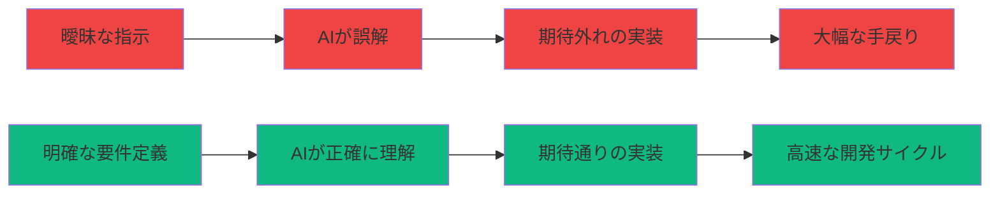

**要件定義の品質 = 最終成果物の品質**

---

## 🆚 従来 vs AI駆動：何が変わったのか

| 観点 | 従来の要件定義 | AI駆動要件定義 |
|------|--------------|--------------|
| **作成者** | ビジネスアナリスト、PM | あなた + AI |
| **所要時間** | 2週間〜2ヶ月 | 数時間〜数日 |
| **形式** | Word、Excel、専用ツール | Markdown（テキスト） |
| **粒度** | 最初から詳細まで記述 | 段階的に深掘り |
| **更新頻度** | 低（変更管理が大変） | 高（Git管理で容易） |
| **AIとの親和性** | 低（構造が複雑） | 高（テキストベース） |

---

## 📊 情報階層の3層構造：AIが理解しやすい設計

### **Layer 1: Why（ビジネス層）**
- **目的**: なぜこのプロジェクトを行うのか
- **内容**:
  - ビジネス目標
  - 解決する課題
  - 成功指標（KPI）
  - 制約条件（予算、期間、技術）
  - 非目標（やらないこと）

### **Layer 2: What（要件層）**
- **目的**: 何を作るのか
- **内容**:
  - ユーザーストーリー
  - 機能要件（詳細）
  - 非機能要件（性能、セキュリティ、UI/UX）
  - データ契約（エンティティ、リレーション）
  - インターフェース設計（API、画面遷移）
  - 受入基準（Given/When/Then）

### **Layer 3: How（実装層）**
- **目的**: どう実装するのか
- **内容**:
  - 技術スタック
  - コードベース制約（ファイル構成、命名規則）
  - 許可されるライブラリ
  - テスト計画
  - デプロイ計画

---

## 🧠 重要な原則：優先順位の逆転

### **AIへの指示では順序が重要**

```markdown
❌ 従来の順序（人間向け）:
1. 背景説明（なぜこのプロジェクトが必要か）
2. 目標（何を目指すか）
3. 制約条件（守るべきルール）
4. 要件詳細（具体的に何を作るか）

✅ AI向けの順序:
1. 制約条件と受入基準（最優先）
2. 要件詳細（タスク内容）
3. データ契約とインターフェース
4. 背景説明（コンテキスト）
```

**理由**: AIは制約を最初に理解することで、その後の生成物の品質が劇的に向上する

---

## 📝 AI駆動要件定義の特徴

### **1. 対話型アプローチ**
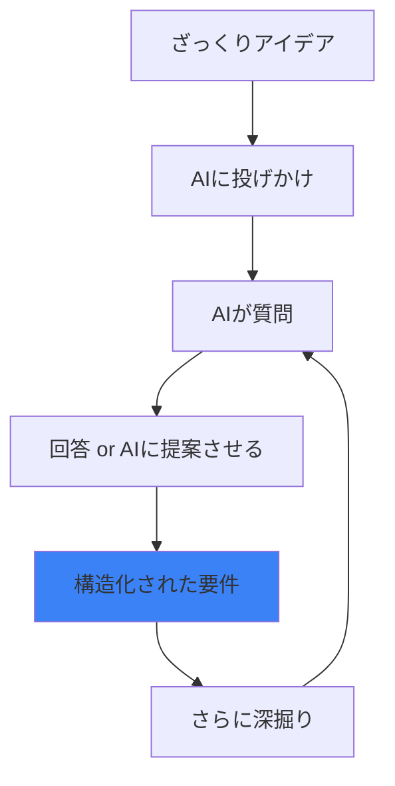

- AIとの対話を通じた要件の深掘り
- 見落としを防ぐAIからの質問
- フレームワーク活用による多角的分析

### **2. 構造化文書（Markdown）**
- 人間とAIの両方が読みやすい
- Gitでバージョン管理可能
- 自動化（PDF変換、サイト生成）との親和性

### **3. 継続的改善**
- 開発と並行して要件を洗練
- フィードバックループによる品質向上

---

## 🎓 この章のまとめ

### **要件定義 = AIへの最高の指示書**

✅ **情報階層を意識する**
  - Layer 1 (Why): ビジネス目標と制約
  - Layer 2 (What): 機能要件と受入基準
  - Layer 3 (How): 技術実装の詳細

✅ **AIに伝える順序を最適化する**
  - 制約条件を最優先に配置
  - 受入基準を明確に記述
  - 背景は最後でOK

✅ **Markdown形式で構造化する**
  - AIが理解しやすい
  - バージョン管理が容易
  - チーム共有が簡単

---

<!-- 第1章終了 -->

<!-- _class: section -->
# 第2章
## Markdownが最強のフォーマットである理由
### 〜 "Text is KING" の原則 〜

---

## 💬 Text is KING：テキストを制する者はLLMを制する

### **なぜMarkdownなのか？**

LLM（大規模言語モデル）は、その名の通り「言語」モデルです。
つまり、**テキストを理解し、テキストを生成する**ことに最適化されています。

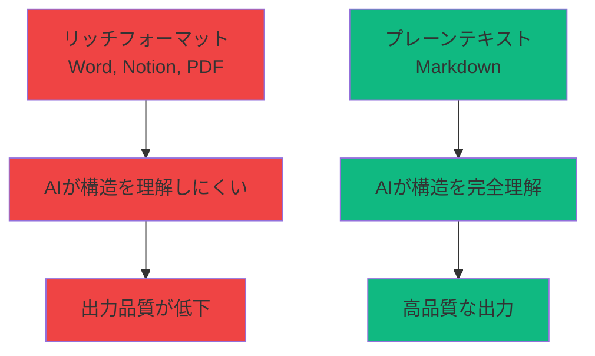

**Markdown = AIとの最高の共通言語**

---

## 📝 Markdownとは何か？

### **軽量マークアップ言語**
- プレーンテキストで書かれた文書を構造化
- 記号（`#`, `-`, `*`等）で見出しやリストを表現
- HTML、PDF等への変換が容易

### **基本記法（30秒で覚えられる）**

```markdown
# 見出し1（最大）
## 見出し2
### 見出し3

**太字**
*斜体*
`インラインコード`

- 順序なしリスト
  - サブ項目

1. 順序ありリスト
2. 項目2

[リンクテキスト](URL)

| 項目1 | 項目2 |
|-------|-------|
| 値1   | 値2   |
```

---

## 🎯 Markdownの5つの優位性

### **1️⃣ AIとの圧倒的な親和性**

```markdown
# 機能要件

## ユーザー管理
- ユーザー登録
- ログイン/ログアウト
- プロフィール編集

## タスク管理
- タスク作成
- タスク編集
- タスク削除
```

**AIが理解すること:**
- `#`の数 = 階層レベル
- `-`のインデント = 親子関係
- テキストの内容 = 具体的な要件

→ **構造と内容を同時に理解**できる！

---

### **2️⃣ バージョン管理との完璧な相性**

```bash
# Gitで変更履歴を完全管理
git add requirements.md
git commit -m "Add user authentication requirements"
git push origin feature/requirements

# 差分も一目瞭然
git diff requirements.md
```

**メリット:**
- いつ、誰が、何を変更したか追跡可能
- 間違えても過去に戻れる
- チームでの同時編集がスムーズ
- ブランチ戦略で並行作業可能

**Word/PDFではこれが非常に困難！**

---

### **3️⃣ プラットフォーム非依存の可搬性**

| フォーマット | 10年後読める？ | 専用ソフト必要？ | 軽量？ |
|------------|-------------|---------------|-------|
| **Markdown** | ✅ 確実 | ❌ 不要 | ✅ 超軽量 |
| Word (.docx) | ⚠️ バージョン依存 | ✅ 必要 | ❌ 重い |
| Notion | ⚠️ サービス依存 | ✅ 必要 | ⚠️ ネット必要 |
| PDF | ✅ 読める | ⚠️ 編集に必要 | ❌ 重い |

**Markdown = 未来永劫読めるフォーマット**

---

### **4️⃣ 自動化との親和性**

```bash
# Markdownから様々な形式へ変換
pandoc requirements.md -o requirements.pdf
pandoc requirements.md -o requirements.html
pandoc requirements.md -o requirements.docx

# 静的サイト生成
mkdocs build
gitbook build

# プレゼンテーション生成（Marp）
marp slide.md -o slide.pdf
```

**一度書けば、あらゆる形式で共有可能！**

---

### **5️⃣ エディタを選ばない自由度**

**どこでも編集可能:**
- メモ帳（Windows標準）
- テキストエディット（Mac標準）
- VS Code
- Cursor
- Vim / Emacs
- スマホのメモアプリ
- GitHub Web Editor

**専用ソフト不要 = 環境に左右されない**

---

## 🆚 NotionとMarkdownの使い分け

### **Notionの強み**
✅ リアルタイム共同編集
✅ データベース、カレンダー等の豊富な機能
✅ 視覚的な編集インターフェース
✅ チーム内の情報共有

### **Markdownの強み**
✅ Gitによるバージョン管理
✅ AIとの圧倒的な親和性
✅ プラットフォーム非依存
✅ 軽量で高速
✅ 長期保存性

---

## 📊 使い分けの指針

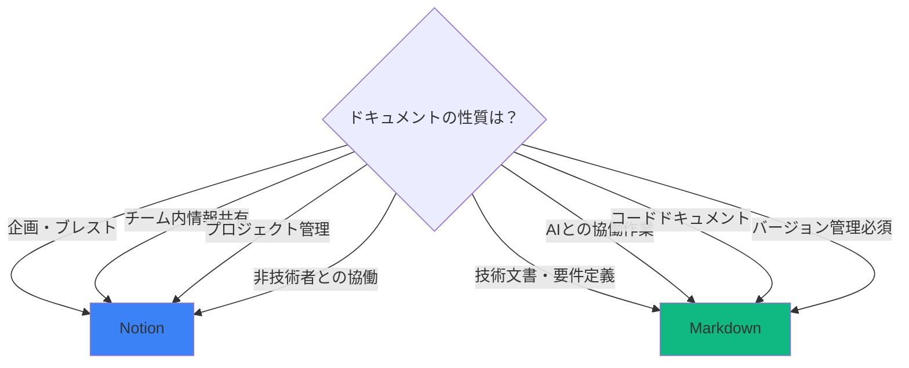

**結論: 用途に応じて使い分ける**

---

## 💡 実例：AI が理解する構造化の威力

### **❌ 構造化されていない指示**
```
ユーザー登録機能が必要です。メールアドレスとパスワードで登録できるようにしてください。
パスワードは8文字以上で、エラーメッセージも出してください。
```

### **✅ Markdown で構造化された指示**
```markdown
## ユーザー登録機能

### 入力項目
- メールアドレス（必須）
- パスワード（必須、8文字以上）

### バリデーション
- メールアドレス形式チェック
- パスワード長チェック（8文字以上）
- 重複メールアドレスチェック

### エラーメッセージ
- 「メールアドレスの形式が正しくありません」
- 「パスワードは8文字以上で入力してください」
- 「このメールアドレスは既に登録されています」
```

**AIの理解度が10倍違う！**

---

## 🎓 この章のまとめ

### **Markdown = AI駆動開発の標準フォーマット**

✅ **Text is KING**
  - テキストを制する者はLLMを制する
  - プレーンテキストこそが最強

✅ **5つの優位性**
  - AI親和性、バージョン管理、可搬性、自動化、自由度

✅ **Notionとの使い分け**
  - 企画・共有 → Notion
  - 技術・要件・AI協働 → Markdown

✅ **構造化の重要性**
  - 階層（`#`の数）
  - リスト（`-`、`1.`）
  - テーブル（`| | |`）

**次の章では、ビジネス要件とシステム要件の2階層について学びます**

---

<!-- 第2章終了 -->

<!-- _class: section -->
# 第3章
## 要件定義の2つの階層
### 〜 ビジネス要件とシステム要件の橋渡し 〜

---

## 🏗️ 2階層構造：Why/What と How

### **要件定義の全体像**

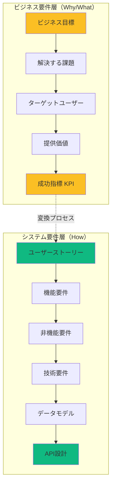

---

## 📋 ビジネス要件（Why/What）とは

### **目的：「なぜ」「何を」を明確にする**

ビジネス要件は、**プロジェクトの存在理由**を定義します。
エンジニアでなくても書ける・理解できる内容です。

### **記載すべき項目**

#### 1️⃣ プロジェクト概要
```markdown
## プロジェクト概要
- **プロジェクト名**: TaskMaster
- **一言説明**: 個人の生産性を最大化するタスク管理アプリ
- **背景**: 既存のタスク管理ツールは機能過多で複雑すぎる
```

#### 2️⃣ 解決する課題
```markdown
## 解決する課題
- タスク管理ツールが複雑で使いこなせない
- 締め切りを忘れてしまう
- チーム間でタスクの進捗が見えない
```

#### 3️⃣ ターゲットユーザー
```markdown
## ターゲットユーザー
- **メインターゲット**: 20-40代のビジネスパーソン
- **サブターゲット**: フリーランス、小規模チーム
- **ペルソナ**: 田中太郎（32歳、営業マネージャー、10人のチーム管理）
```

---

## 📊 ビジネスフレームワークの活用

### **7 Powers分析（競合優位性）**

```markdown
## 7 Powers分析

1. **スケールメリット**: ユーザー数が増えるほどデータが蓄積され、AI提案の精度が向上
2. **ネットワーク効果**: チーム利用でコラボレーション価値が増大
3. **カウンターポジショニング**: 「シンプル特化」で既存ツールと差別化
4. **スイッチングコスト**: タスク履歴とワークフローが資産化
5. **ブランド**: 「3秒で使える」が口コミで広がる
6. **囲い込み**: モバイル最適化でいつでもどこでも利用
7. **プロセスパワー**: AI駆動の自動優先順位付け
```

### **Blue Ocean戦略（新市場創造）**

```markdown
## Blue Ocean戦略

### 取り除く（Eliminate）
- 複雑な設定メニュー
- 不要なリマインダー機能

### 減らす（Reduce）
- 機能数（10個→3個のコア機能に絞る）
- 初期設定時間（5分→30秒）

### 増やす（Raise）
- UIのシンプルさ
- モバイル操作性

### 付け加える（Create）
- AI自動優先順位付け
- 音声入力でのタスク追加
```

---

## 🎯 システム要件（How）とは

### **目的：「どのように実装するか」を定義する**

システム要件は、ビジネス要件を**技術的に実現可能な形**に変換したものです。

### **3つのカテゴリ**

#### 1️⃣ 機能要件（Functional Requirements）
```markdown
## 機能要件

### FR-01: ユーザー登録
**ユーザーストーリー**:
As a 新規ユーザー, I want メールアドレスで登録, so that すぐに使い始められる

**受入基準（Given/When/Then）**:
- Given: ユーザーが登録画面にいる
- When: 有効なメールアドレスとパスワードを入力して送信
- Then: アカウントが作成され、確認メールが送信される

**エッジケース**:
- 重複メールアドレス → エラー表示
- 無効なパスワード（7文字以下）→ エラー表示
```

#### 2️⃣ 非機能要件（Non-Functional Requirements）
```markdown
## 非機能要件

### パフォーマンス
- ページ読み込み: p95 < 2.0秒（3G回線）
- API応答: p95 < 400ms
- 同時接続数: 1,000ユーザー対応

### セキュリティ
- パスワード: bcrypt ハッシュ化
- 通信: TLS 1.3 必須
- XSS/CSRF対策実装

### アクセシビリティ
- WCAG 2.2 AA準拠
- キーボード操作完全対応
- コントラスト比 4.5:1 以上
```

#### 3️⃣ 技術要件（Technical Requirements）
```markdown
## 技術要件

### フロントエンド
- Next.js 14（App Router）
- TypeScript
- Tailwind CSS

### バックエンド
- Next.js API Routes
- Supabase（PostgreSQL）

### 認証
- Clerk

### ホスティング
- Vercel
```

---

## 🌉 2階層の橋渡しプロセス

### **ビジネス要件 → システム要件への変換**


### **変換の実例**

| ビジネス要件 | ユーザーストーリー | 機能仕様 | 技術実装 |
|------------|----------------|---------|---------|
| タスクを忘れない | 通知を受け取りたい | 期限3日前に通知 | cron + Email API |
| チームの進捗を知りたい | ダッシュボードで確認 | リアルタイム進捗表示 | WebSocket + Chart.js |
| シンプルに使いたい | 3クリックで登録 | ワンステップ登録 | OAuth2.0（Google） |

---

## 📝 実践的な記述例

### **ビジネス要件ドキュメント（business-requirements.md）**

```markdown
# TaskMaster ビジネス要件定義書

## プロジェクト概要
- **名称**: TaskMaster
- **コンセプト**: 3秒で使えるタスク管理
- **ビジョン**: 世界中の人の生産性を最大化する

## 解決する課題
1. 既存ツールの複雑さ（機能過多）
2. タスクの優先順位が不明確
3. チームでの進捗共有が困難

## ターゲットユーザー
- **ペルソナ1**: 田中太郎（32歳、営業マネージャー）
  - ペインポイント: 10人のチームのタスクを把握できない
  - 期待する価値: ワンクリックで全員の進捗を確認

## 成功指標（KPI）
- MAU（月間アクティブユーザー）: 10,000人（6ヶ月後）
- 継続率: Week 4で40%以上
- NPS（Net Promoter Score）: 50以上

## 制約条件
- 予算: 月額 $50以内（初期6ヶ月）
- 期間: MVP完成まで1ヶ月
- 技術: フルスタックJavaScript（学習コスト削減）

## 非目標（やらないこと）
- ガントチャート機能（複雑化を避ける）
- プロジェクト収支管理（範囲外）
- デスクトップアプリ（Web優先）
```

---

## 📋 システム要件ドキュメント（system-requirements.md）

```markdown
# TaskMaster システム要件定義書

## 機能要件

### FR-01: タスク作成
**ストーリー**: As a ユーザー, I want タスクを30秒で作成, so that 思いついたらすぐ記録

**受入基準**:
- Given: ユーザーがログイン済み
- When: タスク名を入力して作成ボタンをクリック
- Then: タスクが保存され、一覧に表示される

**入力項目**:
- タスク名（必須、100文字以内）
- 期限（任意）
- 優先度（高/中/低、デフォルト:中）

## 非機能要件

### パフォーマンス
- タスク一覧表示: 1秒以内（100件）
- 検索: 0.5秒以内（1,000件）

### セキュリティ
- 認証: JWT + Refresh Token
- API: Rate Limiting（100req/min/user）

## データモデル（概要）

### テーブル: tasks
| カラム | 型 | 制約 |
|--------|----|----- |
| id | UUID | PK |
| title | VARCHAR(100) | NOT NULL |
| due_date | DATE | |
| priority | INT | DEFAULT 1 |
| user_id | UUID | FK → users |
| created_at | TIMESTAMP | DEFAULT NOW() |
```

---

## 🎓 この章のまとめ

### **要件定義は2階層構造**

✅ **ビジネス要件（Why/What）**
  - プロジェクトの存在理由
  - 非エンジニアも理解できる
  - フレームワーク活用で深掘り

✅ **システム要件（How）**
  - 技術的実装方法
  - ユーザーストーリー + 受入基準
  - 機能/非機能/技術の3要件

✅ **橋渡しプロセス**
  - ビジネス課題 → ストーリー → 機能 → 実装
  - トレーサビリティの確保

**次の章では、AIとの対話で要件を洗練させる5ステップを学びます**

---

<!-- 第3章終了 -->

<!-- _class: section -->
# 第4章
## AIとの対話で要件を洗練させる6ステップ
### 〜 ざっくりアイデアから完璧な設計書へ 〜

---

## 💭 対話型要件定義のパワー

### **完璧なアイデアは最初から存在しない**

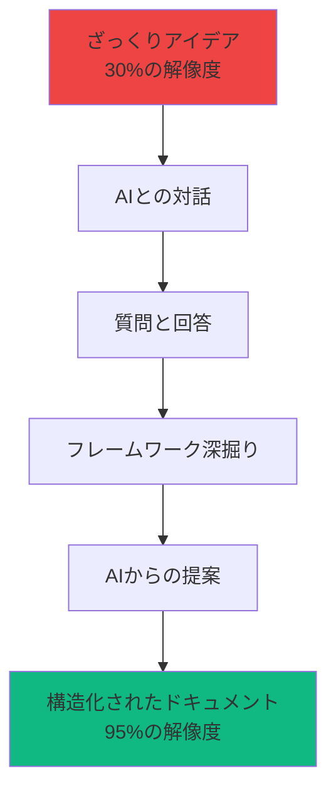

**対話を通じて、アイデアの解像度を高める！**

---

## 📝 Step 1: ざっくりアイデアをAIに話す

### **完璧な文章は不要！思いついたまま伝える**

```markdown
【プロンプト例】
自分が持っているガジェットを記録して、
他の人と共有できるアプリを作りたい。
買い物の記録にもなるし、
同じ趣味の人と繋がれたら面白そう。
```

### **この段階でのポイント**
- ✅ 誰に、何を、なぜを含める
- ✅ 制約条件があれば伝える（予算、期間、技術）
- ❌ 完璧な文章にこだわらない
- ❌ 技術用語を無理に使わない

---

## 🔄 Step 2: AIに構造化してもらう

### **AIが整理する主な項目**

```markdown
【AIからの返答例】
素晴らしいアイデアですね！以下のように整理しました。

## プロジェクト概要
- **プロジェクト名**: GadgetLog（仮）
- **コンセプト**: ガジェット好きのための備忘録SNS
- **解決する課題**: 所有ガジェットの管理と、同じ趣味の人との繋がり

## ターゲットユーザー
- デジタルガジェットを複数所有する30代〜50代の男性
- 新しいガジェット購入時に、過去の購入履歴を参照したい
- 他の人の機材セットを見て参考にしたい

## コア機能（仮）
1. ガジェット登録機能（写真、スペック、購入日、価格）
2. 他ユーザーとの共有・いいね機能
3. スペック比較機能

## 確認したい点
- 収益化は考えていますか？
- スマホアプリも必要ですか、それともWebのみですか？
- ターゲット地域は日本のみですか？
```

**AIが曖昧な部分を質問してくれる！**

---

## 🎯 Step 3: フレームワークを使った深掘りを指示

### **プロンプト例**

```markdown
7 Powersのフレームワークに基づいて、
私に質問しながらこのビジネス要件を深掘りしてください。

各質問に対して、私が答えられない部分は、
あなたの知識で提案も含めてください。
```

### **AIからの質問例（7 Powers）**

```markdown
【AIの質問】
それでは7 Powersの観点から質問させてください。

1. **スケールメリット**: ユーザーが増えるほど価値が高まる仕組みはありますか？
   例：データ蓄積によるレコメンド精度向上など

2. **ネットワーク効果**: 他のユーザーの存在が価値を生みますか？
   例：ユーザーが多いほど参考情報が増えるなど

3. **ブランド**: このアプリならではの独自性は何ですか？
   例：「ガジェット専用SNS」としてのポジション

4. **スイッチングコスト**: ユーザーが使い続ける理由は？
   例：蓄積された購入履歴が資産になるなど

5. **カウンターポジショニング**: 既存サービスとどう違いますか？
   例：一般SNSと違い、ガジェット特化で専門性が高い

6. **囲い込み**: プラットフォーム特有の優位性は？
   例：API連携で価格比較サイトと統合など

7. **プロセスパワー**: 他が真似できない独自プロセスは？
   例：AIによるスペック自動抽出機能など
```

---

## 💡 Step 4: AIに自分の知識でも提案させる

### **プロンプト例**

```markdown
私がうまく答えられない部分は、
あなたの知識をもとに提案もしてください。
対話しながら一緒に練り上げましょう。
```

### **AIの提案例**

```markdown
【AIからの提案】
ご質問に答えていただきありがとうございます。
いくつか答えられなかった点について、提案をさせていただきます。

## 収益モデル（私からの提案）
### 1. アフィリエイト収益
- Amazon、楽天のアフィリエイトリンクを各ガジェットに設置
- ユーザーの購入行動から収益化
- 推定収益：月間1万PVで月額3-5万円

### 2. プレミアムプラン
- 無料版：登録ガジェット数10個まで
- プレミアム（月額500円）：無制限 + 詳細比較機能
- 1,000ユーザー中10%課金で月額5万円

### 3. 企業向けAPI
- ガジェット価格推移データの提供
- 月額3万円〜

## ネットワーク効果の設計（提案）
- 「フォロー機能」で憧れのガジェッターをフォロー
- 「セット公開」機能で、作業環境を丸ごと共有
- 「コレクション完成度」の可視化でゲーミフィケーション
```

---

## 📋 Step 5: Markdownで蓄積する

### **最重要ステップ！**

対話で明らかになった情報を、必ず**Markdownファイルに記録**します。

#### なぜMarkdownで記録するのか？
- 次回以降、このファイルをAIに読み込ませれば同じ説明不要
- Git管理できるので、要件の変化の履歴が残る
- チームメンバーとも共有できる
- プロジェクト全体像が常に可視化される

#### 記録すべきファイル

```
project-name/
├── docs/
│   ├── business-requirements.md  # ビジネス要件
│   ├── user-stories.md           # ユーザーストーリー
│   ├── system-requirements.md    # システム要件
│   └── architecture.md            # アーキテクチャ概要
```

---

## 📄 business-requirements.md の例

```markdown
# GadgetLog ビジネス要件定義書

## プロジェクト概要
- **プロジェクト名**: GadgetLog
- **コンセプト**: ガジェット好きのための備忘録SNS
- **解決する課題**: 所有ガジェットの管理と、同じ趣味の人との繋がり

## ターゲットユーザー
- **ペルソナ1**: 山田太郎（35歳、ITエンジニア）
  - 所有ガジェット: 30個以上
  - ペインポイント: 何を持っているか忘れる、重複購入してしまう
  - 期待する価値: 一覧で確認、スペック比較、他人の環境を参考に

## 7 Powers分析（AIとの対話で明らかになった点）
1. **ネットワーク効果**: ユーザーが増えるほど、参考になる機材情報が増える
2. **データ資産**: ユーザーの購入履歴データが蓄積されると、レコメンド精度が上がる
3. **ブランド**: 「ガジェット好き専用SNS」としてのニッチなポジション
4. **スイッチングコスト**: 購入履歴が資産化され、他サービスへ移行しにくい

## 収益モデル（AIの提案を採用）
### Phase 1: アフィリエイト
- Amazon、楽天のアフィリエイトリンク
- 目標：月間3万PVで月額10万円

### Phase 2: プレミアムプラン
- 月額500円
- 詳細比較機能、過去の価格推移グラフ
- 目標：1,000ユーザー中10%課金で月額5万円

## 制約条件
- 予算: 月額$30以内（Supabase + Vercel）
- 期間: 1ヶ月でMVPリリース
- 技術: Next.js + Supabase、スマホ最適化必須
```

---

## 🆕 Step 6: AIに質問させる戦略（見落とし防止）

### **なぜこのステップが重要なのか**

人間は「自分が知っている範囲」でしか考えられません。
**AIに質問させることで、見落としを防ぐ！**

### **プロンプト例**

```markdown
あなたは経験豊富なプロダクトマネージャーです。
上記のビジネス要件を読んで、
私が見落としている可能性のある重要な項目について、
チェックリスト形式で質問してください。

特に以下の観点から：
- 法務・コンプライアンス
- プライバシー・データ保護
- アクセシビリティ
- 国際化（i18n）
- 運用・保守
- スケーラビリティ
- セキュリティ
```

---

## 📋 AIからの質問例（見落としチェック）

```markdown
【AIからの重要な質問リスト】

## 法務・コンプライアンス
- [ ] ユーザー投稿コンテンツの著作権はどう扱いますか？
- [ ] 商品画像の利用許諾は取得済みですか？
- [ ] 利用規約、プライバシーポリシーの作成予定は？

## プライバシー・データ保護
- [ ] GDPR対応は必要ですか？（EU在住ユーザーがいる場合）
- [ ] 個人情報（購入履歴）の取り扱いルールは？
- [ ] ユーザーデータの削除リクエストに対応できますか？

## アクセシビリティ
- [ ] スクリーンリーダー対応は考慮していますか？
- [ ] キーボードのみでの操作は可能ですか？
- [ ] カラーコントラスト比は適切ですか？（WCAG 2.2 AA）

## 国際化（i18n）
- [ ] 将来的に英語対応は考えていますか？
- [ ] 通貨表示（円、ドル、ユーロ）の対応は？
- [ ] タイムゾーンの考慮は？

## 運用・保守
- [ ] 不適切なコンテンツの報告機能は必要ですか？
- [ ] 管理者ダッシュボードは必要ですか？
- [ ] エラー監視ツール（Sentry等）の導入は？

## スケーラビリティ
- [ ] 初期想定ユーザー数は？ピーク時の想定は？
- [ ] 画像ストレージの容量上限は？
- [ ] データベースのスケーリング戦略は？

## セキュリティ
- [ ] パスワードポリシーは？（最低8文字、英数字記号混在等）
- [ ] 二段階認証（2FA）は提供しますか？
- [ ] APIのレートリミットは設定しますか？
```

**これらの質問に答えることで、要件の完成度が飛躍的に向上！**

---

## 🔄 イテレーションの重要性

### **一度で完璧にしようとしない**

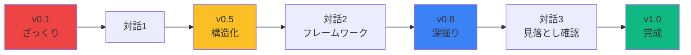

**3-5回の対話で、要件の完成度を段階的に高める**

---

## 📊 次回からの使い方

### **一度作ったドキュメントをAIに渡すだけ**

```markdown
【プロンプト例（Cursor）】
@business-requirements.md を読んで、
次に実装すべき機能について提案してください。
```

```markdown
【プロンプト例（Claude）】
添付した business-requirements.md を基に、
データベース設計を提案してください。
```

### **このクセをつけることで**
- AIとの対話が「使い捨て」ではなく「資産」になる
- プロジェクト全体像が常に可視化される
- チーム開発でも、全員が同じコンテクストを共有できる
- 開発の途中で方向性を見失わない

**これがVibe Coderの真髄！**

---

## 🎓 この章のまとめ

### **6ステップで要件定義の解像度を上げる**

✅ **Step 1**: ざっくりアイデアを話す
✅ **Step 2**: AIに構造化してもらう
✅ **Step 3**: フレームワークで深掘り
✅ **Step 4**: AIに提案させる
✅ **Step 5**: Markdownで蓄積する（最重要！）
✅ **Step 6**: AIに質問させて見落としを防ぐ

### **重要な原則**
- 完璧なアイデアは最初から存在しない
- 対話を通じて解像度を高める
- Markdownで必ず記録する
- イテレーションを恐れない

**次の章では、Cursorで実践するビジネス要件定義の全フローを学びます**

---

<!-- 第4章終了 -->

<!-- _class: section-title -->

# 第5章
# Cursorで実践するビジネス要件定義の全フロー
## 🎯 音声入力からシステム要件生成まで

---

## 🎤 実践ワークフローの全体像

### **5つのステップで要件定義を完成させる**

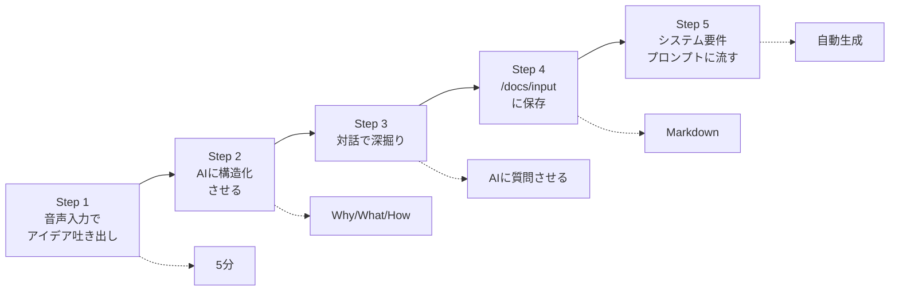

### **💡 重要な考え方**

- **量→質の順番**: まずコンテクストの量を担保し、次に質や中身を充実させる
- **人間がやること**: アイデアを話す、対話で深掘り、保存する
- **AIがやること**: 構造化、質問生成、システム要件の自動生成

---

## 🎤 Step 1: 音声入力でアイデアを吐き出す（5分）

### **Cursorの音声入力機能を使う**

```
⌘ + I (Mac) / Ctrl + I (Windows)
→ マイクアイコンをクリック
→ 思いついたことを話し続ける
```

### **話すべき内容（順不同でOK）**

| カテゴリ | 話す内容の例 |
|---------|------------|
| **背景** | なぜこのアイデアを思いついたのか、どんな課題を感じたのか |
| **ターゲット** | 誰のための製品か、どんな人が困っているか |
| **解決策** | どんな機能があれば課題が解決するか |
| **制約** | 予算はいくらか、いつまでに作りたいか、何人で開発するか |
| **競合** | 似たようなサービスは何か、どう違うのか |
| **ビジネス** | どうやって収益を得るか、どのくらいの規模を目指すか |

### **💡 うまく話すコツ**

- **完璧な文章にしなくていい**: 「えっと」「あの」も含めてOK
- **思いつく順に話す**: 構造化はAIに任せる
- **具体例を入れる**: 「例えば〜」「〜みたいな」
- **制約を明確に**: 「予算は50万円まで」「3ヶ月で作りたい」

---

## 🎤 Step 1: 音声入力の実例

### **悪い例（抽象的すぎる）**

```
タスク管理アプリを作りたいです。
便利な機能をつけて、使いやすくしたいです。
```

**問題点**: 具体性がなく、AIが構造化できない

---

### **良い例（具体的で文脈がある）**

```
うちの会社、営業が10人いるんですけど、
みんなExcelでタスク管理してて、
誰が何やってるか全然わからないんですよ。

例えば、田中さんが急に休んだときに、
彼が担当してる案件の進捗が誰もわからなくて、
お客さんから電話来ても対応できない。

だから、チーム全体でタスクの進捗が見えるアプリが欲しい。
Trelloみたいなカンバン形式で、
誰がどの案件を担当してるかパッと見でわかるやつ。

あと、期限が近づいたら自動で通知が来るとか、
案件ごとにメモを残せる機能も欲しい。

予算は50万円まで。
3ヶ月後の新年度から使い始めたいので、
2ヶ月で作れるといいなと思ってます。

ちなみに開発は私一人で、
フロントはReactちょっとできるレベル。
バックエンドは触ったことないです。
```

**良い点**: 課題、ターゲット、具体例、制約が全部入っている

---

## 🏗️ Step 2: AIに構造化させる

### **Cursorでのプロンプト例**

```markdown
あなたは経験豊富なプロダクトマネージャーです。
上記の音声入力内容を、以下の3層構造に整理してください。

## Layer 1: Why（ビジネス層）
- ビジネス目標
- 解決する課題
- ターゲットユーザー
- 制約条件（予算、期間、技術）
- 非目標（やらないこと）

## Layer 2: What（要件層）
- 主要な機能要件（5個以内）
- 非機能要件（パフォーマンス、セキュリティ等）
- ユーザーストーリー（3個程度）

## Layer 3: How（実装層）
- 推奨技術スタック
- 開発フェーズ（MVP → Full Release）
- 想定される技術的課題

Markdown形式で出力してください。
```

---

## 🏗️ Step 2: 構造化の出力例

```markdown
# 営業チーム向けタスク管理アプリ要件定義

## Layer 1: Why（ビジネス層）

### ビジネス目標
- 営業チーム10人のタスク進捗を可視化し、属人化を解消する
- 新年度（3ヶ月後）からの運用開始

### 解決する課題
- Excelでのタスク管理による情報の属人化
- 担当者不在時の業務引き継ぎ困難
- タスク期限の見落とし

### ターゲットユーザー
- 営業担当者（10名）
- 営業マネージャー（進捗確認者）

### 制約条件
- 予算: 50万円まで
- 期間: 2ヶ月で開発完了
- 技術: 開発者1名（React基礎レベル、バックエンド未経験）

### 非目標
- 複雑な権限管理（営業チーム内での共有のみ）
- 他システムとの連携（Salesforce等）
- モバイルアプリ（Web版のみ）

## Layer 2: What（要件層）

### 主要な機能要件
1. カンバン形式のタスクボード（ステータス: 未着手/進行中/完了）
2. タスクへの担当者割り当て
3. 期限設定と通知機能（3日前、1日前）
4. タスクごとのメモ/コメント機能
5. 担当者別のタスク一覧表示

### 非機能要件
- レスポンスタイム: 3秒以内（同時接続10名程度）
- 稼働率: 営業時間中（9:00-18:00）の99%以上
- データバックアップ: 日次

### ユーザーストーリー
- US-1: 営業担当者として、自分の担当タスクを一覧で見たい
- US-2: マネージャーとして、チーム全体の進捗を俯瞰したい
- US-3: 営業担当者として、期限が近いタスクの通知を受け取りたい

## Layer 3: How（実装層）

### 推奨技術スタック
- フロントエンド: Next.js (React) + Tailwind CSS
- バックエンド: Supabase (PostgreSQL + Auth + Realtime)
- ホスティング: Vercel
- 通知: Supabase Functions + Resend (Email)

**選定理由**: バックエンド未経験者でも扱いやすいBaaS、予算内で収まる、2ヶ月で実装可能

### 開発フェーズ
**MVP (1ヶ月目)**
- タスクのCRUD
- カンバン表示
- 担当者割り当て

**Full Release (2ヶ月目)**
- 通知機能
- コメント機能
- 担当者別フィルタ

### 想定される技術的課題
- Supabase Realtimeでのカンバン更新の実装
- 通知のスケジューリング（Cron設定）
```

---

## 💬 Step 3: 対話で深掘り

### **Step 6（第4章）のテクニックを使う**

```markdown
あなたは経験豊富なプロダクトマネージャーです。
上記のビジネス要件を読んで、
私が見落としている可能性のある重要な項目について、
チェックリスト形式で質問してください。

特に以下の観点から：
- 法務・コンプライアンス（個人情報保護法等）
- セキュリティ（認証、権限管理）
- 運用・保守（誰がメンテナンスするか）
- スケーラビリティ（将来的な拡張）
- アクセシビリティ（使いやすさ）
```

---

## 💬 Step 3: AIからの質問例

### **AIが返してくる質問リスト**

```markdown
## セキュリティと認証
□ ログイン方法はどうしますか？（メール/パスワード、SSO、Google認証等）
□ 誤ってタスクを削除した場合の復元機能は必要ですか？
□ 退職者のアカウント削除フローは定義されていますか？

## データとプライバシー
□ 顧客情報をタスクに含める可能性はありますか？
  → 個人情報保護法への対応が必要になります
□ タスクの履歴は何ヶ月分保存しますか？
□ データのエクスポート機能（CSV等）は必要ですか？

## 運用とメンテナンス
□ 障害発生時の連絡先は誰ですか？
□ 営業メンバーへのトレーニングは誰が行いますか？
□ 機能追加の要望はどこで受け付けますか？

## スケーラビリティ
□ 将来的に他部署（10人以上）への展開予定はありますか？
□ タスクの数が1000件を超えた場合の動作は考慮されていますか？

## アクセシビリティ
□ 色覚障害のあるメンバーはいますか？
  → カンバンのステータス色に配慮が必要です
□ スマホからの閲覧・編集は本当に不要ですか？
```

---

## 💬 Step 3: 質問への回答例

### **人間がやること：質問に答えて深掘り**

```markdown
## セキュリティと認証
✅ Google認証でお願いします（会社のGoogleアカウントを使う）
✅ 削除したタスクは30日間はソフトデリートで復元可能にしたい
✅ 退職者は管理者（私）が手動で削除します

## データとプライバシー
⚠️ 顧客名を入れる可能性はあります
  → 個人情報保護法対応が必要とのこと、具体的に何をすればいいですか？
✅ 履歴は1年分保存
✅ CSV エクスポートは欲しいです（月次レポート用）

## 運用とメンテナンス
✅ 障害時は私（開発者）に連絡
✅ トレーニングは私がマニュアル作って営業マネージャーに説明
✅ 機能要望はSlackの専用チャンネルで受付

## スケーラビリティ
❌ 他部署への展開予定は今のところなし（まず営業で試す）
✅ タスク1000件対応は考慮してください

## アクセシビリティ
✅ 色覚障害のメンバーはいないですが、配慮した設計をお願いします
⚠️ スマホ対応は不要と言いましたが、外出先で確認したいこともあるかも
  → レスポンシブデザインにしておくべきですか？
```

### **AIが追加の提案をする**

```markdown
個人情報保護法対応について：
- タスクに顧客名を含める場合、Supabaseの Row Level Security (RLS) で
  営業チームのみがアクセスできるよう制限してください
- プライバシーポリシーの作成が必要です（テンプレート提供可能）

レスポンシブデザインについて：
- Tailwind CSSのレスポンシブクラスを使えば追加コストなしで対応可能
- MVP時点で基本的なモバイル対応を入れることを推奨します
```

---

## 💾 Step 4: /docs/input に保存

### **ファイル構成**

```
/docs/input/
├── business_model.md      # ビジネスモデル（今回の例では不要）
├── product_overview.md    # プロダクト概要
├── constraints.md         # 制約条件
└── qa_log.md             # Q&A ログ
```

### **product_overview.md の例**

```markdown
# 営業チーム向けタスク管理アプリ

## 解決する課題
- Excelでのタスク管理による情報の属人化
- 担当者不在時の業務引き継ぎ困難
- タスク期限の見落とし

## ターゲットユーザー
- 営業担当者（10名）
- 営業マネージャー（進捗確認者）

## 主要機能
1. カンバン形式のタスクボード
2. 担当者割り当て
3. 期限通知（3日前、1日前）
4. タスクコメント機能
5. CSV エクスポート

## 非機能要件
- Google認証
- レスポンシブデザイン（基本的なモバイル対応）
- ソフトデリート（30日間復元可能）
- RLS による顧客情報保護

## 非目標
- 他部署展開（まず営業で試す）
- 複雑な権限管理
- 他システム連携
```

---

## 💾 Step 4: constraints.md の例

```markdown
# 制約条件

## 予算
- 上限: 50万円
- 内訳想定:
  - 開発: 自社開発（人件費のみ）
  - インフラ: Vercel Pro ($20/月) + Supabase Pro ($25/月)
  - ドメイン: 年間 1,500円

## 期間
- 開発期間: 2ヶ月
- リリース予定: 3ヶ月後（新年度開始）

## 技術スキル
- 開発者: 1名
- スキルレベル:
  - React: 基礎レベル（簡単なコンポーネント作成可能）
  - TypeScript: 学習中
  - バックエンド: 未経験
  - インフラ: 未経験

## 運用体制
- 保守: 開発者（私）が担当
- トレーニング: 営業マネージャー経由で展開
- サポート: Slack チャンネルで受付
```

---

## 🚀 Step 5: システム要件プロンプトに流す

### **Cursorでの実行方法**

```
1. Cursor の Composer を開く（⌘ + I）

2. 以下のプロンプトファイルを参照として追加
   @docs/prompt/1_system-requirements-prompt.md

3. /docs/input フォルダを参照に追加
   @docs/input

4. 実行
```

### **💡 プロンプトファイルが何をするか**

- `/docs/input` 内のすべてのファイルを読み込む
- ビジネス要件をシステム要件に変換
- 技術スタック選定と理由を記述
- 機能要件・非機能要件を詳細化
- 開発ロードマップを生成
- リスク分析を実施
- UI/UX の方向性を提案
- **出力先: `/docs/output/system_requirements.md`**

---

## 🚀 Step 5: 生成されるシステム要件の例

### **自動生成される内容（抜粋）**

```markdown
# システム要件定義書

## システム概要
営業チーム10名向けのタスク管理Webアプリケーション。
Excelベースの属人化したタスク管理を脱却し、
カンバン形式での進捗可視化と自動通知により、
チーム全体の業務効率を向上させる。

MVP: 2ヶ月、予算: 50万円以内、開発者: 1名（React基礎レベル）

## 機能要件

### FR-1: タスク管理
- タスクのCRUD操作
- ステータス: 未着手/進行中/完了
- 担当者割り当て
- 期限設定
- ドラッグ＆ドロップでステータス変更

### FR-2: 通知機能
- 期限3日前: メール通知
- 期限1日前: メール通知
- 通知設定のオン/オフ切り替え

### FR-3: コメント機能
- タスクごとのコメントスレッド
- メンション機能（@username）

### FR-4: データエクスポート
- CSV エクスポート（月次レポート用）
- 出力項目: タスク名、担当者、期限、ステータス、作成日

## 非機能要件

### NFR-1: パフォーマンス
- ページ読み込み: 3秒以内
- タスク作成/更新: 1秒以内のレスポンス
- 同時接続: 10名を想定

### NFR-2: セキュリティ
- Google OAuth認証
- Supabase RLS による行レベルセキュリティ
- HTTPS通信のみ許可
- ソフトデリート（30日間復元可能）

### NFR-3: 可用性
- 稼働率: 営業時間中（9:00-18:00）99%以上
- データバックアップ: Supabase自動バックアップ（日次）

### NFR-4: ユーザビリティ
- レスポンシブデザイン（PC・タブレット・スマホ対応）
- WCAG 2.2 AA準拠（色覚障害対応含む）

## 技術スタック

### フロントエンド
- **Next.js 14 (App Router)**: SSR/SSG、ルーティング
- **TypeScript**: 型安全性
- **Tailwind CSS**: 高速UI開発、レスポンシブ対応
- **react-beautiful-dnd**: カンバンのドラッグ＆ドロップ

### バックエンド（BaaS）
- **Supabase**:
  - PostgreSQL: データベース
  - Auth: Google OAuth
  - RLS: 行レベルセキュリティ
  - Realtime: カンバン更新のリアルタイム反映
  - Storage: プロフィール画像（将来拡張）
  - Functions: 通知のスケジューリング

### インフラ
- **Vercel**: Next.jsホスティング、自動デプロイ
- **Resend**: メール送信（通知機能）

### 選定理由
- **バックエンド未経験でも扱いやすい**: SupabaseはBaaSでSQL知識のみで実装可能
- **予算内**: Vercel Pro + Supabase Pro = 月額$45（年間$540、予算内）
- **2ヶ月で実装可能**: Next.js + Supabaseの組み合わせは豊富なチュートリアルあり
- **スケーラビリティ**: 将来的な他部署展開にも対応可能

## 開発ロードマップ

### フェーズ1: MVP（1ヶ月目）
**Week 1-2**
- プロジェクトセットアップ（Next.js + Supabase + Vercel）
- 認証機能（Google OAuth）
- データベース設計（Supabase）

**Week 3-4**
- タスクCRUD機能
- カンバン表示
- 担当者割り当て

**マイルストーン**: 基本的なタスク管理が動作する状態

### フェーズ2: Full Release（2ヶ月目）
**Week 5-6**
- 通知機能（Supabase Functions + Resend）
- コメント機能

**Week 7**
- CSV エクスポート
- レスポンシブ対応の最終調整

**Week 8**
- テスト（営業チーム5名でパイロット）
- バグ修正
- マニュアル作成

## リスク分析

### 技術的リスク
| リスク | 影響 | 対策 |
|-------|------|------|
| Supabase Realtimeの実装難易度 | 中 | 公式ドキュメント + コミュニティ事例を参照 |
| 通知のスケジューリング（Cron） | 中 | Supabase Functions の cron 機能を使用 |
| ドラッグ＆ドロップのUX | 低 | react-beautiful-dnd のチュートリアル活用 |

### ビジネス的リスク
| リスク | 影響 | 対策 |
|-------|------|------|
| 営業チームが使わない | 高 | パイロット期間に feedback 収集、UI改善 |
| Excel習慣からの移行困難 | 中 | トレーニングとマニュアル整備 |

### 運用的リスク
| リスク | 影響 | 対策 |
|-------|------|------|
| 開発者（私）が不在時の障害対応 | 中 | Vercel/Supabase のアラート設定、ドキュメント整備 |

## UI/UXの方向性

### デザインコンセプト
- **ミニマル**: 情報過多を避け、タスクに集中できるシンプルなUI
- **直感的**: ドラッグ＆ドロップで操作完結

### トーン＆マナー
- **プロフェッショナル**: ビジネスツールとしての信頼性
- **親しみやすい**: 営業チームが毎日使いたくなる温かみ

### ターゲットデバイス
- **PCメイン**: デスク作業中の利用
- **モバイル対応**: 外出先での進捗確認

### 参考サイト
- Trello (https://trello.com) - カンバンUI
- Linear (https://linear.app) - ミニマルなタスク管理
- Notion (https://notion.so) - モダンなデザイン

## 追加情報リクエスト

### 高優先度
- [ ] プライバシーポリシーの作成は誰が担当しますか？
- [ ] 営業メンバーの平均的なITリテラシーはどの程度ですか？

### 中優先度
- [ ] タスクにファイル添付機能は必要ですか？
- [ ] 将来的に営業以外の部署（例: カスタマーサポート）への展開予定はありますか？

### 低優先度
- [ ] ダークモード対応は必要ですか？
```

---

## 🎯 実践デモ：ゲートボール案件

### **実際の音声入力例**

```
地元のゲートボール協会から相談を受けたんですけど、
高齢者の方々がゲートボールの試合結果を
紙の台帳で管理してて大変だと。

毎回手書きで記録して、
年度末に集計するのに丸一日かかってるらしいです。

で、試合結果をWeb上で簡単に入力できて、
自動で勝敗や得点をランキング表示できるシステムが欲しいと。

ただ、使う人が70代80代の方なので、
スマホで操作できるくらいシンプルじゃないとダメ。

あと、予算が30万円くらいしかないので、
できるだけコストを抑えたい。

開発期間は3ヶ月くらい。
私一人で作ります。
```

---

## 🎯 実践デモ：AIによる構造化結果

```markdown
# ゲートボール試合管理システム要件定義

## Layer 1: Why（ビジネス層）

### ビジネス目標
- 地元ゲートボール協会の試合結果管理をデジタル化
- 紙の台帳管理から脱却し、集計作業を自動化

### 解決する課題
- 手書き台帳による管理の手間
- 年度末の集計作業（丸一日）
- 試合結果の検索困難

### ターゲットユーザー
- ゲートボール協会メンバー（70代〜80代）
- 試合記録担当者（1〜2名）

### 制約条件
- 予算: 30万円
- 期間: 3ヶ月
- 技術: 開発者1名
- **ユーザー特性**: 高齢者がスマホで操作

### 非目標
- 試合のライブ配信
- 他の協会との連携
- 複雑な統計分析

## Layer 2: What（要件層）

### 主要な機能要件
1. 試合結果の入力（チーム名、得点、日付）
2. ランキング表示（勝率、得点順）
3. 試合履歴の検索
4. 年度末レポートの自動生成（PDF出力）

### 非機能要件
- **超シンプルなUI**: 大きなボタン、大きな文字
- **スマホ対応**: タップしやすいデザイン
- **オフライン対応**: 電波が悪い場所でも入力可能
- レスポンスタイム: 5秒以内（高齢者が待てる時間）

### ユーザーストーリー
- US-1: 記録担当者として、試合結果をスマホで簡単に入力したい
- US-2: 協会メンバーとして、現在のランキングをすぐに見たい
- US-3: 協会として、年度末の集計を自動で出力したい

## Layer 3: How（実装層）

### 推奨技術スタック
- フロントエンド: Next.js + Tailwind CSS（超大フォント設定）
- バックエンド: Supabase
- ホスティング: Vercel
- PDF生成: react-pdf

**選定理由**: 予算内、シンプルなUI実装が容易、PWA対応でオフライン動作可能

### 開発フェーズ
**MVP (2ヶ月目)**
- 試合結果入力
- ランキング表示
- PWA化（オフライン対応）

**Full Release (3ヶ月目)**
- 試合履歴検索
- PDF レポート生成
- 高齢者向けマニュアル作成

### 想定される技術的課題
- 高齢者向けUIの設計（ユーザビリティテスト必須）
- PWAによるオフライン対応
- タッチ操作の誤入力防止
```

---

## 🎯 実践デモ：AIからの質問

```markdown
## ユーザビリティ（高齢者対応）
□ 音声入力機能は必要ですか？
□ ふりがな表示は必要ですか？
□ 誤入力時の「取り消し」ボタンは目立つ位置に配置しますか？

## データ管理
□ 過去の紙台帳データの移行は必要ですか？何年分ですか？
□ データのバックアップはどこに保存しますか？

## 運用
□ 高齢者へのトレーニングは誰が行いますか？
□ 問い合わせ対応は電話で受け付けますか？

## スマホ対応
□ Android/iPhoneの両方をサポートしますか？
□ ガラケーのユーザーはいますか？（Web版のみで対応可能か）
```

---

## 🎯 第5章まとめ

### **5つのステップ**

1. **音声入力（5分）**: 思いついたことを話す
2. **構造化**: AIに Why/What/How で整理させる
3. **対話で深掘り**: AIに質問させて見落としを防ぐ
4. **/docs/input に保存**: Markdown で記録
5. **プロンプトに流す**: システム要件を自動生成

### **重要な考え方**

- **量→質の順番**: まずコンテクストを担保
- **人間の役割**: アイデアを話す、深掘りする
- **AIの役割**: 構造化、質問生成、システム要件生成

### **次のステップ**

- 生成されたシステム要件を元に、第二回講義で技術スタック選定とCursor実装を学ぶ
- `/docs/output/system_requirements.md` を `@参照` して開発を開始

---

<!-- 第5章終了 -->

<!-- _class: section-title -->

# 付録
## 📚 詳細なドキュメントテンプレートとUI/UX・データモデリング基礎

**注意**: 以下の付録は参考資料です。実際の授業では、第1〜5章の実践ワークフローを優先し、必要に応じて参照してください。

---

<!-- _class: section -->

# 付録A
## AIに与えるべき情報の体系的整理
### 〜 詳細なBRD/PRDテンプレート 〜

---

## 📚 付録A: AIに与えるべき情報の体系的整理

### **AIが理解しやすいドキュメント構造**

```markdown
# [プロジェクト名] 要件定義書

## BR-1 ビジネス目標
- **目標**: [測定可能な成果とタイムフレーム]
- **KR-1**: [Key Result 1 - 定量的指標]
- **KR-2**: [Key Result 2 - 定量的指標]

## BR-2 ステークホルダーとペルソナ
- **ステークホルダー**: [役割と責任]
- **ペルソナ1**: [名前、年齢、職業、ペインポイント、期待価値]

## BR-3 スコープと非目標
- **スコープ**: [やること]
- **非目標（Anti-Requirements）**: [明示的にやらないこと]

## BR-4 リスクと制約
- **リスク-1**: [リスク内容 + 軽減策]
- **制約条件**: [予算、期間、技術、コンプライアンス]

## BR-5 成功基準とテレメトリ
- **成功基準**: [どの状態を成功とするか]
- **収集すべきメトリクス**: [測定する指標]
```

---

## 🔢 安定した識別子（ID体系）の重要性

### **なぜIDが必要なのか**

```markdown
❌ 悪い例（IDなし）:
ユーザーはタスクを作成できる。
タスクには期限を設定できる。
期限が近づいたら通知を送る。

✅ 良い例（IDあり）:
FR-01: ユーザーはタスクを作成できる
FR-02: タスクには期限を設定できる
FR-03: 期限3日前に通知を送る（FR-02に依存）

TEST-01: FR-01の受入テスト
TEST-02: FR-02の受入テスト
TEST-03: FR-03の受入テスト
```

**メリット**:
- AIが要件間の関係を理解しやすい
- プロンプトで「FR-03について詳しく」と参照できる
- トレーサビリティの確保

---

## 📋 コンテキスト設計パターン

### **パターン1: 制約条件を最優先に配置**

```markdown
## 制約条件（最優先で読んでください）
- 変更不可: `src/legacy/` 配下のファイル
- 使用禁止: jQuery、Moment.js
- 必須: TypeScript strict mode
- パフォーマンス: p95 < 2.0秒

## タスク内容
[具体的な実装内容]

## 背景説明
[なぜこの機能が必要か]
```

**理由**: AIは最初に読んだ制約を強く記憶する

---

### **パターン2: 実例と反例の両方を提供**

```markdown
## ユーザー登録フォーム

### ✅ 正しい実装例
```typescript
// パスワードは8文字以上、英数字含む
const isValidPassword = (password: string): boolean => {
  return password.length >= 8 && /[a-zA-Z]/.test(password) && /[0-9]/.test(password);
};
```

### ❌ 避けるべき実装（反例）
```typescript
// NG: 最低文字数チェックのみ（脆弱）
const isValidPassword = (password: string): boolean => {
  return password.length >= 6; // 短すぎる＆文字種チェックなし
};
```

**AIはこの対比から「意図」を深く理解する**

---

## 📐 データ契約の明示

### **機械検証可能な形式で記述**

```yaml
# API契約: POST /api/tasks

## リクエストスキーマ
type: object
required: [title]
properties:
  title:
    type: string
    minLength: 1
    maxLength: 100
  due_date:
    type: string
    format: date
    nullable: true
  priority:
    type: integer
    enum: [1, 2, 3]
    default: 2

## レスポンススキーマ
type: object
properties:
  id:
    type: string
    format: uuid
  title:
    type: string
  created_at:
    type: string
    format: date-time

## エラーコード
- 400: INVALID_INPUT - タイトルが空または100文字超過
- 401: UNAUTHORIZED - 認証トークンが無効
- 500: INTERNAL_ERROR - サーバーエラー
```

---

## 🧪 受入基準パターン（Given/When/Then）

### **短く、テスト可能な形式**

```markdown
## FR-01: タスク作成

### AC-01-01（正常系）
- **Given**: ユーザーがログイン済み
- **When**: タスク名「買い物」を入力して作成ボタンをクリック
- **Then**:
  - タスクがデータベースに保存される
  - タスク一覧に「買い物」が表示される
  - 作成日時が記録される

### AC-01-02（異常系：タイトル空）
- **Given**: ユーザーがログイン済み
- **When**: タイトルを空のまま作成ボタンをクリック
- **Then**:
  - エラーメッセージ「タイトルを入力してください」が表示される
  - タスクは作成されない

### AC-01-03（異常系：タイトル長すぎ）
- **Given**: ユーザーがログイン済み
- **When**: 101文字のタイトルを入力して作成
- **Then**:
  - エラーメッセージ「タイトルは100文字以内で入力してください」
  - タスクは作成されない
```

---

## 🗂️ プロジェクトレベルのAIインデックス

### **AI_README.md の例**

```markdown
# AI開発者向けプロジェクトガイド

## プロジェクト概要
- **名称**: TaskMaster
- **技術スタック**: Next.js 14 (App Router) + Supabase + TypeScript
- **アーキテクチャ**: サーバーサイドレンダリング + API Routes

## モジュールマップ
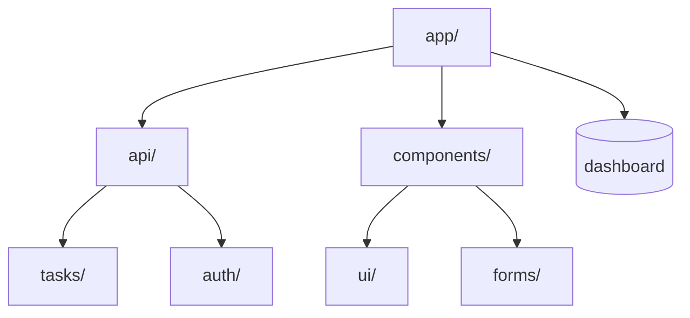

## 重要なエントリーポイント
- `app/page.tsx` - ホームページ
- `app/api/tasks/route.ts` - タスクAPI
- `lib/supabase.ts` - DB接続
- `middleware.ts` - 認証ミドルウェア

## コーディング規約
- コンポーネントは必ず TypeScript
- Server Componentsをデフォルト使用
- Client Componentは`"use client"`を明記
- 状態管理: Zustand使用

## 絶対に変更してはいけないファイル
- `lib/legacy/**` - レガシーコード（削除予定）
- `scripts/migration/**` - マイグレーションスクリプト

## テスト実行コマンド
```bash
npm run test        # 単体テスト
npm run test:e2e    # E2Eテスト
npm run lint        # リント
```
```

---

## 🚧 スコープフェンス（変更禁止領域の明示）

### **プロンプトでの指定例**

```markdown
## 変更可能なファイル
- `app/tasks/**` 配下の全ファイル
- `components/task-form.tsx`
- `lib/task-service.ts`

## 変更禁止（Do NOT modify）
- `app/api/billing/**` - 決済関連（別チームが管理）
- `lib/auth/**` - 認証ロジック（セキュリティ監査済み）
- `public/**` - 静的アセット

## 新規ファイルが必要な場合
- `lib/` 配下に作成
- 命名規則: `[機能名]-[役割].ts`（例: `task-validator.ts`）
```

**AIがスコープ外を誤って変更するのを防ぐ！**

---

## 📝 Work Order（作業指示書）テンプレート

### **Cursorで使える実践フォーマット**

```markdown
## Task ID: FEAT-142
## 目的: タスク一覧にCSVエクスポート機能を追加

### 変更可能ファイル
- `app/tasks/page.tsx`
- `app/api/tasks/export/route.ts`（新規作成）
- `components/export-button.tsx`（新規作成）

### 制約条件
- React 18、Tailwind CSS使用
- サーバーでストリーミングレスポンス
- 新しい依存関係の追加は禁止

### データ契約
GET /api/tasks/export?from=YYYY-MM-DD&to=YYYY-MM-DD&status=all|completed|pending
→ 200 text/csv
→ 400 INVALID_RANGE（開始日 > 終了日の場合）
→ 401 UNAUTHORIZED

### 受入基準
- AC-142-01: 期間2025-01-01〜2025-01-31を指定してエクスポート
  → CSVヘッダー: id, title, due_date, status, created_at
  → 1行/タスクで出力
- AC-142-02: 無効な期間（to < from）を指定
  → 400エラー、エラーメッセージ表示
- AC-142-03: 10,000件のタスクをエクスポート
  → 500ms以内にストリーミング開始

### 出力形式
1. 変更ファイルの差分（diff）
2. 新規作成ファイルの全体
3. テスト結果（`npm run test:export`）
4. 簡潔な実装メモ（ADR）

### 検証手順
```bash
npm run test:export
npm run e2e:export -- --seed SEED_2025_10
```

### テレメトリ
ログイベント `tasks_export_requested` を記録
- user_id
- date_range
- row_count
```

---

## 🎓 この章のまとめ

### **AIが理解しやすいコンテキスト設計**

✅ **BRD/PRDスケルトン**
  - 番号付き項目（BR-1, FR-01, AC-01-01）
  - 階層構造の明示

✅ **優先順位の最適化**
  - 制約条件を最初に配置
  - 受入基準を明確に記述
  - 背景説明は最後

✅ **データ契約の明示**
  - スキーマをYAML/JSON形式で
  - サンプルペイロードと境界値

✅ **スコープフェンス**
  - 変更可能/禁止ファイルを明示
  - 新規ファイルの命名規則

✅ **Work Order**
  - 1タスク = 1-3ファイル変更
  - 原子性を保つ

**次の章では、UI/UX設計の実践手法を学びます**

---

<!-- 第5章終了 -->

<!-- _class: section -->
# 付録B
## UI/UX設計の実践
### 〜 ユーザー視点での要件定義 〜

---

## 🎨 UI/UX設計はVibe Coderの必須スキル

### **なぜ非エンジニアこそUI/UX設計を学ぶべきか**

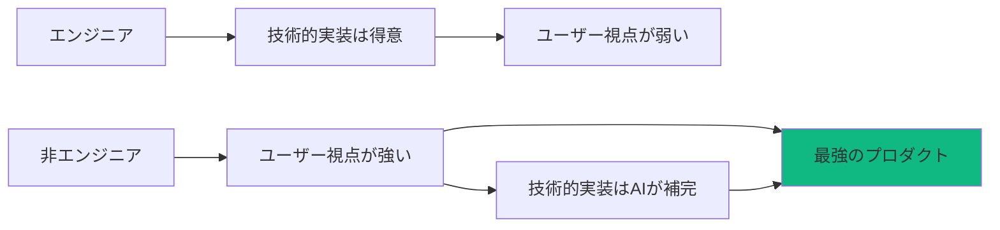

**あなたのユーザー視点 × AIの実装力 = 最強のプロダクト**

---

## 📊 ユーザーストーリーマッピング（2-4時間）

### **目的：リリーススライスを決める**

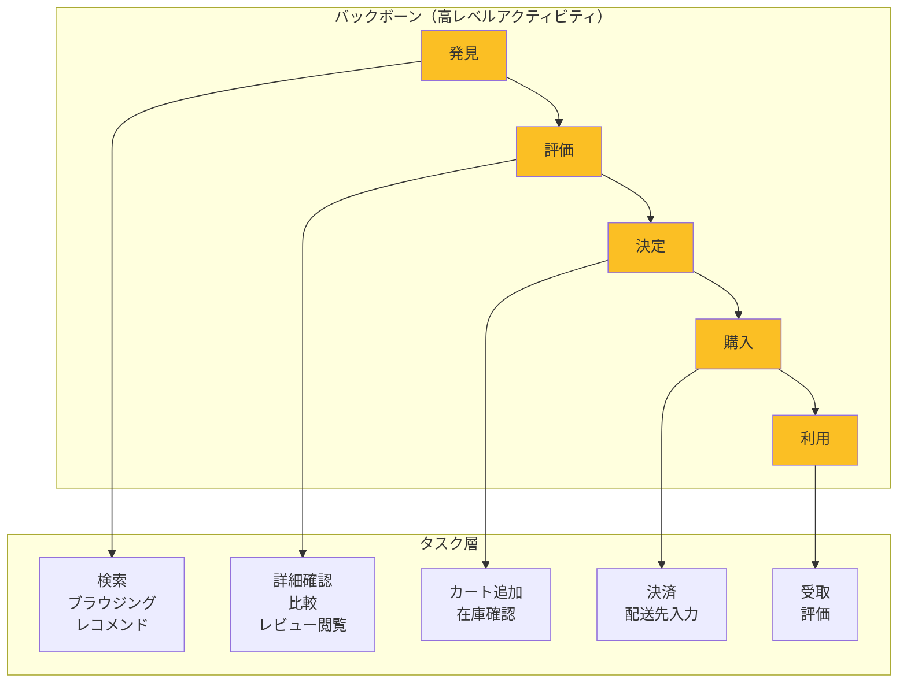

---

## 📝 ストーリーマッピングの4ステップ

### **Step 1: バックボーンを作る**

ユーザーの行動を時系列で並べる（5-10個の高レベルアクティビティ）

```markdown
## ECサイトの例
1. 発見（Discover）
2. 評価（Evaluate）
3. 決定（Decide）
4. 購入（Purchase）
5. 利用（Use）
6. サポート（Support）
```

### **Step 2: タスクとストーリーに分解**

各アクティビティの下に、具体的なタスクとユーザーストーリーを配置

```markdown
## 1. 発見（Discover）

### タスク1-1: 検索
- **ストーリー**: As a ユーザー, I want キーワードで検索, so that 欲しい商品を見つけられる
- **AC**: キーワード入力→結果一覧表示（0.5秒以内）

### タスク1-2: カテゴリブラウジング
- **ストーリー**: As a ユーザー, I want カテゴリから探す, so that 漠然としたニーズでも見つけられる
- **AC**: カテゴリ選択→商品一覧表示

### タスク1-3: レコメンド
- **ストーリー**: As a ユーザー, I want おすすめを見る, so that 新しい発見がある
- **AC**: ホーム画面に「あなたへのおすすめ」表示
```

---

## 🎯 Step 3: リリーススライスを決める

### **Walking Skeleton（Release 0）**

```markdown
## 最も薄い、しかしエンドツーエンドのユーザー体験

### Release 0（Walking Skeleton）
- 検索（キーワードのみ）
- 商品詳細表示
- カート追加
- 決済（テスト環境）
- 注文完了メール

**目標**: 1人のユーザーが最初から最後まで体験できる
```

### **Release 1（MVP）**

```markdown
### Release 1（MVP）+ 追加機能
- カテゴリブラウジング
- レビュー閲覧
- お気に入り登録
- 注文履歴

**目標**: 100人のユーザーが実際に使える
```

---

## 🗺️ カスタマージャーニーマッピング（2-3時間）

### **目的：感情とペインポイントを可視化**

| ステージ | ユーザーアクション | 思考・感情 | ペインポイント | 機会 | メトリクス |
|---------|---------------|-----------|-------------|------|---------|
| **認知** | Google検索 | 「いい商品ないかな」<br/>😐 | 情報が多すぎて迷う | SEO強化<br/>広告最適化 | 訪問数 |
| **検討** | 商品詳細閲覧 | 「これいいかも」<br/>😊 | レビューが少ない | レビュー促進施策 | 詳細閲覧率 |
| **購入** | カート→決済 | 「ちゃんと届くかな」<br/>😰 | 決済フォームが長い | ワンクリック決済 | カート放棄率 |
| **利用** | 商品到着 | 「思った通り！」<br/>😄 | 開梱が面倒 | 開梱しやすい梱包 | NPS |

### **モーメント・オブ・トゥルース（最重要瞬間）**
- 🌟 決済ボタンクリック（離脱が最も多い）
- 🌟 商品到着（期待を超える体験を）

---

## 🖼️ ワイヤーフレーミングのベストプラクティス

### **段階的なアプローチ**


### **ローファイ段階でやること**
- レイアウト（ボックス配置）
- 情報の階層（何が重要か）
- 画面遷移の流れ
- コピー（実際の文言）

**❌ やってはいけないこと**
- 色を決める
- フォントを選ぶ
- 画像を探す

---

## 📐 8ptグリッドシステム

### **なぜ8ptなのか**

```markdown
## デバイス対応
- 8の倍数は、あらゆる画面サイズで割り切れる
- デザイナーとエンジニアの共通言語

## スペーシング例
- 8pt: 最小マージン
- 16pt: 標準マージン
- 24pt: セクション間
- 32pt: 大きなセクション間
- 48pt: ページセクション間
```

### **レスポンシブブレークポイント**

| デバイス | 幅 | 用途 |
|---------|----|----|
| Mobile | 320-375px | スマホ縦 |
| Mobile L | 375-768px | スマホ横、小タブレット |
| Tablet | 768-1024px | タブレット |
| Desktop | 1024-1440px | ノートPC |
| Desktop L | 1440px+ | デスクトップ |

---

## 🎨 状態設計（State Design）

### **すべての状態を設計する**

```markdown
## タスク一覧画面の状態

### 1. Empty（空状態）
- 表示: 「まだタスクがありません」
- アクション: 「最初のタスクを作成」ボタン
- 画像: イラスト（親しみやすさ）

### 2. Loading（読み込み中）
- 表示: スケルトンスクリーン（3行）
- アニメーション: パルス効果
- 時間: 1秒以内に完了想定

### 3. Success（正常表示）
- 表示: タスクリスト
- 操作: 編集、削除、完了チェック

### 4. Error（エラー）
- 表示: 「データの読み込みに失敗しました」
- アクション: 「再試行」ボタン
- ログ: エラー詳細をSentryに送信

### 5. No Permission（権限なし）
- 表示: 「このタスクを表示する権限がありません」
- アクション: 「ダッシュボードに戻る」
```

---

## 📋 フォーム設計の原則

### **ベストプラクティス**

```markdown
## ✅ やるべきこと
1. **ラベルをトップ配置**（左配置より入力しやすい）
2. **必須項目を明示**（アスタリスク*）
3. **インライン検証**（入力中にリアルタイム）
4. **明確なエラーメッセージ**（フィールドの近くに赤字）
5. **自動フォーカス**（ページ表示時に最初のフィールド）
6. **Enter で送信**（キーボード操作）

## ❌ やってはいけないこと
1. **プレースホルダーをラベル代わりに使う**
2. **エラーをページ上部だけに表示**
3. **全角/半角を自動変換しない**
4. **パスワードを見せない**（表示切替ボタンを用意）
```

### **実装例（悪い vs 良い）**

```markdown
❌ 悪い例:
[      ユーザー名      ] ← プレースホルダーのみ

✅ 良い例:
ユーザー名 *
[                     ]
半角英数字、3文字以上
```

---

## ♿ アクセシビリティ（WCAG 2.2 AA準拠）

### **最低限守るべき5つのルール**

```markdown
## 1. カラーコントラスト比
- 通常テキスト: 4.5:1 以上
- 大きなテキスト（18pt以上）: 3:1 以上
- ツール: Contrast Checker（WebAIM）

## 2. キーボード操作
- Tab でフォーカス移動
- Enter/Space でボタン押下
- Esc でモーダル閉じる

## 3. フォーカスインジケーター
- フォーカス時に明確な枠線
- 色だけでなく形状でも区別

## 4. 代替テキスト
- 画像に alt 属性
- アイコンボタンに aria-label

## 5. セマンティックHTML
- `<button>` を使う（`<div onclick>` は NG）
- `<form>` でフォームを囲む
- 見出しタグを階層通りに使う（h1 → h2 → h3）
```

---

## 🎓 この章のまとめ

### **UI/UX設計の3つのツール**

✅ **ユーザーストーリーマッピング**
  - バックボーン → タスク → ストーリー
  - Walking Skeleton → MVP → Full Release

✅ **カスタマージャーニーマッピング**
  - 感情とペインポイントの可視化
  - モーメント・オブ・トゥルースの特定

✅ **ワイヤーフレーミング**
  - ローファイから開始
  - 8ptグリッド、レスポンシブ対応
  - 状態設計（Empty/Loading/Error/Success）

### **重要な原則**
- ユーザーの視点で考える
- すべての状態を設計する
- アクセシビリティを最初から考慮

---

<!-- _class: section-title -->

# 付録C
# データモデリングの基礎
## 🗄️ データ設計で失敗しないための基本原則

---

## 📚 データモデリングとは？

### **データの構造と関係性を設計すること**

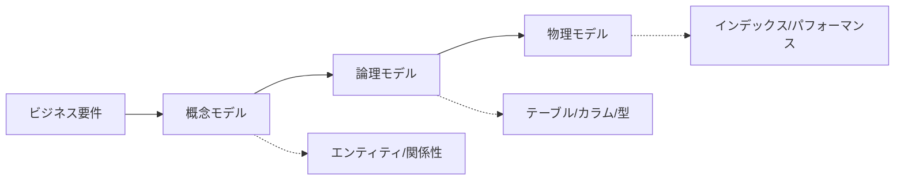

### **3つのモデル**

- **概念モデル**: ビジネスの観点でデータを整理（エンティティと関係性）
- **論理モデル**: データベース設計の観点（テーブル、カラム、データ型）
- **物理モデル**: 実装の観点（インデックス、パーティション、パフォーマンス最適化）

---

## 🧩 エンティティとは？

### **データとして扱う「もの」や「概念」**

#### **タスク管理アプリの例**

| エンティティ | 説明 | 主な属性 |
|------------|------|---------|
| **User（ユーザー）** | システムを使う人 | id, name, email, created_at |
| **Task（タスク）** | やるべき仕事 | id, title, due_date, status, user_id |
| **Tag（タグ）** | タスクの分類 | id, name, color |
| **Comment（コメント）** | タスクへのメモ | id, content, task_id, user_id, created_at |

### **💡 エンティティの見つけ方**

- ビジネス要件から「名詞」を抽出
- 「〜を管理したい」「〜を記録したい」と言われるもの

---

## 🔗 リレーションシップとは？

### **エンティティ同士の関係性**

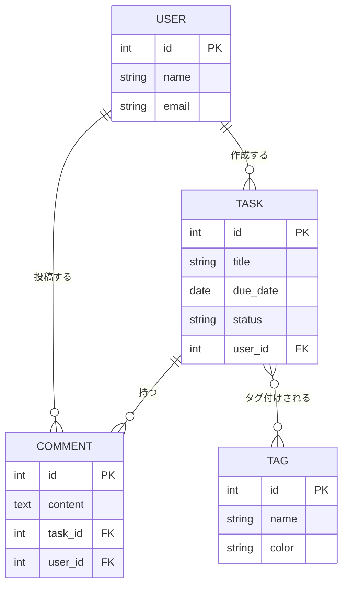

---

## 📐 カーディナリティ（多重度）

### **関係の数を表す記法**

| 記法 | 読み方 | 意味 | 例 |
|-----|-------|------|---|
| `1:1` | 1対1 | 片方に1つだけ対応 | ユーザー:プロフィール |
| `1:N` | 1対多 | 片方に複数対応 | ユーザー:タスク |
| `N:M` | 多対多 | 両方に複数対応 | タスク:タグ |

### **Mermaid ER図での表記**

```
||--|| : 1対1（両方必須）
||--o| : 1対0または1（片方任意）
||--o{ : 1対多（多側任意）
||--|{ : 1対多（多側必須）
}o--o{ : 多対多（両方任意）
```

---

## 🔑 主キー（Primary Key）

### **各レコードを一意に識別するID**

#### **主キーの特徴**

- ✅ **一意性**: 重複しない
- ✅ **不変性**: 更新されない
- ✅ **NOT NULL**: 必ず値がある

#### **良い主キーの例**

```sql
-- ✅ GOOD: UUID（グローバルに一意）
id: "550e8400-e29b-41d4-a716-446655440000"

-- ✅ GOOD: 連番ID（単一テーブル内で一意）
id: 1, 2, 3, 4, ...

-- ❌ BAD: メールアドレス（変更される可能性）
id: "user@example.com"

-- ❌ BAD: 名前（重複する可能性）
id: "山田太郎"
```

---

## 🔗 外部キー（Foreign Key）

### **他のテーブルを参照する列**

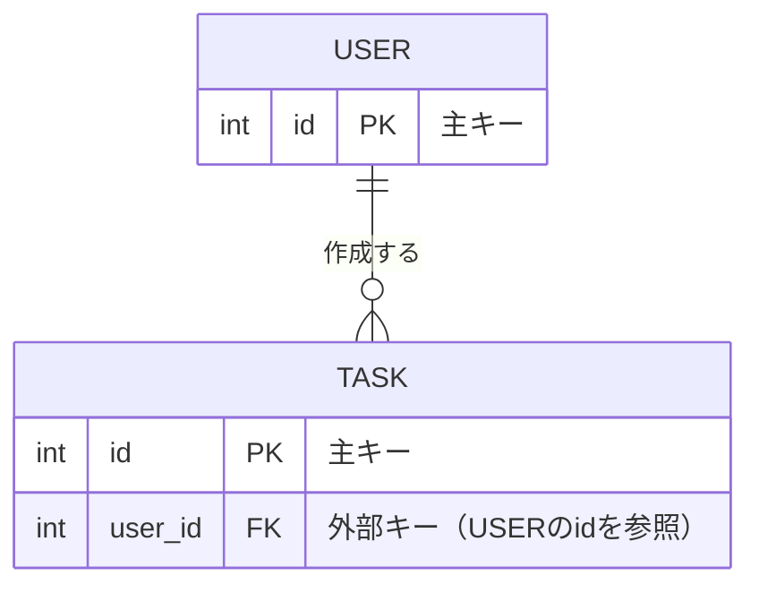

### **外部キーの役割**

- **参照整合性**: 存在しないユーザーIDのタスクは作れない
- **関連データの取得**: JOINでユーザー情報とタスクを同時取得

```sql
-- 外部キー制約の例
CREATE TABLE tasks (
  id INT PRIMARY KEY,
  title VARCHAR(255),
  user_id INT,
  FOREIGN KEY (user_id) REFERENCES users(id)
    ON DELETE CASCADE  -- ユーザー削除時にタスクも削除
);
```

---

## 🔄 多対多リレーションシップの実装

### **中間テーブル（Junction Table）が必要**

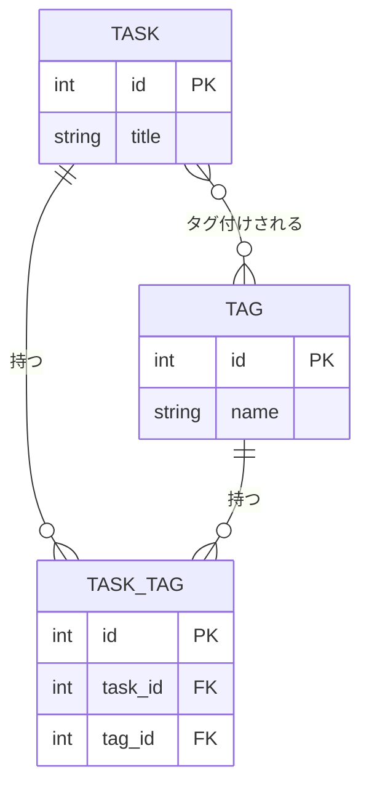

### **中間テーブルの設計**

- 両方のテーブルのIDを外部キーとして持つ
- 複合ユニーク制約で重複を防ぐ: `UNIQUE(task_id, tag_id)`

---

## 🎯 正規化の基本

### **データの冗長性を排除して整合性を保つ技術**

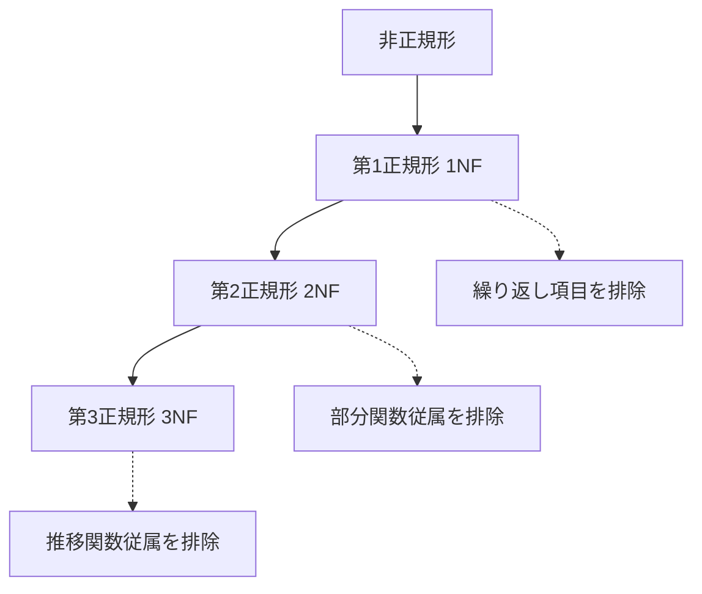

---

## 📝 第1正規形（1NF）

### **繰り返し項目を排除する**

#### **❌ BAD: 1NFに違反（タグが配列）**

| task_id | title | tags |
|---------|-------|------|
| 1 | レポート作成 | "仕事,重要,期限あり" |

#### **✅ GOOD: 1NFに準拠（別テーブルで管理）**

**tasks テーブル**
| task_id | title |
|---------|-------|
| 1 | レポート作成 |

**task_tags テーブル**
| task_id | tag_id |
|---------|--------|
| 1 | 1 |
| 1 | 2 |
| 1 | 3 |

---

## 📝 第2正規形（2NF）

### **部分関数従属を排除する（複合主キーの一部にのみ依存する列を分離）**

#### **❌ BAD: 2NFに違反**

**order_items テーブル（複合主キー: order_id + product_id）**
| order_id | product_id | product_name | quantity | price |
|----------|-----------|-------------|----------|-------|
| 1 | 101 | ノートPC | 2 | 120000 |
| 1 | 102 | マウス | 3 | 3000 |

**問題**: `product_name`, `price` は `product_id` にのみ依存（`order_id` は不要）

#### **✅ GOOD: 2NFに準拠**

**products テーブル**
| product_id | product_name | price |
|-----------|-------------|-------|
| 101 | ノートPC | 120000 |
| 102 | マウス | 3000 |

**order_items テーブル**
| order_id | product_id | quantity |
|----------|-----------|----------|
| 1 | 101 | 2 |
| 1 | 102 | 3 |

---

## 📝 第3正規形（3NF）

### **推移関数従属を排除する（主キー以外の列に依存する列を分離）**

#### **❌ BAD: 3NFに違反**

**tasks テーブル**
| task_id | title | user_id | user_name | user_email |
|---------|-------|---------|-----------|-----------|
| 1 | レポート | 10 | 山田太郎 | yamada@example.com |

**問題**: `user_name`, `user_email` は `user_id` に依存（`task_id` を経由した推移的依存）

#### **✅ GOOD: 3NFに準拠**

**users テーブル**
| user_id | user_name | user_email |
|---------|-----------|-----------|
| 10 | 山田太郎 | yamada@example.com |

**tasks テーブル**
| task_id | title | user_id |
|---------|-------|---------|
| 1 | レポート | 10 |

---

## ⚖️ 正規化のトレードオフ

### **正規化しすぎると読み取りが遅くなる**

| 正規化レベル | メリット | デメリット |
|-----------|---------|----------|
| **高い（3NF以上）** | データ整合性が高い<br/>更新が簡単<br/>ストレージ効率が良い | JOIN が増えて読み取りが遅い |
| **低い（非正規化）** | 読み取りが速い<br/>JOIN が少ない | データ重複<br/>更新時の不整合リスク |

### **💡 実務での判断基準**

- **OLTP（トランザクション処理）**: 3NFまで正規化
- **OLAP（分析処理）**: 意図的に非正規化（スタースキーマ等）
- **パフォーマンス問題**: 特定の読み取りパターンで非正規化を検討

---

## 📊 CRUD分析マトリクス

### **各エンティティに対する操作を整理**

| エンティティ | Create | Read | Update | Delete | 誰が操作？ |
|-----------|--------|------|--------|--------|----------|
| **User** | 管理者 | 全員 | 本人/管理者 | 管理者 | 管理者、本人 |
| **Task** | 本人 | 本人/チーム | 本人 | 本人 | タスク作成者 |
| **Comment** | 本人 | タスク閲覧者 | 本人 | 本人/管理者 | コメント投稿者 |
| **Tag** | 管理者 | 全員 | 管理者 | 管理者 | 管理者のみ |

### **💡 CRUD分析の活用法**

- **権限設計**: 誰が何を操作できるかの洗い出し
- **API設計**: 必要なエンドポイントの特定（例: `POST /tasks`, `GET /tasks/:id`）
- **UI設計**: ボタンやフォームの配置を決める

---

## 🗂️ 実践：タスク管理アプリのER図

### **完全なMermaid ER図**

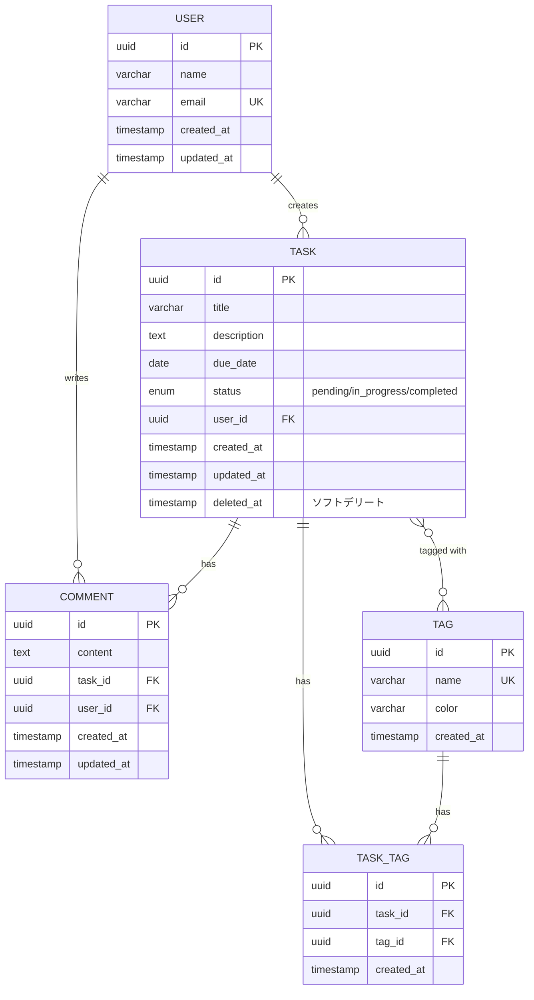

---

## 🔒 個人情報（PII）の分離戦略

### **法務・コンプライアンス対応**

```mermaid
erDiagram
    USER ||--|| USER_PII : "has"
    USER ||--o{ TASK : "creates"

    USER {
        uuid id PK "匿名ID"
        varchar username
        timestamp created_at
    }

    USER_PII {
        uuid id PK
        uuid user_id FK UK
        varchar full_name "暗号化"
        varchar email "暗号化"
        varchar phone "暗号化"
        date birth_date "暗号化"
        timestamp created_at
    }

    TASK {
        uuid id PK
        uuid user_id FK "匿名IDのみ参照"
        varchar title
    }
```

### **💡 分離のメリット**

- **アクセス制御**: PIIテーブルへのアクセスを厳しく制限
- **監査**: PII閲覧ログを別途記録
- **データ削除**: GDPR対応（Right to be forgotten）が容易

---

## ⏱️ タイムスタンプパターン

### **すべてのテーブルに必須の3カラム**

```sql
CREATE TABLE tasks (
  id UUID PRIMARY KEY,
  title VARCHAR(255) NOT NULL,

  -- ⭐ タイムスタンプ
  created_at TIMESTAMP DEFAULT CURRENT_TIMESTAMP,
  updated_at TIMESTAMP DEFAULT CURRENT_TIMESTAMP ON UPDATE CURRENT_TIMESTAMP,
  deleted_at TIMESTAMP NULL  -- ソフトデリート用
);
```

### **各タイムスタンプの役割**

| カラム | 役割 | 使用例 |
|-------|------|-------|
| `created_at` | 作成日時 | 監査ログ、並び替え |
| `updated_at` | 最終更新日時 | 同期処理、キャッシュ無効化 |
| `deleted_at` | 削除日時（NULL = 未削除） | ソフトデリート、復元機能 |

---

## 🗑️ ソフトデリート vs ハードデリート

### **削除方法の比較**

```mermaid
graph LR
    A[削除リクエスト] --> B{削除方法}
    B -->|ソフトデリート| C[deleted_at に現在時刻を記録]
    B -->|ハードデリート| D[レコードを物理削除]

    C --> E[復元可能]
    D --> F[完全削除（復元不可）]
```

### **実装例**

```sql
-- ソフトデリート
UPDATE tasks SET deleted_at = CURRENT_TIMESTAMP WHERE id = '123';

-- 取得時は削除済みを除外
SELECT * FROM tasks WHERE deleted_at IS NULL;

-- ハードデリート
DELETE FROM tasks WHERE id = '123';  -- 物理削除
```

### **💡 使い分け**

- **ソフトデリート**: ユーザーデータ、重要な記録（復元・監査が必要）
- **ハードデリート**: セッション、一時ファイル、法的に削除が必要なデータ

---

## 📋 データモデリングチェックリスト

### **設計前に確認すべき10項目**

- [ ] **1. エンティティの洗い出し完了**: ビジネス要件から名詞を抽出
- [ ] **2. 主キーの設定**: UUID or 連番ID、一意性・不変性・NOT NULL
- [ ] **3. リレーションシップの明確化**: 1:1, 1:N, N:M のどれか
- [ ] **4. 外部キー制約**: ON DELETE CASCADE or SET NULL
- [ ] **5. 多対多の中間テーブル**: 複合ユニーク制約 `UNIQUE(id1, id2)`
- [ ] **6. 正規化レベル**: 3NFまで正規化したか
- [ ] **7. タイムスタンプ**: created_at, updated_at, deleted_at
- [ ] **8. PII分離**: 個人情報は別テーブルで暗号化
- [ ] **9. CRUD分析**: 各エンティティの操作権限を整理
- [ ] **10. ER図作成**: Mermaidで可視化してレビュー

---

## 🎯 第7章まとめ

### **データモデリングの7つの基本原則**

1. **エンティティ**: ビジネス要件の名詞を抽出
2. **主キー**: UUID or 連番、一意性・不変性・NOT NULL
3. **外部キー**: 参照整合性を保証
4. **カーディナリティ**: 1:1, 1:N, N:M を明確に
5. **正規化**: 3NFまで正規化してから非正規化を検討
6. **タイムスタンプ**: created_at, updated_at, deleted_at は必須
7. **PII分離**: 個人情報は別テーブルで管理

### **💡 次のステップ**

- Prisma/Drizzleなどのスキーマ定義ツールで実装
- マイグレーションスクリプトでバージョン管理
- インデックス設計でパフォーマンス最適化

---

<!-- 付録終了 -->

<!-- _class: section-title -->

# 全体まとめ
## 🎯 AI駆動開発のビジネス要件定義マスターへの道

---

## 📖 本講義の全体像

### **第1〜5章：実践的な要件定義フロー**

```mermaid
graph LR
    A[第1章<br/>AI駆動開発の本質] --> B[第2章<br/>Markdownの重要性]
    B --> C[第3章<br/>2つの階層]
    C --> D[第4章<br/>6ステップ対話]
    D --> E[第5章<br/>実践ワークフロー]

    E -.-> F[音声入力]
    E -.-> G[構造化]
    E -.-> H[深掘り]
    E -.-> I[保存]
    E -.-> J[自動生成]
```

### **付録A〜C：詳細なテンプレートと基礎知識**

- **付録A**: BRD/PRD詳細テンプレート、ID体系、Work Order
- **付録B**: UI/UX設計（ユーザーストーリーマッピング、カスタマージャーニー、ワイヤーフレーム）
- **付録C**: データモデリング基礎（ER図、正規化、CRUD分析）

---

## 🎯 最も重要な3つの原則

### **1. 量→質の順番**

```mermaid
graph LR
    A[まずコンテクストの量を担保] --> B[次に質と中身を充実]
    B --> C[AIが最高の成果物を生成]

    A -.-> D[音声入力で5分]
    B -.-> E[対話で深掘り]
    C -.-> F[システム要件]
```

**完璧を目指さない**: 最初はざっくりでOK、AIとの対話で磨き上げる

---

### **2. Text is KING**

```
プレーンテキスト（Markdown） > リッチフォーマット（Notion/Word/PDF）
```

**理由**:
- AIが構造を完全に理解できる
- Gitでバージョン管理可能
- プラットフォーム非依存
- 自動化・スクリプト処理が容易

---

### **3. 人間とAIの役割分担**

| 人間がやること | AIがやること |
|------------|----------|
| アイデアを話す | 構造化 |
| 制約を伝える | テンプレート適用 |
| 質問に答える | 質問生成 |
| 深掘りする | ドキュメント生成 |
| 保存・管理 | システム要件生成 |

**人間は考える、AIは書く**

---

## 🚀 次回講義への準備

### **第二回：技術スタック選定とCursor実装**

1. `/docs/output/system_requirements.md` を `@参照` して開発開始
2. Cursor の `.cursorrules` でプロジェクトコンテキスト設定
3. Composer を使った段階的実装
4. デプロイまでの全フロー

### **今日からできること**

- [ ] 自分のアイデアを音声入力で5分話してみる
- [ ] Cursorに構造化させてみる
- [ ] AIに質問させて見落としを確認
- [ ] `/docs/input` に保存してみる

---

## 💡 受講生へのメッセージ

### **Vibe Coderとして成功する3つの心構え**

1. **完璧主義を捨てる**
   - 最初から完璧なアイデアは存在しない
   - イテレーションを恐れない
   - 小さく始めて大きく育てる

2. **Markdownで記録する習慣**
   - すべてをテキストで残す
   - Gitでバージョン管理
   - 未来の自分とAIへの投資

3. **AIを対話のパートナーにする**
   - AIに質問させる（受動的→能動的）
   - 「なぜ？」を繰り返す
   - AIの提案を鵜呑みにせず、検証する

---

## 📚 参考資料

### **第二回講義で使用するプロンプト**

- `@docs/prompt/1_system-requirements-prompt.md` - システム要件生成
- `@docs/prompt/2_tech-stack-selection-prompt.md` - 技術スタック選定（次回）
- `@docs/prompt/3_implementation-plan-prompt.md` - 実装計画（次回）

### **推奨ツール**

- **Cursor**: AI統合開発環境
- **Claude**: ビジネス要件の深掘り対話
- **Supabase**: バックエンドBaaS
- **Vercel**: デプロイメント

---

## 🎓 最終課題（オプション）

### **自分のアイデアで要件定義を完成させる**

1. **音声入力**: 自分のアイデアを5分話す
2. **構造化**: AIに Why/What/How で整理させる
3. **深掘り**: AIに質問させて回答
4. **保存**: `/docs/input` に3ファイル作成
5. **生成**: システム要件を自動生成
6. **提出**: `/docs/output/system_requirements.md` を共有（任意）

**期限**: 第二回講義まで（自主学習用）

---

## 🙏 ありがとうございました！

### **次回予告：第二回講義**

- **タイトル**: 技術スタック選定とAI要件定義演習
- **内容**:
  - システム要件から技術スタック選定
  - Cursor + Composer での実装開始
  - Supabase + Next.js のセットアップ
  - 最初の機能実装

**質問があればいつでもSlackでどうぞ！**

---
