<!-- _class: title -->
# **第一回：ツール紹介と宿題説明**
## 🚀 組織変革のための道具箱
### **〜 AIツール・オーケストラを指揮する 〜**

**TEKION Group**
**2025年9月版**

---

<!-- _class: lead -->
# **本日のゴール**

## **組織のDX推進に必要な「AIツールの全体像」を理解し、**
## **明日から業務で使える「実践的な第一歩」を踏み出す**

### 🎯 **90分後、あなたの部門は変革への道筋が見えている**

---

# **アジェンダ**

## **1. AIツール・オーケストラの全体像**（15分）
## **2. 主要ツールの詳細解説**（25分）
## **3. Cursor最低限マスター講座**（15分）
## **4. v0実践デモ・ライブ**（15分）
## **5. 宿題説明：実践課題**（15分）
## **6. 今日のまとめとアクションプラン**（5分）

---

<!-- _class: section -->
# 第1章
## 🎼 AIツール・オーケストラの全体像
### **〜 単一の万能ツールは存在しない 〜**

---

# **なぜ「オーケストラ」なのか？**

## **交響曲を奏でるには、異なる楽器が必要**

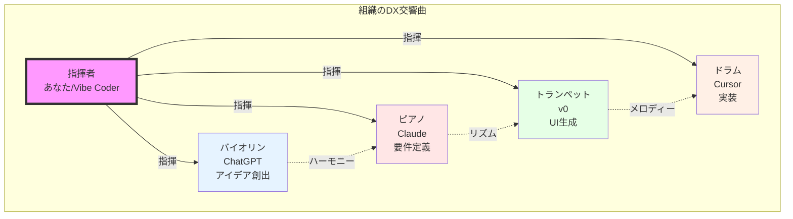

---

# **組織のワークフローとAIツールマッピング**

## **各フェーズに最適な「楽器」を選択する**

| **フェーズ** | **役割** | **主要ツール** | **組織での活用例** |
|:------------|:---------|:--------------|:-----------------|
| **🎯 アイデア創出** | 思考の壁打ち相手 | ChatGPT, Claude | 新規事業企画、改善提案 |
| **📊 情報整理・分析** | 優秀なリサーチャー | Perplexity, Gemini | 市場調査、競合分析 |
| **🎨 UIの可視化** | 天才デザイナー | v0, Figma AI | プロトタイプ作成 |
| **⚡ 実装・開発** | 忠実な副操縦士 | Cursor, Bolt.new | 業務ツール開発 |
| **🔄 自動化** | 24時間働く秘書 | ChatGPT Operators | 定型業務の自動化 |

**重要：** 各ツールは「専門性」を持つ。万能ツールを探すより、適材適所で使い分ける

---

# **2025年9月：AIツール最新カオスマップ**

## **組織変革に必要な主要カテゴリー**

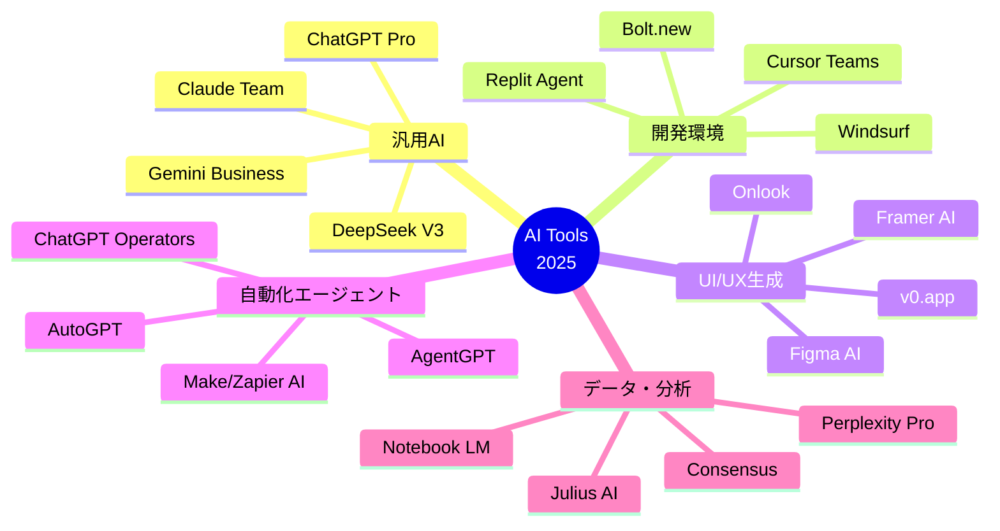

---

# **日本企業の導入実績（2025年9月時点）**

## **先進企業はすでに動いている**

### **大手企業の事例**
- **パナソニックコネクト**：1日5,000回のAI利用で業務効率30%向上
- **セブンイレブン**：商品企画期間を10分の1に短縮（3ヶ月→10日）
- **ヤフージャパン**：11,000人全社員にAI利用を義務化
- **三菱UFJ銀行**：行員8,000人がCopilot for Microsoft 365活用

### **中小企業の成功パターン**
- **製造業A社**（従業員200名）：品質検査をAI画像認識で自動化、不良率70%削減
- **商社B社**（従業員50名）：見積書作成時間を80%削減、月間100時間の創出
- **サービス業C社**（従業員30名）：カスタマーサポートの一次対応を自動化

**📊 データ：** 日本企業のAI活用率は24%（2025年9月）、1年前の9%から急成長

---

<!-- _class: section -->
# 第2章
## 🔧 主要ツールの詳細解説
### **〜 組織変革の実践的道具箱 〜**

---

# **ChatGPT：アイデアと実行の最強パートナー**

## **2025年9月最新情報と組織活用**

### **料金プラン（組織向け）**
| プラン | 月額 | 特徴 | 組織での用途 |
|:------|:-----|:-----|:------------|
| **Team** | $25/人 | SSO、管理機能 | 部門導入向け |
| **Enterprise** | カスタム | データ保護、SLA | 全社展開向け |

### **最新機能：ChatGPT Operators（2025年1月リリース）**
- **ウェブ操作の自動化**：フォーム入力、データ収集を自動実行
- **タスクの自律実行**：「毎朝9時に競合サイトをチェック」等の定期実行
- **Pro版限定機能**：月額$200だが、業務自動化のROIは圧倒的

### **組織での活用例**
```
プロンプト例：
「弊社の月次売上レポートのフォーマットで、
今月の実績をまとめてください。
前月比と前年同月比も含めて」
```

---

# **Claude：要件定義と長文処理のスペシャリスト**

## **組織の知的作業を強力サポート**

### **2025年9月の新機能**
- **Memory機能**：チーム全体のコンテキストを記憶（Team/Enterprise限定）
- **200Kトークン処理**：契約書や仕様書を丸ごと理解
- **Research モード**：45分かけて徹底的なリサーチを自動実行

### **料金体系（組織向け）**
| プラン | 月額 | 特徴 | 最適な部門 |
|:------|:-----|:-----|:----------|
| **Team** | $25/人 | 共有ワークスペース | 企画・開発部門 |
| **Max** | $100-200/月 | 高頻度利用 | 専門職・研究部門 |

### **実践的活用法**
```
プロンプト例：
「添付した100ページの業務マニュアルを分析し、
効率化できるポイントを10個提案してください。
各提案に対してAI活用の可能性も評価してください」
```

---

# **Gemini：Google連携と最新情報の宝庫**

## **組織のナレッジマネジメントを革新**

### **Google Workspace統合の威力**
- **Gmail自動要約**：重要メールを3行でまとめ
- **Drive横断検索**：「先月の会議資料から売上データを抽出」
- **Sheets分析**：「このデータから異常値を発見して」

### **2025年9月アップデート**
- **2Mトークン処理**：動画や大規模文書も一括処理
- **Veo 3動画生成**：プレゼン用動画を自動作成
- **日本リージョン対応**：データの国内保管が可能

### **料金と導入パターン**
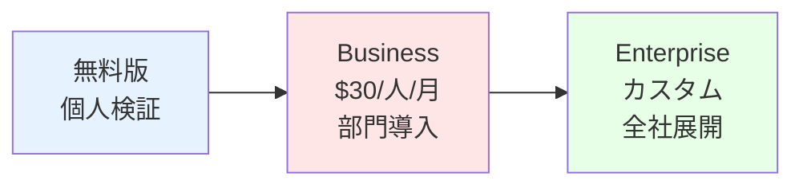

---

# **Cursor：組織のVibe Coding実現環境**

## **プログラミング知識ゼロから業務ツール開発へ**

### **Cursor 1.0の革新（2025年9月）**
- **Agent中心の操作**：日本語で指示するだけで開発完了
- **Background Agent**：複数タスクを並列自動実行
- **YOLOモード**：エラーを自動検出・修正
- **Bugbot**：コードレビューと修正を自動化

### **組織導入の料金体系**
| プラン | 月額 | 特徴 | 導入規模 |
|:------|:-----|:-----|:--------|
| **Pro** | $20/人 | 個人利用 | パイロット |
| **Teams** | $40/人 | SSO、管理機能 | 部門展開 |
| **Enterprise** | カスタム | オンプレミス対応 | 全社展開 |

### **業務ツール開発例**
```
「経費精算システムを作って。
領収書をアップロードしたら自動で項目を読み取り、
承認フローに回す機能付き」
→ 15分で動作するプロトタイプ完成
```

---

# **v0.app：UIを瞬時に具現化する魔法**

## **アイデアから動くプロトタイプまで5分**

### **2025年9月の進化**
- **v0.dev → v0.app**：より「アプリ開発」に特化
- **エージェント化**：研究→計画→実装→デバッグを自動実行
- **Platform API**：組織のシステムに統合可能

### **料金とクレジット制**
| プラン | 月額 | クレジット | 作成可能数 |
|:------|:-----|:----------|:----------|
| **Free** | $0 | $5相当 | 簡単なUI 5-10個 |
| **Premium** | $20 | $20相当 | 複雑なアプリ 10-20個 |
| **Team** | $30/人 | $30相当/人 | 無制限に近い |

### **実際の生成例**
```
プロンプト：
「社内向け備品管理システムのダッシュボード。
在庫一覧、発注履歴、アラート表示付き」
→ 30秒で完成、即座にCursorで機能追加可能
```

---

# **Bolt.new：ブラウザだけで完結する開発環境**

## **インストール不要、即座に開発開始**

### **組織での活用メリット**
- **環境構築不要**：ITサポートなしで即開発
- **共有が簡単**：URLを送るだけでレビュー可能
- **セキュリティ**：ローカル環境を汚さない

### **料金体系（2025年9月）**
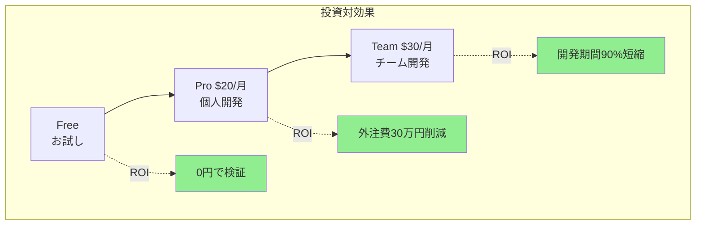

---

# **Windsurf：エンタープライズ向け本格IDE**

## **大規模組織のAI開発標準環境**

### **Cursor vs Windsurf 比較**
| 機能 | Cursor | Windsurf | 組織向け推奨 |
|:-----|:-------|:---------|:-----------|
| **使いやすさ** | ⭐⭐⭐⭐⭐ | ⭐⭐⭐⭐ | Cursor |
| **エンタープライズ機能** | ⭐⭐⭐ | ⭐⭐⭐⭐⭐ | Windsurf |
| **JetBrains対応** | ❌ | ✅ | Windsurf |
| **価格** | $20-40/月 | $15-60/月 | Windsurf |

### **Cascade Agent（Windsurf独自）**
- 複数ファイルの同時編集
- 長期的なコンテキスト保持
- エンタープライズレベルのセキュリティ

### **導入判断基準**
- **50人未満の組織**：Cursor推奨（簡単・高速）
- **50人以上の組織**：Windsurf推奨（管理・統制）

---

# **NotebookLM：ドキュメントを対話型知識に変える**

## **Google製の革新的な学習・分析ツール**

### **2025年7月の大型アップデート**
- **🎥 Video Overviews機能追加** - AIがスライドショー動画を自動生成（2025年7月29日リリース）
  - 資料から画像、引用、データ、図表を自動抽出
  - ナレーション付き動画として出力
  - 80言語対応（2025年8月25日拡張）
- **📹 YouTube動画の直接分析** - URLを貼るだけで内容を完全理解
  - トランスクリプトを自動取得
  - タイムスタンプ付き引用
  - モバイルアプリから直接共有可能

### **NotebookLMの主要機能**
- **ドキュメントアップロード** - PDF、テキスト、Googleドキュメント、URL、YouTube動画
- **AI音声ポッドキャスト生成** - 2人の司会者が内容を解説する音声を自動生成
- **Video Overview生成** - 資料を動画化、共有リンク発行可能
- **質問応答** - アップロードした資料について無限に質問可能
- **要約・分析** - 長大な資料を即座に構造化

### **Vibe Coderとしての活用法**
1. **要件定義書をアップロード** → Video Overviewで動画説明を生成
2. **技術解説YouTube動画を投入** → 内容を文書化して学習
3. **議事録を整理** → 音声ポッドキャストで移動中に復習
4. **競合サイトのURL群を統合** → 横断的な分析レポート生成

### **料金**
- **完全無料** - Googleアカウントがあれば即利用可能
- **容量制限** - 1ノートブックあたり50ソースまで
- **文字数制限** - 1ソースあたり500,000文字

### **実際の使い方**
```
1. notebooklm.google.com にアクセス
2. 「新しいノートブック」を作成
3. YouTube URLを直接ペーストorファイルをドラッグ&ドロップ
4. 「Video Overview」で動画生成（NEW！）
5. 「Audio Overview」で音声生成（80言語対応）
6. チャットで質問し放題
```

**💡 プロのコツ：** 技術系YouTube動画をNotebookLMに入れて、Video Overviewで要点整理動画を作成！

---

# **Genspark：次世代AI検索とエージェント**

## **検索を超えた「答えの生成」**

### **Gensparkの革新的機能（2025年）**
- **Sparkpages** - 検索結果を構造化された1ページに集約
  - 広告なし、クリーンなインターフェース
  - AI Copilotで対話的に深掘り可能
  - マインドマップでビジュアル探索
- **Super Agent（2025年4月リリース）** - 自律的に作業を完了
  - リサーチから資料作成まで自動実行
  - OpenAI Realtime APIで電話も可能
  - スライド、動画生成まで対応
- **AI Browser（2025年6月）** - エージェント統合ブラウザ
  - 広告ブロック標準搭載
  - Autopilotモードで自動操作
  - どのサイトでもSuper Agent呼び出し可能
- **AI Meeting Notes（2025年8月）** - 会議の自動文書化
  - Apple Watchにも対応
  - ワンタップで議事録生成

### **料金**
- **基本機能** - 無料
- **Pro版** - $20/月（無制限のSparkpages）
- **Super Agent** - $39/月〜

### **Vibe Coderとしての活用法**
```
1. 競合分析 → Sparkpageで一覧化
2. 技術調査 → 複数モデルで検証済み回答
3. 企画書作成 → Super Agentが自動生成
```

---

# **Manus：完全自律型AIエージェント**

## **「あなたの代わりに働くAI」**

### **Manusの特徴（2025年）**
- **エンドツーエンド実行** - タスクを丸ごと任せられる
  - 計画→実行→検証まで自動
  - クラウド上で動作、PCを閉じてもOK
  - 数時間かかる作業も自律完遂
- **マルチエージェント構成** - 専門チームが協働
  - Planner（計画）
  - Researcher（調査）
  - Coder（開発）
  - Executor（実行）
- **実績のあるユースケース**
  - 市場調査レポート作成
  - データ分析とExcel出力
  - 簡単なWebアプリ開発
  - 競合サイトの情報収集
  - プレゼン資料の自動生成

### **技術基盤**
- Claude Sonnet + Alibaba Qwenモデル
- GAIAベンチマーク高スコア
- Web操作、API呼び出し、コード実行に対応

### **料金（2025年）**
- **個人** - $39/月
- **Pro** - $199/月
- **Teams** - カスタム価格

### **注意点**
- まだベータ的な側面あり
- データプライバシーに配慮必要
- 完璧ではなく、エラーも発生

**💡 使い分け：** NotebookLM（学習）→ Genspark（調査）→ Manus（実行）

---

# **AIエージェント：2025年の自動化革命**

## **人間の仕事を本当に代替し始めた**

### **ChatGPT Operators（最新）**
- **できること**：
  - Webフォームへの自動入力
  - 定期的な情報収集
  - レポートの自動生成
  - メールの自動返信

### **導入効果の実例**
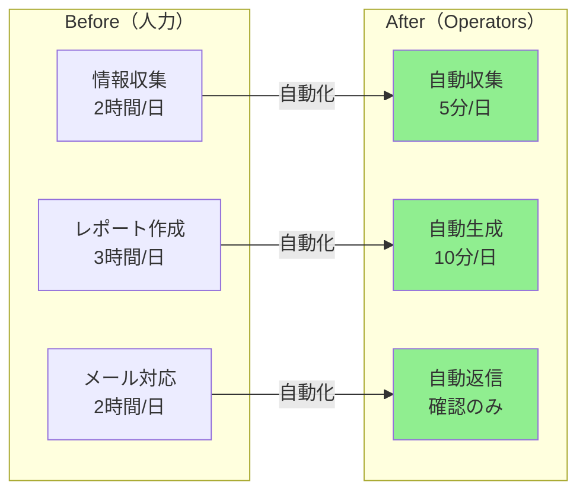

**削減時間：7時間/日 → 15分/日（97%削減）**

---

<!-- _class: section -->
# 第3章
## 💻 Cursor最低限マスター講座
### **〜 宿題に必要な操作だけ15分で習得 〜**

---

# **Cursorで宿題をこなすための3ステップ**

## **プログラミング知識ゼロでもできる**

### **Step 1: プロジェクトを開く**
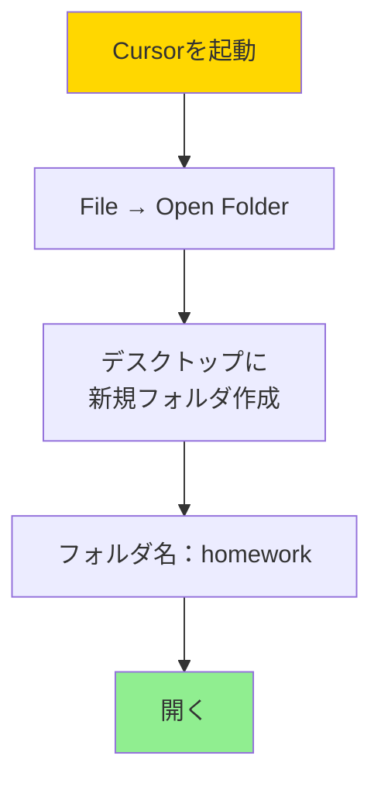

### **Step 2: AIと対話する（Cmd+I / Ctrl+I）**
```
プロンプト例：
「シンプルなToDoアプリを作ってください。
HTMLとCSSとJavaScriptで。
タスクの追加と削除ができればOK」
```

### **Step 3: 動作確認**
- 生成されたHTMLファイルを右クリック
- 「Open with Live Server」を選択
- ブラウザで動作確認

**これだけで宿題は完了できます！**

---

# **Cursor Agent（Composer）の魔法**

## **「こうしたい」を伝えるだけ**

### **実際の対話例**
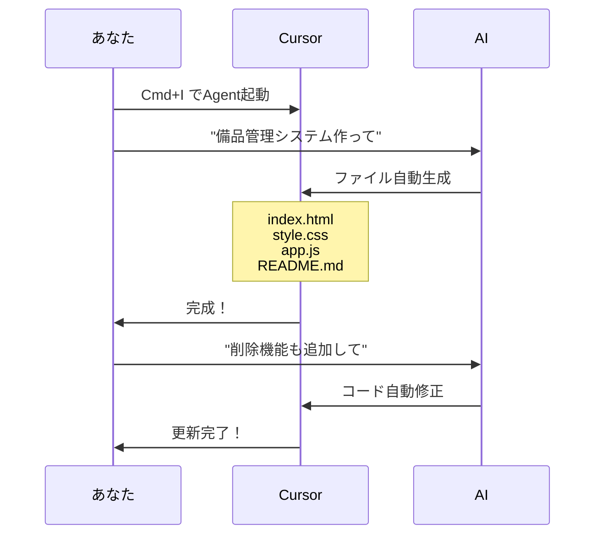

### **便利な言い回し集**
- 「○○を作って」→ 新規作成
- 「○○を追加して」→ 機能追加
- 「○○を修正して」→ バグ修正
- 「もっと○○にして」→ デザイン変更

---

# **よくあるトラブルと解決法**

## **初心者が必ずぶつかる壁と突破法**

### **Q: 生成されたコードが動かない**
**A:** 以下の魔法の言葉を使う
```
「エラーが出ています。修正してください」
→ AIが自動的にデバッグ
```

### **Q: どこにファイルができたか分からない**
**A:** 左側のファイルツリーを確認
- 📁 homework
  - 📄 index.html（これをブラウザで開く）
  - 📄 style.css
  - 📄 app.js

### **Q: デザインが気に入らない**
**A:** 具体的に指示
```
「もっとモダンなデザインにして。
青を基調にして、角を丸くして」
```

### **最終手段：YOLOモード**
```
「YOLOモードで全部お任せで作って」
→ AIが全自動で最適解を生成
```

---

<!-- _class: section -->
# 第4章
## 🎨 v0実践デモ・ライブ
### **〜 5分でUIを形にする魔法を体験 〜**

---

# **v0.appで即座にUIを生成**

## **百聞は一見に如かず：実演します**

### **今から作るもの：社内ポータルサイト**
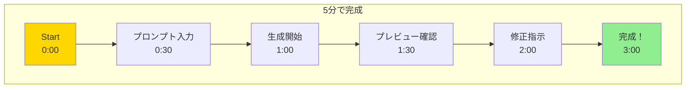

### **実際のプロンプト**
```
「社内ポータルサイトのトップページを作成してください。

必要な要素：
- ヘッダー：会社ロゴ、ナビゲーションメニュー
- お知らせセクション：最新3件表示
- クイックリンク：よく使うツールへのショートカット
- 今日の予定：カレンダー連携風のUI
- 社内Wiki検索ボックス

デザイン：信頼感のある青系、レスポンシブ対応」
```

---

# **v0デモ：段階的な改善プロセス**

## **初回生成 → 改善 → 完成の流れ**

### **Stage 1: 初回生成（30秒）**
- 基本レイアウト完成
- 色とフォントの適用
- レスポンシブ対応

### **Stage 2: 詳細調整（1分）**
```
追加プロンプト：
「お知らせセクションをカード形式に変更。
各カードに日付とカテゴリーラベルを追加」
```

### **Stage 3: 最終調整（30秒）**
```
最終プロンプト：
「全体的にもう少し余白を増やして、
フォントサイズを大きくして読みやすく」
```

### **完成品の特徴**
- プロダクションレベルの品質
- 即座にCursorで機能追加可能
- コードは商用利用OK

---

# **生成されたコードの活用法**

## **v0 → Cursor → 実運用への道筋**

### **Step 1: v0でUI生成**
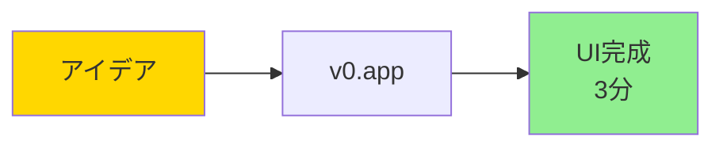

### **Step 2: Cursorで機能実装**
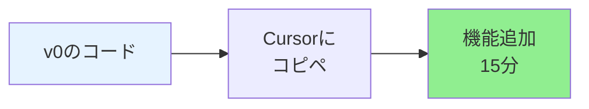

### **Step 3: 実運用へ**
| 段階 | 作業内容 | 所要時間 |
|:-----|:--------|:---------|
| **データ連携** | APIとの接続 | 30分 |
| **認証追加** | ログイン機能 | 30分 |
| **デプロイ** | Vercelで公開 | 10分 |

**合計：アイデアから公開まで2時間以内**

---

<!-- _class: section -->
# 第5章
## 📝 宿題説明：実践課題
### **〜 学んだことを即実践 〜**

---

# **宿題：あなたの最初のAIアプリを作ろう**

## **3つのレベルから選べる実践課題**

### **Level 1: シンプルタスク（推奨）**
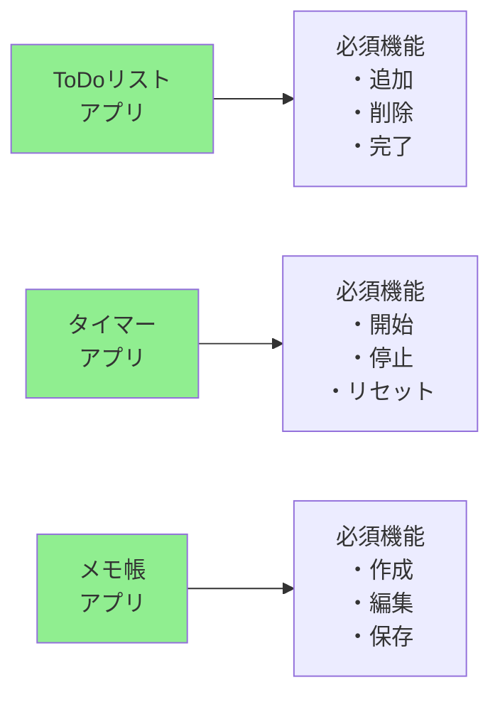

### **Level 2: 業務系ツール**
- 経費精算フォーム
- 備品管理システム
- シフト管理表

### **Level 3: チャレンジ課題**
- 社内Wiki風ページ
- ダッシュボード
- チャットアプリ

---

# **宿題の進め方：推奨フロー**

## **成功のための段階的アプローチ**

### **Day 1-2: 構想とv0でプロトタイプ**
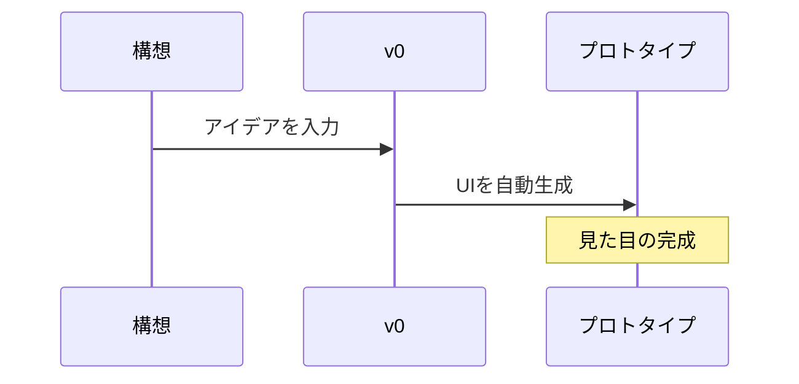

### **Day 3-4: Cursorで機能実装**
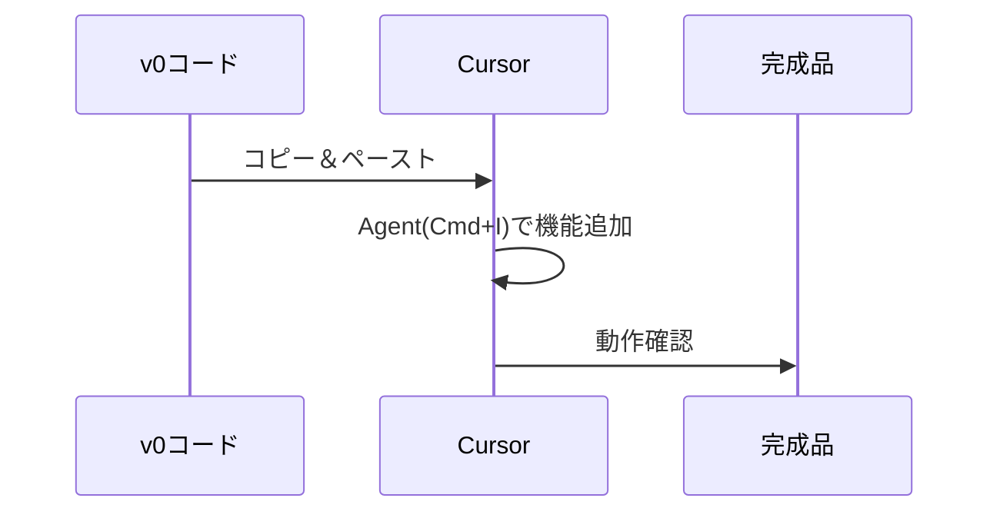

### **Day 5-7: ブラッシュアップ**
- エラー修正
- デザイン調整
- ドキュメント作成

---

# **宿題提出の要件**

## **最低限クリアすべき基準**

### **必須提出物**
| 項目 | 内容 | 形式 |
|:-----|:-----|:-----|
| **1. 動作するアプリ** | HTMLファイル一式 | ZIPまたはGitHub |
| **2. 説明資料** | 機能説明、使い方 | README.mdまたはPDF |
| **3. 開発記録** | 使用したプロンプト | テキストファイル |
| **4. スクリーンショット** | 動作画面3枚以上 | 画像ファイル |

### **評価ポイント**
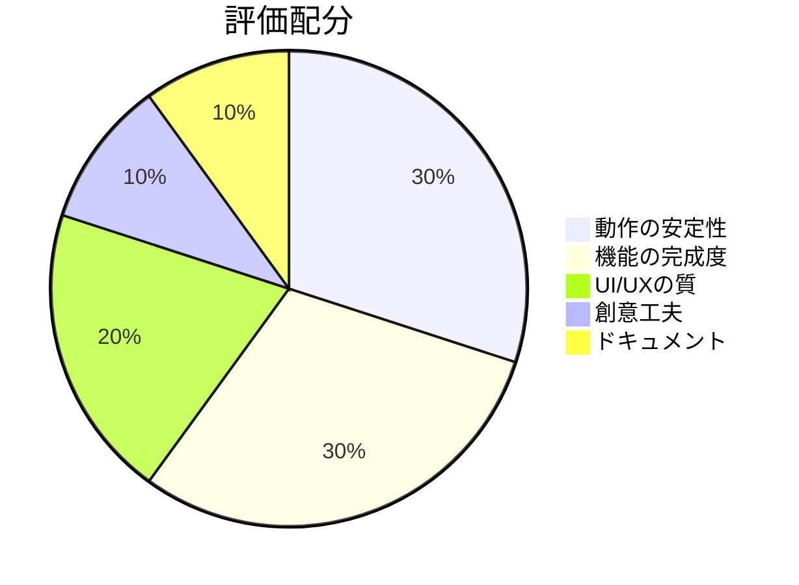

### **加点要素**
- 実際の業務で使えるツール
- チーム共有を想定した設計
- エラーハンドリング実装

---

# **よくある質問：宿題編**

## **つまずきポイントと解決策**

### **Q: どのレベルを選べばいい？**
**A:** 迷ったらLevel 1から。完成させることが最重要。

### **Q: プログラミング経験ゼロでも大丈夫？**
**A:** 全く問題なし。AIが99%やってくれます。

### **Q: 時間がかかりそう...**
**A:** 実作業時間は3-5時間程度。毎日30分でOK。

### **Q: エラーが出て動かない**
**A:** Cursorに「エラーを修正して」と伝えるだけ。

### **Q: デザインセンスがない**
**A:** v0に「モダンでプロフェッショナルな感じで」と指示。

### **Q: 提出期限に間に合わない場合は？**
**A:** 未完成でも提出。プロセスも評価対象です。

---

# **成功者の開発パターン**

## **過去の受講生の成功事例**

### **パターン1: シンプル＆確実型**
```
Day 1: v0でToDoアプリのUI生成（30分）
Day 2: Cursorで機能実装（1時間）
Day 3: バグ修正と調整（30分）
→ 合計2時間で完成
```

### **パターン2: 段階的改善型**
```
Day 1: 最小限の機能で動くものを作成（1時間）
Day 2-3: 機能を1つずつ追加（各30分）
Day 4: UI/UXの改善（30分）
→ 少しずつ確実に完成
```

### **パターン3: 週末集中型**
```
土曜AM: v0でUI作成、Cursorで実装（2時間）
土曜PM: エラー修正、機能追加（1時間）
日曜AM: ドキュメント作成（30分）
→ 週末で完結
```

**共通点：** 完璧を求めず、動くものを優先

---

# **宿題サポート体制**

## **困ったときの相談窓口**

### **Slackサポート**
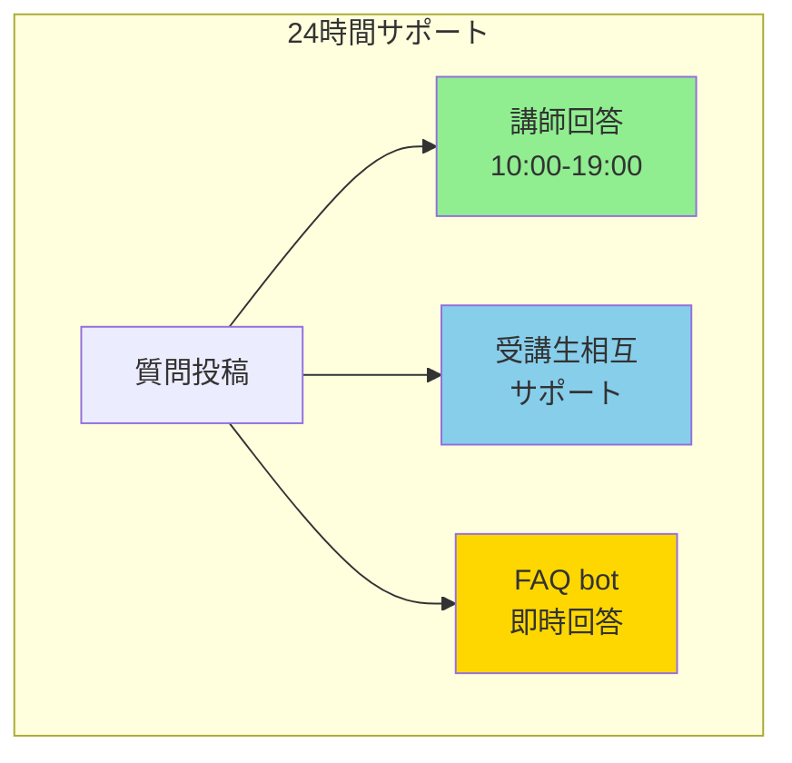

### **推奨：#homework チャンネル**
- スクリーンショット付きで質問
- エラーメッセージは全文コピペ
- 試したことを箇条書き

### **オフィスアワー**
| 曜日 | 時間 | 形式 |
|:-----|:-----|:-----|
| 平日 | 12:00-13:00 | Slack |
| 平日 | 18:00-19:00 | Zoom可 |
| 土曜 | 10:00-12:00 | 特別対応 |

**モットー：** 「聞くは一時の恥、聞かぬは一生の損」

---

<!-- _class: section -->
# 第6章
## 🎯 今日のまとめとアクションプラン
### **〜 明日から始まる変革 〜**

---

# **今日学んだことを実践する**

## **知識からアクションへ**

### **今日からできること**
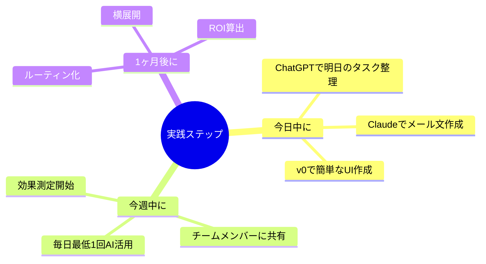

**重要：** 完璧を求めない。「やってみた」ことが第一歩

---

# **推奨：今週の実践チャレンジ**

## **自主的に試してみよう**

### **チャレンジ1：AI活用ログ**
| 日付 | 使用場面 | 使用ツール | 結果 | 気づき |
|:-----|:--------|:----------|:-----|:-------|
| - | - | - | - | - |

### **チャレンジ2：v0でプロトタイプ**
- Twitter風SNSのタイムライン
- 業務改善ツールのUI
- 自分のアイデアを形に

### **成功のコツ**
1. **とりあえず聞く**：「これAIでできる？」
2. **比較する**：ChatGPT vs Claude
3. **改善する**：プロンプトを工夫

---

# **第2回講義で学ぶこと**

## **更なるステップアップへ**

### **第2回の内容予告**
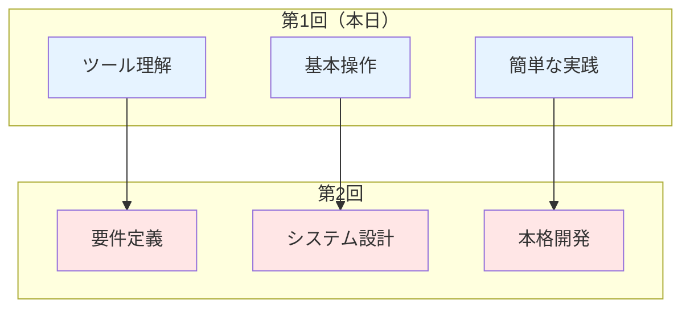

### **次回までに試しておくと良いこと**
1. **実践経験**を積む
2. **つまづいたポイント**をメモ
3. **作りたいもの**をイメージ

---

<!-- _class: section -->
# まとめ
## 🚀 明日から始まる、組織の変革

---

# **本日の学び：革命的ツールの数々**

## **組織変革のための道具箱は揃った**

### **汎用AI御三家**
1. **ChatGPT**：Operators で自動化の扉を開く
2. **Claude**：長文処理と要件定義のプロ
3. **Gemini**：Google連携で情報を制する

### **開発環境の革命児**
4. **Cursor**：日本語で指示するだけの開発
5. **v0**：UIを5分で形にする魔法
6. **Bolt.new**：ブラウザだけで完結
7. **Windsurf**：エンタープライズ向け統合環境

### **次世代ツール**
8. **NotebookLM**：ドキュメントを動画と音声に変換
9. **Genspark**：次世代検索エンジン
10. **Manus**：自律型AIエージェント

**これらを組み合わせることで、組織のDXは加速する**

---

# **投資対効果の現実**

## **月額投資 vs 削減効果**

### **シミュレーション（50名規模の部門）**
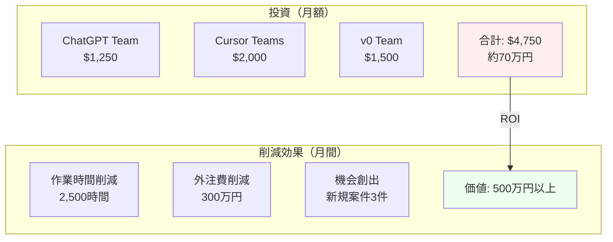

**投資回収期間：実質1ヶ月以内**

---

# **日本企業の成功パターン**

## **先行企業から学ぶ3つの教訓**

### **1. スモールスタートが成功の鍵**
- **失敗例**：全社一斉導入 → 混乱
- **成功例**：1部門で実証 → 横展開

### **2. 使い方教育への投資**
- **失敗例**：ツールだけ導入 → 活用されず
- **成功例**：週1回の勉強会 → 自走する組織

### **3. 成果の可視化と共有**
- **失敗例**：効果測定なし → 予算削減
- **成功例**：ROI明確化 → 投資拡大

### **成功企業の共通点**
```
初月：パイロット部門で実験
3ヶ月：効果測定と改善
6ヶ月：全社展開の判断
1年後：競合との差別化実現
```

---

# **今日からのアクションプラン**

## **組織変革への具体的な第一歩**

### **Day 1-3：個人で試す**
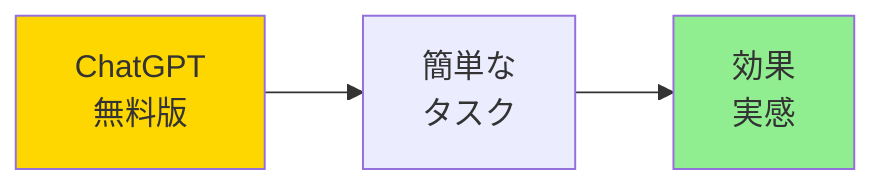

### **Day 4-7：チームで共有**
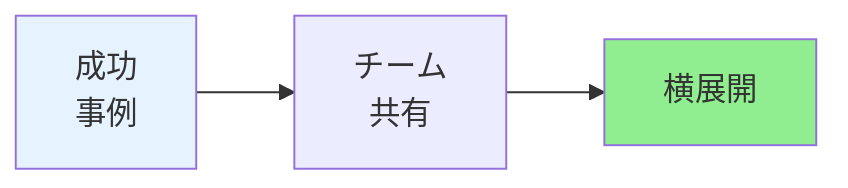

### **Week 2：部門で展開**
- チーム向けプランの検討
- 共通ルール策定
- 定期勉強会開始

### **Month 2：成果測定**
- KPI設定と追跡
- ROI算出
- 次期投資判断

---

# **Q&A：よくある質問**

## **現場からの疑問に答える**

### **Q: セキュリティは大丈夫？**
**A:** エンタープライズプランならデータ保護完備。まずはTeamプランで公開情報から開始。

### **Q: 部下に使わせるには？**
**A:** 自分が成功事例を作る → 効果を数値化 → 「楽になる」を実感させる

### **Q: 費用承認が通らない**
**A:** 個人プランで実証 → 削減時間を金額換算 → 投資提案書作成

### **Q: どのツールから始めるべき？**
**A:** ChatGPT Plus（$20）→ 効果確認 → Cursor → v0 の順で拡大

### **Q: 失敗したらどうする？**
**A:** 月額課金なので即解約可能。リスクは最小限。

---

<!-- _class: ending -->
# **組織の未来は、今日から変わる**

## **あなたが起こす変革の波**

### **覚えておくべき3つの真実**

### **1. ツールは道具、指揮者はあなた**
### **2. 完璧より実践、明日を待たず今から**
### **3. 一人の成功が、組織を変える**

---

# **本日の講義を終えて**

## **今日からあなたは変わる**

### **サポート体制**
- **Slack**：即座に質問OK
- **オフィスアワー**：毎日10:00-19:00
- **相互サポート**：受講者同士での助け合い

### **最後のメッセージ**
> **「最初の一歩が、最も大きな一歩」**
>
> 今日からのあなたの挑戦が、
> 来月の部門の成功につながり、
> 来年の組織の競争力になる。
>
> **一緒に、未来を作りましょう。**

**第2回講義でお会いしましょう！**
**頑張れ、Vibe Coders！** 🚀