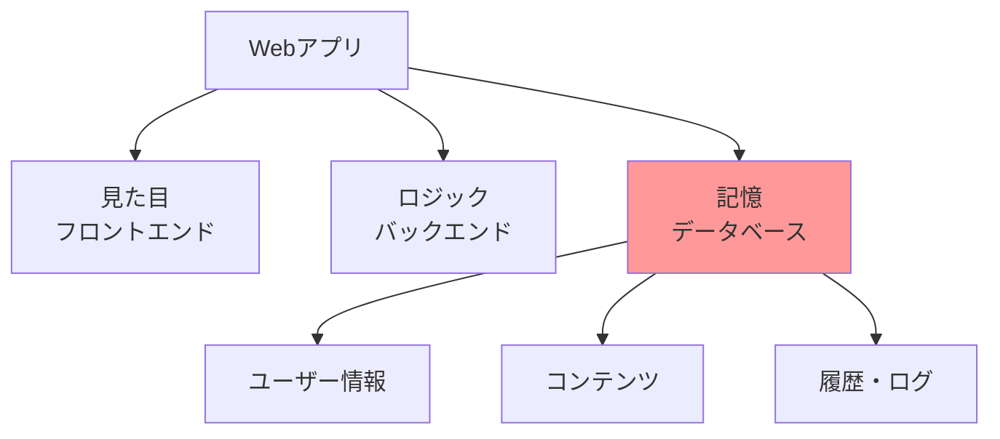
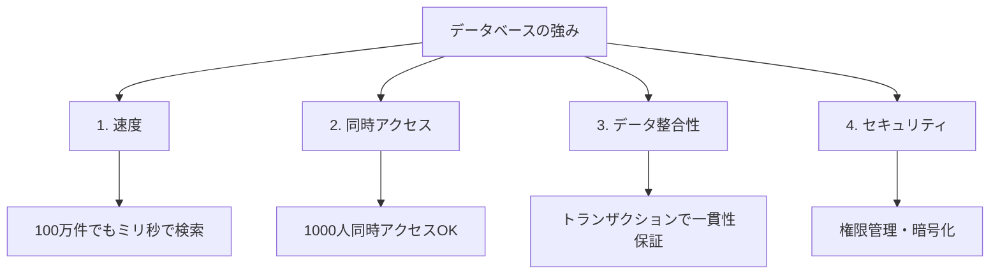
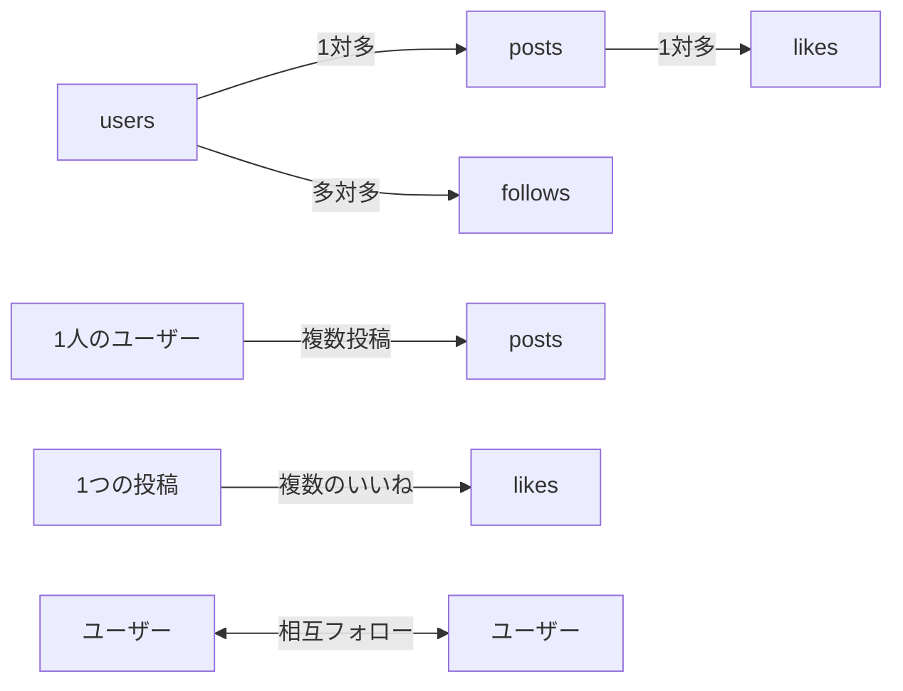
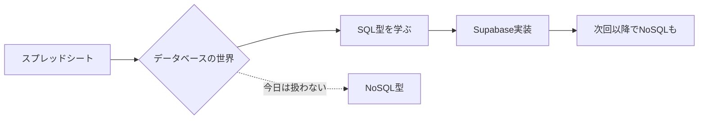
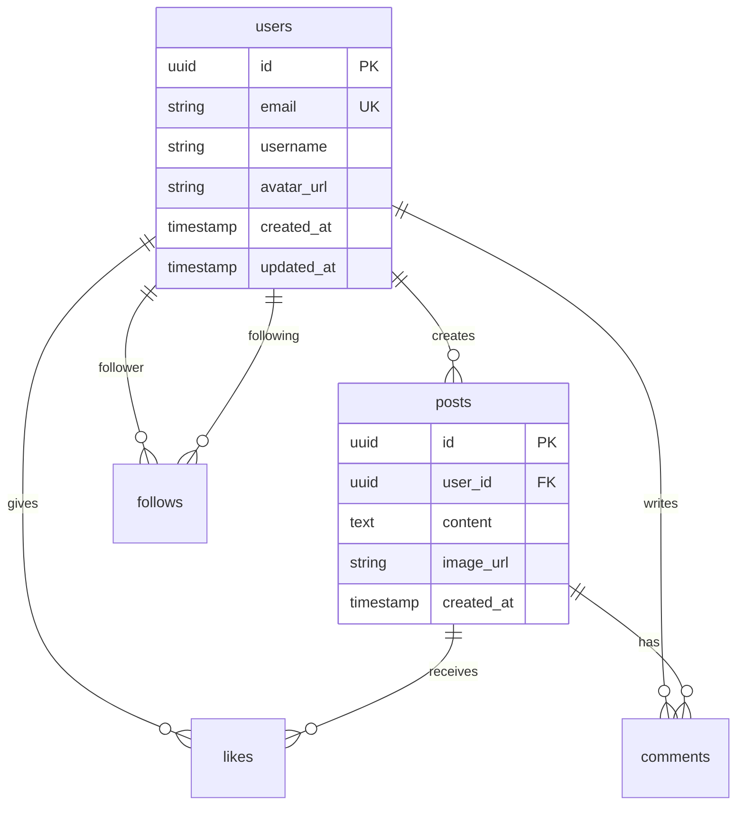

# **第三回 - Session 1**
## DB基礎とSupabase実装
### 〜AIと対話しながらデータの魂を吹き込む〜

**TEKION Group - VibeCoder育成プログラム**
**2025年9月版**

---

# 本日のゴール 🎯

## **「データの記憶装置」を理解し、実装する**

### 3つの段階的アプローチ

1. **触って理解する** 📊
   - スプレッドシートでDB概念を体感
   - VLOOKUPでリレーションを実体験

2. **AIに設計させる** 🤖
   - 要件定義→ER図を10秒で生成
   - SQL不要、日本語で指示するだけ

3. **実装して動かす** 🚀
   - Supabaseで本番DB構築（30分）
   - RLSでセキュリティも万全に

---

# そもそもデータベースとは？ 🤔

## **一言で言うと：「整理された情報の保管庫」**

### 身近な例で理解しよう

あなたは普段、こんなことをしていませんか？

| やっていること | 実はこれが... |
|-------------|------------|
| 📱 スマホの連絡先で友達の電話番号を管理 | データベース |
| 📅 Googleカレンダーで予定を記録 | データベース |
| 💰 家計簿アプリで支出を記録 | データベース |
| 📚 読書記録アプリで本を管理 | データベース |

**驚きの事実：これらすべて「データベース」を使っています！**

---

# データベースの定義 📖

## **データベース = 「情報を整理して保存し、必要な時に取り出せるようにした仕組み」**

### 3つの重要な要素

1. **整理（Structure）**
   - データを決まった形式で保存
   - 例: 名前、電話番号、住所を分けて管理

2. **保存（Storage）**
   - データを消えないように保管
   - 何度でも取り出せる

3. **検索（Retrieval）**
   - 必要な情報をすぐに見つけられる
   - 例: 「山田さんの電話番号は？」→ 即座に表示

---

# なぜ今「データベース」を学ぶのか？ 💡

## **答え：すべてのWebアプリはデータベースで動いているから**

### 実例で見るデータベースの役割

| アプリ | データベースが管理しているもの |
|-------|---------------------------|
| **Instagram** | 📸 写真、❤️ いいね、👥 フォロー、💬 コメント |
| **Amazon** | 📦 商品情報、📊 在庫、🛒 注文履歴、⭐ レビュー |
| **Netflix** | 🎬 動画メタデータ、📺 視聴履歴、🎯 おすすめ |
| **銀行アプリ** | 💳 残高、📝 取引履歴、💸 送金記録 |



**重要な気づき：**
- アプリの見た目（フロントエンド）は氷山の一角
- 裏側には膨大なデータベースが存在
- **データベースなしでは何も保存できない＝アプリとして成立しない**

---

# メモ帳 vs データベース 📝

## **具体例：ユーザー管理を比較**

### ❌ メモ帳の場合

```text
山田太郎さんの電話番号は090-1234-5678
田中花子さんの電話番号は080-9876-5432
山田太郎さんの住所は東京都渋谷区...
田中花子さんのメールはtanaka@example.com
山田太郎さんのメールはyamada@example.com
```

**問題点：**
- 🔍 検索が大変（全部読まないと見つからない）
- 📋 重複しやすい（山田太郎さんの情報が散らばる）
- ✏️ 更新が漏れる（電話番号を変更し忘れる）
- 🔗 データの関連性が分からない

---

### ✅ データベースの場合

```
[ユーザーテーブル]
ID | 名前      | 電話番号        | メール                | 住所
1  | 山田太郎  | 090-1234-5678  | yamada@example.com   | 東京都渋谷区...
2  | 田中花子  | 080-9876-5432  | tanaka@example.com   | 神奈川県横浜市...
```

**利点：**
- ✅ 検索が簡単（名前で即座に検索）
- ✅ 重複がない（1人1レコード）
- ✅ 更新が確実（1箇所変えれば全体に反映）
- ✅ データの関連付けが可能

---

# では、どうやって学ぶ？ 🎯

## **今日の作戦：3ステップアプローチ**

### Step 1: 身近なツールで体感（スプレッドシート）
**なぜスプレッドシート？**
- ✅ 誰でも使ったことがある
- ✅ 視覚的に理解できる
- ✅ データベースの基本概念が同じ

### Step 2: 限界を知る
- スプレッドシートでは実現できないことを体験
- 本物のデータベースが必要な理由を理解

### Step 3: 本物のDBを触る（Supabase）
- プロが使うツールを30分で実装
- AIに手伝ってもらうから簡単

**準備はOK？では始めましょう！**

---

# 1. 宿題レビュー 🎨

## **あなたのアプリが「見た目」を手に入れた**

### 前回の宿題
- ✅ フロントエンド完成
- ✅ GitHubへのコミット・プッシュ
- ✅ `npm run dev` で動作確認

### 共有タイム（3名程度）
- UIデザインの工夫点
- 実装で苦労した箇所
- AIとの対話で学んだこと

> **今はまだハリボテ状態...**
> **今日ここに「魂（データ）」を吹き込んでいく！**

---

# 2. スプレッドシートでDB概念を体感する 📊

## **なぜ最初にスプレッドシート？**

### 理由1: すでに「データベース」を使っている
- Excelやスプレッドシートは「簡易データベース」
- あなたはすでに基本概念を知っている！

### 理由2: 視覚的に理解できる
- 表形式 = データベースの基本構造
- 行と列 = レコードとフィールド

### 理由3: 限界を知るため
- 実際に触って「ここが不便！」を体験
- 本物のDBの必要性を実感

---

# 今から作るもの：SNSアプリのデータベース 🛠️

## **管理するデータ**

1. **ユーザー情報** - 誰が使っているか
2. **投稿** - 誰が何を投稿したか
3. **いいね** - 誰がどの投稿を気に入ったか
4. **フォロー関係** - 誰が誰をフォローしているか

**この構造は Instagram や Twitter と同じ！**

---

# スプレッドシートの限界も体感する ⚠️

## **実例：規模が大きくなったら？**

### 初期（100人のユーザー）
- ✅ 動作する
- ✅ 誰でも理解できる
- ✅ 無料

### 成長期（1万人のユーザー、10万投稿）
- ❌ ファイルを開くのに**3分**かかる
- ❌ 同時編集で**データが壊れる**
- ❌ 誤操作で**全データ消失**のリスク
- ❌ **パスワードが丸見え**（セキュリティ皆無）

---

# データベースの４つの優位性 💪



---

# データベース基礎用語 📚

## **基本用語をスプレッドシートで理解**

| データベース用語 | スプレッドシートでの対応 | 説明 |
|:--------------|:-------------------|:-----|
| **データベース** | ファイル全体 (`.xlsx`) | プロジェクトの全データを格納する箱 |
| **テーブル** | シート | `users`や`posts`といったデータの種類ごとの表 |
| **レコード（行）** | 行 | 1人のユーザー、1つの投稿といった個々のデータ |
| **カラム（列）** | 列 | `name`, `email`, `content`等の属性 |
| **主キー** | ID列 | `user_id`, `post_id`等（重複しない識別子） |
| **外部キー** | 他シート参照 | `posts`の`user_id` → `users`の`user_id` |

---

# ハンズオン演習 🙌

## **実際にSNSアプリのDBをスプレッドシートで作ってみよう！**

### 準備
1. Google スプレッドシートを新規作成
2. ファイル名：「SNSアプリ_データベース演習」
3. 以下の4つのシートを作成：
   - `users`（ユーザー情報）
   - `posts`（投稿）
   - `likes`（いいね）
   - `follows`（フォロー関係）

**これから一緒に作っていきます！**

---

# シート1：users（ユーザー情報） 👥

## **実際に入力してみよう**

| user_id | email | username | avatar_url | created_at |
|---------|-------|----------|------------|------------|
| 1 | yamada@example.com | yamada_taro | https://... | 2025-01-01 10:00 |
| 2 | tanaka@example.com | tanaka_hanako | https://... | 2025-01-02 11:00 |
| 3 | sato@example.com | sato_jiro | https://... | 2025-01-03 09:00 |

### ポイント解説
- **user_id**: 絶対に重複しない番号（主キー）
- **email**: ログイン時の識別子（ユニーク制約）
- **username**: 表示名（変更可能）
- **created_at**: いつ登録したか（監査ログ）

---

# シート2：posts（投稿） 📝

## **投稿データを追加**

| post_id | user_id | content | image_url | created_at |
|---------|---------|---------|-----------|------------|
| 1 | 1 | おはようございます！今日も一日頑張りましょう💪 | null | 2025-01-10 08:00 |
| 2 | 2 | カフェでコーヒータイム☕️ | https://... | 2025-01-10 10:30 |
| 3 | 1 | プログラミング楽しい！#VibeCoder | null | 2025-01-10 14:00 |
| 4 | 3 | 初投稿です。よろしくお願いします！ | null | 2025-01-10 15:00 |
| 5 | 2 | 夕焼けが綺麗でした🌅 | https://... | 2025-01-10 18:00 |

---

# リレーション（関連）を理解する 🔗

## **VLOOKUPで投稿者名を表示してみよう**

### postsシートのF列に以下を追加：

```excel
=VLOOKUP(B2, users!A:C, 3, FALSE)
```

### 結果

| post_id | user_id | content | ... | 投稿者名 |
|---------|---------|---------|-----|----------|
| 1 | 1 | おはよう... | ... | yamada_taro |
| 2 | 2 | カフェで... | ... | tanaka_hanako |

**これがリレーション！** user_idで2つのテーブルが繋がっている

---

# シート3：likes（いいね） ❤️

## **誰がどの投稿にいいねしたか**

| like_id | user_id | post_id | created_at |
|---------|---------|---------|------------|
| 1 | 2 | 1 | 2025-01-10 08:30 |
| 2 | 3 | 1 | 2025-01-10 08:45 |
| 3 | 1 | 2 | 2025-01-10 11:00 |
| 4 | 3 | 2 | 2025-01-10 11:30 |
| 5 | 1 | 4 | 2025-01-10 15:15 |
| 6 | 2 | 3 | 2025-01-10 15:30 |

### 集計してみよう（COUNTIF関数）
```excel
=COUNTIF(likes!C:C, A2)  // 各投稿のいいね数
```

---

# シート4：follows（フォロー関係） 👥

## **誰が誰をフォローしているか**

| follow_id | follower_id | following_id | created_at |
|-----------|-------------|--------------|------------|
| 1 | 1 | 2 | 2025-01-05 10:00 |
| 2 | 1 | 3 | 2025-01-06 11:00 |
| 3 | 2 | 1 | 2025-01-07 09:00 |
| 4 | 3 | 1 | 2025-01-07 14:00 |
| 5 | 3 | 2 | 2025-01-08 16:00 |
| 6 | 2 | 3 | 2025-01-09 10:00 |

### 解釈の仕方
- **follower_id = 1, following_id = 2**
  → 「山田太郎が田中花子をフォロー」

---

# データの関連性を可視化 📊



### リレーションの種類
- **1対1**: ユーザー ⟷ プロフィール詳細
- **1対多**: ユーザー → 投稿（1人が複数投稿）
- **多対多**: ユーザー ⟷ ユーザー（フォロー関係）

---

# 3. データベースの2大勢力：SQL vs NoSQL 🥊

## **本物のデータベースに進む前に知っておくべきこと**

スプレッドシートから卒業すると、2つの選択肢があります：

1. **SQLデータベース** - 「きっちり型」
2. **NoSQLデータベース** - 「ゆるふわ型」

**今日はこの違いを、スプレッドシートで例えて理解しましょう！**

---

# SQL vs NoSQL：スプレッドシートで理解する 📊

## **例：Instagramのような投稿アプリを作る**

### パターン1：SQL型（スプレッドシートの延長）

```
シート1: users
| id | name      | email              |
|----|-----------|-------------------|
| 1  | 山田太郎  | yamada@example.com |
| 2  | 田中花子  | tanaka@example.com |

シート2: posts
| id | user_id | content           | created_at |
|----|---------|-------------------|------------|
| 1  | 1       | 今日は良い天気！  | 2025-01-10 |
| 2  | 2       | ランチなう        | 2025-01-10 |
```

**特徴：**
- ✅ **きっちり整理** - 必ず列が決まっている
- ✅ **関連性が明確** - user_idで誰の投稿か分かる
- ❌ **自由度が低い** - 新しい項目を追加しづらい

---

### パターン2：NoSQL型（JSONファイルの集まり）

```json
// ユーザー1のデータ（全部まとめて）
{
  "id": 1,
  "name": "山田太郎",
  "email": "yamada@example.com",
  "posts": [
    {
      "id": 1,
      "content": "今日は良い天気！",
      "created_at": "2025-01-10",
      "images": ["photo1.jpg", "photo2.jpg"],
      "location": "東京タワー"
    }
  ],
  "favorites": ["ラーメン", "旅行", "写真"]
}

// ユーザー2のデータ（構造が違ってもOK！）
{
  "id": 2,
  "name": "田中花子",
  "posts": [
    {
      "id": 2,
      "content": "ランチなう",
      "hashtags": ["#ランチ", "#おしゃれカフェ"]
      // created_atがなくてもOK！
    }
  ]
  // favoritesがなくてもOK！
}
```

**特徴：**
- ✅ **自由度が高い** - 項目は自由に追加・削除OK
- ✅ **階層構造** - ネスト（入れ子）で関連データをまとめる
- ❌ **検索が複雑** - 「いいねが10個以上の投稿」を探すのが大変

---

# 比較表：どっちを選ぶ？ 🤔

## **6つの観点で比較**

| 観点 | SQL（例：Supabase） | NoSQL（例：Firebase） |
|-----|-------------------|---------------------|
| **1. データ構造** | 📋 表形式（スプレッドシート型）<br>「users」「posts」などテーブルで分離 | 📦 ドキュメント型（JSON型）<br>関連データをまとめて保存 |
| **2. 自由度** | ❌ 列は事前に定義必須<br>後から変更は大変 | ✅ フィールド自由追加OK<br>柔軟に変更可能 |
| **3. 検索能力** | ✅ 複雑な検索が得意<br>「30代の東京在住で投稿数10件以上」もSQL一発 | ❌ 複雑な検索は苦手<br>事前にインデックス設計が必要 |
| **4. データの整合性** | ✅ 厳格なルール<br>「存在しないユーザーの投稿」は作れない | ⚠️ ゆるい<br>アプリ側で整合性を保つ必要あり |
| **5. 学習難易度** | ⚠️ SQL文法を学ぶ必要<br>（でもAIが書いてくれる！） | ✅ JavaScriptっぽく書ける<br>初心者フレンドリー |
| **6. 得意分野** | 📊 データ分析<br>📈 ビジネスアプリ<br>💳 金融システム | 📱 リアルタイムチャット<br>🎮 ゲームスコア<br>📍 位置情報アプリ |

---

# 具体例で理解：同じアプリを作る場合 🏗️

## **SNSアプリ「MiniTwitter」を作る**

### 必要な機能
1. ユーザー登録・ログイン
2. 投稿機能（テキスト・画像）
3. いいね機能
4. フォロー機能
5. タイムライン表示

---

## ケース1：SQL（Supabase）で実装

```sql
-- 複雑な検索もSQL一発！
-- 「フォローしている人の投稿を、いいね数順に取得」
SELECT
  posts.*,
  users.name,
  COUNT(likes.id) as like_count
FROM posts
JOIN users ON posts.user_id = users.id
JOIN follows ON follows.following_id = users.id
LEFT JOIN likes ON likes.post_id = posts.id
WHERE follows.follower_id = 1  -- ログインユーザー
GROUP BY posts.id
ORDER BY like_count DESC
LIMIT 20;
```

**メリット：**
- ✅ 複雑な条件でも1つのクエリで取得
- ✅ データの整合性が保証される
- ✅ 分析しやすい（管理画面で集計など）

**デメリット：**
- ❌ SQL文法を理解する必要がある（AIが助けてくれる）
- ❌ テーブル設計が重要（後から変更が大変）

---

## ケース2：NoSQL（Firebase）で実装

```javascript
// Firebaseでタイムライン取得
const timeline = [];

// 1. フォローしているユーザーを取得
const follows = await db.collection('follows')
  .where('follower_id', '==', currentUserId)
  .get();

// 2. それぞれのユーザーの投稿を取得（ループが必要）
for (const follow of follows.docs) {
  const posts = await db.collection('posts')
    .where('user_id', '==', follow.data().following_id)
    .orderBy('created_at', 'desc')
    .limit(10)
    .get();

  timeline.push(...posts.docs);
}

// 3. いいね数でソート（クライアント側で処理）
timeline.sort((a, b) => b.like_count - a.like_count);
```

**メリット：**
- ✅ JavaScriptで書ける（親しみやすい）
- ✅ リアルタイム同期が簡単
- ✅ テーブル設計が不要（柔軟）

**デメリット：**
- ❌ 複数回のクエリが必要（遅い可能性）
- ❌ クライアント側で処理が増える
- ❌ 複雑な検索は実装が大変

---

# 実際のサービスはどっちを使ってる？ 🌐

## **有名サービスの選択**

### SQLを使っているサービス

| サービス | 理由 |
|---------|------|
| **Instagram** | 複雑な検索（ハッシュタグ、位置情報など） |
| **Twitter** | リアルタイムフィード、トレンド分析 |
| **Amazon** | 在庫管理、注文処理（整合性が最重要） |
| **GitHub** | コード検索、Issue管理 |

---

### NoSQLを使っているサービス

| サービス | 理由 |
|---------|------|
| **Discord** | リアルタイムチャット |
| **Uber** | 運転手の位置情報（頻繁に更新） |
| **Netflix** | ユーザーごとの視聴履歴（構造が多様） |
| **Spotify** | プレイリスト、おすすめ曲（柔軟性） |

---

### 両方使っているサービス

| サービス | 使い分け |
|---------|---------|
| **YouTube** | SQL（動画メタデータ）+ NoSQL（コメント、再生履歴） |
| **Facebook** | SQL（友達関係）+ NoSQL（メッセージ） |
| **Airbnb** | SQL（予約管理）+ NoSQL（検索ログ） |

---

# じゃあ初心者はどっちを選ぶべき？ 🎯

## **結論：まずはSQLから始めるのがオススメ！**

### 理由1：汎用性が高い
```
SQL学習 → どのデータベースでも応用可能
- PostgreSQL（Supabase）
- MySQL
- SQLite
- SQL Server
```

### 理由2：AIが助けてくれる
```
従来：SQL文法暗記に数ヶ月
↓
AI時代：「こういうデータが欲しい」と言えば即生成
```

### 理由3：就職・転職に有利
- 企業の90%以上がSQLデータベースを使用
- データ分析の必須スキル
- NoSQLより求人が多い

---

# でも、NoSQLも後で学ぶべき！ 📚

## **こんな時はNoSQLが最適**

### ケース1：リアルタイムチャットアプリ

```javascript
// Firebaseなら3行でリアルタイム同期
db.collection('messages').onSnapshot((snapshot) => {
  snapshot.docChanges().forEach((change) => {
    if (change.type === 'added') {
      displayMessage(change.doc.data());
    }
  });
});
```

**SQLだと大変！** WebSocketやPollingの実装が必要

---

### ケース2：IoTデバイスのログ

```json
// センサーデータ（構造が不定期に変わる）
{
  "device_id": "sensor_001",
  "timestamp": "2025-01-10T10:00:00Z",
  "temperature": 23.5,
  "humidity": 60,
  "new_sensor_added": 1234  // 突然追加されてもOK！
}
```

---

# 今日の選択：Supabase（SQL）を学ぶ理由 💡

## **なぜ今日はSupabaseなのか？**

### 1. Vibe Coderに最適

```
❌ 従来：SQL文法を覚える → 実装
✅ Vibe Coder：AIに生成させる → 即実装

→ SQLの「検索能力の高さ」だけを享受できる！
```

---

### 2. 学習効率が良い

```
Supabase（PostgreSQL）を学ぶ
→ 他のSQLデータベースも理解できる
→ NoSQLは「別の考え方」として後から学べる
```

---

### 3. プロダクション対応

```
Supabase = PostgreSQL（世界標準）
- スタートアップ → 上場企業まで使われる
- 無料枠でも本格的な機能
- スプレッドシートのような制限なし
```

---

### 4. 認証・ストレージも統合

```
Supabase = データベース + 認証 + ファイル保存
Firebase = 同様の統合サービス

→ 今日学べば、Firebaseへの移行も簡単！
```

---

# まとめ：SQL vs NoSQL 🎓

## **覚えるべきポイント**

| 項目 | SQL | NoSQL |
|-----|-----|-------|
| **イメージ** | きっちり型のスプレッドシート | 自由度の高いJSON |
| **得意なこと** | 複雑な検索・分析 | リアルタイム・柔軟性 |
| **学習順序** | ✅ **まずこっち** | その後で学ぶ |
| **代表例** | Supabase, PostgreSQL | Firebase, MongoDB |

---

## **今日の学習フロー**



---

# 次のステップ：SQLの世界へ 🚀

**では、SQLとは具体的に何なのか？**
**どうやって使うのか？**

次のセクションで詳しく見ていきましょう！

---

# 4. SQLとは何か？ 📝

## **スプレッドシート → SQLへの進化**

### スプレッドシートでの操作

```excel
1. データを見る → シートを開く
2. 検索する → Ctrl+F
3. 並び替え → メニューから選択
4. 集計する → SUM関数
```

---

### SQLでの操作

```sql
1. データを見る → SELECT * FROM users
2. 検索する → WHERE name = '山田'
3. 並び替え → ORDER BY created_at DESC
4. 集計する → COUNT(*), SUM(price)
```

**気づき：やりたいことは同じ！SQLは「命令の言い方」が違うだけ**

---

# でも今日はSQLを書かない！ 🤖

## **なぜ？**

### ❌ 従来の学習方法（非効率）

```sql
-- 文法を暗記...
-- JOIN句の種類を覚える...
-- GROUP BYの使い方を練習...
-- サブクエリの書き方を学ぶ...
```

**問題点：**
- 学習に**数ヶ月**かかる
- 使わない知識も多い
- **忘れやすい**

---

### ✅ Vibe Coderの方法（効率的）

```markdown
「ユーザーごとの投稿数を多い順に表示するSQLを書いて」
→ AIが即座に生成！
```

**メリット：**
- **即座に**使える
- 必要な時に必要な分だけ
- **最新のベストプラクティス**を反映

---

# 今日のスタンス 💡

## **「SQLって何ができるか」だけ理解する**

- ✅ SQLの**概念**を知る
- ✅ SQLの**できること**を理解する
- ❌ SQL文法は暗記しない（AIに任せる）

**必要な時に必要な分だけ学ぶ - これがVibe Coderの極意！**

---

# SQLとは何か？ 📝

## **データベースと対話するための共通言語**

### SQL (Structured Query Language) の基本

**SQLとは：**
- データベースに命令を出すための**専門言語**
- でも実は**英語に近い**シンプルな文法
- 世界中のデータベースで使える**共通語**

### 身近な例で理解するSQL

| 日常の要求 | SQL命令 |
|-----------|--------|
| 「山田さんの情報を見せて」 | `SELECT * FROM users WHERE name = '山田'` |
| 「新しいユーザーを登録して」 | `INSERT INTO users VALUES (...)` |
| 「田中さんのメールアドレスを変更して」 | `UPDATE users SET email = '...'` |
| 「退会したユーザーを削除して」 | `DELETE FROM users WHERE id = 1` |

---

# SQLの4大操作（CRUD） 🔧

## **データベース操作の基本動詞**

### CRUD = Create, Read, Update, Delete

```sql
-- 1. CREATE (作成) - 新しいデータを追加
INSERT INTO posts (user_id, content)
VALUES (1, '今日は良い天気です');

-- 2. READ (読み取り) - データを取得
SELECT * FROM posts WHERE user_id = 1;

-- 3. UPDATE (更新) - データを変更
UPDATE posts SET content = '編集しました' WHERE id = 1;

-- 4. DELETE (削除) - データを削除
DELETE FROM posts WHERE id = 1;
```

**覚え方：** 日常会話と同じ！
- 「〜を追加して」→ INSERT
- 「〜を見せて」→ SELECT
- 「〜を変更して」→ UPDATE
- 「〜を削除して」→ DELETE

---

# AIにSQLを生成させる実例 💡

## **実際のプロンプトと生成結果**

### プロンプト例1：シンプルな検索
```markdown
「山田太郎さんの全投稿を新しい順に取得するSQL」
```

**AIが生成：**
```sql
SELECT p.*, u.name
FROM posts p
JOIN users u ON p.user_id = u.id
WHERE u.name = '山田太郎'
ORDER BY p.created_at DESC;
```

### プロンプト例2：集計処理
```markdown
「今月最も人気のある投稿TOP10を取得するSQL」
```

**AIが生成：**
```sql
SELECT p.*, COUNT(l.id) as like_count
FROM posts p
LEFT JOIN likes l ON p.id = l.post_id
WHERE p.created_at >= DATE_TRUNC('month', CURRENT_DATE)
GROUP BY p.id
ORDER BY like_count DESC
LIMIT 10;
```

---

# スプレッドシートの限界を実感 ⚠️

## **実際に起こる問題**

### 問題1：速度
```excel
投稿が10万件になったら？
→ VLOOKUPが1つ実行されるのに1秒
→ 100個のVLOOKUP = 100秒待機
```

### 問題2：同時編集
```
ユーザーA: 行100を編集中
ユーザーB: 行100を削除
→ データ消失！
```

### 問題3：セキュリティ
```
全員が全シートを見られる
→ パスワード、個人情報が丸見え
```

---

# スプレッドシート vs データベース 🥊

| 観点 | スプレッドシート | データベース |
|------|--------------|------------|
| **データ量** | 〜1万行が限界 | 数億行でもOK |
| **速度** | 1万行で遅延発生 | インデックスでミリ秒検索 |
| **同時アクセス** | 10人程度 | 数千人〜数万人 |
| **データ整合性** | 手動管理（ミス多発） | 自動制約（FOREIGN KEY等） |
| **セキュリティ** | 全員が全データ閲覧可 | 行レベルで権限制御（RLS） |
| **料金** | 無料 | 無料枠あり〜月額課金 |
| **学習コスト** | 低（誰でも使える） | 中（SQL学習が必要） |

**結論：** プロトタイプはスプレッドシート、本番はDB！

---

# 5. AIによるDB設計 🤖

## **要件定義書からER図を自動生成**

### なぜAIを使うのか？

#### 従来の方法（手動設計）
1. 要件を読み込む（30分）
2. エンティティを抽出（30分）
3. 属性を定義（1時間）
4. リレーションを設計（1時間）
5. ER図を作成（30分）
6. **SQL文を手書き（1時間）**
**合計：4時間30分**

#### AI駆動の方法
1. 要件定義書をAIに投げる（1分）
2. ER図の自動生成（30秒）
3. **SQLも自動生成（30秒）**
4. 人間がレビュー・修正（10分）
**合計：12分（22倍高速！）**

---

# 実演：CursorでER図を生成 💻

## **プロンプト例**

```markdown
以下のシステム要件定義書を基に、
データベースのER図をMermaid記法で作成してください。

要件：
- SNSアプリケーション
- ユーザー登録・ログイン機能
- 投稿機能（テキスト・画像）
- いいね機能
- フォロー機能
- コメント機能

各テーブルには以下を含めてください：
- 主キー（id）
- 作成日時（created_at）
- 更新日時（updated_at）
- 必要な外部キー
```

---

# AIが生成したER図（例） 🎨



---

# 命名規則の重要性 📝

## **統一されたルールがチーム開発を救う**

### テーブル名
- **複数形**を使う: `users`, `posts`, `comments`
- **snake_case**: `user_profiles`, `post_images`

### カラム名
- **主キー**: 単純に`id`（`user_id`ではない）
- **外部キー**: `参照先_id` (例: `user_id`, `post_id`)
- **日時**: `_at`で終わる（`created_at`, `deleted_at`）
- **フラグ**: `is_`で始まる（`is_active`, `is_verified`）

### なぜ重要？
- AIが生成するコードの精度が上がる
- チーム全員が理解しやすい
- バグの早期発見

---

# 6. Supabaseで実装 🚀

## **なぜSupabaseを選ぶのか？**

### 他の選択肢との比較

| サービス | 種類 | 特徴 | 向いている用途 |
|---------|------|------|--------------|
| **Supabase** | SQL (PostgreSQL) | オールインワン、認証付き | 一般的なWebアプリ |
| **Firebase** | NoSQL | リアルタイム同期 | チャット、ゲーム |
| **PlanetScale** | SQL (MySQL) | スケーラブル | 大規模アプリ |
| **MongoDB Atlas** | NoSQL | 柔軟なスキーマ | ドキュメント型データ |

**復習：** SQL vs NoSQLの詳細は前のセクションで学びました。今日はSupabaseを使います！

---

### Supabaseの圧倒的メリット
✅ 無料枠が充実（500MB、5万ユーザー）
✅ 管理画面でデータ確認・編集可能
✅ 認証機能が組み込み済み(今回はClerk利用)
✅ リアルタイム機能標準装備

---

# Supabaseプロジェクト作成 🎯

## **ステップバイステップガイド**

### 1. アカウント作成
1. [supabase.com](https://supabase.com) にアクセス
2. "Start your project" をクリック
3. GitHubアカウントでサインイン（推奨）

### 2. 新規プロジェクト作成
- **Organization**: 個人名 or チーム名
- **Project name**: `vibe-coder-sns`
- **Database Password**: 強力なパスワード（保存必須！）
- **Region**: Tokyo（東京）を選択
- **Pricing Plan**: Free（無料）

---

# 重要：APIキーの管理 🔑

## **2025年最新：新しいAPIキー体系**

### 新しいキー（2025年7月〜）
- `sb_publishable_...`: 公開可能なキー
- `sb_secret_...`: サーバー専用（秘密）

```env
# .env.local
NEXT_PUBLIC_SUPABASE_URL="https://xxxxx.supabase.co"
NEXT_PUBLIC_SUPABASE_PUBLISHABLE_KEY="sb_publishable_..."

# .env.local（サーバー専用）
SUPABASE_SECRET_KEY="sb_secret_..."
```

---

# APIキー取得方法 📋

## **Supabase Dashboardから取得**

1. **Settings** → **API** に移動
2. 以下をコピー：
   - **Project URL**: `https://xxxxx.supabase.co`
   - **Publishable key**: `sb_publishable_...`（またはanon key）
   - **Secret key**: `sb_secret_...`（またはservice_role key）

### ⚠️ セキュリティ注意事項
- **Secret keyは絶対に公開しない**
- GitHubにコミットしない（.gitignoreで除外）
- フロントエンドコードに書かない
- 定期的にキーをローテーション

---

# Table Editorでテーブル作成 🛠️

## **GUIで簡単テーブル作成**

### 手順
1. Supabase Dashboard → **Table Editor**
2. **New Table** をクリック
3. テーブル名: `users`
4. カラムを追加：

| Column | Type | Default | Constraints |
|--------|------|---------|------------|
| id | uuid | gen_random_uuid() | Primary Key |
| email | text | - | Unique, Not Null |
| username | text | - | Not Null |
| avatar_url | text | - | - |
| created_at | timestamp | now() | Not Null |

---

# AIにテーブル作成を任せる 🤖

## **SQLは書かない、AIに指示する**

### Cursorへの指示例
```markdown
SupabaseのSQL Editorで実行するテーブル作成文を生成してください。

要件：
- usersテーブル：メール、ユーザー名、アバター画像
- postsテーブル：投稿内容、画像URL、投稿者への外部キー
- UUID型の主キー、タイムスタンプ付き
- ユーザー削除時は投稿も削除（CASCADE）
```

### AIが生成したSQLをコピペするだけ！
- SQLの文法を覚える必要なし
- エラーが出たらAIに修正を依頼
- 「こうしたい」を伝えるだけ

---

# リレーションの設定 🔗

## **外部キー制約の重要性**

### なぜ外部キー制約が必要？
1. **データ整合性**: 存在しないユーザーの投稿を防ぐ
2. **カスケード削除**: ユーザー削除時に投稿も自動削除
3. **パフォーマンス**: 自動的にインデックスが作成される

### 設定方法（Table Editor）
1. `posts`テーブルを開く
2. `user_id`カラムの設定を編集
3. **Foreign Key Relation**:
   - Referenced table: `users`
   - Referenced column: `id`
   - On delete: `CASCADE`

---

# 7. RLS（Row Level Security）の設定 🔒

## **データベースレベルのセキュリティ**

### RLSとは？
- **Row Level Security**の略
- 行レベルでアクセス制御
- 「自分のデータしか操作できない」を強制

### なぜ重要？
```javascript
// ❌ アプリケーション側だけの制御は危険
if (user.id === post.user_id) {
  // 削除を許可
}

// ✅ データベース側でも制御（二重の防御）
CREATE POLICY "Users can delete own posts"
ON posts FOR DELETE
USING (auth.uid() = user_id);
```

---

# RLSポリシーの実装 🛡️

## **基本的なポリシー設定**

### 1. RLSを有効化
```sql
ALTER TABLE posts ENABLE ROW LEVEL SECURITY;
ALTER TABLE users ENABLE ROW LEVEL SECURITY;
```

### 2. AIにポリシー作成を指示

**Cursorへの指示：**
```markdown
SupabaseのRLSポリシーを作成してください。

要件：
- postsテーブル
- 誰でも投稿を閲覧可能
- 投稿者本人のみ編集・削除可能
- ログインユーザーのみ新規投稿可能
```

**AIが生成 → SQL Editorにコピペ → 実行！**

---

# RLSポリシーパターン集 📚

## **よく使うポリシーテンプレート**

### よく使うAI指示パターン

#### パターン1：公開コンテンツ
```markdown
「投稿は誰でも見られるが、作成はログインユーザーのみ」
というRLSポリシーを作成して
```

#### パターン2：プライベートデータ
```markdown
「ユーザー設定は本人のみアクセス可能」
というRLSポリシーを作成して
```

**ポイント：日本語で要件を伝えるだけ！**

---

# テストデータの投入 📝

## **開発効率を上げるサンプルデータ**

### AIへの指示
```markdown
Supabaseでテストデータを投入するSQLを作成してください。

- usersテーブルに3人のテストユーザー
- 各ユーザーに日本人っぽい名前
- アバター画像はダミー画像サービスを使用
- postsテーブルに2〜3個の投稿サンプル
- 日本語のカジュアルな投稿内容
```

**生成されたSQL → SQL Editorで実行！**

💡 **ポイント：**
- SQLを書く必要なし
- 「こんなデータが欲しい」を伝えるだけ
- エラーが出たら「このエラーを修正して」

---

# AIが生成したコードの検証方法 ✅

## **動作確認のベストプラクティス**

### 検証の3ステップアプローチ

1. **実データ投入テスト** 📝
2. **GUI確認** 👀
3. **エラーケーステスト** 🚨

---

# ステップ1：実データ投入テスト 📝

## **実際に操作して動作を確認**

### 基本的な流れ
```markdown
1. フロントエンドから実際に投稿
   ↓
2. Supabase Table Editorで確認
   ↓
3. データが正しく入っているか検証
```

### 具体的なチェック項目
- ✅ データが保存されているか
- ✅ 日時が正しく記録されているか
- ✅ user_idが適切に設定されているか
- ✅ 不要なnullがないか

**💡 ポイント：「実際に使ってみる」が最強の検証**

---

# ステップ2：Table EditorでのGUI確認 👀

## **Supabaseの管理画面で視覚的に検証**

### Table Editorの活用方法

1. **データの整合性チェック**
   - 外部キーが正しくリンクしているか
   - 必須フィールドが埋まっているか
   - データ型が適切か

2. **フィルタリング機能で検証**
   ```sql
   -- GUIでフィルタ設定
   user_id = '特定のユーザー'
   created_at > '今日の日付'
   ```

3. **リレーション表示で確認**
   - 関連テーブルのデータも一緒に表示
   - JOINが正しく機能しているか視覚的に確認

---

# ステップ3：エラーケーステスト 🚨

## **あえて間違った操作をして堅牢性を確認**

### テストパターン集

| テスト内容 | 期待される結果 | 確認方法 |
|-----------|---------------|----------|
| 他人の投稿を削除しようとする | エラー（RLS） | コンソールログ確認 |
| 必須項目を空で送信 | エラー（NOT NULL） | エラーメッセージ表示 |
| 存在しないIDを参照 | エラー（外部キー） | Table Editorで確認 |
| 同じメールで重複登録 | エラー（UNIQUE） | 登録画面でテスト |

### エラーログの確認方法
```javascript
// フロントエンドでエラーキャッチ
const { data, error } = await supabase
  .from('posts')
  .delete()
  .eq('id', otherUsersPostId)

if (error) {
  console.error('期待通りのエラー:', error.message)
  // RLSが正しく動作している証拠！
}
```

---

# 検証自動化のテクニック 🤖

## **AIに検証コードも書かせる**

### プロンプト例：検証スクリプト生成
```markdown
Supabaseのpostsテーブルが正しく動作するか
検証するテストコードを作成してください。

以下をテスト：
1. 投稿の作成
2. 自分の投稿の取得
3. 他人の投稿の削除（失敗すること）
4. RLSポリシーの動作確認
```

### AIが生成する検証コード例
```javascript
// 検証用関数
async function validateDatabase() {
  console.log('🧪 DB検証開始...')

  // 1. 投稿作成テスト
  const { data: newPost, error: createError } = await supabase
    .from('posts')
    .insert({ content: 'テスト投稿' })
    .select()

  console.log(createError ? '❌ 作成失敗' : '✅ 作成成功')

  // 2. 取得テスト
  const { data: posts } = await supabase
    .from('posts')
    .select('*')

  console.log(`✅ ${posts.length}件取得`)

  // 3. RLSテスト（あえて失敗させる）
  const { error: deleteError } = await supabase
    .from('posts')
    .delete()
    .eq('user_id', 'other-user-id')

  console.log(deleteError ? '✅ RLS正常動作' : '❌ RLS機能していない')
}
```

---

# リアルタイムで検証する方法 🔄

## **複数タブで同時確認**

### セットアップ
1. **タブ1**: アプリケーション画面
2. **タブ2**: Supabase Table Editor
3. **タブ3**: ブラウザのコンソール

### リアルタイム検証フロー


**メリット：**
- 即座にフィードバック
- 問題の早期発見
- 直感的な理解

---

# トラブルシューティングのコツ 🔧

## **よくある問題と確認ポイント**

### データが保存されない時
```markdown
チェックリスト：
□ RLSが有効になっていないか？
□ ポリシーは正しく設定されているか？
□ 認証トークンは有効か？
□ 必須フィールドは埋まっているか？
```

### Table Editorでの確認手順
1. **Authentication** → ユーザーが存在するか
2. **Database** → テーブル構造は正しいか
3. **Logs** → エラーログはないか
4. **SQL Editor** → 直接SQLで確認

### AIへの相談テンプレート
```markdown
Supabaseで以下の問題が発生しています：

症状：[具体的な症状]
Table Editorで確認したこと：[確認内容]
エラーメッセージ：[あれば貼り付け]

原因と解決方法を教えてください。
```

---

# 従来のデータ確認方法 🔍

## **基本的な3つの確認方法**

### 1. Table Editor（GUI）
- 最も簡単
- データの追加・編集・削除が可能
- フィルタリング・ソート機能付き

### 2. SQL Editor（AIに書かせる）

**Cursorへの指示：**
```markdown
投稿一覧を表示するSQLを作成してください。
投稿内容、投稿者名、投稿日時を
新しい順に表示したいです。
```

**AIが複雑なJOIN文も自動生成！**

### 3. API経由（ブラウザでテスト）
```
https://xxxxx.supabase.co/rest/v1/posts?select=*
```

---

# Supabase Magic: リアルタイム機能 ⚡

## **データの変更を即座に反映**

### リアルタイム機能の用途
- チャットメッセージの即時表示
- いいね数のライブ更新
- オンライン状態の表示
- 共同編集機能

### 有効化方法
1. Dashboard → **Database** → **Replication**
2. テーブルを選択
3. **Enable Replication** をON

```javascript
// フロントエンドでのリアルタイム購読
const channel = supabase
  .channel('posts')
  .on('postgres_changes',
    { event: 'INSERT', schema: 'public', table: 'posts' },
    (payload) => console.log('New post:', payload.new)
  )
  .subscribe()
```

---

# エラー対処法：よくある問題 🚨

## **つまずきポイントと解決策**

### 問題1：RLSでデータが取得できない
```javascript
// エラー: 0 rows returned
const { data } = await supabase.from('posts').select()
```
**解決**: ポリシーを確認、または一時的にRLSを無効化してテスト

### 問題2：外部キー制約エラー
```sql
ERROR: violates foreign key constraint
```
**解決**: 参照先のレコードが存在することを確認

### 問題3：Permission denied
**解決**: APIキーの種類を確認（publishable vs secret）

---

# パフォーマンス最適化 🏎️

## **高速なデータベースを作るコツ**

### 1. インデックスの活用（AIに最適化を依頼）

**Cursorへの指示：**
```markdown
postsテーブルのパフォーマンスを改善したいです。
以下の検索をよく行います：
- 特定ユーザーの投稿一覧
- 最新投稿の取得
- ユーザーIDと日時での絞り込み

適切なインデックスを作成するSQLを生成してください。
```

**AIが最適なインデックス戦略を提案！**

### 2. クエリの最適化
```javascript
// ❌ 非効率：全データ取得後にフィルタ
const posts = await supabase.from('posts').select('*')
const filtered = posts.filter(p => p.user_id === userId)

// ✅ 効率的：DBでフィルタ
const posts = await supabase
  .from('posts')
  .select('*')
  .eq('user_id', userId)
```

---

# バックアップとリカバリ 💾

## **データを失わないために**

### 自動バックアップ（Supabase Pro以上）
- 毎日自動バックアップ
- 7日間保持
- ワンクリックでリストア

### 手動バックアップ（無料プラン）
```bash
# pg_dumpを使用
pg_dump postgresql://[user]:[password]@[host]/[database] > backup.sql

# Supabase CLIを使用
supabase db dump > backup.sql
```

### 開発時のベストプラクティス
1. 本番環境を直接編集しない
2. マイグレーションファイルで変更管理
3. ステージング環境でテスト

---

# 監視とデバッグ 📊

## **問題の早期発見**

### Supabase Dashboard の活用
- **Logs**: SQLクエリログ、エラーログ
- **Performance**: 遅いクエリの特定
- **Database Health**: CPU、メモリ使用率

### デバッグテクニック
```javascript
// クエリの詳細を確認
const { data, error, status, statusText } = await supabase
  .from('posts')
  .select('*')

console.log({
  status,      // HTTPステータスコード
  statusText,  // エラーメッセージ
  error,       // エラー詳細
  data        // 取得データ
})
```

---

# 8. まとめ：本日の成果 🎉

## **できるようになったこと**

### ✅ 概念理解
- データベースの必要性を体感
- スプレッドシートでリレーションを理解
- テーブル設計の基本をマスター

### ✅ 実践スキル
- Supabaseプロジェクトの作成
- Table Editorでのテーブル作成
- RLSによるセキュリティ設定
- リアルタイム機能の有効化

### ✅ AI活用
- 要件定義からER図を自動生成
- SQLクエリをAIで作成

---

# 次のステップ 🚶

## **Session 3-2へ向けて**

### 今回構築したDB基盤の上に...
1. **認証システム**（Clerk）を追加
2. **ユーザーごとのデータ制御**を実装
3. **本格的なCRUD操作**を構築

### 宿題（オプション）
- 自分のプロジェクトのER図を作成
- Supabaseでテーブルを1つ追加
- RLSポリシーを設定してみる

### 重要な準備
📁 **supabase_prompt/**フォルダを確認
→ 次回使用する魔法のプロンプトが入っています！

---

# Q&A タイム 🙋

## **よくある質問**

### Q1: スプレッドシートAPIではダメ？
**A:** 小規模なら可。ただし成長を見据えるならDBが必須

### Q2: FirebaseとSupabaseどっちがいい？
**A:** SQLに慣れたい → Supabase
リアルタイム重視 → Firebase

### Q3: 無料枠で足りる？
**A:** 個人開発なら十分（500MB、5万ユーザーまで）

### Q4: SQLを覚える必要ある？
**A:** 基本だけでOK。複雑なクエリはAIに生成させる

---

# 重要：AI時代の学習スタイル 🤖

## **従来の学習 vs Vibe Coder流**

### 従来のアプローチ
1. SQL文法を暗記（1ヶ月）
2. ER図の書き方を学習（2週間）
3. 正規化理論を勉強（1週間）
4. やっと実装開始...

### Vibe Coder流
1. **概念だけ**理解（今日の90分）
2. **AIにSQL生成**させる
3. **動くものを作る**
4. 必要に応じて深掘り

**結果：** 10倍速で実装、理解も実践を通じて深まる

---

# AIプロンプトの活用例 💡

## **実際に使えるプロンプト集**

### DB設計プロンプト
```
私は[SNSアプリ]を作っています。
以下の機能を実現するためのDB設計を
PostgreSQL用のCREATE TABLE文で生成してください：
- ユーザー登録・ログイン
- 投稿（テキスト・画像）
- いいね機能
- フォロー機能
```

### RLSポリシー生成
```
postsテーブルに以下のRLSポリシーを設定したいです：
- 全員が閲覧可能
- 投稿者本人のみ編集・削除可能
- ログインユーザーのみ新規投稿可能
PostgreSQLのポリシー文を生成してください。
```

---

# 本日のハイライト 🌟

## **3つの重要ポイント**

### 1. 概念の理解
スプレッドシートで**視覚的に**DBの仕組みを理解
→ 「なるほど、こういうことか！」の瞬間

### 2. AIとの協働
要件定義 → ER図 → SQL → RLSまで**AIが生成**
→ 人間は「何を作りたいか」だけ考える

### 3. 実践的なスキル
Supabaseで**実際に動くDB**を30分で構築
→ 理論だけでなく「動くもの」を作れる

**これがVibe Coderの開発スタイル！**

---

# 最後に：データベースは怖くない 😊

## **今日でデータベースマスターの第一歩**

### 覚えておいてほしいこと
- DBは「**整理された情報の保管庫**」
- スプレッドシートの**進化版**
- **AIが複雑な部分を代行**してくれる
- **Supabaseなら30分**で本番環境構築

### 次回予告
**Session 3-2：認証システムとClerk実装**
- ログイン機能を10分で実装
- Google認証の追加
- ユーザーごとのデータ管理

**お疲れ様でした！** 🎊

---

# 付録A：用語集 📖

| 用語 | 説明 | 例 |
|-----|------|-----|
| **データベース（DB）** | データを整理して保存する仕組み | MySQL, PostgreSQL |
| **テーブル** | データを表形式で管理する単位 | users, posts |
| **レコード** | テーブルの1行分のデータ | 1人のユーザー情報 |
| **フィールド/カラム** | テーブルの列（データの項目） | name, email |
| **主キー（PK）** | レコードを一意に識別するID | user_id = 1 |
| **外部キー（FK）** | 他テーブルとの関連を示すID | posts.user_id |
| **SQL** | データベースを操作する言語 | SELECT, INSERT |
| **RLS** | Row Level Security（行レベルセキュリティ） | 自分のデータのみ操作可 |
| **インデックス** | 検索を高速化する仕組み | idx_posts_user_id |
| **トランザクション** | 一連の処理をまとめて実行 | BEGIN...COMMIT |

---

# 付録B：SQLクイックリファレンス 📝

## **AIに指示するパターン集**

### データ取得
```markdown
「全ユーザーを取得するSQL」
「ID=1のユーザーの名前とメールを取得するSQL」
```

### データ追加
```markdown
「山田太郎さんをusersテーブルに追加するSQL」
```

### データ更新
```markdown
「ID=1のユーザーの名前を山田次郎に変更するSQL」
```

### テーブル結合
```markdown
「投稿内容と投稿者名を一覧表示するSQL」
「ユーザーごとの投稿数を集計するSQL」
```

**ポイント：日本語で「何をしたいか」を伝える！**

---

# 付録C：Supabaseトラブルシューティング 🔧

## **よくあるエラーと対処法**

### エラー1：JWT expired
```
原因: トークンの有効期限切れ
対処: ログインし直す or トークンをリフレッシュ
```

### エラー2：Permission denied for schema public
```
原因: RLSポリシーが設定されていない
対処: 適切なポリシーを追加 or RLSを一時無効化
```

### エラー3：relation "table_name" does not exist
```
原因: テーブルが存在しない
対処: テーブル名の確認 or マイグレーション実行
```

---

# 付録D：パフォーマンスチューニング ⚡

## **データベースを高速化するテクニック**

### パフォーマンス改善もAIに相談

**Cursorへの指示例：**

#### 遅いクエリの改善
```markdown
以下のクエリが遅いです。改善方法を教えてください：
[遅いクエリをペースト]
```

#### インデックス最適化
```markdown
usersテーブルでメール検索が遅いです。
アクティブユーザーのみ検索することが多いです。
適切なインデックスを提案してください。
```

#### 実行計画の分析
```markdown
このEXPLAIN ANALYZEの結果を分析して、
ボトルネックと改善案を教えてください：
[実行計画をペースト]
```

**SQLのチューニング知識不要！AIが専門家レベルで分析**

---

# 付録E：セキュリティベストプラクティス 🔐

## **安全なデータベース運用**

### 1. 環境変数の管理
```javascript
// ❌ ダメな例
const url = "https://xxx.supabase.co"

// ✅ 良い例
const url = process.env.NEXT_PUBLIC_SUPABASE_URL
```

### 2. SQLインジェクション対策
```javascript
// ❌ 危険
const query = `SELECT * FROM users WHERE email = '${userInput}'`

// ✅ 安全（Supabaseクライアント使用）
supabase.from('users').select().eq('email', userInput)
```

### 3. 最小権限の原則
- 必要最小限の権限のみ付与
- 定期的な権限レビュー

---

# 付録F：学習リソース 📚

## **さらに学びたい方へ**

### 公式ドキュメント
- [Supabase Docs](https://supabase.com/docs)
- [PostgreSQL Tutorial](https://www.postgresqltutorial.com/)
- [SQL入門](https://www.w3schools.com/sql/)

### 動画教材
- YouTube: "Supabase Crash Course"
- Udemy: "PostgreSQL Bootcamp"

### コミュニティ
- [Supabase Discord](https://discord.supabase.com)
- [PostgreSQL JP User Group](https://www.postgresql.jp/)

### AI活用ツール
- ChatGPT/Claude: SQL生成、エラー解決
- GitHub Copilot: コード補完

---

# 補足：2025年最新情報 🆕

## **Supabase最新アップデート**

### 新APIキー体系（2025年7月〜）
```env
# 従来のキー（2026年末まで有効）
NEXT_PUBLIC_SUPABASE_ANON_KEY="eyJ..."
SUPABASE_SERVICE_ROLE_KEY="eyJ..."

# 新しいキー（推奨）
NEXT_PUBLIC_SUPABASE_PUBLISHABLE_KEY="sb_publishable_..."
SUPABASE_SECRET_KEY="sb_secret_..."
```

### 移行スケジュール（2025年10月時点）
- **2025年11月1日**: 新規プロジェクトは新キー（sb_publishable_...、sb_secret_...）のみ
- **2026年後半**: 旧キー（anon、service_role）完全廃止予定

⚠️ **重要**: 2025年11月以降に新規作成するプロジェクトでは、必ず新しいAPIキー体系を使用してください

### Next.js 15対応
- `@supabase/ssr`パッケージ使用
- 非同期cookiesに対応済み

---

# エンディング：次回への架け橋 🌉

## **Session 3-2 プレビュー**

### 認証システムの実装（Clerk）
- メールアドレス認証
- Google/GitHub OAuth
- マジックリンク認証

### Supabase × Clerk連携
- JWTトークンの連携
- RLSとの統合
- ユーザーデータの同期

### 実装の自動化
🔥 **MASTER_INTEGRATION_PROMPT.md**
→ 30分で全実装が完了する魔法のプロンプト！

**次回もお楽しみに！** 🚀

---

# Thank You! 🙏

## **本日の講義は以上です**

### 質問・相談
- Slackチャンネル: #vibe-coder-db
- メンター: @ryosuke_sensui

### 今日の資料
- スライド: `/docs/3-1_DB基礎とSupabase実装.md`
- 演習ファイル: Google Drive共有
- 録画: 後日Slack配信

### 宿題（任意）
1. 自分のアプリのER図作成
2. Supabaseでテーブル追加
3. RLSポリシー設定

**Great job today! You're becoming a true Vibe Coder!** 🎊