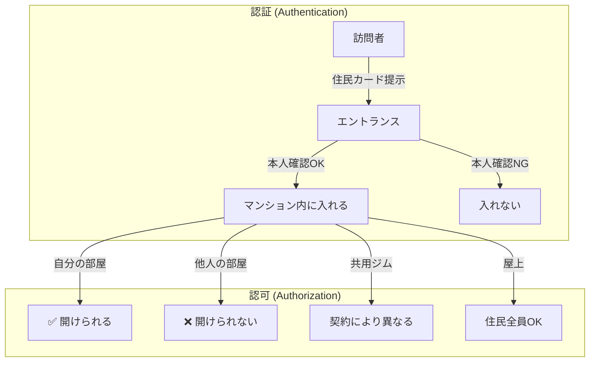
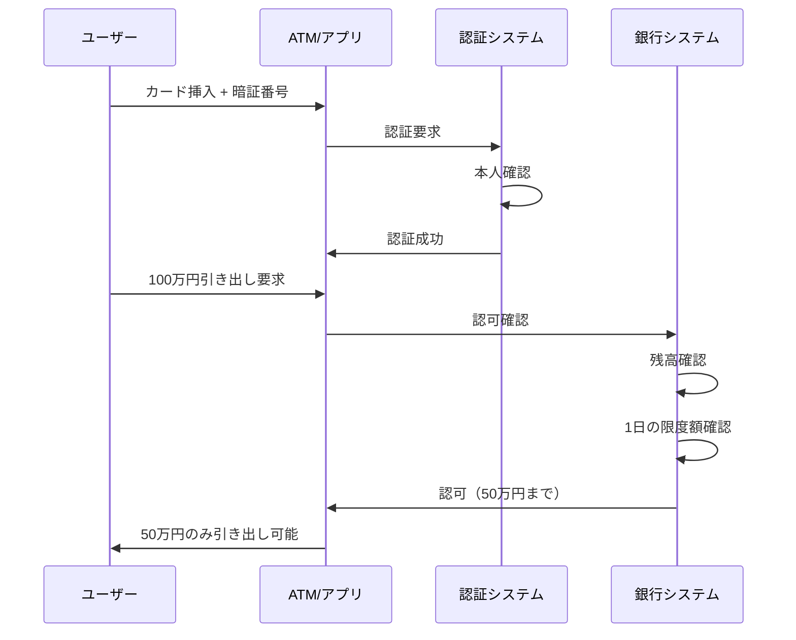
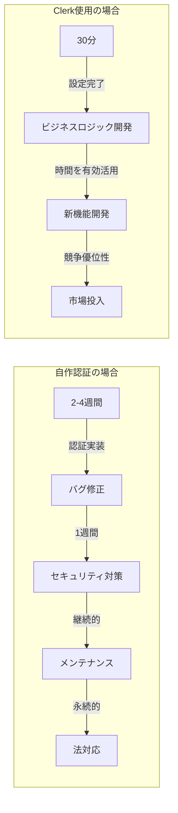
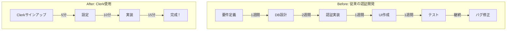
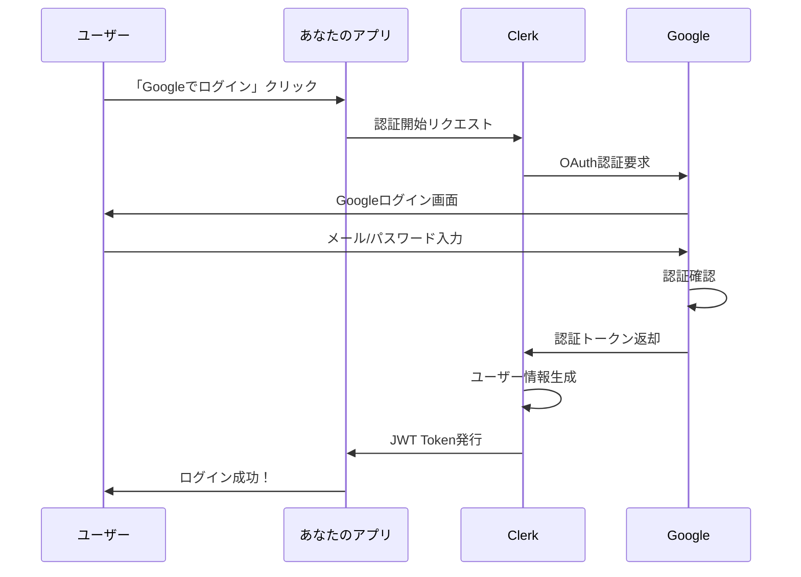
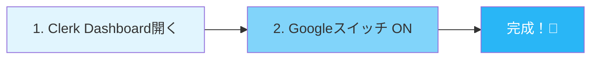
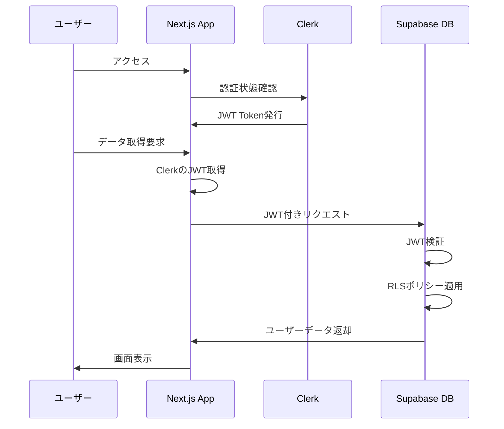

# **第三回 Session 2**
## 認証・認可基礎とClerk実装

**～AIエージェント時代の「信頼」を構築する～**

**Vibe Coder Bootcamp**
**2025年9月版**

---

# 本日のアジェンダ (75分間)

1. **認証・認可の基礎知識 (20分)**
   - 認証と認可の違い：「身元確認」と「権限管理」
   - なぜ認証を自作してはいけないのか？
   - 現代認証システムの要件とトレンド

2. **Clerk概論とGoogle認証設定 (25分)**
   - ClerkがもたらすUX革命
   - 2025年最新：開発環境での簡単設定
   - OAuth 2.0フローの理解

3. **AIで認証実装（完全理解版）(25分)**
   - Clerk AI Promptsで5分実装
   - 用語と設定項目の完全理解
   - エラー対処とトラブルシューティング

4. **Clerk + Supabase連携アーキテクチャ (5分)**
   - JWT連携の仕組み
   - RLS（Row Level Security）との統合

---

# 🎯 今日の学習目標

## 技術的ゴール
- 認証と認可の概念を完全理解
- Clerkによる「超」簡単認証実装
- 現代的なJWT認証フローの習得

## ビジネス価値
- なぜ多くのスタートアップが認証で失敗するのかを理解
- AI時代に対応した「ゼロトラスト認証」の基礎習得
- 明日から使えるClerk実装パターンを身につける

## 実務への応用
- セキュアなWebアプリケーションの設計能力
- 認証コストを90%削減する方法の習得
- エンタープライズレベルの認証システム構築スキル

---

# パート1：認証・認可の基礎知識
## 20分

---

# 🔒 認証・認可の基礎知識

## まず最初に理解すべき2つの概念

**認証（Authentication）と認可（Authorization）**

この2つの違いを理解することが、
セキュアなシステム設計の第一歩です

---

# 認証 (Authentication) とは？

## 「あなたは誰？」を確認するプロセス

### 日常生活での例
- **空港のセキュリティチェック**: パスポートで本人確認
- **銀行ATM**: 暗証番号でカード所有者を確認
- **マンション入口**: オートロックでの住民確認

### デジタル世界での例
- **メールアドレス + パスワード**
- **指紋認証、顔認証**
- **SMS認証コード**
- **ソーシャルログイン（Google、Facebook）**

---

# 認可 (Authorization) とは？

## 「あなたに何ができる？」を管理するプロセス

### 日常生活での例
- **ホテルのカードキー**: 自分の部屋だけ開けられる
- **会社の社員証**: 入れるフロアが制限されている
- **駐車場の契約**: 契約者専用スペースの利用権限

### デジタル世界での例
- **管理者 vs 一般ユーザー**: 削除権限の有無
- **有料会員 vs 無料会員**: プレミアムコンテンツへのアクセス
- **部署別アクセス**: 経理データは経理部のみ閲覧可能

---

# 認証と認可：マンションの比喩で完全理解



**認証 = 入館許可**
**認可 = 各施設の利用権限**

---

# 具体例：SNSアプリケーション

## Twitterを例に考えてみましょう

### 認証のステップ
1. ユーザー名とパスワードを入力
2. システムがデータベースと照合
3. 一致すれば「あなたは@username さんですね」と認証

### 認可のステップ
1. **自分のツイート**: 編集・削除可能 ✅
2. **他人のツイート**: 閲覧のみ（編集・削除不可）❌
3. **プライベートアカウント**: フォロワーのみ閲覧可能
4. **管理者機能**: 一般ユーザーはアクセス不可

---

# 銀行システムでの認証・認可

## より厳密なセキュリティが必要な例



---

# よくある誤解と落とし穴

## ❌ 間違った理解

「ログインしたら何でもできる」
→ **これは認証と認可を混同している**

## ✅ 正しい理解

1. **ログイン（認証）**: システムに「私は山田太郎です」と証明
2. **権限確認（認可）**: 山田太郎さんができることを確認
   - 自分のプロフィール編集: OK
   - 他人のプロフィール編集: NG
   - 管理画面アクセス: NG（管理者ではないため）

---

# なぜ認証を自作してはいけないのか？

## 「認証の自作 = 手術を素人が行うようなもの」

### 考えてみてください
- 自宅の鍵を自作しますか？
- 銀行の金庫を自作しますか？
- パスポートを自作しますか？

**答え：NO**

同じように、Webアプリの認証も
**専門家が作った仕組みを使うべき**です

---

# 認証自作の恐ろしい現実 - 技術的複雑性

## あなたは以下のすべてを正しく実装できますか？

### パスワード管理
- **bcrypt/scrypt/Argon2** でのハッシュ化（MD5やSHA-1は論外）
- **ソルト**の適切な生成と管理
- **レインボーテーブル攻撃**への対策

### セッション管理
- **CSRF（クロスサイトリクエストフォージェリ）**対策
- **セッションハイジャック**防止
- **セッション固定攻撃**への対応
- 適切なタイムアウト設定

---

# 認証自作の恐ろしい現実 - セキュリティ脅威

## 日々進化する攻撃手法への対応

### 2025年の最新脅威
- **AIを使った総当たり攻撃**
- **ディープフェイクによるなりすまし**
- **量子コンピューティングへの対策準備**
- **ゼロデイ脆弱性への即時対応**

### 実際の被害例
- **2023年**: 某スタートアップ、認証の実装ミスで500万人の個人情報流出
- **2024年**: 大手ECサイト、セッション管理の不備で1億円の不正購入被害
- **2025年**: AIボットによる大規模アカウント乗っ取り（自作認証のサイトが標的）

---

# 認証自作の恐ろしい現実 - 法的責任

## コンプライアンス違反のリスク

### 対応が必要な規制
- **GDPR（EU一般データ保護規則）**
  - 違反時の制裁金：最大2000万ユーロまたは年間売上の4%
- **個人情報保護法（日本）**
  - 最大1億円の罰金
- **CCPA（カリフォルニア州消費者プライバシー法）**
- **サイバーセキュリティ基本法**

### 必要な機能
- データポータビリティ（データ移行）
- 忘れられる権利（データ削除）
- 同意管理とログ記録
- セキュリティインシデント時の72時間以内の報告義務

---

# 認証自作の恐ろしい現実 - 機会損失

## 本来やるべきことに集中できない



**結論：認証に時間をかけている間に、競合に市場を奪われる**

---

# 現代認証システムの要件

## 2025年に求められる認証の標準

### 必須要件
- **MFA（多要素認証）**: パスワード + SMS/アプリ認証
- **パスワードレス対応**: 生体認証、マジックリンク
- **ソーシャルログイン**: Google、Apple、GitHub等
- **SSO（シングルサインオン）**: 企業向け

### UX要件
- **登録3クリック以内**
- **ログイン2秒以内**
- **パスワード忘れ対応自動化**
- **多言語対応**

---

# 現代の認証トレンド

## AI時代の新しい認証パラダイム

### ゼロトラスト認証
「誰も信用しない」前提でシステムを設計
- 継続的な認証（アクセスごとに検証）
- コンテキスト認証（場所、デバイス、時間）
- リスクベース認証（AIによる異常検知）

### 分散型アイデンティティ
- **DID（Decentralized Identifiers）**
- ブロックチェーンベースの認証
- ユーザー主権型のデータ管理

---

# 認証サービスのROI計算

## 実際のコストを比較してみましょう

### 自作認証のコスト
| 項目 | 費用 |
|------|------|
| 初期開発（エンジニア2名×1ヶ月） | 200万円 |
| セキュリティ監査 | 100万円 |
| 年間メンテナンス | 120万円 |
| インシデント対応リスク | ∞（計測不能） |
| **年間合計** | **420万円+α** |

### Clerkのコスト
| 項目 | 費用 |
|------|------|
| Pro プラン（月額） | 2.5万円 |
| 実装工数（30分） | 実質0円 |
| **年間合計** | **30万円** |

**ROI：1400%の改善（14倍のコスト効率）**

---

# パート2：Clerk概論とGoogle認証設定
## 25分

---

# 🚀 Clerk：認証UXの革命

## なぜClerkなのか？

### 従来の認証サービスの問題点
- **Auth0**: 複雑な設定、高額な料金
- **Firebase Auth**: Google依存、カスタマイズ性の低さ
- **AWS Cognito**: 学習曲線が急峻、UXが古い

### Clerkの革新
- **開発者体験（DX）最優先**
- **最新のUI/UXコンポーネント**
- **30分で本番環境レベルの認証**

---

# Clerkが解決する課題

## Before & After の劇的な違い



**5週間 → 30分（240倍の高速化）**

---

# Clerk vs 他の認証サービス

## 詳細な比較表

| 機能 | Clerk | Auth0 | Firebase | Supabase Auth |
|------|-------|-------|----------|---------------|
| **セットアップ時間** | 30分 | 2-3時間 | 1時間 | 1時間 |
| **UI コンポーネント** | ◎ 美しい | △ 普通 | △ 基本的 | × 自作必要 |
| **価格（月額）** | $25～ | $240～ | $0～ | $0～ |
| **日本語対応** | ○ | ○ | △ | × |
| **開発者体験** | ◎ 最高 | ○ 良い | ○ 良い | △ 普通 |
| **カスタマイズ性** | ◎ | ◎ | ○ | ◎ |
| **エンタープライズ機能** | ◎ | ◎ | △ | △ |

---

# Clerkの主要機能

## すべてが「すぐに使える」状態で提供

### 認証方法
- **メール + パスワード**
- **マジックリンク（パスワードレス）**
- **SMS認証**
- **ソーシャルログイン**（20+ プロバイダー）
- **Web3ウォレット認証**

### UI コンポーネント
- **SignIn / SignUp** - 美しいログイン画面
- **UserButton** - ユーザープロフィール管理
- **UserProfile** - プロフィール編集画面
- **OrganizationSwitcher** - 組織切り替え

---

# Clerkの2025年最新機能

## 最新バージョンの革新的な機能

### Native Supabase Integration（NEW!）
```typescript
// 2025年版：Supabaseとの直接統合
import { clerkClient } from '@clerk/nextjs/server';

// ClerkのJWTを自動的にSupabaseに渡す
const supabase = createClient({
  auth: {
    provider: 'clerk', // 新機能！
    clerkPublishableKey: process.env.CLERK_PUBLISHABLE_KEY
  }
});
```

### AI-Powered Fraud Detection
- 機械学習による不正ログイン検知
- リアルタイム脅威分析
- 自動ブロック機能

---

# OAuth 2.0の仕組み

## Google認証の裏側を理解する



---

# OAuth 2.0の重要概念

## 理解すべき4つのキーワード

### 1. Client ID（クライアントID）
- アプリケーションの「身分証明書」
- 公開情報（秘密ではない）
- 例：`123456789.apps.googleusercontent.com`

### 2. Client Secret（クライアントシークレット）
- アプリケーションの「パスワード」
- **絶対に公開してはいけない**
- 例：`GOCSPX-xxxxxxxxxxxxx`

### 3. Redirect URI（リダイレクトURI）
- 認証後の戻り先URL
- 事前登録が必須（セキュリティのため）
- 例：`https://accounts.clerk.dev/oauth/google/callback`

### 4. Scope（スコープ）
- アクセス許可の範囲
- 例：`email`, `profile`, `openid`

---

# 📱 Google認証の設定（2025年9月最新版）

## 開発と本番の違いを理解しよう

### 🎉 開発環境（今日使うもの）
**必要な作業**: Clerk DashboardでGoogleをON（10秒）
**Google Cloud Console**: **不要！**
**理由**: Clerkが開発用の共有認証情報を自動提供



### 🚀 本番環境（Session 4で学習）
**必要な作業**: Google Cloud Console設定
**いつ必要**:
- Vercelにデプロイする時
- 独自ドメインを使う時
- ユーザーに公開する時

**今は**: スキップしてOK！詳細はSession 4で解説

---

# Clerk Dashboard設定

## Clerkでの設定手順

### 1. Clerkアカウント作成
```
https://dashboard.clerk.com/sign-up
```

### 2. アプリケーション作成
- アプリケーション名を入力
- 開発環境URLを設定（localhost:3000など）

### 3. ソーシャル接続の設定
1. 左メニュー「User & Authentication」
2. 「Social Connections」選択
3. 「Google」を有効化
4. Client ID・Client Secretを入力
5. 保存

---

# Clerkの環境変数設定

## Next.jsプロジェクトでの設定

### .env.localファイルの作成
```bash
# Clerk設定
NEXT_PUBLIC_CLERK_PUBLISHABLE_KEY=pk_test_xxxxxxxxxxxxx
CLERK_SECRET_KEY=sk_test_xxxxxxxxxxxxx

# URL設定
NEXT_PUBLIC_CLERK_SIGN_IN_URL=/sign-in
NEXT_PUBLIC_CLERK_SIGN_UP_URL=/sign-up
NEXT_PUBLIC_CLERK_AFTER_SIGN_IN_URL=/dashboard
NEXT_PUBLIC_CLERK_AFTER_SIGN_UP_URL=/onboarding

# Supabase連携用（Session 3で使用）
NEXT_PUBLIC_CLERK_SUPABASE_JWT_TEMPLATE=supabase-jwt
```

**重要**: `.env.local`は`.gitignore`に必ず追加すること！

---

# パート3：Next.js + Clerk実装
## 25分

---

# 👡 パート3：AIで認証実装（完全理解版）
## 25分

---

# 🤖 2025年最新：コードを書かない時代

## でも、何が起きているかは理解しよう！

### このパートで学ぶこと
1. **AIに認証を実装させる方法**
2. **生成されたコードの意味**
3. **重要な用語と設定項目**
4. **トラブル時の対処法**

### 大切な考え方
- コードは**書かなくていい**
- でも**意味は理解する**
- AIは**あなたの指示で動く**

---

# 📚 まず用語を理解しよう

## 認証システムの重要キーワード

### 環境変数（かんきょうへんすう）
**意味**: アプリの設定情報を保存する特別なファイル
**例え**: 家の鍵を隠しておく場所
**なぜ必要**: パスワードなどの秘密情報を安全に管理

### APIキー
**意味**: サービスを使うための認証コード
**例え**: 会員カードの番号
**2種類**:
- **Publishable Key（公開可能）**: 店頭に見せる会員番号
- **Secret Key（秘密）**: 暗証番号（絶対に秘密！）

### Provider（プロバイダー）
**意味**: アプリ全体に機能を提供する仕組み
**例え**: 建物全体の電気を供給する配電盤
**ClerkProvider**: 認証機能を全画面で使えるようにする

---

# 🌟 Clerk AI Promptsの使い方

## たった3ステップで認証実装

### ステップ1：Clerkでアプリ作成（2分）
1. https://dashboard.clerk.com にアクセス
2. 「Create application」をクリック
3. アプリ名を入力（例：my-social-app）
4. 「Google」をONにする ← **これだけ！**

### ステップ2：公式プロンプト取得（30秒）
1. https://clerk.com/docs/ai-prompts/nextjs を開く
2. プロンプト全体を選択してコピー

### ステップ3：Cursorで実行（2分）
1. プロジェクトフォルダを開く
2. `.cursorrules`ファイルを作成
3. プロンプトを貼り付け
4. 「Clerk認証を実装して」と入力

**完成！🎉**

---

# 🔑 環境変数の完全理解

## .env.localファイルって何？

### ファイルの役割
```
.env.local = あなたのアプリの「秘密のメモ帳」
```

### 中身の構造（実際の例）
```bash
# これがPublishable Key（公開してもOK）
NEXT_PUBLIC_CLERK_PUBLISHABLE_KEY=pk_test_abc123...
#    ↑                  ↑              ↑
#  公開OK           変数の名前       Clerkからもらった値

# これがSecret Key（絶対に秘密！）
CLERK_SECRET_KEY=sk_test_xyz789...
#      ↑            ↑
#  秘密を表す    Clerkからもらった秘密の値
```

### なぜNEXT_PUBLIC_がつく？
- **NEXT_PUBLIC_あり** = ブラウザでも使う設定
- **NEXT_PUBLIC_なし** = サーバーだけで使う秘密設定

---

# 🔍 AIが生成したコードの読み方

## 生成されるファイルと役割

### 1. `.env.local`（環境設定ファイル）
```bash
NEXT_PUBLIC_CLERK_PUBLISHABLE_KEY=pk_test_xxx
# ↑ これがあなたのアプリの「身分証明書」

CLERK_SECRET_KEY=sk_test_yyy
# ↑ これがあなたのアプリの「パスワード」
```

### 2. `layout.tsx`（全体設定ファイル）
AIが生成するコード：
```typescript
<ClerkProvider>
  {children}
</ClerkProvider>
```
**意味**: 「このアプリ全体でClerkの認証機能を使います」

### 3. `middleware.ts`（門番ファイル）
**役割**: 誰がどのページを見られるか管理
**例え**: マンションの管理人さん

---

# 📊 重要な設定項目の意味

## publicRoutes（公開ルート）
**意味**: ログインしなくても見られるページ
**例**:
- `/` = トップページ
- `/about` = 会社概要
- `/sign-in` = ログイン画面

## protectedRoutes（保護ルート）
**意味**: ログインが必要なページ
**例**:
- `/dashboard` = 管理画面
- `/profile` = プロフィール
- `/settings` = 設定画面

## afterSignInUrl（ログイン後のURL）
**意味**: ログイン成功後に移動するページ
**設定例**: `/dashboard`（管理画面へ）

---

# 🏷️ Clerkコンポーネントの意味

## AIが使うコンポーネント辞典

### SignInButton（サインインボタン）
**役割**: ログイン画面を表示するボタン
**使い場所**: 未ログイン時のトップページ

### SignUpButton（サインアップボタン）
**役割**: 新規登録画面を表示するボタン
**使い場所**: 未ログイン時のトップページ

### UserButton（ユーザーボタン）
**役割**: ログイン中のユーザー情報とメニュー
**表示内容**:
- プロフィール画像
- アカウント管理
- ログアウト

### SignedIn / SignedOut
**役割**: ログイン状態で表示を切り替える
**例**:
- SignedIn内 = ログイン時のみ表示
- SignedOut内 = 未ログイン時のみ表示

---

# 🆘 エラーメッセージの読み方

## よくあるエラーと意味

### 「Missing NEXT_PUBLIC_CLERK_PUBLISHABLE_KEY」
**意味**: 「公開キーが設定されていません」
**原因**: .env.localファイルがないか、キー名が違う
**対処**:
```
AIに伝える：「環境変数が読み込まれません」
```

### 「ClerkProvider is not defined」
**意味**: 「ClerkProviderが定義されていません」
**原因**: インポート忘れ
**対処**:
```
AIに伝える：「ClerkProviderのインポートを追加してください」
```

### 「Invalid authentication」
**意味**: 「認証情報が無効です」
**原因**: Secret Keyが間違っている
**対処**:
```
AIに伝える：「Secret Keyを確認して再設定してください」
```

---

# 📝 AIへの指示の出し方

## 効果的なプロンプトの書き方

### 基本テンプレート
```
Clerk公式のNext.js App Router用プロンプトを使用して認証を実装してください。

環境設定：
- Publishable Key: [ここにpk_test_を貼る]
- Secret Key: [ここにsk_test_を貼る]

実装内容：
1. 必要なパッケージをインストール
2. 環境変数を.env.localに保存
3. 全ページで認証を使えるように設定
4. ログイン/ログアウト画面を作成
5. Googleログインを有効化

注意事項：
- TypeScriptを使用
- エラーが出たら日本語で説明
```

---

# 📌 用語チートシート

## 認証関連の重要用語集

| 用語 | 読み方 | 意味 | 例え |
|-----|-------|------|------|
| Authentication | オーセンティケーション | 本人確認 | 身分証明書の確認 |
| Authorization | オーソライゼーション | 権限確認 | 入館証の権限チェック |
| Provider | プロバイダー | 機能提供者 | 電力会社 |
| Middleware | ミドルウェア | 中間処理 | 門番 |
| Environment Variable | エンバイロメント バリアブル | 環境変数 | 設定メモ |
| Public Route | パブリック ルート | 公開ページ | 誰でも入れる場所 |
| Protected Route | プロテクテッド ルート | 保護ページ | 会員限定エリア |
| Session | セッション | ログイン状態 | 入館証の有効期限 |
| Token | トークン | 認証チケット | 切符 |
| JWT | ジェイ ダブリュー ティー | 認証情報の形式 | パスポート |

---

# 🤔 よくある質問と回答

## Q：画面が真っ白になりました
**A：**Cursorに以下を入力してください：
「画面が真っ白です。Clerk認証の設定を確認して修正してください」

## Q：「環境変数が見つかりません」エラー
**A：**以下の手順で解決：
1. `.env.local`ファイルがあるか確認
2. なければCursorに「.env.localファイルを作成してClerkのキーを設定して」

## Q：Googleログインボタンが出ない
**A：**Clerk DashboardでGoogleがONになっているか確認
1. https://dashboard.clerk.com を開く
2. あなたのアプリを選択
3. 「User & Authentication」→「Social Connections」
4. GoogleがONになっているか確認

## Q：それでも動かない
**A：**Cursorに画面のスクリーンショットを貼って
「このエラーを解決してください」と入力

---

# ✅ 理解度チェックリスト

## これが分かれば完璧！

### 用語理解
- [ ] 環境変数が何か説明できる
- [ ] PublishableとSecretの違いが分かる
- [ ] Providerの役割が分かる

### 設定理解
- [ ] .env.localファイルの役割が分かる
- [ ] publicRoutesとprotectedRoutesの違いが分かる
- [ ] NEXT_PUBLIC_の意味が分かる

### トラブル対応
- [ ] エラーメッセージの意味が分かる
- [ ] AIへの質問の仕方が分かる
- [ ] どこを確認すればいいか分かる

### 全体理解
- [ ] 認証の流れが説明できる
- [ ] なぜClerkを使うのか説明できる
- [ ] Google認証の仕組みが分かる

---

# 🌯 実践：AIと一緒に実装

## 準備から完成まで15分

### Phase 1：準備（3分）
1. Clerk Dashboardでアプリ作成
2. APIキーをメモ帳にコピー
3. Cursorでプロジェクトを開く

### Phase 2：AI実装（5分）
1. Clerk公式プロンプトをコピー
2. APIキーと一緒にCursorに貼付け
3. 「実装してください」と指示

### Phase 3：確認（3分）
1. `npm run dev`でアプリ起動
2. ログインボタンをクリック
3. Googleでログイン成功！

### Phase 4：理解（4分）
1. 生成されたファイルを確認
2. 各設定の意味を確認
3. このスライドと照らし合わせ

**できた！これであなたも認証マスター！🎉**

---

# 🔗 Supabase連携について（概要のみ）

## Session 3-3で詳しく学びます

### 覚えておくこと
- **Clerk**: 認証（誰なのか）を管理
- **Supabase**: データ（何ができるか）を管理
- **連携方法**: JWT（ジェイダブリューティー）という仕組み

### JWTって何？
**意味**: JSON Web Token（認証情報の受け渡し形式）
**例え**: パスポート（どの国でも通用する身分証明書）
**働き**: ClerkがSupabaseに「この人は本人です」と証明

### 今は理解不要
詳細な実装はSession 3-3でAIが全部やってくれます！

---

# JWT統合の仕組み

## 認証フローの完全理解



---

# 2025年版：Native Integration

## Clerkの最新Supabase統合機能

### 従来の方法（2024年まで）
```typescript
// JWT Templateを手動設定する必要があった
const supabaseClient = createClient(
  process.env.NEXT_PUBLIC_SUPABASE_URL!,
  process.env.NEXT_PUBLIC_SUPABASE_ANON_KEY!,
  {
    global: {
      fetch: async (url, options = {}) => {
        const clerkToken = await getToken({
          template: 'supabase-jwt' // 手動設定
        })
        // ...
      }
    }
  }
)
```

### 2025年の新方法
```typescript
// Clerkが自動的にSupabaseと連携
import { createClerkSupabaseClient } from '@clerk/nextjs/server'

const supabase = createClerkSupabaseClient()
// JWTの設定は自動化！
```

---

# Supabase側のRLS設定

## Row Level Securityの実装

```sql
-- ユーザーテーブルのRLSポリシー
CREATE TABLE posts (
  id UUID DEFAULT gen_random_uuid() PRIMARY KEY,
  content TEXT NOT NULL,
  author_id TEXT NOT NULL,
  created_at TIMESTAMP DEFAULT NOW()
);

-- RLSを有効化
ALTER TABLE posts ENABLE ROW LEVEL SECURITY;

-- Clerk JWTのsubクレームを使用したポリシー
CREATE POLICY "Users can view all posts"
  ON posts FOR SELECT
  USING (true);

CREATE POLICY "Users can insert own posts"
  ON posts FOR INSERT
  WITH CHECK (auth.jwt() ->> 'sub' = author_id);

CREATE POLICY "Users can update own posts"
  ON posts FOR UPDATE
  USING (auth.jwt() ->> 'sub' = author_id)
  WITH CHECK (auth.jwt() ->> 'sub' = author_id);

CREATE POLICY "Users can delete own posts"
  ON posts FOR DELETE
  USING (auth.jwt() ->> 'sub' = author_id);
```

---

# 統合実装コード

## lib/supabase/client.ts

```typescript
import { createClient } from '@supabase/supabase-js'
import { useAuth } from '@clerk/nextjs'

// クライアントサイド用フック
export function useSupabaseClient() {
  const { getToken } = useAuth()

  const supabase = createClient(
    process.env.NEXT_PUBLIC_SUPABASE_URL!,
    process.env.NEXT_PUBLIC_SUPABASE_ANON_KEY!,
    {
      global: {
        fetch: async (url, options = {}) => {
          const token = await getToken({ template: 'supabase' })

          const headers = new Headers(options.headers)
          headers.set('Authorization', `Bearer ${token}`)

          return fetch(url, { ...options, headers })
        },
      },
    }
  )

  return supabase
}
```

---

# サーバーサイド統合

## lib/supabase/server.ts

```typescript
import { createClient } from '@supabase/supabase-js'
import { auth } from '@clerk/nextjs'

// サーバーコンポーネント用
export async function createServerSupabaseClient() {
  const { getToken } = auth()

  const supabaseUrl = process.env.NEXT_PUBLIC_SUPABASE_URL!
  const supabaseAnonKey = process.env.NEXT_PUBLIC_SUPABASE_ANON_KEY!

  const token = await getToken({ template: 'supabase' })

  const supabase = createClient(
    supabaseUrl,
    supabaseAnonKey,
    {
      global: {
        headers: {
          Authorization: `Bearer ${token}`,
        },
      },
    }
  )

  return supabase
}

// 使用例
export async function getPosts() {
  const supabase = await createServerSupabaseClient()

  const { data, error } = await supabase
    .from('posts')
    .select('*')
    .order('created_at', { ascending: false })

  if (error) throw error
  return data
}
```

---

# JWT Template設定（Clerk Dashboard）

## Supabase用カスタムJWTの設定

### Clerkダッシュボードで設定
1. JWT Templates → New Template
2. Name: `supabase`
3. Claims:
```json
{
  "aud": "authenticated",
  "role": "authenticated",
  "email": "{{user.primary_email_address}}",
  "sub": "{{user.id}}",
  "user_metadata": {
    "name": "{{user.full_name}}",
    "avatar_url": "{{user.image_url}}"
  }
}
```

### Lifetime設定
- 1時間（3600秒）推奨

---

# 実装例：投稿機能

## CRUD操作の実装

```typescript
// app/actions/posts.ts
'use server'

import { auth } from '@clerk/nextjs'
import { createServerSupabaseClient } from '@/lib/supabase/server'
import { revalidatePath } from 'next/cache'

export async function createPost(content: string) {
  const { userId } = auth()
  if (!userId) throw new Error('Unauthorized')

  const supabase = await createServerSupabaseClient()

  const { data, error } = await supabase
    .from('posts')
    .insert({
      content,
      author_id: userId,
    })
    .select()
    .single()

  if (error) throw error

  revalidatePath('/dashboard')
  return data
}

export async function deletePost(postId: string) {
  const { userId } = auth()
  if (!userId) throw new Error('Unauthorized')

  const supabase = await createServerSupabaseClient()

  // RLSにより、自分の投稿のみ削除可能
  const { error } = await supabase
    .from('posts')
    .delete()
    .eq('id', postId)

  if (error) throw error

  revalidatePath('/dashboard')
}
```

---

# リアルタイム機能の実装

## Supabase Realtimeとの統合

```typescript
'use client'

import { useEffect, useState } from 'react'
import { useSupabaseClient } from '@/lib/supabase/client'
import { useUser } from '@clerk/nextjs'

export function RealtimePosts() {
  const [posts, setPosts] = useState<Post[]>([])
  const supabase = useSupabaseClient()
  const { user } = useUser()

  useEffect(() => {
    if (!user) return

    // 初期データ取得
    const fetchPosts = async () => {
      const { data } = await supabase
        .from('posts')
        .select('*')
        .order('created_at', { ascending: false })

      if (data) setPosts(data)
    }

    fetchPosts()

    // リアルタイムサブスクリプション
    const channel = supabase
      .channel('posts-changes')
      .on('postgres_changes',
        { event: '*', schema: 'public', table: 'posts' },
        (payload) => {
          if (payload.eventType === 'INSERT') {
            setPosts(prev => [payload.new as Post, ...prev])
          }
          if (payload.eventType === 'DELETE') {
            setPosts(prev => prev.filter(p => p.id !== payload.old.id))
          }
        }
      )
      .subscribe()

    return () => {
      supabase.removeChannel(channel)
    }
  }, [user, supabase])

  return (
    <div className="space-y-4">
      {posts.map(post => (
        <PostCard key={post.id} post={post} />
      ))}
    </div>
  )
}
```

---

# トラブルシューティング

## よくある統合エラーと解決法

### 1. JWT検証エラー
```
Error: JWT verification failed
```
**解決**:
- Clerk DashboardでJWT Templateを確認
- Supabase DashboardでJWT Secretを確認

### 2. RLSポリシーエラー
```
Error: new row violates row-level security policy
```
**解決**:
- `auth.jwt() ->> 'sub'`がClerkのuser.idと一致することを確認
- RLSポリシーのUSING句を確認

### 3. CORS エラー
**解決**:
- Supabase URLが正しいことを確認
- 環境変数にhttps://を含める

---

# Session 2 まとめ

## このセッションで達成したこと

### ✅ 理論的理解
- **認証と認可の違い**を完全理解
- **認証を自作すべきでない理由**を学習
- **OAuth 2.0の仕組み**を理解

### ✅ 実践的スキル
- **Clerk + Google認証**の実装完了
- **Next.js 14 App Router**での統合
- **ユーザー情報の取得と活用**方法習得

### ✅ アーキテクチャ設計
- **Clerk + Supabase統合**パターン理解
- **JWT連携**の仕組み把握
- **RLS（Row Level Security）**との統合準備

---

# 次のSession 3-3へ

## 統合実装に向けて

### これから学ぶこと
- **データベース（3-1）と認証（3-2）の統合**
- **実装ロードマップの詳細**
- **宿題タスクの具体的な進め方**

### 準備できたこと
- ✅ Supabaseデータベース構築（3-1）
- ✅ Clerk認証システム構築（3-2）
- 🔄 次は統合実装へ（3-3）

### 重要ポイント
Session 3-3では、今まで学んだパーツを
**一つの動作するアプリケーション**として
統合する方法を学びます

**続いてSession 3-3で実装手順を確認しましょう！**