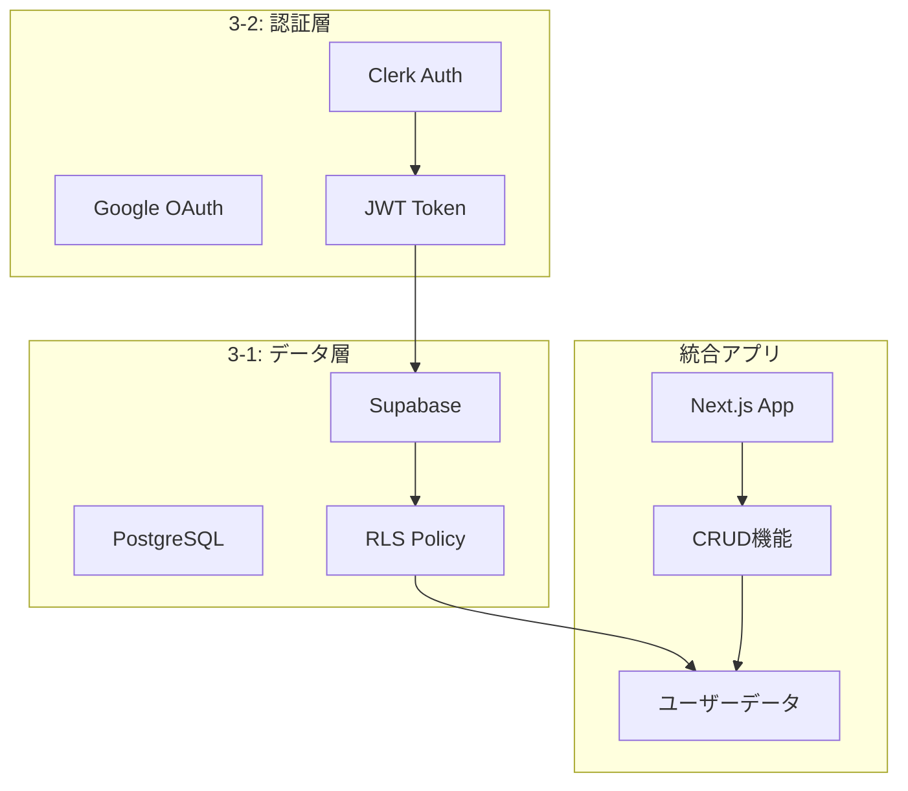
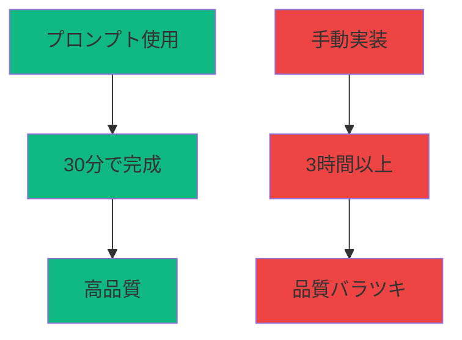

# **第三回 Session 3**
## 実装ロードマップと宿題

**～学んだパーツを組み合わせて動くアプリを作る～**

**Vibe Coder Bootcamp**
**2025年9月版**

---

## 本日のアジェンダ (30分間)

1. **統合アーキテクチャ確認 (5分)**
   - 3-1と3-2で構築した要素の関係
   - 最終的なアプリケーション構成

2. **実装ロードマップ (10分)**
   - Step by Step実装手順
   - 各Markdownガイドの使い方

3. **宿題詳細説明 (10分)**
   - 必須タスク vs 発展タスク
   - 期待される成果物

4. **トラブルシューティング (5分)**
   - よくあるエラーと解決方法
   - 質問の仕方

---

## 🏗️ 統合アーキテクチャ

### 今日作った2つの柱を繋げる

---

## Session 3-1 と 3-2 の成果



---

## これらを組み合わせると実現できること

### ✅ 実装可能な機能

**認証関連：**
- ユーザー登録・ログイン
- Google/GitHub OAuth
- ログアウト・セッション管理

**データ管理：**
- ユーザーごとのデータ隔離
- セキュアなCRUD操作
- リアルタイムデータ同期

**セキュリティ：**
- 多層防御（フロント・API・DB）
- 自動的な権限チェック
- SQLインジェクション対策

---

## 📋 実装ロードマップ

### 宿題を完成させるための4つのフェーズ

---

## Phase 0: AIプロンプトを使った高速実装 🚀

### ✨ 魔法のプロンプトを使えば自動化できる！

**🎁 特別配布：`supabase_prompt/` フォルダ**

```
📁 supabase_prompt/
├── 🎯 QUICK_START_PROMPT.md        # すぐ使えるコピペ集（これを使う！）
├── MASTER_INTEGRATION_PROMPT.md     # 完全統合の設計書
├── clerk_setupprpompt.md            # Clerk設定
├── supabase_bootstrap_nextjs.md     # Supabase設定
├── supabase_migration_prompt.md     # マイグレーション
├── supabase_realtime_AIprompt.md    # リアルタイム機能
└── FRONTEND_IMPLEMENTATION_ADDON.md # フロントエンド実装
```

---

## 🎯 魔法のプロンプトの使い方

### Cursorでの実行手順

1. **QUICK_START_PROMPT.mdを開く**
   ```
   @supabase_prompt/QUICK_START_PROMPT.md
   ```

2. **自分のシナリオを選ぶ**
   - シナリオ1: ゼロから完全統合（最も推奨）
   - シナリオ2: Clerkのみ追加
   - シナリオ3: Supabaseのみ追加
   - その他10種類以上のシナリオ

3. **選んだシナリオのプロンプトをコピペしてCursorに貼るだけ！**

**結果：AIが完璧なコードを自動生成！**

---

## 🤖 何をやってくれるのか？

### **シナリオ1（完全統合）を選んだ場合：**

| 実装内容 | 詳細 |
|---------|------|
| **環境構築** | 必要なパッケージを全自動インストール、環境変数の設定 |
| **Clerk認証** | Google OAuth、サインイン/サインアップページ、認証ミドルウェア |
| **Supabaseクライアント** | SSR対応、型安全なクライアント作成、ブラウザ/サーバー両対応 |
| **データベース構築** | マイグレーションファイル作成、テーブル定義、外部キー制約 |
| **セキュリティ（RLS）** | 行レベルセキュリティ、ユーザーごとのデータ制御 |
| **ユーザー同期** | ClerkとSupabaseのユーザー情報を自動同期 |
| **CRUD操作** | データの作成・読取・更新・削除機能を全実装 |
| **Server Actions** | Next.js 14の最新パターンで実装 |
| **フロントエンドUI** | 認証画面、ナビゲーション、データ操作画面、ローディング状態 |
| **Webhook設定** | Clerkのイベントを自動処理するエンドポイント |

---

## 💡 シナリオ別の選び方

| あなたの状況 | 選ぶべきシナリオ | 説明 |
|------------|----------------|------|
| **新規プロジェクト** | シナリオ1 | 完全統合＋フロントエンド全部入り |
| **UIは自分で作りたい** | シナリオ1-B | バックエンドのみ統合 |
| **認証だけ追加したい** | シナリオ2 | Clerkのみ実装 |
| **DBだけ追加したい** | シナリオ3 | Supabaseのみ実装 |
| **既存DBから移行** | シナリオ6 | 設計書からマイグレーション生成 |
| **リアルタイム機能** | シナリオ5 | チャット等のリアルタイム更新 |
| **型安全にしたい** | シナリオ8 | TypeScript完全対応 |
| **本番環境準備** | シナリオ9 | エラーハンドリング追加 |

---

## 環境変数の設定内容

```env
# Clerk（Session 3-2で取得）
NEXT_PUBLIC_CLERK_PUBLISHABLE_KEY=pk_test_...
CLERK_SECRET_KEY=sk_test_...

# Supabase（Session 3-1で取得）
NEXT_PUBLIC_SUPABASE_URL=https://xxxxx.supabase.co
NEXT_PUBLIC_SUPABASE_PUBLISHABLE_KEY=sb_publishable_...
SUPABASE_SECRET_KEY=sb_secret_...

# URL設定
NEXT_PUBLIC_CLERK_SIGN_IN_URL=/sign-in
NEXT_PUBLIC_CLERK_SIGN_UP_URL=/sign-up
NEXT_PUBLIC_CLERK_AFTER_SIGN_IN_URL=/dashboard
NEXT_PUBLIC_CLERK_AFTER_SIGN_UP_URL=/dashboard
```

---

## チェックポイント

### ✅ Phase 1完了確認

- [ ] `npm run dev`でアプリが起動する
- [ ] http://localhost:3000 でページが表示される
- [ ] 環境変数が正しく設定されている
- [ ] エラーメッセージが表示されていない

**よくある失敗：**
- 環境変数のコピーミス
- パッケージのインストール漏れ
- ポート3000が既に使用中

---

## 🎉 AIが自動生成してくれるもの

**ファイル構成：**
```
📁 プロジェクト/
├── 📁 app/
│   ├── api/webhook/        # Clerkイベント処理
│   ├── sign-in/           # ログインページ
│   ├── sign-up/           # サインアップページ
│   └── (protected)/       # 認証必須ページ
├── 📁 lib/
│   ├── supabase/         # DBクライアント
│   ├── clerk/            # 認証設定
│   └── actions/          # Server Actions
├── 📁 components/         # UIコンポーネント
├── 📁 supabase/
│   └── migrations/       # DB定義ファイル
└── .env.local            # 環境変数
```

**完成品の特徴：**
- ✅ プロダクションレディな品質
- ✅ ベストプラクティスに準拠
- ✅ 最新のNext.js 14パターン
- ✅ セキュリティ完備（RLS、CORS、CSRFトークン）
- ✅ 型安全（TypeScript）

---

## 実装順序とAI活用

### 1. ClerkProviderの設定（layout.tsx）

**🤖 Cursorへの指示：**
```markdown
app/layout.tsxにClerkProviderを設定してください。
@clerk/nextjs の最新版に対応した実装で。
```

### 2. middleware.tsの作成

**🤖 Cursorへの指示：**
```markdown
middleware.tsを作成して、/dashboardを保護してください。
publicRoutesは["/", "/sign-in", "/sign-up"]にしてください。
```

---

## 3. サインインページの実装

```typescript
// app/sign-in/[[...sign-in]]/page.tsx
import { SignIn } from "@clerk/nextjs";

export default function SignInPage() {
  return (
    <div className="flex justify-center items-center min-h-screen">
      <SignIn />
    </div>
  );
}
```

### 4. ユーザープロフィール表示

```typescript
// components/UserProfile.tsx
import { UserButton } from "@clerk/nextjs";

export function UserProfile() {
  return <UserButton afterSignOutUrl="/" />;
}
```

---

## 💡 プロンプトの賢い使い方

### カスタマイズのコツ

**基本のプロンプトに追加指示を加える：**

```markdown
# 例1：UIフレームワークを指定
「UIコンポーネントにはshadcn/uiを使用してください」

# 例2：既存コードとの統合
「現在のapp/layout.tsxの構造を保持しつつ統合してください」

# 例3：段階的な実装
「まず認証機能のみ実装し、動作確認後にDB統合を行ってください」

# 例4：多言語対応
「日本語のUIテキストを使用してください」
```

### よくある間違いと回避方法

❌ **悪い例：**
```
ClerkとSupabaseを統合して
```
（ベストプラクティスを参照していない）

✅ **良い例：**
```
@supabase_prompt/QUICK_START_PROMPT.md のシナリオ1を使って
ClerkとSupabaseを完全統合してください
```

---

## 実装順序

### 1. Supabaseクライアント作成

**🤖 Cursorへの指示：**
```markdown
lib/supabase/にclient.tsとserver.tsを作成してください。
Clerkの認証情報を使ってSupabaseにアクセスできるように設定。
```

### 2. テーブル作成（SQL実行）

**Supabase Dashboard → SQL Editor:**
```sql
-- profilesテーブル（Clerkユーザーと連携）
CREATE TABLE profiles (
  id TEXT PRIMARY KEY,  -- Clerk user_id
  email TEXT NOT NULL,
  username TEXT UNIQUE,
  created_at TIMESTAMP DEFAULT NOW()
);
```

---

## 3. RLSポリシー設定

### 自分のデータのみ操作可能に

```sql
-- RLS有効化
ALTER TABLE profiles ENABLE ROW LEVEL SECURITY;

-- 自分のプロフィールのみ読み書き可能
CREATE POLICY "Users can manage own profile"
ON profiles FOR ALL
TO authenticated
USING (auth.jwt() ->> 'sub' = id)
WITH CHECK (auth.jwt() ->> 'sub' = id);
```

---

## 4. Clerk JWT連携

### ClerkのJWTをSupabaseに渡す設定

**Clerk Dashboard → JWT Templates:**
1. New Template作成
2. Name: `supabase`
3. Claims:
```json
{
  "sub": "{{user.id}}",
  "email": "{{user.primary_email_address}}",
  "user_metadata": {
    "username": "{{user.username}}"
  }
}
```

---

## Phase 1: 環境構築（AIを使わない場合の手順）

> 💡 **注意：** AIプロンプトを使えば以下のPhase 1〜4は全自動です！
> 手動でやりたい人向けの参考情報として残しています。

### 🎯 プロジェクトの土台作り

**手動でやる場合：**

```bash
# 1. プロジェクト初期化
npx create-next-app@latest my-app --typescript --tailwind --app

# 2. 必要パッケージインストール
npm install @clerk/nextjs @supabase/supabase-js @supabase/ssr

# 3. 環境変数設定（.env.local作成）
```

---

## 実装する4つの機能

### 1. Create（作成）: 新規投稿

**🤖 Cursorへの指示：**
```markdown
app/dashboard/page.tsxに投稿フォームを追加。
Server Actionで投稿をSupabaseに保存してください。
```

```typescript
async function createPost(formData: FormData) {
  'use server'
  const { userId } = auth()
  const content = formData.get('content') as string

  const supabase = createClient()
  await supabase.from('posts').insert({
    content,
    user_id: userId
  })

  revalidatePath('/dashboard')
}
```

---

## 2. Read（読取）: タイムライン表示

```typescript
// app/dashboard/page.tsx
export default async function DashboardPage() {
  const supabase = createClient()

  const { data: posts } = await supabase
    .from('posts')
    .select(`
      *,
      profiles (username, avatar_url)
    `)
    .order('created_at', { ascending: false })

  return (
    <div>
      {posts?.map(post => (
        <PostCard key={post.id} post={post} />
      ))}
    </div>
  )
}
```

---

## 3. Update（更新）: 投稿編集

```typescript
async function updatePost(postId: string, content: string) {
  'use server'
  const { userId } = auth()
  const supabase = createClient()

  await supabase
    .from('posts')
    .update({ content })
    .eq('id', postId)
    .eq('user_id', userId) // 自分の投稿のみ編集可能

  revalidatePath('/dashboard')
}
```

---

## 4. Delete（削除）: 投稿削除

```typescript
async function deletePost(postId: string) {
  'use server'
  const { userId } = auth()
  const supabase = createClient()

  await supabase
    .from('posts')
    .delete()
    .eq('id', postId)
    .eq('user_id', userId) // 自分の投稿のみ削除可能

  revalidatePath('/dashboard')
}
```

---

## 📝 宿題：認証付きCRUDアプリの完成

### 🎁 QUICK_START_PROMPTを使った宿題実装手順

1. **プロジェクトフォルダに`supabase_prompt/`をコピー**
2. **Cursorで以下を実行：**

```markdown
@supabase_prompt/QUICK_START_PROMPT.md を開いて、
「シナリオ 1: ゼロからの完全統合」のプロンプトをコピー
```

3. **コピーしたプロンプトをCursorに貼り付けて実行**
4. **環境変数を設定（ClerkとSupabaseのダッシュボードから取得）**
5. **完成！**

### 期限：次回セッションまで

---

## 必須タスク（最低限の動作）

### ✅ これだけは必ず実装

**1. 認証機能**
- [ ] Google認証でログイン/ログアウト
- [ ] ユーザー情報の表示（UserButton）

**2. 投稿機能**
- [ ] 新規投稿の作成（フォーム）
- [ ] 投稿一覧の表示（タイムライン）
- [ ] 自分の投稿のみ編集・削除可能

**3. データ永続化**
- [ ] Supabaseにデータ保存
- [ ] ページリロードしてもデータが残る

---

## 発展タスク（チャレンジ）

### 🚀 余力があれば挑戦

**1. いいね機能**
- [ ] 投稿にいいねをつける
- [ ] いいね数の表示
- [ ] useOptimisticでの楽観的更新

**2. プロフィール機能**
- [ ] プロフィール編集ページ
- [ ] アバター画像アップロード（Supabase Storage）
- [ ] ユーザー名の変更

**3. リアルタイム機能**
- [ ] 新規投稿の自動表示
- [ ] Supabase Realtimeで即座に反映

---

## 成果物の提出方法

### 📤 GitHubで共有

1. **GitHubリポジトリ作成**
```bash
git init
git add .
git commit -m "Initial commit"
gh repo create my-social-app --public
git push -u origin main
```

2. **README.md作成**
- アプリの概要
- 実装した機能一覧
- 工夫した点
- 苦労した点

3. **SlackでURL共有**

---

## 🔧 トラブルシューティング

### よくあるエラーTop 3

---

## エラー1：環境変数エラー

### Missing NEXT_PUBLIC_CLERK_PUBLISHABLE_KEY

**原因：** 環境変数が設定されていない

**解決法：**
1. `.env.local`ファイルを確認
2. キーが正しくコピーされているか確認
3. **開発サーバーを再起動**

```bash
# 必ず再起動！
npm run dev
```

---

## エラー2：CORS/認証エラー

### Invalid authentication credentials

**原因：** ClerkとSupabaseの連携設定ミス

**チェックポイント：**
- [ ] Clerk DashboardでJWT Template作成済み？
- [ ] Supabase DashboardでJWT Secret設定済み？
- [ ] 環境変数が両方とも設定済み？

**解決法：**
```sql
-- Supabase SQL Editorで確認
SELECT current_setting('request.jwt.claims', true);
```

---

## エラー3：RLSエラー

### new row violates row-level security policy

**原因：** RLSポリシーが正しく設定されていない

**解決法：**
1. Supabase Dashboard → Authentication → Policies
2. 該当テーブルのポリシーを確認
3. auth.jwt() ->> 'sub' が正しく取得できているか確認

**デバッグ用SQL：**
```sql
-- 現在のユーザーIDを確認
SELECT auth.jwt() ->> 'sub' AS current_user_id;
```

---

## 💡 実装のコツ

### AI活用の極意

---

## 実装のコツ

### 1. **まずはQUICK_STARTから始める**
   ```
   @supabase_prompt/QUICK_START_PROMPT.md
   → シナリオ1を選んでコピペ
   ```

### 2. **環境変数を正しく設定**
   - Clerk Dashboard → API Keys
   - Supabase Dashboard → Settings → API

### 3. **動作確認は小まめに**
   - 認証だけ先にテスト
   - DBは後から追加でもOK

### 4. **詰まったら**
   - QUICK_START_PROMPTの別シナリオを試す
   - エラーメッセージをAIに相談
   - Slackで質問

---

## QUICK_START_PROMPTの便利なシナリオ

### 困ったときのシナリオ選択ガイド

| 困っていること | 使うシナリオ | 結果 |
|--------------|------------|------|
| **何から始めればいいか分からない** | シナリオ1 | 全部入りで完成 |
| **認証でエラーが出る** | シナリオ2 | Clerkだけをシンプル実装 |
| **DBが動かない** | シナリオ3 | Supabaseだけをシンプル実装 |
| **型エラーがたくさん出る** | シナリオ8 | TypeScript完全対応版 |
| **本番で動かない** | シナリオ9 | エラーハンドリング追加 |
| **テストを書きたい** | シナリオ11 | テストとドキュメント付き |



**結論：プロンプトを使えば：**
- 🚀 10倍速く完成
- ✅ ベストプラクティス保証
- 🔒 セキュリティ完璧
- 🎆 初心者でもプロレベル

---

## 📚 参考資料

### 公式ドキュメント

**必読：**
- [Clerk Docs - Next.js Quickstart](https://clerk.com/docs/quickstarts/nextjs)
- [Supabase Docs - Next.js Guide](https://supabase.com/docs/guides/getting-started/quickstarts/nextjs)
- [Next.js 14 Docs - App Router](https://nextjs.org/docs/app)

**トラブルシューティング：**
- [Clerk + Supabase Integration](https://clerk.com/docs/integrations/databases/supabase)
- [Supabase RLS Guide](https://supabase.com/docs/guides/auth/row-level-security)

---

## 🎁 配布プロンプト集

### 📁 supabase_promptフォルダの内容

```
📁 supabase_prompt/
├── 🎯 QUICK_START_PROMPT.md
│   └── すぐ使える11個のシナリオ
│       コピペするだけで完成！
│
├── MASTER_INTEGRATION_PROMPT.md
│   └── 1039行の詳細な設計書
│       QUICK_STARTが内部で使用
│
├── clerk_setupprpompt.md
│   └── Clerk認証のベストプラクティス
│
├── supabase_bootstrap_nextjs.md
│   └── Supabase統合の詳細手順
│
└── その他の専門プロンプト...
```

**使い方：**
1. **QUICK_START_PROMPT.md を開く**
2. **自分に合うシナリオを選ぶ**
3. **コピペして実行するだけ！**

---


---

## ✅ Session 3 完了チェックリスト

### 今日の理解度確認

---

## 理解度チェック

### 📋 概念理解

- [ ] データベース基礎（3-1）を理解した
- [ ] 認証の仕組み（3-2）を理解した
- [ ] ClerkとSupabaseの連携方法を理解した
- [ ] RLSの重要性を理解した

### 🔧 実装準備

- [ ] 開発環境が整っている
- [ ] ClerkとSupabaseのアカウント作成済み
- [ ] 環境変数を取得済み
- [ ] 実装ガイドにアクセスできる

---

## 宿題準備確認

### 📝 実装計画

- [ ] 実装手順を把握した
- [ ] 必須タスクと発展タスクの違いを理解した
- [ ] 時間配分を決めた（目安：3-4時間）
- [ ] 分からないことは質問する準備OK

### 🎯 目標設定

- [ ] 最低限：必須タスクの完成
- [ ] 目標：発展タスク1つ以上
- [ ] 理想：全機能実装＋独自アイデア

---

## 🎉 第三回セッション完了！

### 実装開始の準備が整いました

**今日の成果：**
- Supabaseでデータベース構築
- Clerkで認証システム実装
- 統合アーキテクチャの理解

**宿題：**
認証付きCRUDアプリの完成

**次回予告：**
作ったアプリを世界に公開！

---

## 🚀 次回（第四回）予告

### Session 4: デプロイと公開

---

## 第四回で学ぶこと

### 🌍 あなたのアプリを世界へ

**学習内容：**
- Vercelへのデプロイ
- 環境変数の本番設定
- カスタムドメイン設定
- パフォーマンス最適化
- SEO対策

**宿題の活用：**
- 今回作ったアプリを実際に公開
- URLを共有してフィードバックをもらう
- ポートフォリオとして活用

---

## 最後に：実装のマインドセット

### 💭 大切な考え方

**完璧を求めない**
- 動くものを作ることが最優先
- リファクタリングは後からできる

**エラーを恐れない**
- エラーは学びのチャンス
- AIに聞けば解決できる

**楽しむことを忘れない**
- 自分のアイデアを形にする喜び
- 小さな成功を積み重ねる

---

## 📢 激励のメッセージ

### あなたならできる！

**覚えておいてください：**
- 3週間前はHTML/CSSも知らなかった
- でも今、データベースと認証を扱っている
- これは**すごい成長**です！

**宿題のコツ：**
- 毎日30分でも触る
- 詰まったらすぐ質問
- 動いたら自分を褒める

**次回お会いするときには、あなたのアプリが動いています！**

---

# 頑張ってください！

## See you next week! 🎊

**宿題締切：次回セッション前日まで**

**提出先：Slack #vibecoder-share**

**質問先：Slack #vibecoder-support**