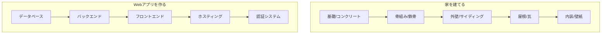
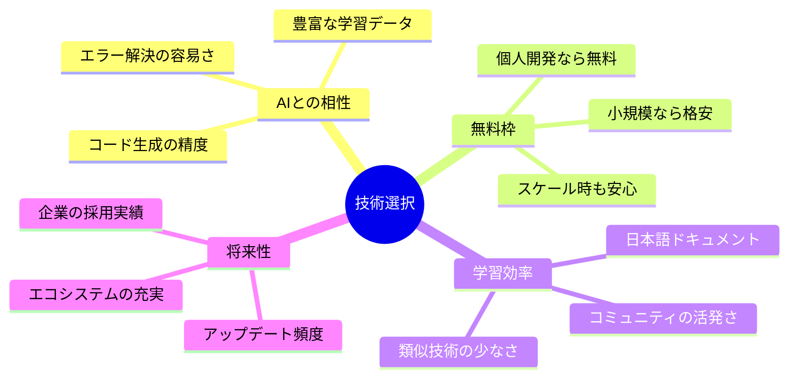
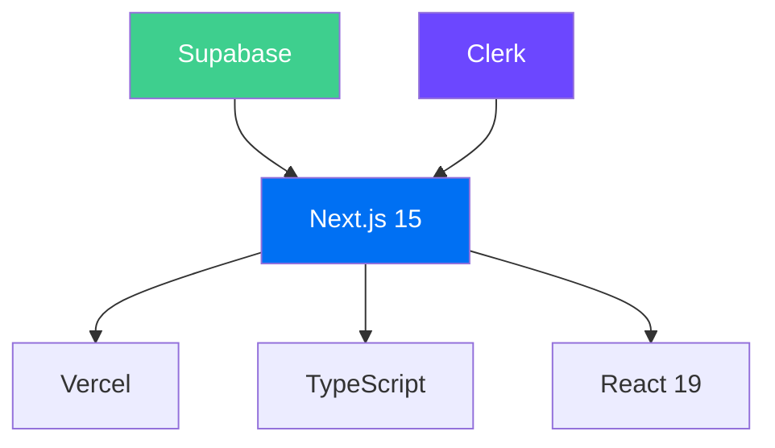
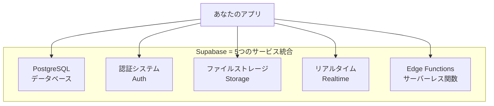
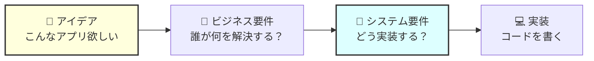
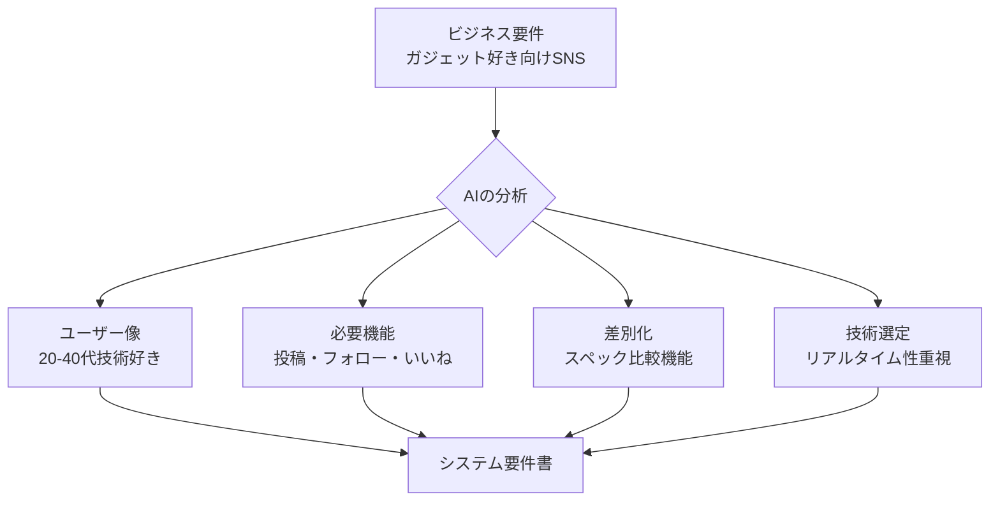
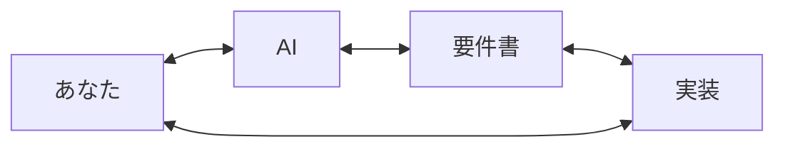

# **第二回（後半）**
## 技術スタックとAIによるシステム要件定義（演習）
### 〜アイデアを設計図に変える革命的体験〜

**Vibe Coder Bootcamp**
TEKION Group / 泉水亮介
2025年9月23日

---

# 本講義の位置づけ

## 🎯 **前半から後半への架け橋**

### 前半で学んだこと
- Webアプリの仕組みの理解
- APIの力を借りる開発手法
- エラーとの正しい付き合い方

### これから学ぶこと
- **技術スタック** = アプリを作る「建材」の選び方
- **AIによる要件定義** = アイデアを設計図に自動変換
- **実践的な演習** = 今すぐ使える具体的スキル

---

# アジェンダ

## 📋 **本講義の流れ**（45分）

| 時間 | 内容 | 重要度 |
|------|------|--------|
| **10分** | 技術スタックの理解 | ★★★ |
| **35分** | AI要件定義演習 | ★★★★★ |

### 💡 演習中心の実践的講義
**理論は最小限、手を動かして体感する**

---

# 第1部：技術スタックとは？
## アプリケーションの「建材」を理解する

---

# 家を建てることに例えると

## 🏠 **建築とWebアプリの類似性**



**適材適所の技術選択が品質を決定する**

---

# なぜ技術スタックの理解が必要なのか

## 🎯 **3つの重要な理由**

### 1. AIへの的確な指示
```
❌ 悪い例：「アプリを作って」
✅ 良い例：「Next.jsとSupabaseを使って、認証付きのタスク管理アプリを作って」
```

### 2. 実現可能性の判断
- 「この機能は無料でできる？」
- 「どれくらいの規模まで対応できる？」
- 「学習にどれくらい時間がかかる？」

### 3. コスト見積もり
- 初期費用：**0円〜**
- 月額費用：**0円〜数千円**
- スケール時：**従量課金**

---

# 技術選択の4つの観点

## 🔍 **判断基準を明確にする**



---

# 第2部：Vibe Coder推奨技術スタック
## 2025年最新の最適解

---

# 推奨スタック一覧

## 🚀 **初心者が最初に真似すべき構成**

| 役割 | 技術 | 理由 |
|:-----|:-----|:-----|
| **フロントエンド** | Next.js 15 + React 19 | 最新機能とAI対応 |
| **言語** | TypeScript | 型安全でAI生成精度向上 |
| **バックエンド** | Next.js API Routes | 統一環境で学習コスト削減 |
| **データベース** | Supabase | 無料枠充実・リアルタイム対応 |
| **認証** | Clerk | 実装最速・UI標準装備 |
| **ホスティング** | Vercel | GitHub連携で自動デプロイ |

### なぜこの組み合わせ？
**統一感・無料枠・AI相性・学習効率・拡張性**のベストバランス

### 🔗 技術間の依存関係



### なぜこの組み合わせが最適なのか？

1. **統一された開発体験** - すべてがJavaScript/TypeScriptで完結
2. **無料枠の充実** - 小規模〜中規模まで無料で運用可能
3. **AI生成の高精度** - 豊富なトレーニングデータによりCursorが正確なコードを生成

---

# Next.js 15 - フルスタックReactフレームワーク

## ❓ **なぜNext.jsなのか**

### 従来のReactの課題
- SEO対策が困難（検索エンジンがJavaScriptを読めない）
- 初期表示が遅い（すべてをブラウザで処理）
- バックエンドは別途必要（API開発が別プロジェクト）

### Next.jsによる解決
✅ サーバーサイドレンダリングで**SEO最適化**
✅ 高速な初期表示
✅ API Routesで**フロント・バックエンド統合**

---

# Next.js 15の機能（2025年最新）

## 🔧 **どう使うのか**

### 1. ファイルベースルーティング
```bash
app/
├── page.tsx          → / (トップページ)
├── about/
│   └── page.tsx      → /about
└── blog/
    └── [id]/
        └── page.tsx  → /blog/123
```
**ファイルを作るだけでページができる**

### 2. React 19完全対応
- **Server Actions**: フォーム処理が劇的に簡単に
- **useActionState**: 楽観的UIの標準実装
- **use() API**: 非同期処理の新しい書き方

### 3. Turbopack開発サーバー
```bash
next dev --turbo  # 従来比10倍高速な起動
```

---

# Next.js - 必須環境変数とAI指示

## 🔑 **必須環境変数**

Next.js自体には不要ですが、連携サービスで必要：

```bash
# Supabase連携時
NEXT_PUBLIC_SUPABASE_URL=https://xxx.supabase.co
NEXT_PUBLIC_SUPABASE_ANON_KEY=eyJhbGc...
SUPABASE_SERVICE_ROLE_KEY=eyJhbGc...

# Clerk連携時
NEXT_PUBLIC_CLERK_PUBLISHABLE_KEY=pk_test_xxx
CLERK_SECRET_KEY=sk_test_xxx
```

## 💬 **Cursor Agentへの指示例**

```markdown
Next.js 15のApp Routerでプロジェクトを作成してください。

要件:
- TypeScript有効化
- Tailwind CSS有効化
- ESLint有効化
- src/ディレクトリ使用
- App Router使用

以下のコマンドで実行:
npx create-next-app@latest my-app --typescript --tailwind --app --src-dir --eslint
```

## 💰 **コスト**
- フレームワーク自体：**無料（オープンソース）**
- ホスティング（Vercel）：無料枠あり

---

# TypeScript - 型安全なJavaScript

## ❓ **なぜTypeScriptなのか**

### JavaScriptの課題
```javascript
// エラーが実行時にしか分からない
const task = { title: "買い物" };
console.log(task.titel);  // typo！でも実行まで気づけない
```

### TypeScriptによる解決
```typescript
// エラーがエディタで即座に分かる
interface Task {
  title: string;
}
const task: Task = { title: "買い物" };
console.log(task.titel);  // ❌ エディタが即座にエラー表示
```

✅ **実行前にバグを発見**
✅ **AIがより正確なコードを生成**
✅ **自動補完が充実**

---

# TypeScript - どう使うか

## 🔧 **基本的な型定義**

### インターフェース
```typescript
interface Task {
  id: string;
  title: string;
  completed: boolean;
  dueDate: Date | null;  // null許容
}

// 使用例
const task: Task = {
  id: "123",
  title: "買い物",
  completed: false,
  dueDate: new Date()
};
```

### 関数の型
```typescript
function createTask(title: string): Task {
  return {
    id: crypto.randomUUID(),
    title: title,
    completed: false,
    dueDate: null
  };
}
```

---

# TypeScript - AI指示と学習

## 💬 **Cursor Agentへの指示例**

```markdown
以下の機能をTypeScriptで実装してください:

タスク管理のCRUD操作:
- createTask(title: string): Task
- updateTask(id: string, updates: Partial<Task>): Task
- deleteTask(id: string): void
- getTasks(): Task[]

型定義も含めてお願いします。
```

## 📚 **学習リソース**

- 公式ドキュメント: [typescriptlang.org](https://www.typescriptlang.org/)
- TypeScript Playground: ブラウザで即実行可能

## 💰 **コスト**
- **無料（オープンソース）**
- Visual Studio Codeで標準サポート

---

# Supabase - オールインワンバックエンド

## ❓ **なぜSupabaseなのか**

### 従来のバックエンド開発の課題
- データベースサーバーの構築・管理が必要
- 認証システムを自作する必要がある
- ファイルアップロード機能の実装が複雑
- インフラの運用コストが高い

### Supabaseによる解決


✅ **データベース・認証・ストレージが全部込み**
✅ **無料枠が充実**
✅ **リアルタイム機能標準装備**

---

# Supabase - どう使うか

## 🔧 **基本的な使い方**

### 1. プロジェクト作成（Webダッシュボード）
1. [supabase.com](https://supabase.com)でアカウント作成
2. 「New Project」でプロジェクト作成
3. APIキーをコピー

### 2. Next.jsで接続
```typescript
// lib/supabase.ts
import { createClient } from '@supabase/supabase-js'

const supabaseUrl = process.env.NEXT_PUBLIC_SUPABASE_URL!
const supabaseKey = process.env.NEXT_PUBLIC_SUPABASE_ANON_KEY!

export const supabase = createClient(supabaseUrl, supabaseKey)
```

### 3. データ取得例
```typescript
// タスク一覧を取得
const { data: tasks, error } = await supabase
  .from('tasks')
  .select('*')
  .order('created_at', { ascending: false })
```

---

# Supabase - 必須環境変数とコスト

## 🔑 **必須環境変数**

```bash
# .env.local
NEXT_PUBLIC_SUPABASE_URL=https://xxxxx.supabase.co
NEXT_PUBLIC_SUPABASE_ANON_KEY=eyJhbGc...
SUPABASE_SERVICE_ROLE_KEY=eyJhbGc...  # 管理者権限（サーバーサイドのみ）
```

### 取得方法
Supabaseダッシュボード → Settings → API

## 💬 **Cursor Agentへの指示例**

```markdown
Supabaseを使ってタスク管理機能を実装してください。

要件:
- tasksテーブルにCRUD操作を実装
- リアルタイム更新機能も追加
- TypeScriptの型定義も生成

環境変数は.env.localに設定済みです。
```

## 💰 **コスト**

### 無料枠の内容
- データベース: **500MB**
- ストレージ: **1GB**
- 帯域幅: **2GB/月**
- **小規模アプリなら完全無料**

### Pro版（$25/月）
- データベース: 8GB
- ストレージ: 100GB
- 毎日の自動バックアップ

---

# Clerk - 最速で実装できる認証システム

## ❓ **なぜClerkなのか**

### 従来の認証実装の課題
- ログイン画面のUI実装に時間がかかる
- セキュリティ対策（ハッシュ化、トークン管理）が複雑
- ソーシャルログイン連携が難しい
- パスワードリセット機能の実装が面倒

### Clerkによる解決
✅ **美しいUIが標準装備**（数行のコードで完成）
✅ **セキュリティは全自動**
✅ **Google/GitHub等のログインが簡単**
✅ **パスキー対応**（パスワード不要の認証）

---

# Clerkの5つの特徴

## 🔐 **なぜClerkが選ばれるのか**

### 1. 最速のUX実装
- **ドロップイン型**の認証画面（SignIn/SignUp/UserProfile）
- 美しいUIが**標準装備**（カスタマイズも可能）
- 日本語対応・ダークモード対応

### 2. 豊富な認証方法
```yaml
対応認証:
  - メール/パスワード
  - マジックリンク（パスワード不要）
  - ソーシャルログイン: Google, GitHub, Twitter/X, LINE
  - 電話番号（SMS）
  - パスキー（生体認証）
```

### 3. Next.js完全対応
- App Router完全サポート
- Edge Runtime対応
- TypeScript型定義完備

### 4. B2B機能
- 組織（Organization）管理
- ロール・権限管理
- エンタープライズSSO

### 5. コストパフォーマンス
- **10,000 MAU無料**（月間アクティブユーザー）
- Pro版でも$25/月〜

---

# Clerk - どう使うか

## 🔧 **基本的な実装**

### 1. インストール
```bash
npm install @clerk/nextjs
```

### 2. 環境変数設定
```bash
# .env.local
NEXT_PUBLIC_CLERK_PUBLISHABLE_KEY=pk_test_xxxxx
CLERK_SECRET_KEY=sk_test_xxxxx
```

### 3. ClerkProviderで囲む
```typescript
// app/layout.tsx
import { ClerkProvider } from '@clerk/nextjs'

export default function RootLayout({ children }) {
  return (
    <ClerkProvider>
      <html lang="ja">
        <body>{children}</body>
      </html>
    </ClerkProvider>
  )
}
```

### 4. 認証が必要なページ
```typescript
import { auth } from '@clerk/nextjs';
import { redirect } from 'next/navigation';

export default async function DashboardPage() {
  const { userId } = auth();

  if (!userId) {
    redirect('/sign-in');
  }

  return <div>ようこそ！ユーザーID: {userId}</div>;
}
```

---

# Clerk - 環境変数とAI指示

## 🔑 **必須環境変数**

```bash
# .env.local
NEXT_PUBLIC_CLERK_PUBLISHABLE_KEY=pk_test_xxxxx
CLERK_SECRET_KEY=sk_test_xxxxx
```

### 取得方法
1. [clerk.com](https://clerk.com)でアカウント作成
2. Application作成
3. API Keys タブでコピー

## 💬 **Cursor Agentへの指示例**

```markdown
Clerkを使って認証機能を実装してください。

要件:
- ログイン・サインアップページの作成
- 認証が必要なダッシュボードページ
- ログアウトボタンの実装
- Googleログインも有効化

環境変数は.env.localに設定済みです。
```

## 💰 **コスト**
- 無料枠：**10,000 MAU/月**
- Pro版：$25/月〜
- Enterprise：カスタム見積もり

---

# Vercelの魔法：GitHubプッシュ = 公開

## 🚀 **世界最速のデプロイ体験**


### プレビューデプロイ
- プルリクエストごとに専用URL
- 本番に影響なくテスト可能
- チームレビューが簡単

---

# 技術スタック選定チェックリスト

## ✅ **プロジェクト開始時の確認事項**

### 必須要件の確認
- [ ] 予算制限（月額上限）
- [ ] 想定ユーザー数（初期/1年後）
- [ ] 必要な機能リスト
- [ ] チームのスキルレベル
- [ ] 納期・開発期間

### 技術選定の判断
- [ ] 推奨スタックで対応可能か？
- [ ] 特殊な要件はないか？
- [ ] 将来の拡張性は十分か？
- [ ] 学習コストは妥当か？

**迷ったら推奨スタックから始める**

---

# 第3部：AIによるシステム要件定義（演習）
## ビジネスアイデアを設計図に変換する魔法

---

# 要件定義とは何か？

## 📋 **夢を設計図に変える作業**



### 従来の問題
- 要件定義には**専門知識**が必要
- エンジニアとの**コミュニケーション**が困難
- 抜け漏れによる**手戻り**が発生

### AI時代の解決策
**AIが自動的に要件を抽出・整理してくれる**

---

# 本日使用するAIプロンプト

## 🤖 **システム要件抽出プロンプトの構造**

```yaml
役割: プロダクトマネージャー & システムアーキテクト
入力: ビジネス要件（あなたのアイデア）
処理:
  1. 情報の統合・分析
  2. 不足情報の確認
  3. 技術要件への変換
  4. リスク分析
出力:
  - システム概要
  - 機能要件・非機能要件
  - 技術スタック提案
  - 開発ロードマップ
  - UI/UX方向性
```

**人間の10年分の経験をAIが数秒で実行**

---

# 演習の流れ

## 🎯 **AIによるシステム要件定義を体験**

### ステップ1：インプット準備（3分）
1. 前回の宿題ファイルを開く
2. `docs/input`フォルダを作成
3. ビジネス要件ファイルを移動

### ステップ2：システム要件定義（7分）
1. Cursorで新規チャット開始
2. 第1プロンプトを読み込み
   ```
   @docs/prompt/system-requirements-prompt.md
   ```
3. 生成された要件書を確認

### ステップ3：詳細要件定義（10分）
1. 第2プロンプトを読み込み
   ```
   @docs/prompt/detailed_requirements_prompt.md
   ```
2. より詳細な要件書を生成
3. 実装可能レベルまで落とし込まれた内容を確認

### ステップ4：アウトプット確認（10分）
1. 2つの要件書を比較
2. AIの思考プロセスを理解
3. 必要に応じて追加質問

---

# ステップ1：インプットの準備

## 📁 **ファイル構成を整える**

### 具体的な手順
```bash
# 1. プロジェクトルートで実行
mkdir -p docs/input
mkdir -p docs/output

# 2. ビジネス要件ファイルを移動
# 例：business_requirements.md
# 例：lean_canvas.md
# 例：product_vision.md
```

### フォルダ構造
```
your-project/
├── docs/
│   ├── input/          # あなたのアイデア
│   │   └── business_requirements.md
│   ├── output/         # AIが生成する設計書
│   └── prompt/         # AIプロンプト
```

---

# ステップ2：システム要件定義プロンプト

## 💻 **第1プロンプト：基本要件の抽出**

### 1. 新規チャットを開始
`Cmd+L` (Mac) または `Ctrl+L` (Windows)

### 2. プロンプトファイルを読み込み
```
@docs/prompt/system-requirements-prompt.md
```

### 3. 実行を待つ（30秒〜1分）
AIが以下を自動実行：
- `/docs/input`内のファイルを分析
- ビジネス要件からシステム要件へ変換
- 最適な技術スタック提案
- 開発ロードマップの策定

### 4. 出力ファイルを確認
```
docs/output/system_requirements.md
```

---

# ステップ3：詳細要件定義プロンプト

## 💻 **第2プロンプト：実装レベルまで詳細化**

### 1. 第2プロンプトを読み込み
```
@docs/prompt/detailed_requirements_prompt.md
```

### 2. AIが実行する処理
- 第1プロンプトの出力を読み込み
- テンプレートに沿って詳細化
- **Mermaid形式**で図を生成：
  - 画面遷移図
  - ER図（データベース設計）
  - アーキテクチャ図
  - コンポーネント階層図

### 3. 追加される詳細情報
- MoSCoW分類による機能優先度
- ユーザーストーリーとユースケース
- API仕様（REST形式）
- ワイヤーフレーム（テキストベース）

### 4. 出力ファイル
```
docs/output/detailed_requirements_specification.md
```

---

# 生成される要件書の構造（第1プロンプト）

## 📋 **AIが作成する設計書の内容**

```markdown
# システム要件定義書

## システム概要
- 解決する課題と提供価値
- 主要機能（コア・差別化・付加価値）

## 機能要件
- ユーザー管理、認証機能
- コア機能の詳細仕様
- UI/UX要件

## 非機能要件
- パフォーマンス（レスポンス3秒以内）
- セキュリティ（データ暗号化）
- スケーラビリティ（初期1,000人想定）

## 技術スタック
- Next.js 15, TypeScript, Supabase
- 選定理由と代替案

## 開発ロードマップ
- Phase 1: MVP（2週間）
- Phase 2: 機能拡張（1ヶ月）
```

---

# AIの思考プロセスを理解する

## 🧠 **どのように要件を導き出すか**

### 例：「ガジェット好きのための備忘録SNS」



### AIが追加する価値
- **非機能要件**の自動提案
- **セキュリティ**考慮事項
- **コスト最適化**の視点

---

# よくある質問と対処法

## ❓ **演習中の疑問を解決**

### Q: 情報が不足していると言われた
**A**: AIが質問リストを提供するので、答えられる範囲で回答
```
例：「想定ユーザー数は？」→「初期は100人程度」
```

### Q: 提案された技術スタックが違う
**A**: 要件に応じて最適化されるため、推奨と異なることも
```
例：リアルタイム性重視 → WebSocket追加提案
```

### Q: 要件書が長すぎる
**A**: 必要な部分だけ抜粋して使用すればOK
最初はPhase 1（MVP）に集中

---

# 生成された要件書の活用方法

## 🎯 **次のステップへの架け橋**

### 1. 開発の指針として
```
Cursorに要件書を読み込ませて実装
「@docs/output/system_requirements.mdを基に
タスク管理機能を実装して」
```

### 2. チーム共有資料として
- エンジニアとの会話のベース
- デザイナーへの要件伝達
- 投資家へのプレゼン資料

### 3. 進捗管理のチェックリスト
- [ ] Phase 1の機能実装
- [ ] 非機能要件の達成
- [ ] リスク対策の実施

---

# 実際の変換例：ビジネス要件→システム要件

## 🔄 **具体例で理解を深める**

### ビジネス要件（入力）
```markdown
「料理レシピを写真でシェアするSNS」
- ターゲット：料理好きの20-50代
- 解決する課題：レシピの整理と共有
- 収益モデル：広告とプレミアム機能
```

### システム要件（AI出力）
```markdown
## 主要機能
- 画像アップロード（最大10MB, WebP自動変換）
- レシピ投稿（材料・手順のDB設計）
- タグ検索（全文検索エンジン）
- フォロー機能（グラフDB考慮）

## 技術スタック
- Next.js 15 + Supabase Storage（画像管理）
- Algolia（レシピ検索）※有料だが必須
```

---

# 演習：あなたのアイデアを変換しよう

## 💪 **実際に手を動かす時間（15分）**

### タスク
1. **インプット準備**（2分）
   - `docs/input`にファイル配置

2. **AI実行**（3分）
   - プロンプト読み込み・実行

3. **結果確認**（5分）
   - 生成された要件書を読む
   - 特に技術スタック提案に注目

4. **質問・調整**（5分）
   - 不明点をAIに質問
   - 必要に応じて再生成

---

# 要件定義でよくある失敗と対策

## ⚠️ **初心者が陥りやすい罠**

### 失敗1：完璧主義
```
❌ 全機能を最初から実装しようとする
✅ MVP（最小限の製品）から始める
```

### 失敗2：技術優先思考
```
❌ 「最新技術を全部使いたい」
✅ 「ユーザー価値を最速で提供」
```

### 失敗3：スケール前提の過剰設計
```
❌ 「100万人対応のシステム」（初期10人）
✅ 段階的にスケールアップ
```

**AIは現実的な提案をしてくれる**

---

# Text is KING - 要件定義の品質向上

## 📝 **インプットの質がアウトプットを決める**

### 良いインプットの例
```markdown
## ターゲットユーザー
- ペルソナ：30代会社員の田中さん
- 課題：毎日の献立を考えるのが大変
- 現在の解決法：クックパッドを見る
- 不満：レシピが多すぎて選べない

## 提供価値
- AIが好みを学習して3つに絞る
- 買い物リストを自動生成
- 家族の評価を記録
```

### AIの出力品質が向上
**具体的な実装方法まで提案される**

---

# 演習の振り返りとフィードバック

## 🎯 **学びを定着させる**

### 確認ポイント
- [ ] 要件書は期待通りでしたか？
- [ ] 技術スタックの提案は納得できる？
- [ ] 開発ロードマップは現実的？
- [ ] 追加で知りたいことは？

### よくある感想
> 「こんなに詳細に分析してくれるとは！」
> 「自分では思いつかない視点があった」
> 「エンジニアに相談する前に整理できた」

### 重要な気づき
**AIは優秀な相談相手として活用できる**

---

# まとめ：本日の学び

## 📚 **3つの重要な理解**

### 1. 技術スタックの基礎
- **建材を選ぶ**ように技術を選択
- **推奨構成**から始めて徐々に最適化
- **4つの観点**で判断（AI相性・無料枠・学習・将来性）

### 2. AIによる要件定義の威力
- **ビジネスアイデア**→**システム設計書**を自動生成
- **専門知識不要**で本格的な要件定義
- **抜け漏れ防止**と**新たな視点**の獲得

### 3. 実践的なワークフロー
- `docs/input`→**AI分析**→`docs/output`
- **要件書を指針**に開発を進める
- **段階的実装**でリスクを最小化

---

# 本日の残りの講義

## 📖 **第二回はまだ続きます**

### この後のスケジュール
- **2-3**: Cursorの本格操作
- **2-4**: バージョン管理とドキュメント

### 本日の学習内容
本日の後半では、要件定義書を基にCursorで実際にアプリケーションを作成し、GitHubでバージョン管理を学びます。

---

# 宿題：要件定義書の完成と環境構築

## 📝 **次回までの課題**

### 必須課題（所要時間：40分）
1. **本日の要件定義書を完成させる**
   - 不足情報をAIに質問
   - Phase 1（MVP）を明確化
   - 技術スタックを確定

2. **実装準備**
   ```bash
   # Next.jsプロジェクト作成
   npx create-next-app@latest my-app --typescript --tailwind --app
   cd my-app

   # 推奨パッケージのインストール
   npm install @supabase/supabase-js @clerk/nextjs
   ```

   **環境変数の設定方法は第二回（前半）で学習済み**

### 任意課題
- 要件定義書を基にワイヤーフレーム作成
- v0.devでUIプロトタイプ生成

---

# 質疑応答タイム

## ❓ **よくある質問と回答**

### Q: 要件定義は毎回必要？
**A**: 新規プロジェクトや大きな機能追加時に実施
- 小さな修正は不要
- 定期的な見直しは有効

### Q: AIの提案と違う技術を使いたい
**A**: 理由があれば変更OK
- ただし学習コストを考慮
- 最初は推奨に従うのが安全

### Q: 要件書はどこまで詳細に？
**A**: MVPは詳細に、将来機能は概要レベル
- 実装直前に詳細化
- アジャイルに更新

---

# 重要：要件定義の本質

## 💡 **覚えておくべき原則**

### 要件定義は「対話」である


### 完璧を求めない
- **60点の要件書**で開発開始
- **実装しながら**改善
- **ユーザーフィードバック**で進化

### AIを「相棒」として活用
- 判断はあなた
- 提案はAI
- **協働で最適解を見つける**

---

# 本日の成果

## 🎉 **できるようになったこと**

### Before（講義前）
- 技術選択に迷う
- 要件定義が分からない
- エンジニアと話せない

### After（講義後）
- ✅ 推奨スタックを理解
- ✅ AIで要件定義を自動化
- ✅ 設計書を持って開発開始

### 次のアクション
1. 要件定義書の完成
2. 開発環境の構築
3. Phase 1の実装開始

**あなたはもうVibe Coderです！**

---

# 参考資料

## 📚 **さらに学びたい方へ**

### 公式ドキュメント
- [Next.js 15](https://nextjs.org/docs) - 最新App Router
- [Supabase](https://supabase.com/docs) - Database & Auth
- [Clerk](https://clerk.com/docs) - 認証システム
- [Vercel](https://vercel.com/docs) - デプロイメント

### 学習リソース
- [React 19新機能](https://react.dev/blog/2024/12/05/react-19)
- [TypeScript入門](https://typescriptbook.jp/)
- [SQL基礎](https://www.w3schools.com/sql/)

### コミュニティ
- Vibe Coder Discord
- TEKION Slack #vibecoder

---

# Thank You!

## 🙏 **お疲れ様でした**

### 本日の講義のポイント
- 技術スタック = **建材選び**
- AI要件定義 = **自動設計書作成**
- Text is KING = **良い入力が良い出力を生む**

### 次回までに
- 📝 要件定義書を完成
- 💻 開発環境を構築
- 🚀 実装の準備

### Remember:
> **「完璧な設計より、動くプロトタイプ」**
> まず作り、そして改善する

**See you in 第三回! 🚀**

---

# 付録：技術スタック早見表

## 🔧 **状況別の最適解**

| ケース | 推奨技術 | 理由 |
|--------|----------|------|
| **個人開発** | Next.js + Supabase | 無料・簡単 |
| **スタートアップ** | Next.js + Clerk + Neon | スケール対応 |
| **社内ツール** | Next.js + Google認証 | 既存連携 |
| **EC サイト** | Next.js + Stripe + Shopify | 決済特化 |
| **ブログ** | Next.js + Contentful | CMS連携 |
| **リアルタイム** | Next.js + Supabase Realtime | WebSocket |

### 迷ったら
**推奨スタックから始めて、必要に応じて追加・変更**

---

# 付録：AIプロンプト活用テンプレート

## 💬 **コピペで使える質問集**

### 技術選定の相談
```
私は[概要]のアプリを作りたいです。
予算：[金額]、期間：[日数]、スキル：[レベル]
最適な技術スタックを提案してください。
```

### 要件の詳細化
```
[機能名]について、以下を詳細に定義してください：
- ユーザーストーリー
- 受入条件
- 技術的な実装方法
- 想定される課題と対策
```

### エラー解決
```
[エラーメッセージ]が発生しました。
環境：[Next.js 15, TypeScript, Supabase]
試したこと：[内容]
解決方法を教えてください。
```

---

# 付録：要件定義チェックリスト

## ✅ **漏れがないか最終確認**

### ビジネス要件
- [ ] ターゲットユーザーは明確か
- [ ] 解決する課題は具体的か
- [ ] 競合との差別化はあるか
- [ ] 収益モデルは現実的か

### システム要件
- [ ] 必須機能は全て含まれているか
- [ ] 非機能要件は定義されているか
- [ ] 技術的な実現可能性は確認したか
- [ ] セキュリティは考慮されているか

### 開発計画
- [ ] MVPの範囲は明確か
- [ ] フェーズ分けは適切か
- [ ] リスクと対策は検討されているか

---

# 最後に：AIと共に創る未来

## 🌟 **Vibe Coderとしての第一歩**

### あなたが今日得たもの
1. **技術を選ぶ力** - 適材適所の判断基準
2. **設計する力** - AIを使った要件定義
3. **実装への道筋** - 具体的な次のステップ

### これから起きる変化
- **1週間後**: 最初のアプリが動く
- **1ヶ月後**: 本格的なサービス構築
- **3ヶ月後**: あなたのアイデアが現実に

### メッセージ
> **「技術は手段、価値創造が目的」**
> AIを味方に、あなたの想いを形にしよう

**頑張ってください！応援しています！🚀**