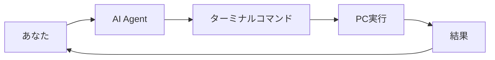

# **第二回（続き）**
## 開発環境構築とエラー対処法
### 〜AI Agentに任せる新時代の開発スタイル〜

**Vibe Coder Bootcamp**
TEKION Group / 泉水亮介
2025年9月23日

---

# パラダイムシフト

## 🎯 **従来の学習 vs AI時代の学習**

### 従来のアプローチ
```
コマンドを覚える → 手で入力 → エラーと格闘 → 解決
```

### AI時代のアプローチ
```
やりたいことを言葉で伝える → AIが実行 → 結果を確認
```

## 今日学ぶこと
**「AIエージェントに適切に指示する方法」**

---

# 本講義の位置づけ

## 🚀 **AI Agent時代の開発者として**

### これまでに学んだこと
- 技術スタックの理解
- AIによる要件定義
- 設計書の自動生成

### これから学ぶこと
- **AI Agent** = あなたの開発アシスタント
- **環境構築** = AIに任せる作業
- **エラー対処** = AIへの最高の質問材料

**コマンドを覚える必要はない、AIとの対話方法を学ぶ**

---

# アジェンダ

## 📋 **本講義の流れ**（45分）

| 時間 | 内容 | アプローチ |
|------|------|----------|
| **15分** | AI Agentとターミナル | AIに指示する方法 |
| **15分** | Next.js環境構築 | AIによる自動セットアップ |
| **15分** | エラーとの付き合い方 | AIを活用した問題解決 |

### 💡 本日のゴール
**AIエージェントを使って環境構築を完了する**

---

# 第1部：AI Agentとターミナル
## コマンドを覚える時代の終わり

---

# ターミナルの新しい考え方

## 🤖 **AI Agentが代わりに操作してくれる**

### 従来の苦労
```bash
# コマンドを覚えて、手で入力する必要があった
cd /Users/name/Documents/project
npm install
npm run dev
```

### AI Agent時代
```
Cursor Composer/Agent に伝える：
「プロジェクトフォルダに移動して、
パッケージをインストールして、
開発サーバーを起動して」
```

**AIが適切なコマンドを生成・実行**

---

# CursorのAI Agent機能

## 🎯 **Composerモードで何でも頼める**

### 起動方法
1. Cursorで `Cmd/Ctrl + Shift + I` を押す
2. Composerモードが開く
3. 日本語で指示する

### 指示例
```
「Next.jsプロジェクトを新規作成して、
必要なパッケージをインストールして、
開発サーバーを起動してください」
```

### AIの実行内容
```bash
npx create-next-app@latest my-app --typescript --tailwind --app
cd my-app
npm install
npm run dev
```

---

# ターミナルとは何か？（理解だけはしておく）

## 🖥️ **PCとの「対話ウィンドウ」**

### なぜ理解が必要？
- **AIの実行内容**を把握するため
- **エラーメッセージ**を読むため
- **問題が起きた時**に状況を理解するため

### ターミナルの役割


**あなたはAIを通じてPCと対話する**

---

# 環境の違いを理解する

## 🌍 **Mac vs Windows**

### AIへの指示で伝えるべき情報

```
「私の環境：Mac / M2チップ / macOS Sonoma」
「私の環境：Windows 11 / PowerShell」
```

### なぜ環境情報が重要？
- コマンドの**書き方が異なる**
- 使えるツールが**異なる**
- エラーの**解決方法が異なる**

**AIは環境に応じた適切なコマンドを生成**

---

# よく使うAI指示パターン

## 📝 **コピペで使える指示集**

### プロジェクト開始時
```
「現在のフォルダ位置を確認して、
デスクトップにmy-appフォルダを作成して、
そこに移動してください」
```

### ファイル操作
```
「srcフォルダ内のすべての.jsファイルを
.tsxに拡張子変更してください」
```

### 環境確認
```
「Node.jsとnpmのバージョンを確認して、
最新版でない場合はアップデート方法を教えてください」
```

---

# 第2部：Next.js環境構築
## AIに全部やってもらう

---

# Node.jsのインストール

## 🟢 **AI Agentへの指示例**

### 状況確認から始める
```
Cursorに指示：
「Node.jsがインストールされているか確認して、
されていない場合はインストール方法を教えてください。
私の環境は[Mac/Windows]です」
```

### AIの実行例
```bash
# バージョン確認
node --version
npm --version

# Macの場合のインストール
brew install node

# Windowsの場合のインストール
winget install OpenJS.NodeJS.LTS
```

---

# Next.jsプロジェクトの作成

## 🚀 **完全自動セットアップ**

### 魔法の一言
```
Cursorに指示：
「SNSアプリを作りたいです。
Next.js 15、TypeScript、Tailwind CSS、
Supabase対応のプロジェクトを
セットアップしてください」
```

### AIがやってくれること
1. プロジェクト作成
2. 必要なパッケージのインストール
3. 設定ファイルの生成
4. 環境変数の準備
5. 開発サーバーの起動

**5分で環境構築完了！**

---

# package.jsonの理解

## 📝 **プロジェクトの設計書**

### AIに聞くべきこと
```
「package.jsonファイルを見て、
このプロジェクトで使える
コマンドを教えてください」
```

### よくあるスクリプト
```json
{
  "scripts": {
    "dev": "開発サーバー起動",
    "build": "本番用ビルド",
    "start": "本番サーバー起動",
    "lint": "コード品質チェック"
  }
}
```

**実行は `npm run [スクリプト名]`**

---

# 開発サーバーの起動

## 🍳 **アプリを動かす**

### シンプルな指示
```
「開発サーバーを起動して、
ブラウザで確認できるように
してください」
```

### AIの実行内容
```bash
npm run dev
# 出力：
# ✓ Ready
# ○ Local: http://localhost:3000
```

### トラブル時の指示
```
「ポート3000が使用中というエラーが出ました。
解決してください」
```

---

# 第3部：エラーとの付き合い方
## エラーは宝物

---

# エラーに対する新しい考え方

## 🎁 **エラー = AIへの最高のプレゼント**

### 従来の反応
```
エラー発生 → パニック → Stack Overflow検索 →
試行錯誤 → 時間浪費
```

### AI時代の対応
```
エラー発生 → エラーメッセージコピー →
AIに貼り付け → 即座に解決策
```

## 重要な心構え
**エラーメッセージは、AIが最も得意とする入力**

---

# エラーメッセージの扱い方

## 📋 **完璧なコピペ術**

### 良い例
```
以下のエラーが出ました。解決してください：

Error: listen EADDRINUSE: address already in use :::3000
    at Server.setupListenHandle [as _listen2] (node:net:1812:16)
    at listenInCluster (node:net:1860:12)

環境：Mac、Next.js 15、Node.js v20
```

### AIの回答
```bash
# ポート3000を使用中のプロセスを確認
lsof -i :3000
# プロセスを停止
kill -9 [PID]
# または別ポートで起動
npm run dev -- -p 3001
```

---

# Next.js特有のエラー集①

## 🚫 **モジュール不足エラー**

### エラー例
```
Module not found: Can't resolve 'react-icons'
Module not found: Can't resolve 'lucide-react'
Cannot find module '@/components/Button' or its corresponding type declarations
```

### AIへの指示
```
「以下のエラーが出ました。解決してください：
Module not found: Can't resolve 'react-icons'
環境：Next.js 15、TypeScript」
```

### AIの解決策
```bash
# パッケージ不足の場合
npm install react-icons
npm install lucide-react

# パスエイリアスの問題の場合
# tsconfig.jsonのpaths設定を確認
```

### 学び
**「Module not found」= パッケージ不足またはパス設定ミス**

---

# Next.js特有のエラー集②

## ⚠️ **環境変数エラー**

### エラー例
```
Error: Missing NEXT_PUBLIC_SUPABASE_URL
Error: Invalid environment variables
TypeError: Cannot read properties of undefined (reading 'SUPABASE_URL')
```

### AIへの完璧な質問
```
「Supabaseの環境変数エラーが出ています：
Error: Missing NEXT_PUBLIC_SUPABASE_URL

Next.js 15でSupabaseを使用しています。
.env.localファイルの正しい設定方法を教えてください」
```

### AIの解決策
```bash
# 1. .env.localファイル作成
touch .env.local

# 2. 環境変数を記入（クライアント側で使う場合はNEXT_PUBLIC_プレフィックス必須）
NEXT_PUBLIC_SUPABASE_URL=your-url
NEXT_PUBLIC_SUPABASE_ANON_KEY=your-key

# 3. 開発サーバーを再起動
npm run dev
```

---

# Next.js特有のエラー集③

## 🎨 **Tailwind CSS v4エラー**

### エラー例
```
Error: Cannot find module 'tailwindcss'
Warning: missing tailwind.config.js
Tailwind IntelliSense not working
Tailwind styles not applying
```

### AIへの指示
```
「Tailwind CSS v4がNext.js 15で動作しません。
スタイルが適用されず、IntelliSenseも効きません。
設定を確認してください」
```

### AIの解決策
```bash
# Tailwind v4のインストール
npm install -D tailwindcss @tailwindcss/postcss postcss

# postcss.config.mjsの設定
export default {
  plugins: {
    "@tailwindcss/postcss": {}
  }
}

# app/globals.cssの修正（v4は@importを使用）
@import "tailwindcss";
@theme {
  --color-primary: oklch(0.64 0.12 262);
}
```

---

# Next.js特有のエラー集④

## 🔄 **Hydration Mismatchエラー**

### エラー例
```
Error: Hydration failed because the initial UI does not match what was rendered on the server.
Text content does not match server-rendered HTML.
Warning: Expected server HTML to contain a matching <div>
```

### AIへの詳細な質問
```
「Hydrationエラーが発生しています：
Text content does not match server-rendered HTML.

コンポーネントでDate.now()を使用しています。
Next.js 15 App Routerで解決方法を教えてください」
```

### AIの解決策
```jsx
// ❌ 問題のあるコード
const TimeDisplay = () => {
  return <div>{new Date().toLocaleString()}</div>
}

// ✅ 修正版
'use client'
import { useState, useEffect } from 'react'

const TimeDisplay = () => {
  const [time, setTime] = useState<string>('')

  useEffect(() => {
    setTime(new Date().toLocaleString())
  }, [])

  return <div>{time || 'Loading...'}</div>
}
```

---

# Next.js特有のエラー集⑤

## 🖼️ **Image最適化エラー**

### エラー例
```
Error: Invalid src prop ... hostname is not configured
Error: Sharp is not installed
Error: Image Optimization using Sharp is not available
ECONNREFUSED localhost:3000
```

### AIへの質問テンプレート
```
「Next.js Imageコンポーネントでエラーが出ます：
Error: Invalid src prop ... hostname 'images.example.com' is not configured

外部画像を使用したいです。next.config.jsの
設定方法を教えてください」
```

### AIの解決策
```javascript
// next.config.js
module.exports = {
  images: {
    remotePatterns: [
      {
        protocol: 'https',
        hostname: 'images.example.com',
        pathname: '/**',
      },
    ],
  },
}

// Sharpのインストール
npm install sharp
```

---

# Next.js特有のエラー集⑥

## ⚡ **Server/Client Componentエラー**

### エラー例
```
You're importing a component that needs useState/useEffect...
You're importing a component that needs next/headers...
Async Server Component TypeScript Error
'Promise<Element>' is not a valid JSX element
```

### AIへの完璧な質問
```
「Server ComponentでuseStateを使おうとしたらエラーが出ました：
You're importing a component that needs useState

正しい実装方法を教えてください」
```

### AIの解決策
```jsx
// ❌ Server ComponentでuseStateは使えない
export default function Page() {
  const [count, setCount] = useState(0) // エラー！
}

// ✅ Client Componentとして分離
// components/Counter.tsx
'use client'
import { useState } from 'react'

export default function Counter() {
  const [count, setCount] = useState(0)
  return <button onClick={() => setCount(count + 1)}>{count}</button>
}

// app/page.tsx (Server Component)
import Counter from '@/components/Counter'

export default function Page() {
  return <Counter />
}
```

---

# Next.js特有のエラー集⑦

## 🎬 **Server Actions エラー**

### エラー例
```
Error: Failed to find Server Action
Error: Server actions must be async functions
useActionState is not defined
useOptimistic TypeError
```

### AIへの質問例
```
「Server ActionとuseActionStateでエラーが出ます：
Failed to find Server Action

以下のコードの問題点を指摘してください：
[コードを貼る]」
```

### AIの解決策
```typescript
// actions.ts
'use server'

export async function submitForm(prevState: any, formData: FormData) {
  const name = formData.get('name')
  // 処理...
  return { success: true }
}

// Form.tsx
'use client'
import { useActionState } from 'react'
import { submitForm } from './actions'

export default function Form() {
  const [state, formAction, isPending] = useActionState(
    submitForm,
    { success: false }
  )

  return (
    <form action={formAction}>
      <input name="name" />
      <button disabled={isPending}>送信</button>
    </form>
  )
}
```

---

# Next.js特有のエラー集⑧

## 📦 **ビルド・デプロイエラー**

### エラー例
```
Error: EMFILE: too many open files
Error: Cannot find module '.next/server/app-paths-manifest.json'
Type error: Property does not exist on type 'JSX.IntrinsicElements'
Module parse failed: Unexpected token
```

### AIへの包括的な質問
```
「Next.jsのビルドでエラーが出ます：
EMFILE: too many open files

環境：Mac M2、Next.js 15
大規模プロジェクトです。解決方法を教えてください」
```

### AIの解決策
```bash
# ファイルディスクリプタ制限を上げる
ulimit -n 65535

# キャッシュクリア
rm -rf .next node_modules
npm install

# ビルド再実行
npm run build
```

---

# Next.js特有のエラー集⑨

## 🔌 **API Routes / Route Handlersエラー**

### エラー例
```
Error: Response body object should not be disturbed or locked
TypeError: Failed to parse URL from /api/data
Error: Dynamic server usage: headers
```

### AIへの質問
```
「App RouterのRoute Handlerでエラーが出ます：
Dynamic server usage: headers

キャッシュの設定も含めて正しい実装を教えてください」
```

### AIの解決策
```typescript
// app/api/data/route.ts
import { NextRequest, NextResponse } from 'next/server'

// キャッシュを無効化（Next.js 15のデフォルト）
export const dynamic = 'force-dynamic'
// または特定のキャッシュ設定
// export const revalidate = 60 // 60秒キャッシュ

export async function GET(request: NextRequest) {
  // headersを使用する場合
  const headersList = request.headers
  const userAgent = headersList.get('user-agent')

  return NextResponse.json({ data: 'success' })
}
```

---

# Next.js特有のエラー集⑩

## 🔐 **TypeScriptエラー**

### エラー例
```
Type error: 'Promise<Element>' is not a valid JSX element
Property 'children' does not exist on type
Cannot find name 'React'. Did you mean 'react'?
```

### AIへの質問
```
「TypeScriptでAsync Componentのエラーが出ます：
'Promise<Element>' is not a valid JSX element

Next.js 15、TypeScript 5.4を使用しています」
```

### AIの解決策
```json
// tsconfig.json
{
  "compilerOptions": {
    "jsx": "preserve",
    "moduleResolution": "bundler",
    "allowJs": true,
    "skipLibCheck": true,
    "strict": true
  }
}

// package.json - 最新版に更新
"@types/react": "^18.3.0",
"@types/react-dom": "^18.3.0",
"typescript": "^5.4.0"
```

---

# Chrome開発者ツール

## 🔍 **ブラウザ側のエラー確認**

### AIへの指示方法
```
「ブラウザで画面が真っ白になりました。
Chrome開発者ツールで確認する方法と、
エラーの読み方を教えてください」
```

### AIが教えてくれること
1. F12キーで開発者ツールを開く
2. Consoleタブでエラー確認
3. Networkタブで通信確認
4. エラーメッセージの解釈

**スクリーンショットをAIに送ると更に効果的**

---

# AIへの質問テンプレート集

## 📝 **コピペで使える質問フォーマット**

### 基本テンプレート
```
環境情報：
- Next.js: 15.x
- Node.js: v20.x
- OS: Mac/Windows
- 使用パッケージ: [package.jsonの内容]

エラー内容：
[エラーメッセージ全文をコピペ]

コンテキスト：
- 何をしようとしていたか
- どのファイルでエラーが発生したか
- 関連コード：[該当部分をコピペ]

試したこと：
- npm install実行済み
- キャッシュクリア済み

解決したい内容：
[具体的に何を実現したいか]
```

### 緊急時の短縮版
```
「Next.js 15で以下のエラーが出ました。
即座に解決してください：

[エラーメッセージ]

環境: Mac M2, Node v20"
```

---

# エラー解決のベストプラクティス

## 💎 **段階的エスカレーション**

### レベル1: 基本的な解決
```
「このエラーを解決してください：
[エラーメッセージ]」
```

### レベル2: 詳細な分析
```
「このエラーの原因を詳しく分析して、
段階的な解決手順を提示してください」
```

### レベル3: 代替アプローチ
```
「通常の方法で解決できない場合の
代替案を3つ提案してください」
```

### レベル4: 根本的な再設計
```
「このエラーを回避するための
アーキテクチャ変更を提案してください」
```

---

# デバッグのAI活用術

## 🛠️ **問題解決フロー**

### ステップ1：状況把握
```
「アプリが動かなくなりました。
何から確認すればいいですか？」
```

### ステップ2：ログ確認
```
「ターミナルとブラウザコンソールの
エラーをすべて送ります」
```

### ステップ3：解決実行
```
「提案された解決策を実行してください」
```

### ステップ4：確認
```
「修正後も同じエラーが出ます。
次の手を教えてください」
```

---

# 実践演習

## 🎯 **やってみよう！**

### 演習1：環境構築
```
Cursorに指示：
「ToDoアプリ用のNext.jsプロジェクトを
TypeScriptとTailwindで作成してください」
```

### 演習2：意図的なエラー
```
1. わざとタイポを入れる
2. エラーメッセージをコピー
3. AIに解決させる
```

### 演習3：パッケージ追加
```
「このプロジェクトにアイコンライブラリと
日付処理ライブラリを追加してください」
```

---

# トラブルシューティングTips

## 💡 **困ったときの魔法の言葉**

### 汎用的な依頼
```
「うまく動きません。
デバッグを手伝ってください」
```

### 詳細な調査依頼
```
「このエラーの原因を調べて、
段階的な解決手順を教えてください」
```

### 代替案の依頼
```
「この方法でうまくいかない場合の
別の解決方法を3つ提案してください」
```

---

# AIツールの使い分け

## 🤖 **適材適所で活用**

| ツール | 得意分野 | 使用場面 |
|--------|----------|----------|
| **Cursor Agent** | コマンド実行・ファイル操作 | 環境構築・自動化 |
| **Claude** | 詳細な説明・設計 | エラー解析・学習 |
| **ChatGPT** | 一般的な質問 | 概念理解 |
| **GitHub Copilot** | コード補完 | 実装時 |

### 使い分けのコツ
- **実行が必要** → Cursor Agent
- **説明が欲しい** → Claude
- **コードを書く** → Copilot

---

# 環境構築チェックリスト

## ✅ **AIに確認してもらう項目**

### 必須項目
```
Cursorに指示：
「以下の項目がすべて正しくインストール
されているか確認してください：
- Node.js (v20以上)
- npm または yarn
- Git
- 必要なVS Code拡張機能」
```

### 確認結果の例
```bash
✓ Node.js: v20.11.0
✓ npm: 10.2.4
✓ Git: 2.43.0
✓ Extensions: ESLint, Prettier, Tailwind IntelliSense
```

---

# 本日のまとめ

## 🎊 **新しい開発スタイルの確立**

### パラダイムシフト
✅ **コマンドを覚える** → **AIに指示する**
✅ **エラーで悩む** → **AIに聞く**
✅ **手動で環境構築** → **AIが自動構築**

### 身についたスキル
1. **AI Agentへの適切な指示方法**
2. **エラーメッセージの活用法**
3. **効率的なデバッグフロー**

### 重要な気づき
**「知識を覚える」より「AIとの対話力」が重要**

---

# 次回予告

## 📅 **第二回（最後）：GitHubとチーム開発**

### 学ぶこと
- **GitHub** = コードの保管庫
- **Git** = バージョン管理
- **プルリクエスト** = チーム開発の作法

### AIの活用方法
- コミットメッセージの自動生成
- マージコンフリクトの解決
- コードレビューの支援

**AIと一緒にチーム開発を始めよう！**

---

# 宿題

## 📝 **実践課題**

### 課題内容
1. **Cursorを使って**Next.jsプロジェクトを作成
2. **意図的に**3つ以上のエラーを発生させる
3. **AIを使って**すべて解決する
4. **解決過程**をドキュメント化

### 提出物
- プロジェクトのGitHubリポジトリURL
- エラーと解決方法のまとめ（Markdown）

### 評価ポイント
- AIへの指示の適切さ
- エラー解決のアプローチ
- ドキュメントの分かりやすさ

---

# 参考リソース

## 📚 **さらに学びたい方へ**

### AIツール
- [Cursor Documentation](https://cursor.com/docs)
- [Claude AI](https://claude.ai)
- [GitHub Copilot](https://github.com/features/copilot)

### 開発環境
- [Next.js公式](https://nextjs.org)
- [Node.js公式](https://nodejs.org)
- [npm Documentation](https://docs.npmjs.com)

### トラブルシューティング
- エラーメッセージをそのままAIに
- スクリーンショットを活用
- 環境情報を必ず添える

---

# 質疑応答

## ❓ **よくある質問**

### Q: AIが間違った回答をしたら？
**A:** 別の聞き方をするか、別のAIツールに聞く

### Q: コマンドを全く覚えなくていい？
**A:** 基本的な概念は理解、実行はAIに任せる

### Q: エラーが解決しない場合は？
**A:** エラーメッセージ全文 + 環境情報 + スクリーンショット

### Q: 英語のエラーが分からない
**A:** AIに「日本語で説明して」と依頼

---

# 最後に

## 🌟 **Vibe Coderとしての心構え**

### 忘れないでください
> **「AIは最強の開発パートナー」**
>
> コマンドを覚える必要はない
> エラーを恐れる必要はない
>
> 必要なのは、
> **AIと対話する勇気だけ**

### 本日の学び
**環境構築もエラー対処も、すべてAIと一緒に**

**Happy Coding with AI! 🚀**