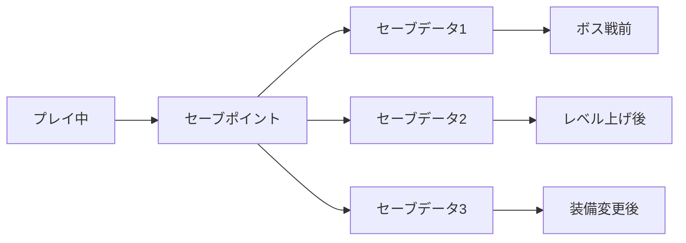
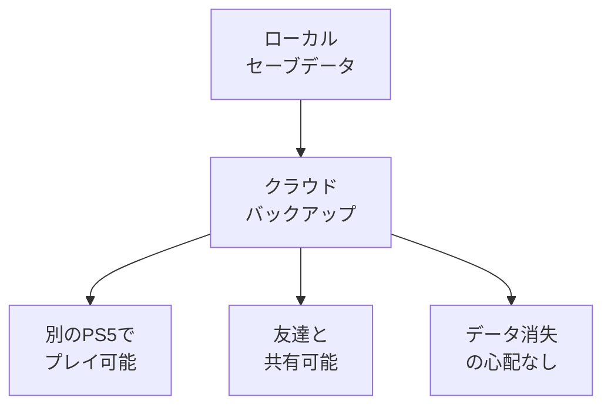
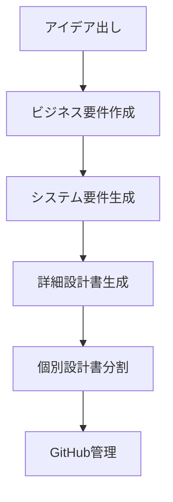
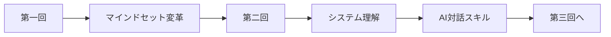

# **第二回（最終）**
## バージョン管理と宿題
### 〜AIエージェントに全部任せるGit管理〜

**Vibe Coder Bootcamp**
TEKION Group / 泉水亮介
2025年9月23日

---

# 本日の最終セッション

## 🎯 **第二回の締めくくり**

### これまでに学んだこと
- Webアプリの仕組みとAPI
- 技術スタックとAI要件定義
- AIエージェント駆動開発
- エラー対処の新しい方法

### これから学ぶこと
- **Git/GitHub** = AIが管理するコード保管庫
- **ドキュメント** = AIが自動生成する設計書
- **宿題** = AIとの対話を極める実践課題

---

# アジェンダ

## 📋 **本講義の流れ**（45分）

| 時間 | 内容 | アプローチ |
|------|------|----------|
| **15分** | AI時代のバージョン管理 | GitをAIに任せる |
| **15分** | 演習：GitHub実践 | AIと一緒にリポジトリ作成 |
| **15分** | 宿題説明 | 詳細設計書の自動生成 |

### 💡 本日のゴール
**コード管理もドキュメント作成も、すべてAIと一緒に**

---

# 第1部：AI時代のバージョン管理
## GitもGitHubもAIに任せよう

---

# Gitとは何か？

## 🎮 **ゲームのセーブシステム**

### RPGゲームに例えると



**Gitは、コードの「セーブポイント」を作るシステム**

---

# GitHubとは何か？

## ☁️ **セーブデータのクラウドストレージ**

### PlayStation Plusのような存在



**GitHubは、コードを安全に保管し、共有できる場所**

---

# なぜバージョン管理が必要？

## 💔 **よくある悲劇**

### バージョン管理なしの世界
```
my-app_最新.zip
my-app_最新_修正版.zip
my-app_最新_修正版_最終.zip
my-app_最新_修正版_最終_本当に最終.zip
my-app_最新_修正版_最終_本当に最終_これが最後.zip
```

### 結果
- どれが本当の最新か分からない
- 間違えて古いファイルを上書き
- チームメンバーとの共有が困難
- **全データ消失のリスク**

---

# AI時代の新しいGit管理

## 🤖 **コマンドを覚える必要なし**

### 従来のアプローチ
```bash
# これらを覚える必要があった...
git init
git add .
git commit -m "Initial commit"
git remote add origin https://github.com/...
git push -u origin main
```

### AI時代のアプローチ
```
Cursorに指示：
「このプロジェクトをGitHubで管理したい。
新しいリポジトリを作って、
最初のコミットをプッシュして」
```

**AIがすべてのコマンドを実行してくれる！**

---

# Cursor/GitHubのAI機能

## ✨ **2025年の最新機能**

### 自動コミットメッセージ生成
```
Cursor: 変更内容を分析して適切なメッセージを提案
GitHub Copilot: コミットメッセージを自動生成
```

### プルリクエストのAI支援
```
- PR概要の自動生成
- コードレビューのAI提案
- マージコンフリクトの自動解決
```

### セキュリティチェック
```
- コードの脆弱性を自動検出
- 修正案の自動提案
```

---

# バージョン管理の基本概念

## 📚 **知っておくべき用語**

| 用語 | ゲームに例えると | 意味 |
|------|-----------------|------|
| **Repository** | ゲームカートリッジ | プロジェクトの保存場所 |
| **Commit** | セーブポイント | 変更の記録 |
| **Branch** | 別ルート | 並行開発の分岐 |
| **Merge** | ルート合流 | 分岐の統合 |
| **Push** | クラウドにアップロード | リモートへの送信 |
| **Pull** | クラウドからダウンロード | リモートから取得 |

**用語は理解、操作はAIに任せる**

---

# AIへの指示パターン①

## 📝 **新規プロジェクトの開始**

### コピペで使える指示
```
「新しいプロジェクトをGitHubで管理したいです。
1. Gitリポジトリを初期化
2. GitHubに新しいプライベートリポジトリを作成
3. READMEファイルを追加
4. 最初のコミットとプッシュ

プロジェクト名：my-awesome-app
説明：AIで作るタスク管理アプリ」
```

### AIの実行内容
- 必要なGitコマンドをすべて実行
- GitHubリポジトリの作成手順を案内
- 初期設定を完了

---

# AIへの指示パターン②

## 📝 **日常的な変更の保存**

### シンプルな指示
```
「今の変更をコミットして、
GitHubにプッシュしてください」
```

### AIの賢い対応
1. 変更内容を分析
2. 適切なコミットメッセージを生成
3. コミットとプッシュを実行

### Cursorの便利機能
- **✨ボタン**をクリックするだけ
- コミットメッセージの自動生成
- Conventional Commitsに準拠

---

# AIへの指示パターン③

## 📝 **チーム開発のワークフロー**

### ブランチ作成と作業
```
「新機能を開発したいので、
feature/user-authenticationという
ブランチを作って切り替えてください」
```

### プルリクエストの作成
```
「現在のブランチの変更を
GitHubのプルリクエストとして
作成してください。

タイトル：ユーザー認証機能の追加
説明：メールとパスワードによる認証を実装」
```

---

# マージコンフリクトの解決

## 🔥 **恐れる必要なし！**

### 従来の恐怖
```
<<<<<<< HEAD
// あなたの変更
const price = item.price * 1.1;
=======
// 他の人の変更
const price = item.cost * 1.08;
>>>>>>> main
```

### AI時代の解決法
```
「マージコンフリクトが発生しました。
以下のコンフリクトを解決してください：
[コンフリクト内容をコピペ]

私の意図：税込み価格を計算したい」
```

**AIが最適な解決策を提案**

---

# .gitignoreの重要性

## 🚫 **アップロードしてはいけないもの**

### AIに生成してもらう
```
「Next.js 15のプロジェクト用の
.gitignoreファイルを作成してください。
Supabaseの環境変数も含んでいます」
```

### 生成される内容（一部）
```gitignore
# 環境変数（絶対に公開しない！）
.env
.env.local
.env.production

# 依存関係（巨大すぎる）
node_modules/

# ビルド結果
.next/
out/

# OS関連
.DS_Store
Thumbs.db
```

---

# 第2部：GitHub演習
## AIと一緒にリポジトリを作ろう

---

# 演習：GitHubアカウント準備

## 🎯 **まずはアカウント作成**

### 既にお持ちの方
- そのまま使用してOK

### 初めての方
```
AIに指示：
「GitHubアカウントの作成方法を
ステップバイステップで教えてください」
```

### 推奨設定
- **Username**: 本名またはニックネーム
- **Email**: 普段使うメールアドレス
- **プラン**: 無料プランでOK

---

# 演習：リポジトリ作成

## 🚀 **実際に作ってみよう**

### ステップ1：GitHubで新規リポジトリ
1. GitHubにログイン
2. 右上の「+」→「New repository」
3. 以下を設定：
   - **Repository name**: vibe-coder-project
   - **Description**: Vibe Coder Bootcampの練習プロジェクト
   - **Private**: チェック（非公開）
   - **Add README**: チェック

### ステップ2：作成をクリック
**これでクラウド側の準備完了！**

---

# 演習：ローカルとの連携

## 🔗 **プロジェクトとGitHubを接続**

### Cursor Agentへの指示
```
「現在のプロジェクトを
GitHubリポジトリと連携させてください。

リポジトリURL：
https://github.com/[あなたのユーザー名]/vibe-coder-project

すべての設定を自動で行ってください」
```

### AIがやってくれること
1. Git初期化
2. リモートリポジトリの設定
3. 初回コミット
4. プッシュ

---

# 演習：最初のコミット

## 💾 **変更を保存してみよう**

### ファイルを作成
```
AIに指示：
「プロジェクトの説明を書いたREADME.mdを
作成してください。内容は以下です：

# My Vibe Coder Project
AIと一緒に作るWebアプリケーション
技術スタック：Next.js, TypeScript, Supabase」
```

### コミット＆プッシュ
```
「READMEを追加したので、
コミットしてGitHubにプッシュしてください」
```

---

# 演習：確認

## ✅ **GitHubで確認**

### ブラウザで確認
1. GitHubのリポジトリページを開く
2. READMEが表示されているか確認
3. コミット履歴を見てみる

### 成功のサイン
- ファイルがGitHubに表示される
- コミットメッセージが記録されている
- 「Initial commit」などのメッセージが見える

**おめでとうございます！**
これでバージョン管理の第一歩を踏み出しました

---

# コラボレーターの追加

## 👥 **講師をプロジェクトに招待**

### 手順
1. GitHubリポジトリの「Settings」タブ
2. 左メニューの「Collaborators」
3. 「Add people」ボタン
4. `rsensui` を検索して追加
5. 招待を送信

### なぜ必要？
- 宿題のレビュー
- フィードバックの提供
- 困った時のサポート

---

# 第3部：宿題説明
## AIと対話して設計書を作る

---

# 宿題の全体像

## 🎯 **AI駆動設計の実践**

### 宿題の流れ


### 重要ポイント
**あなたがやることは「アイデアを書く」だけ**
残りはすべてAIが自動生成！

---

# 課題1：アイデアを書く

## 💡 **何を作りたいか決める**

### `docs/input/idea.md`を作成

```markdown
# プロジェクト概要
- 名前: 今日の気分記録アプリ
- 説明: 毎日の気分を記録し、振り返れるWebアプリ
- 目的: 自分の感情パターンを可視化したい
- ターゲット: セルフケアに興味がある20-30代

# 主要機能
1. 気分を5段階のアイコンで記録
2. 一言メモを追加
3. カレンダー表示
4. 月次統計レポート
```

---

# アイデアのヒント

## 🎨 **困ったら以下から選ぼう**

### 初心者向け
- **ToDoリスト**: タスク管理の定番
- **メモ帳アプリ**: シンプルで実用的
- **タイマーアプリ**: ポモドーロタイマー

### 中級者向け
- **家計簿アプリ**: 収支管理
- **習慣トラッカー**: 習慣化支援
- **レシピ管理**: 料理レシピ保存

### 上級者向け
- **チャットアプリ**: リアルタイム通信
- **カンバンボード**: プロジェクト管理
- **ポートフォリオサイト**: 作品展示

---

# 課題2：システム要件生成

## 🤖 **AIに骨組みを作ってもらう**

### Cursorでの実行
```
AIに指示：
「@docs/prompt/system-requirements-prompt.md
を実行してください」
```

### 何が起きるか
1. AIが`idea.md`を読み込む
2. ビジネス要件を分析
3. `system_requirements.md`を自動生成

### 生成される内容
- プロジェクト概要
- 機能要件一覧
- 非機能要件
- 技術スタック提案

---

# 課題3：詳細設計書生成

## 📋 **実装レベルまで詳細化**

### 次のプロンプトを実行
```
AIに指示：
「@docs/prompt/detailed_requirements_prompt.md
を実行してください」
```

### 生成される内容
- **画面遷移図**（Mermaid）
- **データベース設計**（ER図）
- **API仕様**
- **UI/UXガイドライン**
- **セキュリティ要件**

**これだけで実装可能な設計書が完成！**

---

# 課題4：設計書の分割

## 📁 **専門別にファイル分割**

### さらに詳細化
```
AIに指示：
「@docs/prompt/generate_detailed_design_files_prompt.md
を実行してください」
```

### 生成される5つのファイル
```
docs/design/
├── database-design.md     # DB設計
├── api-specification.md   # API仕様
├── ui-ux-design.md        # UI/UX設計
├── security-design.md     # セキュリティ
└── deployment-guide.md    # デプロイ手順
```

---

# 課題5：設計書のブラッシュアップ

## ✏️ **AIと対話して改善**

### 生成された設計書をレビュー
```
AIに指示：
「生成された設計書を見て、
以下の点を改善してください：

1. [気になる点や追加したい機能]
2. [UIの具体的なイメージ]
3. [技術的な要件]

修正版を作成してください」
```

### ブラッシュアップのポイント
- 機能の優先順位を明確に
- UIの具体的なイメージを追加
- 実装の難易度を考慮

---

# 課題6：フロントエンド実装

## 🎨 **UIを実際に作ってみよう**

### 専用プロンプトを使用
```
AIに指示：
「@docs/prompt/frontend-implementation-prompt.md
を実行してください」
```

### 何が起きるか
1. 設計書を読み込み
2. Next.js 15プロジェクトを構築
3. すべてのページのUIを生成
4. レスポンシブデザインを適用

### 確認方法
```bash
npm run dev
# http://localhost:3000 で確認
```

---

# 課題7：GitHubで管理

## 🚀 **成果物を保存**

### すべてをGitHubへ
```
AIに指示：
「これまでの成果物をすべて
GitHubにプッシュしてください。

コミットメッセージ：
feat: AI生成による設計書とフロントエンド実装を追加」
```

### 確認項目
- [ ] `docs/input/idea.md`
- [ ] `docs/output/`の生成ファイル
- [ ] `docs/design/`の設計書
- [ ] `app/`フォルダのフロントエンド
- [ ] 動作するUIが完成

---

# AIドキュメント生成ツール

## 🛠️ **最新のツール紹介**

### README自動生成
| ツール | 特徴 | 使い方 |
|--------|------|--------|
| **readme-ai** | CLI、高品質 | `npx readme-ai` |
| **GitHub Copilot** | PR作成も可能 | Issueから生成 |
| **Cursor** | 統合環境 | AIチャットで依頼 |

### 活用方法
```
「このプロジェクトのREADMEを
プロフェッショナルな形式で
自動生成してください」
```

---

# ドキュメント管理のコツ

## 📚 **AIと一緒に保守**

### 推奨構造
```
docs/
├── README.md           # プロジェクト概要
├── input/             # 入力（要件）
├── output/            # AI生成物
├── design/            # 設計書
└── guides/            # 使い方ガイド
```

### 更新の自動化
```
「コードを変更したので、
関連するドキュメントも
更新してください」
```

---

# 提出方法

## 📮 **宿題の提出**

### 提出物
1. **GitHubリポジトリURL**
2. **動作するフロントエンドのスクリーンショット**
3. **講師を Collaborator に追加**

### Slackでの共有
```
@channel
第2回の宿題を提出します！

リポジトリ：https://github.com/[username]/[repo]
講師（@rsensui）を追加済みです

実装内容：
- [作ったアプリの説明]
- [実装できたページ数]
- [工夫した点]

スクリーンショット：[画像添付]
```

### 評価ポイント
- 設計書の完成度
- UIの実装度
- AIとの対話の質

---

# 提出期限とサポート

## 📅 **スケジュール**

### 提出期限
**次回講義の前日まで**

### 困ったときは
1. エラーメッセージをAIに聞く
2. それでも解決しない → Slackで質問
3. オフィスアワーで相談

### レビューのポイント
- アイデアの明確さ
- 設計書の完成度
- **フロントエンドの実装度**
- レスポンシブ対応
- AIとの対話の質

---

# 重要なマインドセット

## 💎 **Vibe Coderの心得**

### ✅ **覚えておくこと**

1. **良い入力が良い出力を生む**
   - 明確なアイデア → 明確な設計書

2. **AIの生成物をレビューする**
   - 期待と違えば修正を依頼

3. **エラーはAIへの質問**
   - エラーメッセージは貴重な情報

### ❌ **やらないこと**
- コマンドを暗記する
- 手動でファイルを管理する
- エラーで諦める

---

# 本日のまとめ

## 🎊 **第二回完了！**

### 今日学んだこと
✅ **Webアプリの仕組み** を理解
✅ **技術スタック** を把握
✅ **AI要件定義** を実践
✅ **エラー対処法** を習得
✅ **Git/GitHub** をAIで管理

### できるようになったこと
- アイデアから設計書まで自動生成
- エラーをAIで即座に解決
- プロジェクトをGitHubで管理

**あなたはもうVibe Coder！**

---

# 次回予告

## 📅 **第三回：バックエンド実装**

### 学ぶこと
- **データベース** = Supabaseで簡単構築
- **認証システム** = Clerkで安全実装
- **CRUD機能** = AIが全部書いてくれる

### 準備すること
- 今回の宿題を完成させる
- 設計書をレビューしておく
- 実装への期待を高める

**設計書さえあれば、実装は簡単！**

---

# Q&A タイム

## ❓ **よくある質問**

### Q: GitHubは公開される？
**A:** Privateリポジトリなら非公開です

### Q: コミットメッセージの書き方は？
**A:** AIが自動生成、Conventional Commits準拠

### Q: マージコンフリクトが怖い
**A:** AIが解決方法を教えてくれます

### Q: ドキュメント更新が面倒
**A:** コード変更時にAIに更新依頼

---

# 参考リソース

## 📚 **さらに学びたい方へ**

### Git/GitHub
- [GitHub公式ドキュメント](https://docs.github.com)
- [Git入門（サルでもわかる）](https://backlog.com/ja/git-tutorial/)

### AIツール
- [readme-ai](https://github.com/eli64s/readme-ai)
- [GitHub Copilot](https://github.com/features/copilot)

### プロンプト集
- `docs/prompt/`フォルダ内のファイル
- Cursor公式プロンプト例

---

# エンディング

## 🌟 **今日の格言**

> **"Version control is not about memorizing commands,**
> **it's about letting AI handle the complexity"**
>
> バージョン管理はコマンドを覚えることではない、
> AIに複雑さを任せることだ

### 本日の学び
**Git も GitHub も、すべてAIと一緒に**

### 宿題頑張ってください！
**Your code, AI's management! 🚀**

---

# 補足：Conventional Commits

## 📝 **AIが従うコミット規約**

### 基本フォーマット
```
<type>: <description>

[optional body]
```

### よく使うタイプ
| タイプ | 用途 | 例 |
|--------|------|-----|
| **feat** | 新機能 | `feat: ユーザー認証機能を追加` |
| **fix** | バグ修正 | `fix: ログインエラーを修正` |
| **docs** | ドキュメント | `docs: READMEを更新` |
| **style** | スタイル調整 | `style: インデントを修正` |
| **refactor** | リファクタリング | `refactor: 関数を分割` |

**AIが自動的にこの形式で生成！**

---

# 補足：.gitignoreテンプレート

## 🚫 **Next.js用の完全版**

```gitignore
# 依存関係
node_modules/
/.pnp
.pnp.js

# 本番ビルド
/.next/
/out/

# デバッグ
npm-debug.log*
yarn-debug.log*
yarn-error.log*

# 環境変数（超重要！）
.env
.env.local
.env.development.local
.env.test.local
.env.production.local

# エディタ
.vscode/
.idea/

# OS
.DS_Store
Thumbs.db
```

---

# 補足：GitHub Actions

## 🤖 **自動化の未来**

### 自動テスト・デプロイ
```yaml
name: CI/CD

on:
  push:
    branches: [main]

jobs:
  test-and-deploy:
    runs-on: ubuntu-latest
    steps:
      - uses: actions/checkout@v3
      - run: npm install
      - run: npm test
      - run: npm run build
```

### AIへの指示
```
「GitHub Actionsで自動テストと
デプロイを設定してください」
```

**第4回で詳しく学びます！**

---

# トラブルシューティング

## 🔧 **よくあるトラブルと対処**

### Permission denied
```
AIに指示：
「GitHubへのプッシュで権限エラーが出ました。
解決方法を教えてください」
```

### Repository not found
```
「リポジトリが見つからないエラーです。
URLの確認方法と修正方法を教えてください」
```

### Large files warning
```
「ファイルサイズが大きすぎる警告が出ました。
.gitignoreの設定を見直してください」
```

**すべてAIが解決策を提供！**

---

# 成功のコツ

## 💡 **宿題を楽しむために**

### 1. 小さく始める
- シンプルなアイデアから
- 完璧を求めない
- 動くものを優先

### 2. AIと対話を楽しむ
- 色々な聞き方を試す
- 生成物を比較する
- フィードバックを与える

### 3. エラーを恐れない
- エラー = 学習機会
- AIが必ず助けてくれる
- 解決過程を楽しむ

---

# 最後のメッセージ

## 🎓 **第二回お疲れ様でした！**

### あなたの成長


### 次回への期待
**設計書を実装に変える魔法を学びます**

### Remember
**You are not alone. AI is always with you!**

**Happy Coding with AI! 🚀**