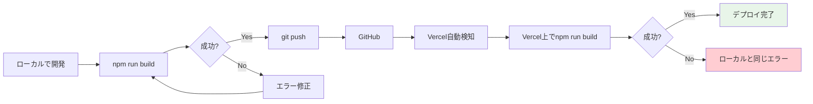
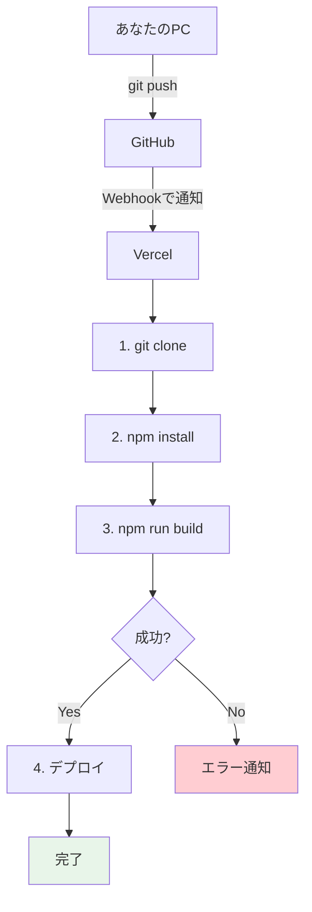
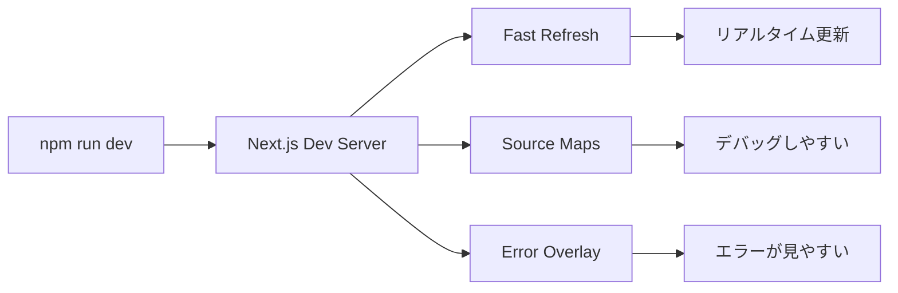
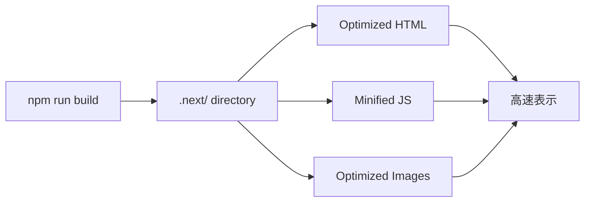

<!--
_class: lead
_paginate: false
-->

# **第四回**
## 実装レビューとデプロイ準備

**あなたのアプリに「魂」が宿り、世界への扉が開く瞬間**

---

## 📋 講師向けガイド

**タイムテーブル（90分講義）**

| 時間 | セクション | 分数 |
|:---|:---|:---:|
| 10:00-10:10 | Part 0: 本質の理解 | 10分 |
| 10:10-10:25 | Part 1: 宿題レビュー | 15分 |
| 10:25-10:55 | Part 2: ビルドの重要性 | 30分 |
| 10:55-11:15 | Part 3: デプロイ前準備 | 20分 |
| 11:15-11:30 | まとめ・質疑応答 | 15分 |

**⚠️ 重要**: Appendixは講義で扱いません。受講者から質問があれば「Appendixを参照してください」と案内。

---

## 本日のアジェンダ

1. **Part 0: 本質の理解** (10分)
   - デプロイとは何か
   - 最重要原則

2. **Part 1: 宿題レビュー** (15分)
   - CRUD機能付きアプリケーションの共有
   - よくあるエラーと解決法

3. **Part 2: ビルドの重要性** (30分)
   - ローカル環境 vs 本番環境
   - ビルドプロセスの理解

4. **Part 3: デプロイ前準備** (20分)
   - デプロイ前チェックリスト
   - 実践ワークフロー

---

<!--
_class: lead
_paginate: false
_backgroundColor: #fff4e1
-->

# 📍 Part 0: 本質の理解
## デプロイ準備の核心

**⏱ 所要時間：10分**

---

## 【本質】デプロイとは何か？

<div class="essence">

**一言で言うと**

```
あなたのPC（ローカル）で動いているアプリを
インターネット上のサーバー（本番）に配置すること
```

</div>

**今の状態**
```
あなたのPC  ← あなたしか使えない
localhost:3000
```

**デプロイ後**
```
インターネット上のサーバー  ← 世界中の誰でも使える
https://your-app.vercel.app
```

---

## 【最重要原則】これだけは覚えて

<div class="essence">

**「ローカルでビルドできなければ、本番でもビルドできない」**

</div>

**デプロイ前に必ずやること**

```bash
npm run build
```

**✅ 成功したら** → デプロイOK
**❌ 失敗したら** → エラーを修正してから

**理由**: Vercelは、あなたのPCと同じコマンドを実行するだけ

---

## デプロイの全体フロー



**ポイント**: ローカルで成功すれば、Vercelでも成功する

---

## デプロイ前チェックリスト（簡易版）

<div class="essence">

**必須チェック項目**

1. ✅ `npm run build` が成功する
2. ✅ `.env.local` の内容をメモしている
3. ✅ GitHubに最新コードがプッシュ済み
4. ✅ mainブランチが最新
5. ✅ エラーが出ていない

</div>

**これさえ確認すれば、デプロイは成功します**

---

## ビルドとは何か？

<div class="essence">

**一言で言うと**

```
あなたのコードを「本番用に最適化」すること
```

</div>

**ビルドが行うこと**
- TypeScript → JavaScript に変換
- コードを圧縮して小さくする
- 複数ファイルを1つにまとめる
- 画像を最適化する

**結果**: 高速で動作するアプリが完成

---

<!--
_class: lead
_paginate: false
_backgroundColor: #e3f2fd
-->

# 👉 Part 1: 宿題レビュー
## あなたのアプリに「魂」が宿った

**⏱ 所要時間：15分**

---

## 第三回の宿題を振り返る

**目標**: SupabaseとClerkを統合し、CRUD機能を実装する

皆さんはここまでの道のりで：
- ✅ **データベース設計**を完成させた
- ✅ **認証システム**を実装した
- ✅ **データの永続化**に成功した

**素晴らしい！**

---

## デモタイム：実装の共有

**数名の受講者によるライブデモ**

以下の観点で共有してください：
1. どのような機能を実装したか？
2. AIとの対話で工夫した点は？
3. つまずいた箇所とその解決方法
4. 最も学びになったポイント

**デモ時に確認するポイント**
- ログイン → データ作成 → 編集 → 削除の一連のフロー
- Supabaseでのデータ永続化確認
- Clerkの認証状態管理

---

## 典型的な実装パターン3選

### パターン1: Server ActionsによるCRUD
```typescript
// app/actions/posts.ts
'use server'

export async function createPost(formData: FormData) {
  const supabase = createServerClient();
  const { data, error } = await supabase
    .from('posts')
    .insert([{
      title: formData.get('title'),
      content: formData.get('content')
    }]);

  if (error) throw error;
  revalidatePath('/posts');
  return data;
}
```

**メリット**: 型安全、シンプル、Next.js 14推奨パターン

---

## よくあるエラー Top 3

### エラー1: Clerk環境変数の設定ミス
**エラーメッセージ**
```
ClerkProvider: Missing publishableKey
```

**解決法**
1. Clerkダッシュボードからキーをコピー
2. `.env.local` に追加
3. 開発サーバーを再起動

---

### エラー2: Supabase接続エラー
**エラーメッセージ**
```
FetchError: Invalid URL
```

**解決法**
1. Supabaseプロジェクト設定 → API → Project URL をコピー
2. `.env.local` で正しいURLを設定
3. `https://` から始まっているか確認

---

### エラー3: 型エラー（TypeScript）
**エラーメッセージ**
```
Property 'email' does not exist on type 'User'
```

**解決法**
```bash
# 型定義を再生成
npx supabase gen types typescript \
  --project-id YOUR_PROJECT_ID > types/supabase.ts
```

<div class="warning">

**型エラーが大量に出た場合**: Appendix Aの「型エラー対処法詳細」を参照

</div>

---

## AIプロンプト：良い例 vs 悪い例

### 悪い例 ❌
```
ログイン機能を作って
```

**問題点**: 技術スタック不明、要件が曖昧、コンテキスト不足

---

### 良い例 ✅
```
Next.js 14 App Router、Clerk、Supabaseを使ったプロジェクトで、
ログイン後にユーザーのプロフィール情報をSupabaseから取得して
表示するコンポーネントを作成してください。

要件：
- Server Componentで実装
- Clerkのauth()でuserIdを取得
- SupabaseのRLSポリシーでセキュリティ担保
- エラーハンドリングを含める
- ローディング状態も表示

現在のファイル構造：
app/profile/page.tsx  ← ここに実装
```

**AIの回答**: 具体的で即実装可能なコード

---

## 共通の学び：AI駆動開発のコツ

<div class="success">

**鉄則1**: 技術スタックを明示する
**鉄則2**: 具体的な要件を列挙する
**鉄則3**: ファイル構造を伝える
**鉄則4**: エラーは全文コピペする
**鉄則5**: 「なぜそうするのか」を聞く

</div>

---

<!--
_class: lead
_paginate: false
_backgroundColor: #e3f2fd
-->

# 👉 Part 2: ビルドの重要性
## 本番用に最適化する

**⏱ 所要時間：30分**

---

## ローカル環境 vs 本番環境

**ローカル環境（あなたのPC）**
```
npm run dev
→ http://localhost:3000
→ あなただけがアクセス可能
→ 開発モード（遅くてもOK）
```

**本番環境（Vercelのサーバー）**
```
デプロイ
→ https://your-app.vercel.app
→ 世界中の誰でもアクセス可能
→ 本番モード（高速である必要がある）
```

---

## 開発モード：`npm run dev`

**特徴**
- コードを変更すると自動でリロード（Hot Reload）
- エラーが画面に表示される
- ソースマップが含まれる（デバッグしやすい）
- **ファイルサイズが大きい**
- **動作が遅い**

**用途**: 開発中のみ

---

## 本番モード：`npm run build`

**特徴**
- コードを圧縮（ファイルサイズが小さい）
- 不要なコードを削除
- 画像を最適化
- **ファイルサイズが小さい**
- **動作が速い**

**用途**: デプロイする時

---

## ビルドプロセスが行う主な処理


**それぞれ解説します**

---

## 処理1：トランスパイル

**TypeScript → JavaScript に変換**

```typescript
// Before (TypeScript)
interface User {
  name: string;
  age: number;
}

const user: User = { name: "田中", age: 25 };
```

```javascript
// After (JavaScript)
const user = { name: "田中", age: 25 };
```

**理由**: ブラウザはTypeScriptを理解できない

---

## 処理2：コード圧縮（Minify）

**人間が読みやすいコード → 機械が処理しやすいコード**

```javascript
// Before (読みやすい)
function createUser(name, age) {
  return {
    name: name,
    age: age
  };
}

// After (小さい)
function createUser(n,a){return{name:n,age:a}}
```

**効果**: ファイルサイズが約50-70%削減

---

## 処理3：バンドリング

**複数のファイルを1つにまとめる**

```
Before (開発中)
├── utils.js
├── components/Button.js
├── components/Header.js
└── app/page.js

After (本番)
└── bundle.js  ← 全部まとめた
```

**効果**: HTTPリクエスト数が減り、読み込みが速くなる

---

## 処理4：最適化

**画像の最適化**
```
元画像: 2.5MB（PNG）
      ↓
最適化後: 150KB（WebP）← 約94%削減
```

**コード分割**
```
必要なコードだけを読み込む
→ 初回ローディング時間が短縮
```

---

## ビルドの実行：実際にやってみよう

<div class="hands-on">

**👉 今すぐ試してください**

```bash
# ステップ1: ビルドを実行
npm run build

# ステップ2: ビルド結果を確認
# → ✓ Compiled successfully
# → ファイルサイズや最適化結果が表示される

# ステップ3: 本番モードで起動してみる
npm run start
# → http://localhost:3000 で本番版が起動
```

</div>

---

## ビルド結果の読み方

```
Route (app)                Size     First Load JS
┌ ○ /                      1.2 kB    87.3 kB
├ ○ /login                 890 B     88.1 kB
└ ○ /posts                 1.5 kB    89.8 kB

○  (Static)  automatically rendered as static HTML
```

**見るべきポイント**
- ✅ First Load JS が 100KB 以下なら良好
- ⚠️ 200KB を超えたら要改善

---

## Vercelのデプロイフロー



---

## ビルドエラーが出た場合

**Vercelのビルドログ**
```
Error: Command "npm run build" exited with 1

Type error: Property 'email' is missing in type 'User'
```

**対処法**
1. エラーメッセージをコピー
2. **ローカルで `npm run build` を実行**
3. 同じエラーが出るはず
4. エラーを修正
5. git push
6. Vercelが自動で再ビルド

---

## 🎉 Part 2完了！

<div class="success">

**理解したこと**
✅ ローカル環境と本番環境の違い
✅ ビルドプロセスの重要性
✅ Vercelのデプロイフロー
✅ エラーの対処方法

</div>

---

<!--
_class: lead
_paginate: false
_backgroundColor: #e3f2fd
-->

# 👉 Part 3: デプロイ前準備
## 最終チェックリスト

**⏱ 所要時間：20分**

---

## デプロイ前チェックリスト（詳細版）

<div class="essence">

**1. ビルド確認**
```bash
npm run build
```
✅ Compiled successfully が表示される

**2. 環境変数の確認**
- `.env.local` の内容をメモ帳にコピー
- 必要な変数がすべて揃っているか確認

**3. GitHubプッシュ確認**
```bash
git status  # 変更がすべてコミット済みか
git push    # GitHubに反映
```

</div>

---

## チェック1：ビルド確認

<div class="hands-on">

**👉 今すぐ実行してください**

```bash
# プロジェクトディレクトリに移動
cd your-project-directory

# ビルドを実行
npm run build
```

**確認ポイント**
- ✅ `✓ Compiled successfully` が表示される
- ✅ エラーメッセージがない
- ✅ 警告（Warning）は無視してOK

</div>

---

## チェック2：環境変数の確認

<div class="hands-on">

**👉 `.env.local` を開いてください**

**コピーすべき項目**
```bash
NEXT_PUBLIC_CLERK_PUBLISHABLE_KEY=pk_test_...
CLERK_SECRET_KEY=sk_test_...
NEXT_PUBLIC_SUPABASE_URL=https://...
NEXT_PUBLIC_SUPABASE_ANON_KEY=eyJ...
```

**やること**
1. これらをメモ帳にコピー
2. 明日のデプロイ時に使います

</div>

---

## チェック3：GitHubプッシュ確認

<div class="hands-on">

**👉 今すぐ確認してください**

```bash
# 変更状態を確認
git status

# 未コミットの変更があれば
git add .
git commit -m "Prepare for deployment"
git push
```

**確認ポイント**
- ✅ `nothing to commit, working tree clean`
- ✅ GitHubで最新コードが見える
- ✅ mainブランチが最新

</div>

---

## デプロイ前の実践ワークフロー

```bash
# ステップ1: ローカルでビルドを試す
npm run build

# ステップ2: エラーがないか確認
# → ✓ Compiled successfully が表示されればOK

# ステップ3: 本番モードで動作確認
npm run start
# → http://localhost:3000 で確認

# ステップ4: 問題なければコミット＆プッシュ
git add .
git commit -m "Ready for deployment"
git push
```

---

## よくあるビルドエラー Top 3

### エラー1: 型エラー
```
Type error: Property 'x' does not exist
```

**解決法**: Appendix A「型エラー対処法詳細」を参照

---

### エラー2: 環境変数未設定
```
Error: NEXT_PUBLIC_SUPABASE_URL is not defined
```

**解決法**
```bash
# .env.local に必要な変数を追加
echo "NEXT_PUBLIC_SUPABASE_URL=https://..." >> .env.local
```

---

### エラー3: 依存関係の不整合
```
Error: Cannot find module 'some-package'
```

**解決法**
```bash
# node_modulesを削除して再インストール
rm -rf node_modules
npm install
npm run build
```

---

## README.mdの整備（推奨）

**デプロイ前にREADME.mdを整備しておくと良い**

```markdown
# プロジェクト名

## 概要
このアプリは〇〇を実現するためのWebアプリケーションです。

## 技術スタック
- Next.js 14
- Supabase
- Clerk
- Tailwind CSS

## 環境変数
`.env.local` に以下を設定してください:
- NEXT_PUBLIC_CLERK_PUBLISHABLE_KEY
- CLERK_SECRET_KEY
- NEXT_PUBLIC_SUPABASE_URL
- NEXT_PUBLIC_SUPABASE_ANON_KEY
```

---

## 🎉 Part 3完了！

<div class="success">

**準備完了**
✅ ビルドが成功することを確認
✅ 環境変数をメモした
✅ GitHubに最新コードをプッシュ
✅ README.mdを整備

</div>

**明日はいよいよVercelでデプロイします！**

---

<!--
_class: lead
_paginate: false
-->

# まとめ
## 本日の学びと達成

---

## 本日達成したこと

<div class="success">

**✅ 完了したこと**
1. 宿題（CRUD機能）のレビュー
2. デプロイの概念を理解
3. ビルドの重要性を理解
4. デプロイ前準備を完了

</div>

**あなたは今**
- ローカル環境と本番環境の違いを理解している
- ビルドプロセスの重要性を知っている
- デプロイ前に何を確認すべきか知っている

---

## 最重要原則（再確認）

<div class="essence">

**「ローカルでビルドできなければ、本番でもビルドできない」**

</div>

**デプロイ前に必ずやること**
```bash
npm run build
```

**この一行が、デプロイ成功の鍵です**

---

## 次回予告：Vercelでのデプロイ実践

**明日やること**
1. Vercelアカウント作成
2. GitHubとの連携
3. プロジェクトのインポート
4. 環境変数の本番設定
5. デプロイ実行

**所要時間**: 約60分

**準備**: 今日確認した内容を復習しておく

---

<!--
_class: lead
_paginate: false
-->

# ご清聴ありがとうございました

**明日はいよいよ世界に公開します！**

---

<!--
_class: lead
_paginate: false
_backgroundColor: #f5f5f5
-->

# 📚 Appendix
## 補足資料・リファレンス

### ⚠️ このセクションは講義では扱いません
### 自習・困ったとき・深掘りしたいときに参照してください

---

# Appendix A
## 型エラー対処法詳細

---

## 型エラーが大量に出た場合の対処法

**症状**: ビルド時に何十個も型エラーが出る

**根本原因**
1. tsconfig.jsonの設定ミス
2. 型定義ファイルの不足
3. インターフェースの不整合

**解決策**: 根本から順に修正していく

---

## 根本原因1：tsconfig.jsonの確認

```json
// tsconfig.json
{
  "compilerOptions": {
    "strict": true,  ← これが重要
    "noEmit": true,
    "skipLibCheck": true,

    // パスエイリアスの設定
    "baseUrl": ".",
    "paths": {
      "@/*": ["./src/*"]  ← これがないとimportエラー
    }
  }
}
```

**確認**: `"strict": true` になっているか

---

## 根本原因2：型定義ファイルの不足

```bash
# よく忘れる@types/パッケージ
npm install --save-dev @types/react
npm install --save-dev @types/react-dom
npm install --save-dev @types/node

# Supabase関連
npm install --save-dev @types/pg

# 確認方法
ls node_modules/@types/
```

---

## 根本原因3：Supabase型定義の生成

```bash
# Supabaseの型定義を自動生成
npx supabase gen types typescript \
  --project-id YOUR_PROJECT_ID > types/supabase.ts

# YOUR_PROJECT_IDの確認方法
# Supabaseダッシュボード → Settings → General → Reference ID
```

**効果**: Supabase関連の型エラーが大幅に減る

---

## AIを使った型エラー解決

**効果的なプロンプト**

```
以下の型エラーを修正してください。

【エラーメッセージ】
[エラー全文をコピペ]

【プロジェクト情報】
- Next.js 14 App Router
- TypeScript 5.x
- Supabase + Clerk使用

【要件】
1. anyは使わず、適切な型を付ける
2. なぜそうするのか説明してください
3. 修正後のコード全体を提示してください
```

---

# Appendix B
## よくあるエラー詳細

---

## エラー4: 認証状態の取得失敗

**エラーメッセージ**
```
Cannot read property 'id' of null
```

**原因**: 非同期の認証状態取得が完了する前にアクセス

**解決法**
```typescript
// ❌ 悪い例
const { userId } = auth();
console.log(userId.toUpperCase()); // null の場合エラー

// ✅ 良い例
const { userId } = auth();
if (!userId) redirect('/sign-in');
console.log(userId.toUpperCase()); // 安全
```

---

## エラー5: データフェッチの無限ループ

**エラーメッセージ**
```
Too many re-renders. React limits the number of renders...
```

**原因**: useEffect内でstateを更新し、そのstateが依存配列に含まれている

**解決法**
```typescript
// ❌ 悪い例
useEffect(() => {
  fetchData().then(setData);
}, [data]); // dataが更新されるとまた実行

// ✅ 良い例
useEffect(() => {
  fetchData().then(setData);
}, []); // 初回のみ実行
```

---

# Appendix C
## 補足資料

---

## コラム：Vercelの歴史とNext.jsの関係

**2015年**: VercelがZeitとして創業
**2016年**: Next.jsをオープンソースとしてリリース
**2020年**: ZeitからVercelへ社名変更
**2023年**: Next.js 13でApp Routerを導入
**2024年**: Next.js 14でServer Actionsが安定版に
**2025年**: Next.js 15でTurbopackがデフォルトに

**重要**: VercelとNext.jsは「同じ会社」
→ だから相性が抜群に良い

---

## コラム：2025年のWebパフォーマンス最前線

**Core Web Vitals（2025年版）**
- LCP (Largest Contentful Paint): 2.5秒以内
- FID (First Input Delay): 100ms以内
- CLS (Cumulative Layout Shift): 0.1以下

**新指標**
- INP (Interaction to Next Paint): 200ms以内 ← 2024年から重視

**Vercelの強み**
- Edge Networkで世界中どこでも高速
- 自動最適化で上記指標をクリア

---

## コラム：Server Components革命

**従来のReact**
```
すべてのコンポーネントがクライアントで動作
→ JavaScriptのダウンロードが必要
→ 初回ローディングが遅い
```

**Server Components（Next.js 13+）**
```
一部のコンポーネントはサーバーで動作
→ JavaScriptのダウンロード不要
→ 初回ローディングが速い
→ SEOに有利
```

**2025年の標準**: Server Componentsがデフォルト

---

## 補足：開発サーバーの仕組み



**特徴**
- ファイル変更を自動検知
- ページをリロードせずに更新
- エラーを画面に表示

---

## 補足：本番サーバーの仕組み



**特徴**
- すべて最適化済み
- ファイルサイズが小さい
- 動作が高速

---

## 補足：Static Site Generation (SSG)

**ビルド時にHTMLを生成**

```typescript
// app/posts/page.tsx
export default async function PostsPage() {
  const posts = await fetchPosts();
  return <div>{/* posts を表示 */}</div>;
}
```

**メリット**
- 超高速（HTMLが事前生成済み）
- CDNでキャッシュ可能
- SEOに最適

**用途**: ブログ、ドキュメント、ランディングページ

---

## 補足：Incremental Static Regeneration (ISR)

**ビルド後もHTMLを更新できる**

```typescript
// app/posts/page.tsx
export const revalidate = 60; // 60秒ごとに再生成

export default async function PostsPage() {
  const posts = await fetchPosts();
  return <div>{/* posts を表示 */}</div>;
}
```

**メリット**
- SSGの速さ
- データの鮮度も保てる

**用途**: ニュースサイト、ECサイト

---

## 補足：Server-Side Rendering (SSR)

**リクエストごとにHTMLを生成**

```typescript
// app/profile/page.tsx
export const dynamic = 'force-dynamic';

export default async function ProfilePage() {
  const user = await fetchUser();
  return <div>{/* user を表示 */}</div>;
}
```

**メリット**
- 常に最新のデータ
- パーソナライズ可能

**用途**: ダッシュボード、マイページ

---

## 補足：環境変数の種類

**3種類の環境変数**

```bash
# 1. クライアントで使える（公開OK）
NEXT_PUBLIC_SUPABASE_URL=https://...

# 2. サーバーのみで使える（秘密）
SUPABASE_SERVICE_ROLE_KEY=...

# 3. ビルド時のみ使える
NEXT_BUILD_ID=...
```

**重要**: 秘密情報に `NEXT_PUBLIC_` を付けてはいけない

---

## 補足：デプロイ戦略

**Blue-Green Deployment**
```
Blue環境（現在の本番）
Green環境（新バージョン）

テスト完了後、一瞬で切り替え
→ ダウンタイムゼロ
```

**Canary Deployment**
```
新バージョンを一部ユーザー（5%）にのみ公開
→ 問題なければ段階的に100%へ
→ リスク最小化
```

**Vercelのデフォルト**: Blue-Green

---

## 補足：モニタリングの重要性

**本番で監視すべき指標**

1. **パフォーマンス**
   - ページ読み込み時間
   - APIレスポンス時間

2. **エラー率**
   - 4xx エラー（クライアント側）
   - 5xx エラー（サーバー側）

3. **ユーザー数**
   - アクティブユーザー数
   - 滞在時間

**ツール**: Vercel Analytics（無料）

---

## 補足：Core Web Vitals

**Googleが重視する3つの指標**

1. **LCP (Largest Contentful Paint)**
   - メインコンテンツの表示時間
   - 目標: 2.5秒以内

2. **FID (First Input Delay)**
   - ユーザー操作への応答時間
   - 目標: 100ms以内

3. **CLS (Cumulative Layout Shift)**
   - レイアウトのズレ
   - 目標: 0.1以下

---

## 補足：セキュリティヘッダー

**next.config.jsで設定**

```javascript
module.exports = {
  async headers() {
    return [
      {
        source: '/:path*',
        headers: [
          { key: 'X-Frame-Options', value: 'DENY' },
          { key: 'X-Content-Type-Options', value: 'nosniff' },
          { key: 'Referrer-Policy', value: 'strict-origin' },
        ],
      },
    ];
  },
};
```

**効果**: XSS、クリックジャッキング等を防ぐ

---

# Appendix D
## Q&A

---

## Q1: ビルドに時間がかかりすぎる

**Q**: ビルドに10分以上かかります

**A**: 以下を確認
```bash
# 1. node_modulesが肥大化していないか
du -sh node_modules/

# 2. 不要なパッケージを削除
npm uninstall unused-package

# 3. キャッシュを活用
# → Vercelは自動でキャッシュする
```

---

## Q2: デプロイ後に真っ白な画面

**Q**: デプロイは成功したが、真っ白な画面が表示される

**A**: ブラウザの開発者ツールでエラー確認
```
F12 → Console タブ

よくあるエラー:
- Failed to load resource: 404
- Unexpected token '<'
```

**解決法**: ビルドログを確認し、警告を修正

---

## Q3: APIキーが漏洩してしまった

**Q**: 誤ってAPIキーをGitHubにプッシュしてしまいました

**A**: 即座に対処
```bash
# 1. APIキーを無効化（各サービスのダッシュボード）
# 2. 新しいAPIキーを発行
# 3. .env.localを更新
# 4. Vercelの環境変数を更新
# 5. GitHubリポジトリからも削除
git filter-branch --force --index-filter \
  "git rm --cached --ignore-unmatch .env" \
  --prune-empty --tag-name-filter cat -- --all
```

---

## 参考リンク集

**公式ドキュメント**
- Next.js Docs: https://nextjs.org/docs
- Vercel Docs: https://vercel.com/docs
- Supabase Docs: https://supabase.com/docs
- Clerk Docs: https://clerk.com/docs

**学習リソース**
- Next.js Examples: https://github.com/vercel/next.js/tree/canary/examples
- Vercel Templates: https://vercel.com/templates

---

<!--
_class: lead
_paginate: false
-->

# 以上で第四回（前半）の講義を終わります

**お疲れ様でした！**

明日はいよいよVercelでデプロイ実践です。
