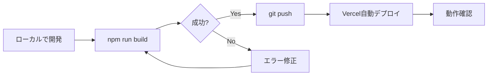
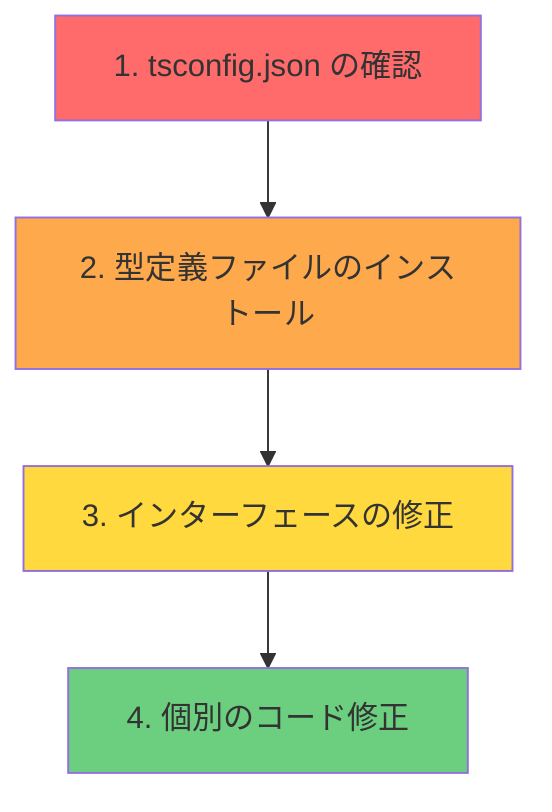

<!--
_class: lead
_paginate: false
-->

# **第四回**
## Vercelデプロイと本番運用

**いよいよ、あなたのアプリを世界に公開します**

---

## 📋 講師向けガイド

**タイムテーブル（90分講義）**

| 時間 | セクション | 分数 |
|:---|:---|:---:|
| 10:00-10:10 | Part 0: 本質の理解 | 10分 |
| 10:10-10:45 | Part 1: デプロイ実践 | 35分 |
| 10:45-11:05 | Part 2: 環境変数設定 | 20分 |
| 11:05-11:20 | Part 3: 本番運用基礎 | 15分 |
| 11:20-11:30 | まとめ・質疑応答 | 10分 |

**⚠️ 重要**: Appendixは講義で扱いません。受講者から質問があれば「Appendixを参照してください」と案内。

---

## 本日のゴール

**前半（4-1）**: デプロイの概念を理解した
**後半（4-2）**: 実際に手を動かしてデプロイする

<div class="success">

✅ **3つのゴール**
1. 自分のアプリが世界中からアクセスできる
2. 公開URLを友人に共有できる
3. 本番運用の基礎を習得する

</div>

---

<!--
_class: lead
_paginate: false
_backgroundColor: #fff4e1
-->

# 📍 Part 0: 本質の理解
## Vercelデプロイの全体像

**⏱ 所要時間：10分**

---

## 【本質】Vercelデプロイは5ステップ

<div class="essence">

**要するに、これだけです**

```
1. Vercelアカウント作成
      ↓
2. ローカルで npm run build 成功
      ↓
3. git push （GitHubにプッシュ）
      ↓
4. 自動デプロイ（Vercelが勝手にやってくれる）
      ↓
5. 環境変数設定（APIキーを登録）
      ↓
✅ 完全動作
```

</div>

**これから90分で、この5ステップを実践します**

---

## なぜVercelを選ぶのか？

**3つの理由**

1. **Next.jsとの最高の相性**
   - 開発元が同じ（Vercel社）
   - 設定ほぼゼロで動く

2. **驚くほど簡単**
   - GitHubと連携するだけ
   - 自動ビルド・自動デプロイ

3. **寛大な無料枠**
   - 個人プロジェクトは無料
   - 商用でも十分使える

---

## デプロイフローの全体像


**重要**: ローカルでビルドできなければ、本番でもビルドできない

---

## デプロイの鉄則

<div class="warning">

**「ローカルでビルドできなければ、本番でもビルドできない」**

</div>

**必ずデプロイ前に実行**

```bash
npm run build
```

**✅ 成功したら** → デプロイOK
**❌ 失敗したら** → エラーを修正してから

---

## 環境変数とは何か？

**秘密情報を安全に管理する仕組み**

```
.env.local（ローカル）  ← APIキーを保存
    ↓
.gitignore  ← Gitで除外（GitHubに上げない）
    ↓
Vercel  ← 別途、Vercelの画面で設定
    ↓
本番アプリ  ← 安全に動作
```

**理由**: APIキーをGitHubに上げると、世界中に公開されてしまう

---

## 今日やること vs やらないこと

**✅ 今日やること（90分）**
- Vercelでの実際のデプロイ操作
- 環境変数の本番設定
- 基本的な運用方法

**❌ 今日やらないこと（次回以降 or Appendix参照）**
- カスタムドメインの設定
- 型エラー詳細解説
- 高度なパフォーマンスチューニング
- トラブルシューティング詳細

---

<!--
_class: lead
_paginate: false
_backgroundColor: #e3f2fd
-->

# 👉 Part 1: Vercelデプロイ実践
## 世界に公開する

**⏱ 所要時間：35分**

---

## 事前確認チェックリスト

<div class="hands-on">

**👉 今から3分で確認してください**

```bash
# ローカルビルドが成功するか確認
npm run build

# GitHubへのプッシュ状態を確認
git status
git log --oneline -n 5
```

**確認ポイント**
- ✅ ビルドが成功する（エラーなし）
- ✅ GitHubに最新コードがプッシュ済み
- ✅ mainブランチが最新

</div>

---

## ビルドエラーが出た場合

**今すぐ対処してください**

```bash
# エラーメッセージをコピー
npm run build 2>&1 | tee build-error.log

# AIに質問
Claude/ChatGPTに以下を貼り付け：
「Next.jsのビルドで以下のエラーが出ました。
原因と解決策を教えてください。

エラー:
[エラーメッセージを貼り付け]
」
```

<div class="warning">

**型エラーが大量に出た場合**: Appendix Aの「型エラー一括修正戦略」を参照

</div>

---

## ステップ1：GitHubリポジトリの最終確認

<div class="hands-on">

**👉 今すぐブラウザでGitHubを開いてください**

https://github.com/your-username/your-repository

**確認すること**
1. リポジトリが存在する
2. mainブランチに最新のコードがある
3. package.jsonが見える

</div>

**問題がある場合**: よくある問題はAppendix Bを参照

---

## ステップ2：Vercelアカウントの作成

<div class="hands-on">

**👉 新しいブラウザタブを開いてください**

https://vercel.com/

**操作手順**
1. 右上の「Sign Up」ボタンをクリック
2. 「Continue with GitHub」を選択
3. GitHubの認証画面が表示される
4. 「Authorize vercel」をクリック

</div>

---

## ステップ3：プロジェクトのインポート

<div class="hands-on">

**操作手順**
1. 「Add New...」ボタンをクリック
2. 「Project」を選択
3. リポジトリを検索
4. 「Import」ボタンをクリック

</div>

**見つからない場合**: 検索ボックスにリポジトリ名を入力

---

## ステップ4：デプロイ設定の確認

**表示される設定画面**

```
Configure Project

Project Name: [your-project-name]  ← 自動入力される
Framework Preset: [Next.js]  ← 自動検出される
Root Directory: [./]  ← そのままでOK

Environment Variables: 空のままでOK（後で設定）
```

**✅ 基本的にデフォルトのままでOK**

---

## ステップ5：デプロイの実行

<div class="hands-on">

**👉 いよいよデプロイします**

1. 画面下部の「Deploy」ボタンをクリック
2. ビルドプロセスが開始される
3. **ログを眺めながら2-3分待つ**

</div>

**ビルドログが流れます**
- Cloning repository... (2-5秒)
- Installing dependencies... (10-30秒)
- Building application... (20-60秒)
- Deploying... (5-10秒)

---

## ステップ6：デプロイ完了の確認

<div class="success">

**🎉 成功画面が表示されます**

```
Congratulations!
Your project has been deployed!

Production Deployment
https://your-project-name.vercel.app

[Visit]
```

</div>

**この瞬間を味わってください！**
あなたのアプリが世界中からアクセスできるようになりました

---

## ステップ7：動作確認

<div class="hands-on">

**👉 公開URLをクリックしてください**

https://your-project-name.vercel.app

**確認すること**
✅ トップページが表示される
✅ スタイル（CSS）が正しく適用されている

**動かないもの（正常）**
❌ ログインボタンを押すとエラー
❌ データベースからのデータ取得ができない

</div>

<div class="warning">

**理由**: 環境変数（APIキー）が未設定 → 次のPartで解決します

</div>

---

## 🎉 Part 1完了！

<div class="success">

**達成したこと**
✅ Vercelアカウント作成
✅ GitHubとの連携
✅ プロジェクトのインポート
✅ 初回デプロイ実行
✅ 公開URLの取得

</div>

**次**: 環境変数を設定して、完全に動作させます

---

<!--
_class: lead
_paginate: false
_backgroundColor: #e3f2fd
-->

# 👉 Part 2: 環境変数の本番設定
## 完全動作させる

**⏱ 所要時間：20分**

---

## 準備：必要な環境変数をリストアップ

<div class="hands-on">

**👉 ローカルの `.env.local` を開いてください**

**コピーすべき項目**
```bash
NEXT_PUBLIC_CLERK_PUBLISHABLE_KEY=pk_test_...
CLERK_SECRET_KEY=sk_test_...
NEXT_PUBLIC_SUPABASE_URL=https://...
NEXT_PUBLIC_SUPABASE_ANON_KEY=eyJ...
```

**今すぐやること**
1. これらをメモ帳にコピー
2. キー名と値の両方をコピー

</div>

---

## ステップ1：Vercelの設定画面へ移動

<div class="hands-on">

**👉 Vercelのダッシュボードに戻ってください**

**操作手順**
1. デプロイしたプロジェクトをクリック
2. 上部の「Settings」タブをクリック
3. 左側メニューから「Environment Variables」を選択

</div>

---

## ステップ2：環境変数を1つずつ追加

<div class="hands-on">

**👉 最初の環境変数を追加します**

**操作手順**
1. 「Create Variable」をクリック
2. フォームに入力

```
KEY: NEXT_PUBLIC_CLERK_PUBLISHABLE_KEY
VALUE: pk_test_xxxxx...

Environment:
☑ Production
☑ Preview
☐ Development  ← チェック不要
```

3. 「Save」をクリック

</div>

---

## ステップ3：残りの環境変数を追加

<div class="hands-on">

**👉 同じ手順で残り3つを追加してください**

1. CLERK_SECRET_KEY
2. NEXT_PUBLIC_SUPABASE_URL
3. NEXT_PUBLIC_SUPABASE_ANON_KEY

**すべてProduction + Previewにチェック**

</div>

**よくある入力ミス**: Appendix D (Q&A) を参照

---

## ステップ4：再デプロイの実行

<div class="warning">

**重要**: 環境変数を追加・変更した後は必ず再デプロイが必要

</div>

**方法1: 自動再デプロイ（推奨）**
- 環境変数を保存すると自動で再デプロイが始まる

**方法2: 手動再デプロイ**
1. 「Deployments」タブに移動
2. 最新のデプロイの「...」メニュー
3. 「Redeploy」を選択

**所要時間**: 2-3分

---

## ステップ5：完全動作の確認

<div class="hands-on">

**👉 再度公開URLにアクセスしてください**

https://your-project-name.vercel.app

**今度は以下が動作するはず**
✅ ログインボタンが機能する
✅ Clerk認証画面が表示される
✅ データベースからデータを取得できる
✅ すべての機能が正常に動作

</div>

<div class="success">

**🎉 成功！** あなたのアプリが完全に動作しています

</div>

---

## 🎉 Part 2完了！

<div class="success">

**達成したこと**
✅ 環境変数の理解
✅ Vercelでの環境変数設定
✅ 再デプロイの実行
✅ アプリの完全動作確認

</div>

**あなたのアプリは今、世界中どこからでも使える状態です**

---

<!--
_class: lead
_paginate: false
_backgroundColor: #e3f2fd
-->

# 👉 Part 3: 本番運用の基礎
## デプロイ後の日常業務

**⏱ 所要時間：15分**

---

## デプロイはゴールではなくスタート

**これまで**
- アプリを作った
- デプロイした
- 世界に公開した ← 今ここ

**これから**
- 機能を追加する
- バグを修正する
- パフォーマンスを改善する

**本番運用** = アプリを「育てる」こと

---

## Vercelダッシュボードの全体像

**主要な4つのタブ**

```
your-project
├── Overview  ← プロジェクト概要
├── Deployments  ← デプロイ履歴
├── Analytics  ← アクセス分析
├── Logs  ← ログ確認
└── Settings  ← 各種設定
```

**基本はこの5つを使います**

---

## Deploymentsタブ：デプロイ履歴

**すべてのデプロイが記録される**

```
Deployments (最新10件)

main  f7a8c9d  2 minutes ago  ✓ Production
Add environment variables

main  a3b4c5d  1 hour ago  ✓ Production
Initial deployment
```

**重要機能**
- ロールバック（前のバージョンに戻す）
- 再デプロイ

---

## ロールバックの方法

**もし新しいデプロイでバグが出たら**

<div class="hands-on">

**👉 前のバージョンに戻す方法**

1. Deploymentsタブを開く
2. 正常に動いていたデプロイを見つける
3. 「...」メニューをクリック
4. 「Promote to Production」を選択

**所要時間**: 約10秒

</div>

**重要**: ロールバックは即座に反映されます

---

## Analyticsタブ：アクセス分析

**見られる情報**

```
Real-time data

Visitors
├── Today: 42 visits
├── This week: 187 visits
└── This month: 634 visits

Top Pages
1. /  (35%)
2. /login  (20%)
3. /dashboard  (15%)
```

**無料プランでも基本的な分析が使える**

---

## Logsタブ：エラー確認

**エラーやリクエストを確認**

```
Runtime Logs

[2025-01-15 10:23:45] GET /api/posts 200 125ms
[2025-01-15 10:24:02] GET /api/posts 500 45ms  ← エラー

Filter by: [All] [Errors] [Warnings] [Info]
```

**実務でのログ確認**
- 毎日1回は確認する習慣
- エラーが増えていないかチェック

---

## 機能追加のフロー

**日常的な開発サイクル**



**ポイント**: 必ずローカルでビルド確認

---

## 本番運用のチェックリスト

**毎日やること**
- [ ] Logsでエラーを確認（5分）
- [ ] Analyticsでアクセス数を確認（2分）

**毎週やること**
- [ ] 全機能の動作確認（15分）

**毎月やること**
- [ ] ユーザーフィードバックの確認（30分）

---

## 🎉 Part 3完了！

<div class="success">

**達成したこと**
✅ Vercelダッシュボードの基本的な使い方
✅ ロールバックの方法
✅ ログとAnalyticsの確認方法
✅ 日常的な開発サイクルの理解

</div>

**詳細な運用テクニックはAppendix Cを参照**

---

<!--
_class: lead
_paginate: false
-->

# まとめ
## 本日の学びと達成

---

## 本日達成したこと

<div class="success">

**✅ 完了した3つのゴール**
1. 自分のアプリが世界中からアクセスできる
2. 公開URLを友人に共有できる
3. 本番運用の基礎を習得した

</div>

**あなたは今**
- Vercelでデプロイできる
- 環境変数を安全に管理できる
- 基本的な運用ができる

---

## 技術的な学び

**Part 0: 本質**
- Vercelデプロイの5ステップ
- デプロイの鉄則

**Part 1: デプロイ実践**
- GitHubとの連携
- プロジェクトのインポート
- デプロイ設定と実行

**Part 2: 環境変数**
- 環境変数の本番設定
- 再デプロイの方法

**Part 3: 本番運用**
- ダッシュボードの使い方
- ロールバック、ログ確認

---

## ビジネス価値の理解

**デプロイで得られるもの**

1. **即座のフィードバック**
   - ユーザーの反応を見られる

2. **ポートフォリオとして**
   - 公開URLを履歴書に記載
   - 実績として示せる

3. **ビジネス展開の可能性**
   - 実際にユーザーに使ってもらえる
   - 収益化の第一歩

---

## 最後に：あなたはもうVibe Coderです

<div class="success">

**おめでとうございます！**

あなたは今、以下ができるようになりました：

✅ AIを使って開発する
✅ GitHubでコードを管理する
✅ データベースと認証を実装する
✅ **世界に向けてアプリを公開する**

これは、数年前までエンジニアにしかできなかったことです。

</div>

---

## 宿題：公開URLを共有しよう

<div class="hands-on">

**👉 今日中にやってほしいこと**

1. 公開URLを友人や家族に送る
2. フィードバックをもらう
3. 気づいた改善点をメモする

**ボーナス**
- SNSで公開URLをシェア
- TwitterやLinkedInで投稿

</div>

---

<!--
_class: lead
_paginate: false
-->

# ご清聴ありがとうございました

**次回：デモデイでお会いしましょう！**

質問がある方は、講師までお気軽にどうぞ。

---

<!--
_class: lead
_paginate: false
_backgroundColor: #f5f5f5
-->

# 📚 Appendix
## 補足資料・リファレンス

### ⚠️ このセクションは講義では扱いません
### 自習・困ったとき・深掘りしたいときに参照してください

---

# Appendix A
## 型エラー一括修正戦略

---

## 型エラーの「もぐらたたき」を避ける方法

<div class="warning">

**よくある問題**
型エラーを1つ修正 → 別のエラーが出現 → また修正 → さらに別のエラー...

**これは効率が悪い！**

</div>

**解決策**: AIを使って一括修正する

---

## 型エラー一括修正の戦略

**ステップ1: 全エラーを一覧化**

```bash
# すべての型エラーをファイルに出力
npx tsc --noEmit --pretty false > type-errors.txt

# ファイルを開いて確認
cat type-errors.txt
```

**出力例**
```
src/app/page.tsx(15,7): error TS2322: Type 'string' is not assignable to type 'number'.
src/app/api/posts/route.ts(23,3): error TS2345: Argument of type 'undefined' is not assignable to parameter of type 'string'.
src/components/Button.tsx(8,15): error TS2339: Property 'onClick' does not exist on type 'Props'.
```

**メリット**: エラーの全体像が見える

---

## 型エラー一括修正の戦略（続き）

**ステップ2: エラーを分類**

```bash
# エラーコード別にカウント
cat type-errors.txt | grep -o "error TS[0-9]*" | sort | uniq -c

# 出力例
  15 error TS2322  ← 最も多いエラー
   8 error TS2339
   5 error TS2345
   2 error TS2307
```

**戦略**: 最も多いエラーから対処

---

## AIによる一括修正プロンプト

**効果的なプロンプト**

```
以下のTypeScript型エラーを体系的に修正してください。

【エラー一覧】
[type-errors.txt の内容を貼り付け]

【要件】
1. TS2322エラーから優先的に修正
2. 各修正について、なぜそうするのか説明
3. 修正後のコード全体を提示
4. ランタイムの動作を変えない
5. anyは使わず、適切な型を付ける

【プロジェクト情報】
- Next.js 14 App Router
- TypeScript 5.x
- Supabase + Clerk使用

各ファイルの修正を、diffフォーマットで提示してください。
```

---

## よくある型エラーと根本原因

**エラーコード別の対処法**

| エラーコード | 意味 | よくある原因 | 解決策 |
|:---|:---|:---|:---|
| **TS2322** | 型が一致しない | データ構造の不一致 | 型定義を正確に |
| **TS2339** | プロパティが存在しない | オブジェクト構造の誤解 | オプショナル化 or 型ガード |
| **TS2345** | 引数の型が違う | 関数の型定義ミス | 引数の型を確認 |
| **TS2307** | モジュールが見つからない | @types/未インストール | npm install |

---

## 根本原因から修正する順序

**効率的な修正順序**



**ポイント**: 上から順に修正すると、下層のエラーが自然に消える

---

## 根本原因1：tsconfig.jsonの設定

**よくある設定ミス**

```json
// tsconfig.json

{
  "compilerOptions": {
    // ❌ 緩すぎる設定
    "strict": false,

    // ✅ 推奨設定
    "strict": true,
    "noEmit": true,
    "skipLibCheck": true,

    // パスエイリアスの設定
    "baseUrl": ".",
    "paths": {
      "@/*": ["./src/*"]  // ← これがないとimportエラー
    }
  }
}
```

---

## 根本原因2：型定義ファイルの不足

**解決方法**

```bash
# よく忘れる@types/パッケージ
npm install --save-dev @types/react
npm install --save-dev @types/react-dom
npm install --save-dev @types/node

# Supabase関連
npm install --save-dev @types/pg

# その他プロジェクトで使っているライブラリの型定義
npm install --save-dev @types/[ライブラリ名]
```

**確認方法**
```bash
# インストール済みの@types/を確認
ls node_modules/@types/
```

---

## 根本原因3：インターフェースの不整合

**よくあるパターン**

```typescript
// ❌ 不完全な型定義
interface User {
  name: string;
}

const user = fetchUser(); // { name: "田中", email: "tanaka@example.com" }
console.log(user.email); // ← エラー！

// ✅ 正確な型定義
interface User {
  name: string;
  email: string; // ← これが必要
}
```

**AIに聞く**: 「このUserインターフェースに必要なプロパティは？」

---

## まとめ：型エラー解決の鉄則

<div class="success">

**鉄則1**: エラーは全体像を把握してから修正
**鉄則2**: AIに一括で修正案を出してもらう
**鉄則3**: 根本原因（tsconfig、型定義）から修正
**鉄則4**: 1つ修正したら再チェック
**鉄則5**: watchモードで常時監視

</div>

**この方法なら、もぐらたたきを避けられます**

---

# Appendix B
## トラブルシューティング詳細

---

## よくあるデプロイエラー Top 5

**実際にエラーが出た人のために**

1. ビルドタイムアウト
2. 依存関係の不整合
3. 環境変数未設定
4. メモリ不足
5. Node.jsバージョン不一致

**それぞれの対処法を解説します**

---

## エラー1：ビルドタイムアウト

**エラーメッセージ**
```
Error: Build exceeded maximum duration of 45 minutes
```

**原因**
- ビルドに時間がかかりすぎている
- 無限ループがある
- 依存関係のインストールが遅い

**対処法**
```bash
# ローカルで計測
time npm run build

# 20分以上かかる場合 → パッケージの見直しが必要
```

---

## エラー2：依存関係の不整合

**エラーメッセージ**
```
Error: Cannot find module 'some-package'
npm ERR! missing: some-package@1.0.0
```

**原因**
- package.jsonとnode_modulesの不一致
- lockfileがない

**対処法**
```bash
# ローカルで修正
rm -rf node_modules
rm package-lock.json
npm install
npm run build

# 成功したらプッシュ
git add package-lock.json
git commit -m "Fix dependencies"
git push
```

---

## エラー3：環境変数未設定

**エラーメッセージ**
```
Error: Required environment variable 'DATABASE_URL' is not defined
```

**対処法**
→ Part 2で設定済み

---

## エラー4：メモリ不足

**エラーメッセージ**
```
FATAL ERROR: Reached heap limit
Allocation failed - JavaScript heap out of memory
```

**原因**
- ビルド時のメモリ使用量が大きい
- 画像やデータが大量にある

**対処法**: Node.jsのメモリ上限を増やす
```json
// package.json
{
  "scripts": {
    "build": "NODE_OPTIONS='--max-old-space-size=4096' next build"
  }
}
```

---

## エラー5：Node.jsバージョン不一致

**エラーメッセージ**
```
Error: The engine "node" is incompatible with this module
```

**原因**
- ローカルとVercelのNode.jsバージョンが違う

**対処法**: package.jsonでバージョンを指定
```json
{
  "engines": {
    "node": "20.x"
  }
}
```

**2025年推奨**: Node.js 20.x または 22.x

---

## AIを活用したトラブルシューティング

**効果的な質問方法**

```
Vercelでのデプロイ中に以下のエラーが出ました。

【環境】
- Next.js: 14.0.0
- Node.js: 20.x
- パッケージマネージャー: npm

【エラーログ】
[エラーメッセージ全体を貼り付け]

【試したこと】
- ローカルでnpm run buildは成功
- 依存関係の再インストールも実施

原因と解決策を教えてください。
```

---

# Appendix C
## 本番運用詳細

---

## Overviewタブ：プロジェクト概要

**見られる情報**

```
Production Deployment
https://your-project-name.vercel.app
Status: Ready  ← 現在の状態

Latest Deployment
main  f7a8c9d  2 minutes ago
✓ Production

Domains
your-project-name.vercel.app  ← 自動付与
（カスタムドメインは次回）
```

**ここでできること**
- 公開URLの確認
- デプロイ状態の確認

---

## Deploymentsタブ：デプロイ詳細

**各デプロイをクリックすると**

```
Deployment Details

Status: Ready ✓
URL: https://your-project-xxx.vercel.app
Branch: main
Commit: f7a8c9d
Duration: 2m 34s

[View Build Logs]  ← ビルドログ確認
[Visit]  ← 実際にアクセス
[...]  ← その他メニュー
  ├── Promote to Production
  ├── Redeploy
  └── Delete
```

---

## Analyticsの活用方法

**ビジネス視点での活用**

1. **人気ページの把握**
   - どのページがよく見られているか
   - ユーザーの動線を理解

2. **デバイス比較**
   - モバイル対応の優先度判断

3. **時間帯分析**
   - いつアクセスが多いか
   - メンテナンス時刻の決定

---

## パフォーマンス監視：Lighthouse

<div class="hands-on">

**👉 パフォーマンスを計測してみよう**

**操作手順**
1. 公開URLを開く
2. F12キーで開発者ツールを開く
3. 「Lighthouse」タブを選択
4. 「Analyze page load」をクリック
5. 結果が表示される（1分程度）

</div>

---

## Lighthouseの結果の見方

**4つのスコア**

```
Performance: 85 / 100  ← ページ速度
Accessibility: 92 / 100  ← アクセシビリティ
Best Practices: 95 / 100  ← ベストプラクティス
SEO: 88 / 100  ← SEO対策

各スコアをクリックすると詳細が表示される
```

**目標**
- すべて90点以上を目指す
- 特にPerformanceが重要

---

## ホットフィックス（緊急バグ修正）のフロー

**本番で重大なバグが見つかった場合**

```bash
# ステップ1: 現象を確認 → Logsでエラーを確認
# ステップ2: ローカルで再現 → 同じエラーを起こしてみる
# ステップ3: 修正 → コードを修正

# ステップ4: ローカルでテスト
npm run build
npm run start

# ステップ5: 即座にデプロイ
git add .
git commit -m "hotfix: Fix critical bug"
git push

# ステップ6: デプロイ完了を確認 → Vercelで自動デプロイ（2-3分）
```

---

## セキュリティのベストプラクティス

**2025年の推奨事項**

1. **環境変数の管理**
   - 定期的にAPIキーをローテーション
   - 使っていないキーは削除

2. **依存関係の更新**
   - 脆弱性があるパッケージは即更新
   - `npm audit` を定期実行

3. **ログの監視**
   - 不審なアクセスパターンをチェック
   - 異常なエラー増加に注意

---

# Appendix D
## Q&A：よくある質問

---

## Q1: デプロイに失敗し続ける

**A**: 以下を確認してください

```bash
# ローカルでビルドが成功するか
npm run build

# package-lock.jsonがコミットされているか
git status | grep package-lock

# Node.jsバージョンが適切か
node -v  # 20.x または 22.x を推奨
```

**それでもダメなら**: ビルドログ全体をコピーして講師に相談

---

## Q2: 環境変数を変更したのに反映されない

**A**: 再デプロイが必要です

1. Deploymentsタブに移動
2. 「Redeploy」を実行
3. **キャッシュをクリア**する場合：
   - Redeployのオプションで「Clear cache」にチェック

**注意**: 変更は即座には反映されません（2-3分必要）

---

## Q3: 公開URLにアクセスできない

**A**: いくつかの可能性

**可能性1**: デプロイ中
→ Deploymentsタブで状態を確認

**可能性2**: DNSの浸透待ち
→ 初回は数分かかることがある

**可能性3**: ブラウザキャッシュ
→ Ctrl+Shift+R で強制リロード

---

## Q4: 無料プランの制限は？

**A**: Hobbyプランの主な制限

```
Deployments: 無制限
Bandwidth: 100 GB/月
Build Time: 6,000分/月
Function Duration: 10秒

【ほとんどの個人プロジェクトは問題なし】
```

**超えた場合**: 自動的に制限されるが、課金はされない

---

## Q5: カスタムドメインはいつ設定できる？

**A**: 次回の講義で扱います

**今すぐ設定したい場合**
1. ドメインを購入（お名前.com、Google Domains等）
2. Vercel Settingsの「Domains」で追加
3. DNSレコードを設定

**詳細は次回解説します**

---

## Q6: よくある入力ミス（環境変数）

**ミス1**: キー名のスペルミス
```
❌ NEXT_PUBILC_CLERK_... (Lが抜けてる)
✅ NEXT_PUBLIC_CLERK_...
```

**ミス2**: 値の前後にスペース
```
❌ " pk_test_xxxxx " (スペースあり)
✅ "pk_test_xxxxx"
```

**ミス3**: 改行が入っている
```
❌ "pk_test_xxxxx
    続き..."
✅ "pk_test_xxxxx続き..."
```

---

# Appendix E
## 補足資料

---

## 補足：Vercel CLIの使い方

**コマンドラインからデプロイ**

```bash
# Vercel CLIのインストール
npm install -g vercel

# ログイン
vercel login

# デプロイ（プレビュー）
vercel

# 本番デプロイ
vercel --prod

# 環境変数をローカルに取得
vercel env pull
```

**メリット**: ダッシュボードを開かずにデプロイ可能

---

## 補足：プレビューデプロイメントの活用

**ブランチごとに自動プレビュー**

```bash
# フィーチャーブランチを作成
git checkout -b feature/new-ui

# 変更してプッシュ
git add .
git commit -m "Update UI"
git push origin feature/new-ui
```

**自動的に**
- プレビューURLが生成される
- PRにコメントが付く
- レビュアーが実際の動作を確認できる

---

## 参考リンク集

**公式ドキュメント**
- Vercel Docs: https://vercel.com/docs
- Next.js Docs: https://nextjs.org/docs
- Vercel CLI: https://vercel.com/docs/cli

**学習リソース**
- Vercel Examples: https://vercel.com/templates
- GitHub Examples: https://github.com/vercel/examples

**コミュニティ**
- Vercel Community: https://github.com/vercel/community
- Discord: https://vercel.com/discord

---

<!--
_class: lead
_paginate: false
-->

# 以上で第四回の講義を終わります

**お疲れ様でした！**

次回のデモデイで、あなたのアプリを発表するのを楽しみにしています。
