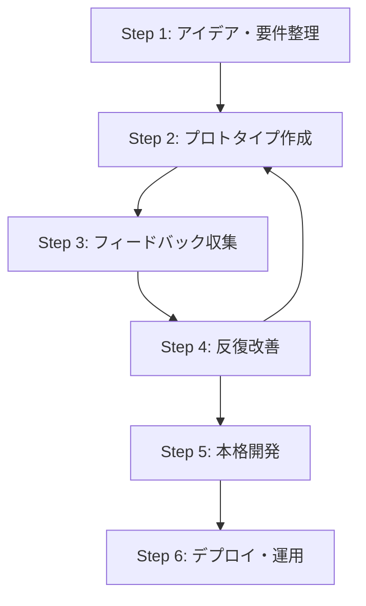
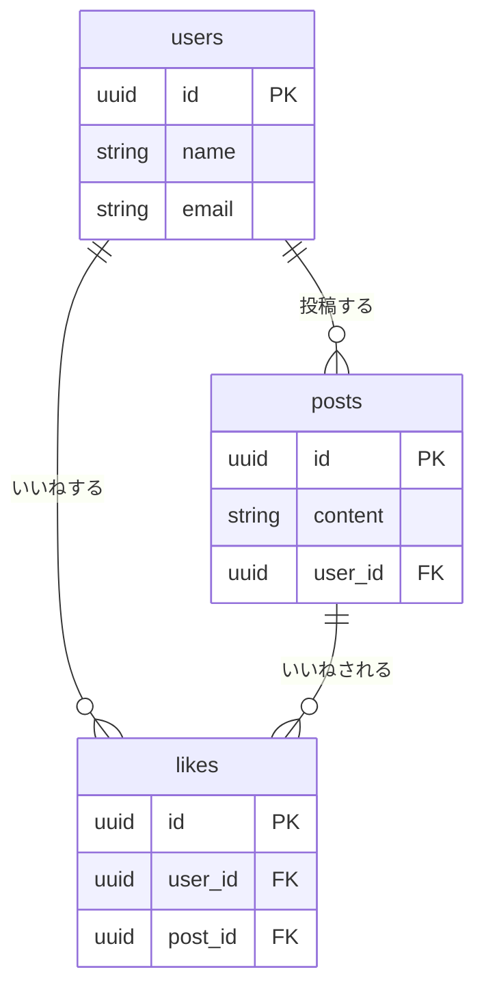

# 【要件定義型AI駆動開発の極意】

---
## 第1部：理論編 - なぜ要件定義が全てを決めるのか
### 1. はじめに：Vibe Coderとして成功するために

#### 1.1 Vibe Coderとは：AIを通じてコードの世界を自在に操る者

VibeCoderは、AIと協働してコードを書く新しいタイプの開発者を指します。従来のプログラマーとは異なり、AIの力を最大限活用して創造性と技術を融合させる開発スタイルです。非エンジニアでもコード生成などを通じて、価値を自ら生み出せる人材へと変貌することが出来ます。

**VibeCoderの主な特徴：**
- AIツールを駆使した開発スタイル
- 創造性とアイデアを重視
- 技術的な詳細よりも全体設計に注力
- 迅速なプロトタイピングと反復改善

**従来のプログラマーとの違い：**
- **VibeCoder**: AIとの対話を通じて開発を進め、自然言語でのコミュニケーション能力が重要。アイデアの具現化とビジネス価値の創出を優先します。
- **従来のプログラマー**: 言語仕様やフレームワークの深い知識が必要で、一からコードを手書きで作成。技術的な専門性が重視されます。

**VibeCoderが提供する価値：**
VibeCoderは、技術とビジネスの橋渡し役として、圧倒的なスピードとアウトプット量で重要な価値を提供します。
- アイデアの迅速な実現
- 開発コストの大幅削減
- 技術的な参入障壁の低下
- イノベーションの加速

#### 1.2 AIの成長を乗りこなし、非エンジニアが開発で価値を生む方法

##### なぜ今、非エンジニアがVibe Coderになるべきなのか？

従来の開発では、非エンジニアは多くの壁に直面していました。
- **アイデア実現の壁**: アイデアがあっても、高額な開発費や長い開発期間が障壁となる。
- **コミュニケーションの壁**: エンジニアとの意思疎通が難しく、完成品が想像と異なる。
- **依存の壁**: 改善やメンテナンスを他人に委ねるしかなく、スピード感に欠ける。

Vibe Coderは、これらの壁をAIの力で打ち破ります。

- **アイデアをその日に試せる**: 数ヶ月かかっていた開発が数日に短縮。低コストで高速な仮説検証が可能です。
- **技術の壁をAIが肩代わり**: 複雑な設定やコーディングはAIが補完。あなたは「何を創りたいか」に集中できます。
- **自走できる改善サイクル**: エンジニアの空きを待つことなく、自分で改善サイクルを回し、製品価値を指数関数的に高められます。

##### AIの進化は「脅威」ではなく「追い風」である

AIの進化は、人間の学習曲線を遥かに超える速度で進んでいます。この事実に追いつこうと知識を暗記するのは不可能です。
発想を転換し、**AIが伸びる速度をそのまま自分のアウトプット速度に変換する仕組み**、つまりAIを「乗りこなす」マインドセットが重要です。

> いま世界で起きていることは、「人間の学習曲線」よりもはるかに急峻な「AI の進化曲線」が私たちを追い越し、背中から強烈な追い風を吹かせはじめた、という事実です。その風を怖がるか、帆に受けて前へ進むか――すべては私たちの“受け止め方”にかかっています。

##### AIを乗りこなすための3つの役割

AIの追い風を最大限に活用するために、私たちは以下の3つの役割を意識的に切り替える必要があります。

1.  **編集者 (Editor)**: AIが生成した大量のドラフトから、目的に沿った本質的な部分を磨き上げ、文脈に合わせて調整する。
2.  **ドメイン専門家 (Domain Expert)**: あなたが持つ業界知識や経験を「翻訳キー」としてAIに与え、出力の精度と価値を決定的に高める。
3.  **実験者 (Experimenter)**: 「試行コストの低さ」というAIの最大の価値を活かし、小さなプロトタイプを高速で作り、壊し、学び、改善サイクルを回し続ける。

この3つの役割を担うことで、AIの進化はあなたの成長と直結し、過去の学びが陳腐化するどころか、むしろ価値を増していくのです。
### 2. AI駆動開発の全体像

#### 2.1 従来の開発と何が違うのか

従来の開発（ウォーターフォール型など）は、各工程が直線的に進み、専門家から専門家へとバトンが渡されていくため、多くの課題を抱えていました。

- **従来の課題**:
    - **高コスト・長時間**: 各工程で専門知識が必要で、後戻りのコストが非常に高い。
    - **コミュニケーションロス**: 仕様書ベースの伝達では、認識の齟齬が生まれやすい。
    - **市場とのズレ**: 完成までに時間がかかり、市場のニーズと乖離するリスクがある。

一方、AI駆動開発は、高速なイテレーション（反復）を特徴とします。

- **AI駆動開発の優位性**:
    - **高速プロトタイピング**: アイデアを数時間〜数日で形にし、すぐに検証できる。
    - **要件の明確化**: AIとの対話を通じて、曖昧な要求を具体的な仕様に落とし込める。
    - **継続的な改善**: ユーザーからのフィードバックを即座に反映し、製品価値を継続的に高められる。

この違いは、開発プロセスそのものを「重厚長大な建築」から「軽量で柔軟な実験」へと変革します。

#### 2.2 Webアプリケーション開発の全体工程フロー（AI駆動版）

AI駆動開発は、以下の6つのステップを高速で繰り返すサイクルが基本となります。



1.  **アイデア・要件整理**: ChatGPTやClaudeを使い、アイデアの壁打ちや必要な機能の洗い出しを行う。
2.  **プロトタイプ作成**: v0やCursorを使い、アイデアを即座に動く形（プロトタイプ）にする。
3.  **フィードバック収集**: プロトタイプを関係者やユーザーに見せ、改善点や新たなニーズを引き出す。
4.  **反復改善**: フィードバックを基に、Cursor等で即座にコードを修正・改善する。
5.  **本格開発**: 検証済みのプロトタイプをベースに、本番品質のコードを実装する。
6.  **デプロイ・運用**: Vercelなどのプラットフォームを使い、数クリックで世界に公開し、運用を開始する。

#### 2.3 LLM（大規模言語モデル）の基礎と可能性

この高速な開発サイクルを支えるのが、**LLM（Large Language Model）**です。

LLMは、大量のテキストデータを学習し、人間の言語を理解・生成するAIです。その本質は、**入力されたテキスト（プロンプト）の文脈を理解し、確率的に最もらしい次の単語を予測し続ける**ことにあります。

この能力を最大限に引き出す原則こそが**「Text is KING」**です。

- **入力の質が出力の質を決める**: 曖昧な指示からは曖昧な結果しか生まれません。明確で具体的なテキストが、高品質なコードや設計を生み出します。
- **テキストはAIとの共通言語**: 構造化されたMarkdownや具体的な指示文（プロンプト）が、AIに対する最も効果的なコミュニケーション手段となります。

Vibe Coderは、この原則を理解し、思考を的確なテキストに変換することで、LLMの能力を最大限に引き出し、開発を加速させるのです。
### 3. 成功の鍵を握る「要件定義」

#### 3.1 なぜ開発は要件定義で9割決まるのか

プロジェクトの成否は、コーディングの巧みさ以前に、**「何を創るか」が明確に定義されているか**に懸かっています。

- **開発がうまくいかない原因の90%は要件定義の不備**: 曖昧な要求は、AIにとっても人間にとっても、不明確なアウトプットしか生みません。
- **AIは「書かれていないこと」は実装しない**: どんなに優れたAIでも、指示されていない機能や考慮されていない仕様を勝手に実装することはありません。
- **良いインプットが良いアウトプットを生む**: これはAI開発における絶対的な原則です。高品質な要件定義こそが、高品質なアプリケーションへの最短ルートです。

要件定義とは、プロの開発者が当たり前に行っている「創るものの設計図を詳細に描く作業」です。Vibe Coderは、この最重要工程をAIとの対話を通じて、非エンジニアでも実践可能にします。

#### 3.2 AI駆動要件定義の核心：「Text is KING」

前章で「Text is KING」の原則に触れましたが、要件定義においてこの原則はさらに重要性を増します。構造化され、明確で、具体的なテキストこそが、AIの能力を100%引き出す鍵だからです。

- **AIとの親和性**: 見出しやリストで構造化されたMarkdownは、AIが文脈や階層関係を正確に理解するための最適なフォーマットです。
- **バージョン管理との親和性**: Gitを使えば、「いつ」「誰が」「なぜ」要件を変更したのかを全て記録できます。これにより、プロジェクトの透明性が保たれ、チームでの共同作業が円滑になります。
- **可搬性と持続性**: Markdownは特定のツールに依存しないため、10年後でも確実に読み書きできます。これは、長期的なプロジェクト資産として極めて重要です。

#### 3.3 なぜWordやNotionではなくMarkdownなのか

Notionのようなツールは、チームでの情報共有やブレインストーミングには非常に優れています。しかし、AI駆動開発の「正本」となる技術ドキュメントにおいては、Markdownが推奨されます。

| 観点 | Markdown | Notion / Word |
| :--- | :--- | :--- |
| **AIとの親和性** | **◎ 非常に高い**（構造が明確） | △ 独自形式でAIが解釈しにくい |
| **バージョン管理** | **◎ Gitで完璧に管理可能** | × 困難または不可能 |
| **可搬性・持続性** | **◎ プレーンテキストで永続的** | × プラットフォームに依存 |
| **共同編集** | △ Git経由での非同期編集 | ◎ リアルタイム共同編集 |

**結論**:
- **議論やアイデア出し**: Notion
- **確定した仕様・要件・設計書**: **Markdown**

このようにツールを使い分けることで、それぞれのメリットを最大限に活かし、効率的な開発プロセスを実現します。

---
## 第2部：実践編 - 完全詳細手順書
### Step 0: 開発環境の準備

AI駆動開発を始める前に、まずは戦いのための武器と防具を揃えましょう。ここでは、開発に必須となるツールとその設定について解説します。

#### 2.1 必須ツールの準備チェックリスト

以下のチェックリストを参考に、ご自身の環境を準備してください。

```yaml
開発環境準備:
  エディタ:
    - [ ] Cursorのインストール
    - [ ] Cursor Proアカウントの作成（$20/月）※強く推奨
    - [ ] 初期設定（フォント、テーマ等）
  
  AI対話ツール:
    - [ ] ChatGPT Plus または Claude Proのアカウント
  
  バージョン管理:
    - [ ] GitHubアカウントの作成
    - [ ] Gitの初期設定
      - git config --global user.name "Your Name"
      - git config --global user.email "your.email@example.com"
  
  開発ツール:
    - [ ] Node.js（v18以上）のインストール
    - [ ] ターミナル/コマンドプロンプトの基本操作確認
  
  デプロイ環境:
    - [ ] Vercelアカウントの作成
    - [ ] GitHubとVercelの連携設定
```

#### 2.2 Cursorの初期設定（詳細）

Cursorは、AIとの協働を前提に設計された「AI統合IDE」です。従来の開発環境が「人間がコードを書く」ためのものだったのに対し、Cursorは「人間がAIに指示を出し、AIがコードを書く」ための環境です。

##### インストールとアカウント設定
- **インストール**: 公式サイト（`https://cursor.sh/`）からダウンロードするか、macOSの場合は `brew install --cask cursor` でインストールします。
- **アカウント**: GitHubまたはGoogleアカウントでサインインし、Proプラン（$20/月）への加入を強く推奨します。これにより、高性能なモデルを気兼ねなく利用できます。

##### 推奨設定と拡張機能
Cursor（VS Code）をより使いやすくするために、以下の設定と拡張機能を導入しましょう。

- **設定 (`settings.json`)**:
  ```json
  {
    "editor.fontSize": 14,
    "editor.fontFamily": "'Fira Code', 'Consolas', monospace",
    "editor.fontLigatures": true,
    "editor.tabSize": 2,
    "workbench.colorTheme": "Dark+ (default dark)",
    "files.autoSave": "afterDelay"
  }
  ```
- **推奨拡張機能**:
  - `bradlc.vscode-tailwindcss`: Tailwind CSSのクラス名補完
  - `esbenp.prettier-vscode`: コードの自動整形
  - `ms-vscode.vscode-eslint`: コードのエラーチェック
  - `formulahendry.auto-rename-tag`: HTMLタグの自動リネーム

##### .cursorrulesによるAIの調教
プロジェクトのルートディレクトリに `.cursorrules` というファイルを作成することで、そのプロジェクト内でのAIの振る舞いを定義できます。これにより、コーディングスタイルを統一したり、プロジェクト固有のルールをAIに遵守させることが可能です。

**`.cursorrules` の記述例:**
```
あなたは経験豊富なReact開発者です。
- 常にTypeScriptを使用してください。
- スタイリングにはTailwind CSSを使用してください。
- コンポーネントは`src/components`に作成してください。
- 命名規則はキャメルケース（`myComponent`）に従ってください。
```
### Step 1: プロジェクトの核を固める「要件定義」

ここからが、プロジェクトの成否を分ける最も重要なステップです。このステップの目的は、**「何を創るのか」を曖昧さなく、構造化されたテキストとして定義する**ことです。単なるチェックリストではなく、具体的な記述例とAIとの対話を通じて、生きた要件定義書を作成する方法を学びます。

#### 1.1 要件定義の思考プロセス：AIとの対話で要求を深掘りする

優れた要件定義は、一方的な指示ではなく、AIとの対話（壁打ち）から生まれます。

**段階的アプローチ:**

1.  **Step 1: 基本要件の洗い出し**
    - まずはプロジェクトの核となるアイデアをAIに投げかけ、基本的な要件をリストアップしてもらいます。
    ```
    プロンプト例:
    「個人向けタスク管理Webアプリケーションを開発します。
    以下の観点から必要な機能要件をMarkdown形式で洗い出してください：
    - ユーザー管理
    - タスク管理
    - データ管理
    - ユーザーインターフェース
    
    各機能について、概要と受入条件を含めてください。」
    ```

2.  **Step 2: 詳細機能の深掘り**
    - AIがリストアップした項目の中から、特に重要な機能を指定し、さらに詳細な仕様を検討させます。
    ```
    プロンプト例:
    「タスク管理機能について、以下の詳細をMarkdown形式で検討してください：
    - タスクの属性（名前、説明、期限、優先度等）
    - タスクの操作（作成、編集、削除、完了等）
    - タスクの表示方法（一覧、検索、フィルタ等）
    
    表形式や箇条書きを使って整理してください。」
    ```

3.  **Step 3: 非機能要件の検討**
    - 機能以外の重要な側面（性能、セキュリティなど）についてもAIに問いかけ、考慮漏れを防ぎます。
    ```
    プロンプト例:
    「上記機能要件に対して、以下の非機能要件をMarkdown形式で検討してください：
    - パフォーマンス要件
    - セキュリティ要件
    - 可用性要件
    - 拡張性要件
    
    個人向けアプリケーションという特性を考慮し、表形式で整理してください。」
    ```

この対話プロセスを経ることで、あなた一人の頭の中だけでは生まれなかった、網羅的で詳細な要件定義が完成します。

#### 1.2 Markdownによる要件定義書の具体的な書き方

AIとの対話で固まった内容を、構造化されたMarkdownファイルとして記述します。これが、以降の開発の「憲法」となります。

##### 機能要件の記述例（タスク管理アプリ）
```markdown
## 機能要件

### 1. ユーザー管理

#### 1.1 ユーザー登録
**概要**: 新規ユーザーがアカウントを作成する機能
**受入条件**:
- [ ] メールアドレスとパスワードで登録できる
- [ ] メールアドレスの形式検証が行われる
- [ ] パスワードは8文字以上、英数字を含む
- [ ] 重複メールアドレスの場合はエラーメッセージを表示

#### 1.2 ログイン
**概要**: 登録済みユーザーがシステムにアクセスする機能
**受入条件**:
- [ ] メールアドレスとパスワードで認証
- [ ] ログイン状態を7日間保持
- [ ] 認証失敗時は適切なエラーメッセージを表示

### 2. タスク管理

#### 2.1 タスク作成
**概要**: 新しいタスクを作成する機能
**入力項目**:
- **タスク名** (必須, 100文字以内)
- **説明** (任意, 500文字以内)
- **期限** (任意)
- **優先度** (高/中/低, デフォルト: 中)
**受入条件**:
- [ ] 必須項目が未入力の場合はエラーメッセージを表示
- [ ] 作成後、タスク一覧に表示される
```

##### 非機能要件の記述例
```markdown
## 非機能要件

### パフォーマンス
- **応答時間**: 全ての操作が2秒以内に完了する
- **同時接続数**: 100人の同時利用に耐える

### セキュリティ
- **認証方式**: JWT認証を利用する
- **通信暗号化**: 全ての通信はHTTPSで行う
- **パスワードポリシー**: 8文字以上、英数字記号をそれぞれ1文字以上含む
```

#### 1.3 最終成果物：`requirements.yaml`の生成

最終的に、これらのMarkdown形式の要件定義を基に、AIが直接読み込める`requirements.yaml`を作成させます。

**プロンプト:**
```
これまでの対話とMarkdownの記述を基に、`requirements.yaml`ファイルを作成してください。
Cursor Agentが読み込んで、そのまま開発を開始できるレベルの詳細度で、
以下の項目をすべて含めてください。

- プロジェクト基本情報
- 機能要件（ユーザーストーリー形式も含む）
- 非機能要件
- 技術スタック
- データベース設計（テーブル定義、ER図）
- API設計（エンドポイント、リクエスト/レスポンス）
```

このステップを丁寧に行うことで、後の工程での手戻りを劇的に減らし、開発の成功確率を最大化することができます。
### Step 2: AIに実装を委ねる「設計」

要件定義という「何を創るか」が固まったら、次はその「どう創るか」を定義する設計フェーズに移ります。ここでは、AIエージェント（Cursor）に詳細な設計を依頼し、開発のブループリントを作成させます。

#### 2.1 Cursorエージェントへの詳細設計指示

以下のプロンプトは、AIにプロジェクト全体の設計を依頼するためのテンプレートです。`@docs/requirements.yaml` を参照させ、13もの詳細な設計ドキュメントを生成させる強力な指示です。

**プロンプトテンプレート:**
```markdown
あなたは最高の開発エンジニアです。@docs/requirements.yaml をベースとしたアプリケーションを開発してください。

私はエンジニアではないので、技術的なことはあなたに基本的な設計や実装も含めて任せます。
このプロジェクトを成功させるために、以下の手順で進めてください。

## 1. プロジェクト構造の作成
まず、以下のディレクトリ構造を作成してください：
/
├── docs/                      # ドキュメント
│   ├── requirements.yaml      # (既存)
│   ├── system_architecture.md # システム設計
│   ├── database_design.md     # DB設計
│   ├── api_specification.md   # API仕様
│   ├── ui_ux_design.md       # UI/UX設計
│   └── ... (その他設計書)
├── src/
...

## 2. 詳細設計ドキュメントの作成
/docs ディレクトリに、実装可能なレベルまで詳細なMarkdownファイルを作成してください。

### 2.1 system_architecture.md
- システム全体の構成図（Mermaid形式）
- 各コンポーネントの役割と責任
- ...

### 2.2 database_design.md
- ER図（Mermaid形式）
- 各テーブルの詳細定義
- ...

(以下、13の設計ドキュメント作成指示が続く)
```

このプロンプトを実行することで、AIは要件定義に基づいた極めて詳細な設計書群を自動で生成します。これにより、開発者は実装に集中できる環境が整います。

#### 2.2 DB設計の具体例（ER図、テーブル定義）

AIが生成する `database_design.md` には、以下のような内容が含まれます。これは、スプレッドシートで考えた概念を、専門的なデータベースの言葉に翻訳したものです。

##### ER図 (Entity-Relationship Diagram)
これは、データベース内のテーブル（シート）同士がどのように関連しているかを示す図です。

**SNSアプリのER図の例 (Mermaid記法):**


##### テーブル定義
各テーブル（シート）のカラム（列）の詳細な定義です。

**`users`テーブルの例:**
| カラム名 | 型 | 制約 | 説明 |
|:---|:---|:---|:---|
| id | UUID | PRIMARY KEY | ユーザーID（重複しない一意な値） |
| name | VARCHAR(100) | NOT NULL | ユーザー名（必須） |
| email | VARCHAR(255) | UNIQUE | メールアドレス（重複不可） |
| created_at | TIMESTAMP | DEFAULT NOW() | 作成日時（自動記録） |

このように、AIに詳細な設計を任せることで、人間はより創造的で本質的な「何を創るか」に集中できるようになるのです。
### Step 3: プロジェクトの初期設定

設計図が完成したら、いよいよプロジェクトの土台を構築します。ここでは、バージョン管理システムであるGitとGitHubを使い、安全かつ効率的に開発を進めるための初期設定を行います。

#### 3.1 バージョン管理（Git）の基本

バージョン管理とは、ファイルの変更履歴を記録し、いつでも過去の状態に戻したり、変更内容を比較したりできるシステムです。これにより、誤ってファイルを消してしまったり、変更によって動かなくなった場合でも、安全に開発を進めることができます。

- **リポジトリ**: プロジェクトのファイルや変更履歴を保存する場所。
- **コミット**: 「セーブポイント」のようなもので、変更を記録する単位。
- **ブランチ**: 現在のバージョンから分岐させ、新しい機能を安全に実験するための仕組み。

#### 3.2 GitHub First アプローチ（推奨）

ローカルで作業を始める前に、まずGitHub上にリモートリポジトリ（インターネット上の保管場所）を作成するアプローチを推奨します。

**手順:**

1.  **GitHubでリポジトリを作成**:
    - ブラウザでGitHubにアクセスし、新しいリポジトリを作成します。
    - このとき、「Add a README file」や「.gitignore」は**追加しない**でください。

2.  **ローカルでプロジェクトフォルダを作成し、Cursorで開く**:
    ```bash
    mkdir my-awesome-project
    cd my-awesome-project
    cursor .
    ```

3.  **ローカルリポジトリを初期化し、リモートと接続**:
    - Cursorのターミナルで以下のコマンドを実行します。
    ```bash
    # Gitを初期化
    git init -b main

    # GitHubのリモートリポジトリと接続
    git remote add origin https://github.com/[あなたのユーザー名]/[リポジトリ名].git
    ```

4.  **`docs`フォルダと`requirements.yaml`を作成**:
    - `docs`フォルダを作成し、Step1で作成した`requirements.yaml`をその中に配置します。

5.  **最初のコミットとプッシュ**:
    - 変更内容を記録し、GitHubにアップロードします。
    ```bash
    # 全ての変更をステージング
    git add .

    # 変更を記録（コミット）
    git commit -m "Initial commit: Add requirements documentation"

    # GitHubにアップロード（プッシュ）
    git push -u origin main
    ```

これで、ローカルとリモートの環境が整い、安全に開発を進める準備ができました。
### Step 4: AIによる段階的な「実装」

設計図が完成し、プロジェクトの土台もできあがりました。いよいよ、アプリケーションに命を吹き込む実装フェーズです。ここでもAIを最大限に活用し、段階的に機能を作り上げていきます。

#### 4.1 段階的な実装計画（フェーズ分け）

一度に全ての機能を作ろうとせず、優先順位の高いコア機能から順番に実装していくことが成功の鍵です。

**実装フェーズの例（SNSアプリの場合）:**
-   **Phase 1: 基盤構築（最優先）**
    -   認証機能（Clerk/Supabase Auth）の統合
    -   データベース（Supabase）クライアント設定
    -   基本的な画面レイアウトの作成
-   **Phase 2: コア機能**
    -   投稿（ツイート）機能
    -   タイムライン表示
    -   いいね機能
-   **Phase 3: 拡張機能**
    -   フォロー機能
    -   返信機能
    -   検索機能
-   **Phase 4: 最適化**
    -   パフォーマンス改善
    -   レスポンシブ対応の微調整

#### 4.2 AIへの具体的な指示方法とエラー対処

各フェーズの実装は、AIとの対話を通じて行います。

**プロンプト例（ツイート表示機能の実装）:**
```
「TweetItemコンポーネントを作成してください。
以下の機能を含めてください：

1. ツイートの表示（ユーザー名、@ハンドル、投稿時間、本文）
2. いいね、リツイート、返信、共有ボタン
3. いいねとリツイートのカウント表示
4. TypeScriptで型安全に実装

Twitter/Xのデザインを参考にしてください。」
```

AIは、この指示に基づいて具体的なコンポーネントのコードを生成します。

##### エラーは友達：AI支援によるデバッグ
開発中にエラーはつきものです。しかし、AI駆動開発ではエラーを恐れる必要はありません。エラーメッセージをそのままAIに伝えるだけで、AIが原因を分析し、解決策を提示してくれます。

**エラー発生時のCursorへの指示例:**
```
「以下のエラーが発生しました。原因と解決策を教えてください。

エラー内容：
[ターミナルやブラウザに表示されたエラーメッセージを貼り付け]

発生箇所：
[ファイル名と行番号]
```

このように、AIをパートナーとして活用することで、実装の壁を乗り越え、着実に開発を進めることができます。
### Step 5: 世界への「デプロイ」

ローカル環境でアプリケーションが完成したら、いよいよ世界に向けて公開します。このプロセスを「デプロイ」と呼びます。ここでは、Vercelという非常に便利なホスティングサービスを使ったデプロイ方法を解説します。

#### 5.1 デプロイ前チェックリスト

デプロイは、いわば「打ち上げ」です。失敗しないように、以下の最終チェックリストを確認しましょう。

```yaml
デプロイ前チェックリスト:
  コード品質:
    - [ ] TypeScriptのエラーがないか (`npm run type-check`)
    - [ ] ESLintのエラーがないか (`npm run lint`)
    - [ ] ローカルでビルドが成功するか (`npm run build`)
  
  環境変数:
    - [ ] `.env.local` に記載したAPIキーなどの機密情報が、Vercelの環境変数設定に正しくコピーされているか
  
  セキュリティ:
    - [ ] 機密情報（APIキーなど）がGitのコミット履歴に含まれていないか
```

#### 5.2 Vercelへのデプロイ手順

VercelとGitHubアカウントを連携させていれば、デプロイは驚くほど簡単です。

1.  **変更をGitHubにプッシュする**
    - ローカルでの全ての変更を保存し、コミットしてからGitHubにプッシュします。
    ```bash
    git add .
    git commit -m "Ready for deployment"
    git push origin main
    ```

2.  **Vercelでプロジェクトをインポート**
    - Vercelのダッシュボードにログインし、「Add New...」 -> 「Project」を選択します。
    - 先ほどプッシュしたGitHubリポジトリを選択し、インポートします。

3.  **環境変数を設定**
    - プロジェクト設定画面の「Environment Variables」で、`.env.local`に記載したキーと値を一つずつ設定します。

4.  **デプロイ！**
    - 「Deploy」ボタンをクリックします。
    - Vercelが自動的にビルドとデプロイを行い、数分後には世界中の誰もがアクセスできるURLが発行されます。

GitHubリポジトリの`main`ブランチに新しい変更がプッシュされるたびに、Vercelは自動で最新版をデプロイしてくれます。これにより、一度設定すれば、あなたは開発に集中することができます。

---
## 第3部：付録

### 1. トラブルシューティング詳細ガイド

開発中には様々な問題が発生しますが、その多くは既知の解決策があります。慌てずに、まずは以下のガイドを確認してください。

#### よくある問題と解決方法

```yaml
問題カテゴリ別対処法:
  
  環境構築エラー:
    "npm install失敗":
      - node_modulesとpackage-lock.jsonを削除して再インストール
      - Node.jsのバージョン確認（v18以上）
      - npm cache clean --force
    
    "Cursor起動エラー":
      - PCを再起動する
      - アンチウイルスソフトの例外設定を確認
  
  開発エラー:
    "TypeScriptエラー":
      - 型定義が正しいか確認
      - tsconfig.jsonの設定を見直す
      - 必要な@typesパッケージがインストールされているか確認
    
    "ビルドエラー":
      - 依存関係のバージョンに不整合がないか確認
      - 環境変数の設定が正しいか確認
      - キャッシュをクリアして再ビルド (`rm -rf .next && npm run build`)
  
  実行時エラー:
    "Hydrationエラー":
      - サーバーサイドとクライアントサイドでレンダリングされるHTMLが一致しているか確認
      - `useEffect`を使ってクライアントサイドでのみ実行されるべき処理を囲む
    
    "認証エラー":
      - ClerkやSupabaseのAPIキーが正しいか確認
      - ダッシュボードの設定（特にURL）が正しいか確認
      - 環境変数が正しく読み込まれているか確認
  
  デプロイエラー:
    "Vercelビルドエラー":
      - Vercelのビルドログを詳細に確認する
      - ローカルでのビルドが成功するか再確認
      - Vercel側の環境変数が正しく設定されているか確認
```

### 2. プロジェクト完了チェックリスト

アプリケーションが完成し、デプロイが完了したら、この最終チェックリストでプロジェクトの完了を確認します。

```yaml
最終確認項目:
  機能面:
    - [ ] すべての必須機能が要件定義通りに動作する
    - [ ] エラーハンドリングが適切に行われる
    - [ ] ユーザビリティテストが完了している
  
  品質面:
    - [ ] レスポンシブデザインが各種デバイスで正しく表示される
    - [ ] パフォーマンステスト（Lighthouse等）で目標値をクリアしている
    - [ ] セキュリティチェックが完了している
  
  運用面:
    - [ ] 本番環境で一通りの動作確認が完了している
    - [ ] バックアップ方針が定まっている
    - [ ] 監視・ログ収集の仕組みが導入されている
  
  ドキュメント:
    - [ ] README.mdが最新の状態に更新されている
    - [ ] 必要に応じて操作マニュアルが作成されている
    - [ ] 開発ドキュメント（`docs/`以下）が整備されている
```

### 3. クイックリファレンス

開発中に「あのコマンドなんだっけ？」「この用語どういう意味だっけ？」となった時に、すぐに参照できる情報をここにまとめます。

#### 3.1 頻繁に使うコマンド集

```bash
# 開発関連
npm run dev              # 開発サーバーを起動
npm run build            # プロダクション用にビルド
npm run lint             # コードの静的解析を実行
npm run type-check       # TypeScriptの型チェック

# Git関連
git add .                # 全ての変更をステージング
git commit -m "メッセージ" # 変更を記録（コミット）
git push origin [ブランチ名] # リモートリポジトリに変更をアップロード
git pull origin [ブランチ名] # リモートリポジトリから最新の変更を取得
git status               # 現在の変更状況を確認
git log                  # コミット履歴を表示

# トラブルシューティング
rm -rf node_modules      # 依存関係をリセット
npm install              # 依存関係を再インストール
```

#### 3.2 Markdown基本記法

```markdown
# 見出し1
## 見出し2
### 見出し3

**太字**
*斜体*
~~取り消し線~~

- 順序なしリスト
- 項目2

1. 順序ありリスト
2. 項目2

[リンクテキスト](https://example.com)


`インラインコード`

```javascript
// コードブロック
function hello() {
  console.log("Hello, World!");
}
```

> 引用文

| テーブルヘッダ1 | テーブルヘッダ2 |
|:---|:---|
| 値1 | 値2 |
```

#### 3.3 用語集

-   **API (Application Programming Interface)**: ソフトウェアやプログラムが互いに情報をやり取りするための「窓口」や「接続部分」のこと。
-   **フロントエンド**: ユーザーが直接見て操作する部分（Webサイトの見た目やボタンなど）。主にHTML, CSS, JavaScriptで構築される。
-   **バックエンド**: ユーザーからは見えない裏側の部分。データベースとのやり取りや、複雑な処理などを行う。
-   **データベース**: 情報を整理して保存し、必要な時に取り出せるようにした仕組み。
-   **リポジトリ**: プロジェクトのファイルやその変更履歴を保存しておく場所。
-   **デプロイ**: 開発したアプリケーションを、インターネット上のサーバーに配置して公開すること。

#### 3.4 推薦AIツール

| ツール名 | カテゴリ | 主な用途 |
|:---|:---|:---|
| **ChatGPT** | AIチャット | アイデア出し、要件定義、壁打ち |
| **Claude** | AIチャット | 長文読解、日本語の精度、安全性 |
| **Cursor** | AI統合IDE | コーディング、デバッグ、リファクタリング |
| **v0.dev** | UI生成 | UIデザインのプロトタイピング |
| **Vercel** | ホスティング | アプリケーションのデプロイと公開 |
| **Supabase** | BaaS | データベース、認証、ストレージ |