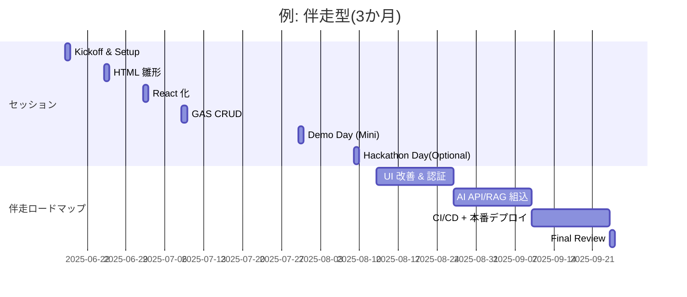

# TEKION Group — Vibe Coder Bootcamp

> **AI × IDE で “非エンジニア” を 3 か月で『泉水レベル』へ引き上げる**
>
> *問い合わせフォーム + GAS 保存を最短 4 週間で動かし、3 か月で “Oh! My Gear” クラスの Web アプリを自力再現できる力へ。*

---

## 1. 目的と背景

* **ビジネスサイドこそ AI を武器にできる**  ─ 生成 AI の進化速度は個人の学習速度を凌駕しており、「知識を覚える」より **“AI に丸投げする設計力と IDE 操作”** が競争力になる。
* Tekion Group は **Cursor / Windsurf / Claude API** など最新 AI エージェントをフル活用し、完全伴走による“右脳＆左脳のコピー”を行うことで、 **非エンジニアでも 3 か月でプロトタイプを量産できる体制** を実証。
* 本ブートキャンプでは **要件定義 → コピペ開発 → AI 自動改善** を繰り返し、受講直後から実務のアウトプット量を 10 倍化する人材（＝Vibe Coder）を育成する。

---

## 1.5  “Oh! My Gear” が作れるレベル & Vibe Coderとは？

> **Vibe Coder = “コードで制御される世界を、AI を通じて自在に操る人”。**
> 生成 AI で要件定義・設計・実装・テスト・運用を一気通貫し、営業資料から本格 Web アプリまで “最短クリックで生み出す” 能力を指します。

### 技術スタックと設計力（完全伴走型の到達ライン）

| 領域               | 代表スキル・知識                                                     |
| ---------------- | ------------------------------------------------------------ |
| **フロントエンド**      | Next.js 14 + TypeScript / Tailwind / React Server Components |
| **バックエンド & API** | Next.js API Routes・Server Actions、GAS 連携、外部 REST/GraphQL 統合  |
| **DB 設計**        | Supabase/PostgreSQL：RLS・全文検索・ER 図レベルのモデリング                   |
| **認証 / ストレージ**   | Supabase Auth + Storage (画像・ファイル)                            |
| **CI/CD**        | GitHub Actions → Vercel 自動デプロイ、Playwright / Vitest で自動テスト    |
| **AI 駆動開発**      | Cursor / Claude API でコード生成→リファクタ→テスト→デプロイを反復                 |

> **⛰️ 到達指標例**
> ・DB テーブル 10+・認証付き CRUD と検索を実装し、公開 URL デプロイ
> ・AI リファクタ提案 50 件以上を取り込み、コードレビューを通過
> ・外部 API 連携機能 (例: 商品検索, RAG) を 1 つ以上追加

---

## 1.6  レベル比較 — 完全伴走 vs 講義＋ライトフォロー

| 項目          | **完全伴走型 (3 か月 / 週 8 h 学習)**                  | **講義＋ライトフォロー (約 1 か月 / 週 2–3 h 学習)**        |
| ----------- | -------------------------------------------- | ------------------------------------------- |
| **開発物の規模**  | “Oh! My Gear” 相当：SPA + 認証 + DB20テーブル + 外部API | 問い合わせフォーム：UI + GAS CRUD + 簡単な React ダッシュボード |
| **AI 利用深度** | IDE エージェントで大量リファクタ・テスト生成・CI/CD               | コピー＆ペースト開発＋簡易 AI 修正提案採用                     |
| **バグ対応**    | ログ解析 → AI 提案 → デバッグの一連を自走                    | 主要エラーを講義内でサポート、運用ノウハウは概要のみ                  |
| **業務への展開**  | 新規サービス案を “触れるプロトタイプ” として経営決裁に乗せられる           | 日常タスク自動化スクリプトを自作・活用できる                      |
| **講師コミット**  | 毎週 1on1 + Slack24h + Hackathon Day           | 講義録画 + Slack48h + Demoコメント                  |
| **想定成長幅**   | 泉水が 2 年で得た知見を **3 か月で圧縮習得**                  | AI 活用 “第一段” を自力で超え、実務改善が即開始                 |

---

## 2. プログラム全体像 プログラム全体像

プログラム全体像

| 区分        | A. 完全伴走型                                                                | B. 講義＋ライトフォロー                                               |
| --------- | ----------------------------------------------------------------------- | ----------------------------------------------------------- |
| 期間        | 3 か月（12 週）                                                              | 5 週カリキュラム＋Demo Day（+3 週制作）                                  |
| 価格 (税別)   | **75 万 / 名**（25 万 × 3 か月）※上限 5 名                                        | **70 万 /月**（〜5 名）6 名以上：+5 万/名　アーカイブは共有します。                  |
| 主要ゴール     | “Oh! My Gear” 相当の サービス をAI 主導で **ゼロから再現できるレベル**                         | 自前の問い合わせフォームとダッシュボード (UI＋GAS CRUD) を**Cursor×Claude** で動かせる |
| 伴走濃度      | – 毎週 1 h 1on1– Slack応答– ・画面共有しながらのフォローアップ                               | – Slack 応答– 宿題 Q\&A（講義内容中心に）                                |
| 推奨学習時間    | 週 8 h以上                                                                 | 週 2–3 h以上                                                   |
| 追加サポート    | – **Hackathon Day** ×1 (8 h) 同行 +15 万/回– Slack **Cross‑Review** チャンネル運営 | – Hackathon Day (任意) +15 万/回                                |
| フォローオプション | 月次 10 万 / 名（月1 1on1 + Slack 48 h 応答 + Weekly News）                      | 同左                                                          |

---

## 3. カリキュラム詳細（※検討中のたたき台）

> **ご注意：** 以下の内容は現時点のイメージです。受講者のスキル状況や業務要件に応じて、順序やテーマを柔軟に入れ替える場合があります。

| 回            | 90 分授業の主なテーマ                                                     | 宿題（目安 1.5〜2 時間）                 |
| ------------ | ---------------------------------------------------------------- | ------------------------------- |
| 第 1 回（120 分） | - Cursor／Windsurf の設定と API キー入力- 音声入力と AI 壁打ちで「問い合わせフォーム」の要件を下書き | 要件定義書（Markdown）を仕上げて提出          |
| 第 2 回        | - 要件を基に HTML・CSS を AI で生成- ブラウザで動作確認                             | 生成した HTML を GitHub へ push       |
| 第 3 回        | - Vite で React 化- Cursor AI による一括リファクタとエラー修正                     | React 版フォームを `npm start` で動かし共有 |
| 第 4 回        | - Google Apps Script で保存・一覧・削除 API を作成- (参考) Supabase CRUD の実演   | React と GAS を接続し CRUD 動画を提出     |
| 第 5 回        | - 成果発表と講師コメント- 最新 AI 開発ツールの紹介                                    | 今後の改善計画をまとめ、Slack に共有           |

---

## 4. ハッカソン Day（オプション）

> **15 万 / 日 / チーム**（休日開催・クライアント本社 or オンライン）
>
> – Demo Day 前に 8 時間 “張り付きコーチ”– 思考ブロック／バグをその場で潰し切り、完成度を一段引き上げます。

---

## 5. 受講メリット

1. **AI 丸投げ設計力** — MCP 思考・要件定義テンプレで「何を作るか」を瞬時に AI へ伝達。
2. **コピペ → IDE エージェント移行** — コピペ開発から Cursor/Windsurf 自動修正まで 3 週間で体験。
3. **バックエンド恐怖症の克服** — GAS で即 CRUD、Supabase/Firebase の概念も把握。
4. **社内展開しやすいアウトプット** — 実際に動くフォーム & CRUD デモをそのまま企画提案書へ。
5. **最新 AI ツールの継続アップデート** — Weekly News & Slack Q\&A で“情報の腐敗”を防止。

---

## 6. 事前準備 & 必携環境

* ChatGPT Plus 契約（API キー含む）
* Cursor IDE (推奨) または Windsurf IDE
* Git / Node.js 18+
* GitHub アカウント（private repo 可）
* Slack ワークスペース加入
* GCP/Firebaseアカウント

> **API 高ティア利用オプション**
> TEKION Group側の高ティアキーを発行 → 実費 +10% で月次請求（上限設定可能）

---

## 7. 価格表（税別）

| サービス           | 単価           | 備考                                |
| -------------- | ------------ | --------------------------------- |
| **完全伴走型**      | 25 万 / 月 / 名 | 3 か月パック (75 万)                    |
| **講義＋ライトフォロー** | 70 万 / 5 名まで | 6 名以上：+5 万/名                      |
| 追加質問権 (講義版)    | 5 万 / 名      | 宿題レビュー・Slack QA 含む                |
| **もくもく開発 Day** | 15 万 / 日     | 8 h × 講師張り付き                      |
| 講義後月次フォローアップ   | 10 万 / 月 / 名 | 月1 1on1 + Slack48 h + Weekly News |
| APIキーホスティング    | 実費 +10 %     | 上限設定可能/履歴レポート付き                   |

---

## 8. スケジュール例（開始: 2025‑06‑17 週\~）


内容はAIの発展状況によって可変



---

## 9. お問い合わせ先

```
Tekion Group  /  Vibe Coder Bootcamp 事務局
担当: 泉水 亮介（TEKION Group CEO）
mail: rsensui@tekion.jp
```

---
