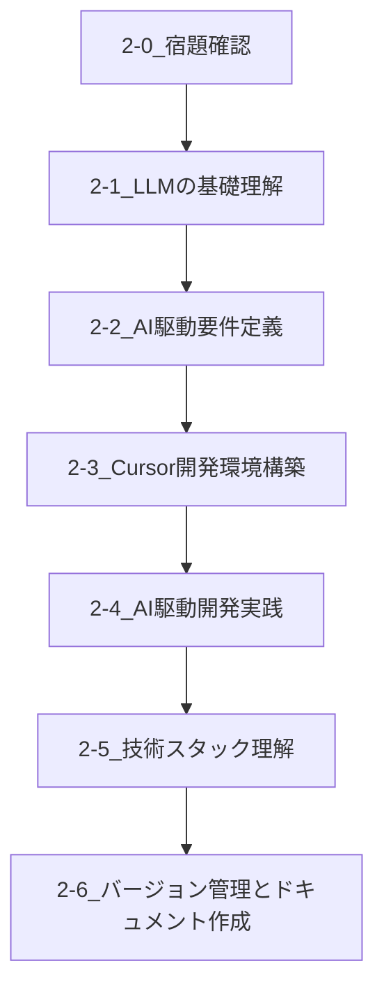

# 第二回講義 Markdownファイル構成設計書

## 概要
第二回講義のMarkdownファイル構成を、提供されたデータを基に設計しました。第一回講義との整合性を保ちながら、適切に統合された7つのファイル構成を提案します。

## 設計方針
1. **統合の原則**: 同じ順番の項目を1つのファイルに統合
2. **宿題確認**: 順番0として独立配置
3. **ファイル名**: 最も重要なテーマを採用
4. **YAMLフロントマター**: 第一回と同様の形式を使用
5. **適切な分量**: 細分化を避け、論理的にまとめた構成

## データ分析結果

### 提供データ（順番別）
- **順番0**: 宿題確認
- **順番1**: LLMとは
- **順番2**: Text is KING/テキストを制するものはLLMを制する
- **順番3**: 基本は音声入力
- **順番4**: 要件定義の重要性、要件定義はYAML形式で作ろう、要件定義書をNotionやフォルダにまとめてみよう
- **順番5**: AIチャットを使って要件定義・機能要件からスタートしよう、詳細設計を考慮した機能要件の洗い出し、開発するための技術スタックを選定してみよう、アプリ全体の構成図をClaudeに聞いてみよう、Claudeでディレクトリ設計をしてみよう、DB設計はAIに任せよう
- **順番6**: IDEとは、【参考】AIエージェントの驚き
- **順番7**: Cursorの初期設定をしよう
- **順番8**: Cursorで使うショートカットキーの紹介
- **順番9**: .cursorrulesを作成してCursorにルール設定をしてみよう
- **順番10**: v0で作ったUIをCursorに取り込もう
- **順番11**: CursorでAI駆動開発をはじめよう
- **順番12**: localhostって何？
- **順番13**: Reactとは
- **順番14**: GAS（Google App Script)とは
- **順番15**: Google Spread Sheet/Sheets APIを活用する
- **順番16**: Githubの説明
- **順番17**: RooCodeの応用で爆速ドキュメント作成

## 統合ファイル構成



## 提案ファイル一覧と詳細構成

### 1. `2-0_宿題確認.md`

**YAMLフロントマター:**
```yaml
---
title: "宿題確認"
track: "ライト版・第2回"
author: "TEKION Group / 泉水亮介"
last_updated: "2025年6月11日"
category: "復習・確認"
---
```

**統合内容:**
- 順番0: 宿題確認

**詳細な内容構成:**
- 第一回講義の振り返り
- 宿題の確認と解説
- 第二回講義への導入
- 学習目標の設定

**統合理由:**
第一回講義の復習と第二回への導入として独立させることで、学習の連続性を保つ

---

### 2. `2-1_LLMの基礎理解.md`

**YAMLフロントマター:**
```yaml
---
title: "LLMの基礎理解"
track: "ライト版・第2回"
author: "TEKION Group / 泉水亮介"
last_updated: "2025年6月11日"
category: "AI基礎知識"
---
```

**統合内容:**
- 順番1: LLMとは
- 順番2: Text is KING/テキストを制するものはLLMを制する
- 順番3: 基本は音声入力

**詳細な内容構成:**
1. **LLMの基本概念**
   - Large Language Modelの定義
   - LLMの仕組みと特徴
   - 主要なLLMサービスの紹介

2. **テキスト処理の重要性**
   - "Text is KING"の概念
   - テキストを制することの意味
   - LLMにおけるテキスト入力の最適化

3. **音声入力の活用**
   - 音声入力の基本操作
   - 効率的な音声入力のコツ
   - テキスト変換の精度向上方法

4. **実践演習**
   - 音声入力でのプロンプト作成
   - テキスト最適化の実例

**統合理由:**
LLMの基礎概念、テキスト処理の重要性、音声入力の活用は密接に関連しており、AI駆動開発の基盤となる知識として一体的に学習することが効果的

---

### 3. `2-2_AI駆動要件定義.md`

**YAMLフロントマター:**
```yaml
---
title: "AI駆動要件定義"
track: "ライト版・第2回"
author: "TEKION Group / 泉水亮介"
last_updated: "2025年6月11日"
category: "設計・要件定義"
---
```

**統合内容:**
- 順番4: 要件定義の重要性、要件定義はYAML形式で作ろう、要件定義書をNotionやフォルダにまとめてみよう
- 順番5: AIチャットを使って要件定義・機能要件からスタートしよう、詳細設計を考慮した機能要件の洗い出し、開発するための技術スタックを選定してみよう、アプリ全体の構成図をClaudeに聞いてみよう、Claudeでディレクトリ設計をしてみよう、DB設計はAIに任せよう

**詳細な内容構成:**
1. **要件定義の基礎**
   - 要件定義の重要性と目的
   - 従来の要件定義との違い
   - AI駆動開発における要件定義の特徴

2. **YAML形式での要件定義**
   - YAML形式の基本構文
   - 要件定義書のYAML化
   - 構造化された要件定義のメリット

3. **要件定義書の管理**
   - Notionでの要件定義書作成
   - フォルダ構成とファイル管理
   - チーム共有とバージョン管理

4. **AIチャットを活用した要件定義**
   - ChatGPT/Claudeでの要件定義手法
   - 機能要件の洗い出し方法
   - 詳細設計を考慮した要件定義

5. **技術選定とアーキテクチャ設計**
   - 技術スタックの選定方法
   - アプリ全体の構成図作成
   - ディレクトリ設計の最適化
   - データベース設計の自動化

6. **実践演習**
   - サンプルプロジェクトの要件定義
   - AIを使った設計書作成

**統合理由:**
要件定義から設計まで一連の流れとして統合することで、AI駆動開発の核となる部分を包括的に理解できる

---

### 4. `2-3_Cursor開発環境構築.md`

**YAMLフロントマター:**
```yaml
---
title: "Cursor開発環境構築"
track: "ライト版・第2回"
author: "TEKION Group / 泉水亮介"
last_updated: "2025年6月11日"
category: "開発環境"
---
```

**統合内容:**
- 順番6: IDEとは、【参考】AIエージェントの驚き
- 順番7: Cursorの初期設定をしよう
- 順番8: Cursorで使うショートカットキーの紹介
- 順番9: .cursorrulesを作成してCursorにルール設定をしてみよう

**詳細な内容構成:**
1. **IDE（統合開発環境）の基礎**
   - IDEとは何か
   - 従来のIDEとAI統合IDEの違い
   - Cursorの特徴と優位性

2. **AIエージェントの可能性**
   - AIエージェントの概念
   - 開発における自動化の未来
   - Cursorでのエージェント機能

3. **Cursorの初期設定**
   - インストールと基本設定
   - アカウント設定とライセンス
   - 基本的なカスタマイズ

4. **効率的なショートカットキー**
   - 必須ショートカットキー一覧
   - AI機能のショートカット
   - カスタムショートカットの設定

5. **.cursorrulesの活用**
   - .cursorrulesファイルの概念
   - ルール設定の基本構文
   - プロジェクト固有のルール作成
   - チーム開発でのルール共有

6. **実践演習**
   - 開発環境のセットアップ
   - カスタムルールの作成

**統合理由:**
IDE概念からCursor設定まで開発環境構築の一連の流れとして統合することで、効率的な学習が可能

---

### 5. `2-4_AI駆動開発実践.md`

**YAMLフロントマター:**
```yaml
---
title: "AI駆動開発実践"
track: "ライト版・第2回"
author: "TEKION Group / 泉水亮介"
last_updated: "2025年6月11日"
category: "実践開発"
---
```

**統合内容:**
- 順番10: v0で作ったUIをCursorに取り込もう
- 順番11: CursorでAI駆動開発をはじめよう
- 順番12: localhostって何？

**詳細な内容構成:**
1. **v0からCursorへの連携**
   - v0で作成したUIの確認
   - CursorへのUIコード取り込み方法
   - コードの最適化と調整

2. **AI駆動開発の実践**
   - Cursor Agentの活用方法
   - コード生成とリファクタリング
   - エラー解決とデバッグ支援
   - コードレビューとベストプラクティス

3. **ローカル開発環境の理解**
   - localhostの概念と仕組み
   - ローカルサーバーの起動方法
   - ポート番号の管理
   - 開発サーバーとプロダクションの違い

4. **開発ワークフローの確立**
   - 効率的な開発サイクル
   - AIとの協働開発手法
   - コード品質の維持方法

5. **実践演習**
   - 実際のプロジェクト開発
   - ローカル環境での動作確認

**統合理由:**
実際の開発作業とローカル環境での動作確認まで実践的な内容として統合することで、開発の全体像を理解できる

---

### 6. `2-5_技術スタック理解.md`

**YAMLフロントマター:**
```yaml
---
title: "技術スタック理解"
track: "ライト版・第2回"
author: "TEKION Group / 泉水亮介"
last_updated: "2025年6月11日"
category: "技術知識"
---
```

**統合内容:**
- 順番13: Reactとは
- 順番14: GAS（Google App Script)とは
- 順番15: Google Spread Sheet/Sheets APIを活用する

**詳細な内容構成:**
1. **React（フロントエンド技術）**
   - Reactの基本概念
   - コンポーネントベース開発
   - JSXの理解
   - Reactの生態系（Next.js等）

2. **Google Apps Script（バックエンド技術）**
   - GASの概要と特徴
   - JavaScriptベースの開発
   - Googleサービスとの連携
   - 無料で使えるサーバーレス環境

3. **Google Sheets API活用**
   - Sheets APIの基本操作
   - データの読み書き
   - 認証とセキュリティ
   - 実用的な活用例

4. **技術スタックの選択指針**
   - プロジェクトに応じた技術選択
   - フロントエンドとバックエンドの組み合わせ
   - コストと機能のバランス

5. **実践演習**
   - ReactとGASの連携
   - Sheets APIを使ったデータ操作

**統合理由:**
フロントエンド技術とバックエンド技術、API活用を技術スタックの理解として統合することで、全体的な技術理解が深まる

---

### 7. `2-6_バージョン管理とドキュメント作成.md`

**YAMLフロントマター:**
```yaml
---
title: "バージョン管理とドキュメント作成"
track: "ライト版・第2回"
author: "TEKION Group / 泉水亮介"
last_updated: "2025年6月11日"
category: "プロジェクト管理"
---
```

**統合内容:**
- 順番16: Githubの説明
- 順番17: RooCodeの応用で爆速ドキュメント作成

**詳細な内容構成:**
1. **Gitとバージョン管理**
   - バージョン管理の重要性
   - Gitの基本概念
   - ローカルリポジトリとリモートリポジトリ

2. **GitHubの活用**
   - GitHubアカウントの作成
   - リポジトリの作成と管理
   - ブランチ戦略
   - プルリクエストとコードレビュー

3. **チーム開発での活用**
   - 複数人での開発フロー
   - コンフリクトの解決
   - Issue管理とプロジェクト管理

4. **RooCodeを活用したドキュメント作成**
   - RooCodeの概要と特徴
   - AIを活用した高速ドキュメント作成
   - 技術文書の自動生成
   - README作成の自動化

5. **ドキュメント管理のベストプラクティス**
   - 効果的なドキュメント構成
   - 継続的なドキュメント更新
   - チーム内での情報共有

6. **実践演習**
   - GitHubリポジトリの作成
   - RooCodeでのドキュメント作成

**統合理由:**
開発プロジェクトの管理とドキュメント作成は開発フローの最終段階として統合することで、プロジェクト全体の管理手法を体系的に学習できる

## 学習フローの設計

### 講義の流れ
1. **復習・導入** (2-0) → **基礎知識** (2-1) → **設計手法** (2-2)
2. **環境構築** (2-3) → **実践開発** (2-4) → **技術理解** (2-5)
3. **プロジェクト管理** (2-6)

### 各ファイル間の関連性
- 2-0から2-1: 基礎知識の積み上げ
- 2-1から2-2: 理論から実践への移行
- 2-2から2-3: 設計から実装準備
- 2-3から2-4: 環境構築から実開発
- 2-4から2-5: 実践から技術理解の深化
- 2-5から2-6: 開発からプロジェクト管理

## 第一回講義との整合性

### YAMLフロントマター形式の統一
```yaml
---
title: "タイトル"
track: "ライト版・第2回"
author: "TEKION Group / 泉水亮介"
last_updated: "2025年6月11日"
category: "カテゴリ名"
---
```

### ファイル命名規則の統一
- 第一回: `1-X_タイトル.md`
- 第二回: `2-X_タイトル.md`

### 内容構成の統一
- 概要
- 学習目標
- 内容（詳細セクション）
- 重要ポイント
- 次のステップ

## まとめ

この設計により、第二回講義は以下の特徴を持ちます：

1. **論理的な構成**: 基礎から実践、管理まで段階的な学習フロー
2. **適切な分量**: 7つのファイルに適切に統合された内容
3. **実践重視**: 理論だけでなく実際の開発作業を含む構成
4. **第一回との連続性**: 一貫したフォーマットと学習の積み上げ
5. **AI駆動開発の全体像**: 要件定義から開発、管理まで包括的にカバー

この構成により、受講者はAI駆動開発の全体像を体系的に学習し、実践的なスキルを身につけることができます。